---
format:
  html:
    css: ../styles/mathematics.css
    html-math-method:
      method: mathjax
      url: https://cdn.jsdelivr.net/npm/mathjax@4.0.0/tex-chtml.js
    include-in-header: ../interactive/math/mathjax.html
    include-after-body: ../interactive/math/include.html
---

# Chapter 0: Mathematical Foundations {.unnumbered #sec-mathematical-foundations}

Suppose that a rise in interest rates is followed by a fall in output. We would like to know how large the effect was, whether it will persist, and how much confidence to place in the answer. Yet the observation itself settles none of these questions. Output and interest rates respond to other forces; the relation may depend on the state of the economy; and a short sample may give a rather misleading picture of a persistent process. Before estimating anything, we therefore need to specify what changes, what is held fixed, and what the data can distinguish.

These are the questions which motivate the mathematics in this chapter. We begin by collecting several economic quantities in a vector and asking what can be recovered from linear relations between them. We then allow these relations to be nonlinear. This requires a careful account of limits and continuity before derivatives, of differentiability before Taylor expansions, and of feasible movements before optimisation conditions. Only then do we introduce uncertainty and the additional assumptions needed to learn from observations.

::: {.math-route}
**Reading this chapter.** The examples introduce the questions, but do not replace the definitions. In the first four sections, we distinguish the mathematical objects, the rules for working with them, and the assumptions under which a result holds. The regression discussion likewise separates the calculation of a fitted line from its statistical interpretation. Short proofs and worked exercises explain these distinctions. The animations illustrate transformations; the equations in the text remain fixed and can be read without using any controls.
:::

## A small model, and the questions it leaves open {#sec-maths-motivating-system}

Let $y_t$ and $\pi_t$ denote deviations of output and inflation from reference levels. A deliberately small model is

$$
\begin{gathered}
x_t=\begin{pmatrix}y_t\\\pi_t\end{pmatrix},\\
A=\begin{pmatrix}.7&.2\\.1&.8\end{pmatrix},\\
x_{t+1}=Ax_t+u_{t+1}.
\end{gathered}
$$ {#eq-maths-state-system}

For an initial state $x_t=(1,0)'$ and no new disturbance, tomorrow's state is $(.7,.1)'$. The first column of $A$ thus describes the response to a unit movement in output, while the second describes the response to a unit movement in inflation. A prime denotes transpose; vectors are columns throughout.

This calculation is exact within the proposed model. Its economic interpretation is another matter. The coefficient $.1$ need not be the causal effect of output on inflation, and the matrix need not describe large departures from the reference state. We shall keep these distinctions in view. Algebra establishes what follows from a specification; analysis controls an approximation to it; probability and statistics determine what an estimated specification can tell us.

## Linear algebra: what can several equations tell us? {#sec-linear-algebra-foundations}

### Vectors and vector spaces {#sec-vector-spaces}

Suppose two disturbances move output and inflation by $a=(1,.5)'$ and $b=(-.2,1)'$. Doubling the first movement and reversing the second gives

$$
2a-b=\begin{pmatrix}2.2\\0\end{pmatrix}.
$$

The inflation changes cancel. We have used two operations: adding movements and multiplying a movement by a real number. Before asking what can be obtained in this way, we should make explicit what these operations mean.

A vector in $\mathbb R^n$ is an ordered list of $n$ real coordinates. The order matters: output and inflation cannot exchange positions halfway through a calculation. We write vectors as columns. For example,

$$
x=\begin{pmatrix}x_1\\x_2\end{pmatrix},\qquad
z=\begin{pmatrix}z_1\\z_2\end{pmatrix}.
$$

Addition is coordinate by coordinate, and scalar multiplication applies the same real number to each coordinate:

$$
x+z=\begin{pmatrix}x_1+z_1\\x_2+z_2\end{pmatrix},\qquad
\alpha x=\begin{pmatrix}\alpha x_1\\\alpha x_2\end{pmatrix}.
$$

Here a **scalar** is a real number, whereas a **vector** is an element of the space on which these operations act. A negative scalar reverses a movement. The zero vector represents no movement. An arrow drawn in a plane is a useful representation of a vector in $\mathbb R^2$, but it is not the definition of a vector in general.

**Definition (real vector space).** A real vector space $V$ is a nonempty set equipped with addition $V\times V\to V$ and scalar multiplication $\mathbb R\times V\to V$, satisfying the following rules for every $u,v,w\in V$ and every $\alpha,\beta\in\mathbb R$:

1. Addition is associative and commutative: $(u+v)+w=u+(v+w)$ and $u+v=v+u$.
2. There is a zero vector $0_V$ such that $v+0_V=v$, and every $v$ has an additive inverse $-v$ satisfying $v+(-v)=0_V$.
3. Scalar multiplication satisfies $1v=v$ and $\alpha(\beta v)=(\alpha\beta)v$.
4. The two distributive laws hold: $\alpha(u+v)=\alpha u+\alpha v$ and $(\alpha+\beta)v=\alpha v+\beta v$.

The operations must stay inside $V$. This requirement is called **closure**. Together with the rules above, it allows us to manipulate linear expressions without changing their meaning. In particular, $0v=0_V$ and $(-1)v=-v$ follow from these rules; they are not additional assumptions.

The space $\mathbb R^n$ with coordinatewise operations is our main example. But matrices of a fixed size also form a vector space, as do real polynomials: two polynomials can be added, and multiplying a polynomial by any real number gives another polynomial. By contrast, the set of nonnegative consumption bundles is not a vector space, since multiplying a strictly positive bundle by $-1$ leaves that set. Economic feasibility and vector-space structure should therefore not be confused.

### Linear combinations, span, and subspaces {#sec-span-subspaces}

Let $v_1,\ldots,v_k$ be vectors in a real vector space $V$. The expression

$$
\alpha_1v_1+\cdots+\alpha_kv_k,
\qquad \alpha_1,\ldots,\alpha_k\in\mathbb R,
$$

is a **linear combination** of these vectors. There is no requirement that the coefficients be positive or sum to one. Imposing those restrictions would give a convex combination instead.

**Definition (span).** The span of a finite family is the set of all its linear combinations:

$$
\operatorname{span}(v_1,\ldots,v_k)
=\left\{\sum_{j=1}^k\alpha_jv_j:
\alpha_1,\ldots,\alpha_k\in\mathbb R\right\}.
$$

The braces describe a set, and the colon means “such that”. Thus $x\in\operatorname{span}(v_1,\ldots,v_k)$ means that there exists at least one choice of coefficients for which $x=\sum_j\alpha_jv_j$. It does not yet say whether this choice is unique. In French notation, the same set is often written $\operatorname{Vect}(v_1,\ldots,v_k)$.

For a nonzero vector $a$, its span is the line through zero in direction $a$. For our two disturbances $a=(1,.5)'$ and $b=(-.2,1)'$, the span is the whole plane. Indeed, any target $(r,s)'$ can be obtained by choosing

$$
\alpha=\frac{r+.2s}{1.1},\qquad
\beta=\frac{s-.5r}{1.1}.
$$

Substitution gives $\alpha a+\beta b=(r,s)'$. If we replace $b$ by $2a$, every combination becomes $(\alpha+2\beta)a$, so we obtain only a line. Notice that counting the vectors is not enough to count the directions they provide.

**Definition (vector subspace).** A subset $W$ of a vector space $V$ is a vector subspace if it contains zero and is closed under addition and scalar multiplication. Equivalently, it is nonempty and $\alpha u+\beta v\in W$ for every $u,v\in W$ and every real $\alpha,\beta$. It then inherits the vector-space rules from $V$.

The span of a family is a subspace. To see this, add two combinations by adding their coefficients, or multiply a combination by a scalar by multiplying its coefficients. Both operations give another combination of the same vectors. Moreover, every subspace containing the family must contain all its combinations. The span is therefore the **smallest vector subspace containing that family**.

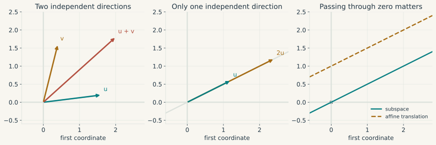{#fig-bases-span}

A budget line such as $c_1+c_2=1$ is not a subspace, since it does not contain zero. It is an **affine set**, namely a translation of a subspace. Its displacements satisfy $dc_1+dc_2=0$ and form the line $\operatorname{span}((1,-1)')$. This distinction will matter in optimisation: the set of choices need not be a vector space even when the directions along which one can move form one.

### Independent, dependent, and spanning families {#sec-vector-families}

We now need to separate two questions. Can the proposed vectors produce every vector in the space of interest? And can they do so in more than one way? These are respectively questions about **generation** and **independence**.

**Definition (spanning family, or famille génératrice).** A family $v_1,\ldots,v_k$ is a spanning family of $V$ if

$$
V=\operatorname{span}(v_1,\ldots,v_k).
$$

The ambient space must be specified. The single vector $(1,0)'$ spans the horizontal axis, but does not span $\mathbb R^2$. Every family spans its own span, which can be a proper subspace of the space in which it is drawn.

**Definition (linearly independent family, or famille libre).** A family is linearly independent if the only combination giving zero is the one with every coefficient equal to zero:

$$
\sum_{j=1}^k\alpha_jv_j=0
\quad\Longrightarrow\quad
\alpha_j=0\ \text{for every }j.
$$

**Definition (linearly dependent family, or famille liée).** A family is linearly dependent if there exist coefficients, not all zero, such that $\sum_j\alpha_jv_j=0$. Choosing an index with a nonzero coefficient and rearranging shows that at least one vector is a combination of the others. This is the precise sense in which that vector provides no additional direction. A family containing the zero vector is necessarily dependent.

Take $e_1=(1,0)'$ and $e_2=(0,1)'$. The family $(e_1,e_2)$ is independent and spans $\mathbb R^2$. The family $(e_1,e_2,e_1+e_2)$ still spans $\mathbb R^2$, but is dependent, since $e_1+e_2-(e_1+e_2)=0$ uses the coefficients $1,1,-1$. Conversely, the family consisting only of $e_1$ is independent but does not span the plane. Independence and generation are thus different properties, neither of which implies the other.

**Definition (basis and dimension).** A **basis** of $V$ is a family which is both independent and spanning. A vector space is finite-dimensional if it has a finite spanning family. In such a space all bases have the same number of vectors; this number is its **dimension**, written $\dim V$. The zero space has dimension zero and the empty family as its basis. The vectors $e_1,\ldots,e_n$, each with a single coordinate equal to one and all others zero, form the **canonical basis** of $\mathbb R^n$.

Why are coordinates in a basis unique? Generation gives at least one representation. If $x=\sum_j\alpha_jv_j=\sum_j\beta_jv_j$, subtracting gives $\sum_j(\alpha_j-\beta_j)v_j=0$. Independence forces $\alpha_j=\beta_j$ for every $j$. Conversely, a dependent family permits different coefficients for the same vector. This is exactly the issue that will arise with collinear regressors.

In a space of dimension $n$, an independent family has at most $n$ members, whereas a spanning family has at least $n$. Any independent family can be extended to a basis, and any finite spanning family can be reduced to a basis by removing redundant vectors. In particular, a family of exactly $n$ vectors is a basis if it is independent, or equivalently if it spans the space. These results follow from the basis exchange argument: an independent vector can replace a spanning vector with a nonzero coefficient in its representation, and this replacement can be repeated until the independent family is exhausted. One cannot insert more independent vectors than the original spanning family contains.

Coordinates nevertheless depend on which basis we choose. In the canonical basis, the coordinates of $(2.2,0)'$ are $2.2$ and $0$. In the basis $(a,b)$ introduced above, they are $2$ and $-1$. The vector has not moved; the directions in which we measure it have changed. We return to the matrix notation for this change after defining matrix multiplication.

### Length, orthogonality, and the choice of units

Comparing two economic states requires a measure of distance. For vectors in $\mathbb R^n$, the Euclidean inner product and its associated norm are

$$
\begin{aligned}
\langle a,b\rangle&=a'b=\sum_i a_ib_i,\\
\|a\|_2&=\sqrt{a'a},\\
d(a,b)&=\|a-b\|_2.
\end{aligned}
$$

For nonzero vectors, the angle satisfies $\cos\theta=a'b/(\|a\|_2\|b\|_2)$. The Cauchy-Schwarz inequality $|a'b|\leq\|a\|_2\|b\|_2$ makes this definition possible. Orthogonality means $a'b=0$ and gives Pythagoras' identity $\|a+b\|_2^2=\|a\|_2^2+\|b\|_2^2$.

One can see Cauchy-Schwarz directly. For $b\neq0$, minimise the nonnegative expression $\|a-tb\|_2^2$ over $t$. Its minimum at $t=a'b/(b'b)$ is $\|a\|_2^2-(a'b)^2/\|b\|_2^2\geq0$. The inequality is therefore a consequence of the fact that a squared distance cannot be negative.

The units remain part of the model. A distance which adds squared euros to squared percentage points is dominated by the numerically larger coordinate. Standardisation or a weighted inner product $\langle a,b\rangle_W=a'Wb$, with $W$ symmetric positive definite, changes this comparison. A gradient's “steepest” direction will likewise depend on the metric chosen.

Other norms are $\|x\|_1=\sum_i|x_i|$ and $\|x\|_\infty=\max_i|x_i|$. A norm is positive except at zero, satisfies $\|cx\|=|c|\|x\|$, and obeys the triangle inequality. In finite dimensions these norms define the same convergent sequences, since

$$
\|x\|_\infty\leq\|x\|_2\leq\|x\|_1\leq\sqrt n\,\|x\|_2.
$$

They nevertheless penalise coefficients differently. This will separate ridge regression from the lasso.

### A matrix acts on a vector {#sec-matrices-transformations}

In @eq-maths-state-system, each of tomorrow's variables depends on both of today's variables. A matrix records these coefficients. More generally, $A=(a_{ij})\in\mathbb R^{m\times n}$ is a rectangular array with $m$ **rows** and $n$ **columns**. The first index $i$ selects a row, and the second index $j$ selects a column. The notation $m\times n$ always means rows first, columns second.

Before calculating a product, write down the dimensions. A column vector with $n$ coordinates is an $n\times1$ matrix. A matrix with $n$ columns can multiply this vector because it has exactly one column for each input coordinate. It produces $m$ output coordinates:

$$
\underbrace{A}_{m\times n}\,
\underbrace{x}_{n\times1}
=\underbrace{Ax}_{m\times1}.
$$

For a numerical example, take

$$
M=\begin{pmatrix}1&2&-1\\0&1&3\end{pmatrix},
\qquad x=\begin{pmatrix}2\\1\\-1\end{pmatrix}.
$$

The matrix has two rows and three columns. Hence it takes a vector in $\mathbb R^3$ and returns a vector in $\mathbb R^2$. To obtain the first output, multiply the three entries in the first row by the corresponding entries in $x$, then add. Repeat with the second row:

$$
Mx=\begin{pmatrix}
1\cdot2+2\cdot1+(-1)\cdot(-1)\\
0\cdot2+1\cdot1+3\cdot(-1)
\end{pmatrix}
=\begin{pmatrix}5\\-2\end{pmatrix}.
$$

This is the **row-by-column rule**. In general it reads

$$
(Ax)_i=\sum_{j=1}^n a_{ij}x_j.
$$

There is another reading of the very same calculation. Let $a_j$ denote column $j$ of $A$. Then

$$
Ax=x_1a_1+\cdots+x_na_n.
$$

For our example, the output is $2(1,0)'+(2,1)'-(-1,3)'=(5,-2)'$. The entries of $x$ are the weights applied to the columns of $M$. This **column-combination reading** explains why every output of a matrix belongs to the span of its columns. It will also explain why a fitted regression vector belongs to the span of the regressors.

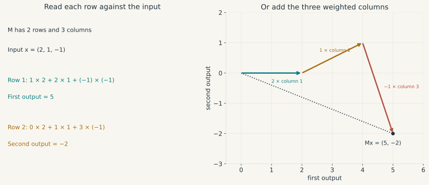{#fig-matrix-vector}

### Linear transformations and their columns

**Definition (linear transformation).** A map $L:V\to W$ between real vector spaces is linear if, for all $u,v\in V$ and real $\alpha,\beta$,

$$
L(\alpha u+\beta v)=\alpha L(u)+\beta L(v).
$$

It preserves linear combinations. In particular, $L(0)=0$. The map $x\mapsto Ax$ is linear by the multiplication rule just established. By contrast, $x\mapsto Ax+c$ with $c\neq0$ is affine, not linear, since it sends zero to $c$.

Now write $x=x_1e_1+\cdots+x_ne_n$. Linearity implies

$$
L(x)=x_1L(e_1)+\cdots+x_nL(e_n).
$$

Knowing where the basis vectors go therefore tells us where every vector goes. The matrix representing $L$ in the canonical bases is precisely the matrix whose columns are $L(e_1),\ldots,L(e_n)$. A column is not an arbitrary list: it records the image of one input direction. This also makes the dimensions substantive. The number of columns is the dimension of the input space, and the number of rows is the dimension of the output space.

::: {#fig-matrix-film .math-film}

```{=html}
<video controls preload="none" playsinline poster="../figures/mathematics/animations/LinearMap.png" aria-label="Animation: two basis vectors and a grid under a linear transformation">
<source src="../figures/mathematics/animations/LinearMap.mp4" type="video/mp4">
<a href="../figures/mathematics/animations/LinearMap.mp4">Download the animation.</a>
</video>
```


A matrix acts on the entire plane. The teal and ochre arrows show the two basis vectors; their images determine the image of every linear combination. The intermediate frames interpolate between maps and are not successive periods of the economic model.
:::

::: {.math-explorer data-math="matrix"}
**Choose a matrix and follow its action.** Start with the shear: its first column leaves $e_1$ unchanged, while its second column sends $e_2$ to $(1,1)'$. Compare the image of $x=e_1+e_2$ with the sum of the two column images. Then choose the projection preset and observe which direction is lost. The fixed figure and video above remain available without JavaScript.
:::

### Multiplying matrices means composing transformations {#sec-matrix-composition}

Suppose that we first double the horizontal coordinate and then add the vertical coordinate to the horizontal one. These two operations are represented by

$$
B=\begin{pmatrix}2&0\\0&1\end{pmatrix},\qquad
A=\begin{pmatrix}1&1\\0&1\end{pmatrix}.
$$

Starting from $x=(1,1)'$, the first operation gives $Bx=(2,1)'$. The second gives $A(Bx)=(3,1)'$. We would like a single matrix which performs both operations. Since $B$ acts first and $A$ acts on its output, this matrix is denoted $AB$:

$$
(AB)x=A(Bx).
$$

We can find its columns without memorising a new rule. Send $e_1$ through both transformations: $Be_1=(2,0)'$, then $A(Be_1)=(2,0)'$. This is column one of $AB$. Sending $e_2$ through both gives $Be_2=(0,1)'$, then $A(Be_2)=(1,1)'$. This is column two. Hence

$$
AB=\begin{pmatrix}2&1\\0&1\end{pmatrix}.
$$

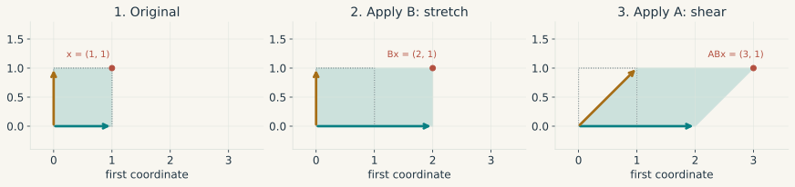{#fig-matrix-composition}

::: {#fig-composition-film .math-film}

```{=html}
<video controls preload="none" playsinline poster="../figures/mathematics/animations/MatrixComposition.png" aria-label="Animation: apply a horizontal stretch B then a shear A, and compare with the reversed order">
<source src="../figures/mathematics/animations/MatrixComposition.mp4" type="video/mp4">
<a href="../figures/mathematics/animations/MatrixComposition.mp4">Download the animation.</a>
</video>
```

The grid, unit square and vector undergo the same two transformations. The first sequence applies B then A and ends at (3, 1). Reversing the order ends at (4, 1). The labels stay fixed while the geometry moves. Intermediate frames make each transformation visible; they are not extra factors in the matrix product.
:::

The general definition follows the same reasoning. Let $B\in\mathbb R^{n\times p}$ and $A\in\mathbb R^{m\times n}$. Matrix $B$ takes $p$ input coordinates and returns $n$ coordinates, which is exactly the number $A$ accepts. The composition takes $p$ coordinates and returns $m$:

$$
\mathbb R^p\xrightarrow{B}\mathbb R^n
\xrightarrow{A}\mathbb R^m.
$$

**Definition (matrix product).** The product $AB$ is the $m\times p$ matrix with entries

$$
(AB)_{ij}=\sum_{\ell=1}^n a_{i\ell}b_{\ell j}.
$$

Entry $(i,j)$ is row $i$ of $A$ multiplied by column $j$ of $B$. Indeed, that column is the output of $B$ for the input $e_j$, and row $i$ of $A$ computes coordinate $i$ of its next image. This gives both the computational rule and its interpretation.

The **inner dimensions must agree**, and the outer dimensions give the size of the result:

$$
(m\times n)(n\times p)=(m\times p).
$$

For example, a $2\times3$ matrix can multiply a $3\times4$ matrix, giving a $2\times4$ matrix. It cannot multiply a $2\times4$ matrix: the latter returns two coordinates, whereas the former requires three. Matrix multiplication is not entrywise multiplication. Entrywise multiplication, when wanted, is a different operation defined for matrices of the same size.

Even when both orders are defined, the result usually differs. In the example,

$$
BA=\begin{pmatrix}2&2\\0&1\end{pmatrix}
\neq AB.
$$

Applying the shear first and the stretch second gives $BAx=(4,1)'$, rather than $(3,1)'$. Thus matrix multiplication is generally **not commutative**. It is, however, associative: $(AB)C=A(BC)$ whenever the dimensions permit the products. Both sides apply $C$, then $B$, then $A$. It is also distributive over addition, as in $A(B+C)=AB+AC$ for compatible sizes.

The identity matrix $I_n$ has ones on its diagonal and zeros elsewhere; it leaves every vector of $\mathbb R^n$ unchanged. For $A\in\mathbb R^{m\times n}$, this gives $I_mA=A=AI_n$. An **inverse** of a square matrix $A$ is a matrix $A^{-1}$ satisfying $A^{-1}A=AA^{-1}=I_n$. It reverses the transformation. If $A$ and $B$ are invertible, reversing their composition requires reversing the order: $(AB)^{-1}=B^{-1}A^{-1}$.

### Transposes and a check on dimensions

The **transpose** $A'$ exchanges rows and columns: $(A')_{ij}=a_{ji}$. It has size $n\times m$ if $A$ has size $m\times n$. Transpose does not mean inverse. A column vector $x\in\mathbb R^n$ becomes the row vector $x'$, so the two products below have different meanings:

$$
\underbrace{x'}_{1\times n}\underbrace{x}_{n\times1}
=\sum_{i=1}^n x_i^2,
$$

whereas

$$
\underbrace{x}_{n\times1}\underbrace{x'}_{1\times n}
=(x_ix_j)_{i,j=1}^n.
$$

The first is a scalar, already encountered as squared length. The second is an $n\times n$ matrix, called an **outer product**. Likewise, if $X$ contains $T$ observations of $k$ regressors, then $X'X$ has size $k\times k$, whereas $XX'$ has size $T\times T$. Neither can be substituted for the other. Transposing a product reverses its order: $(AB)'=B'A'$. This follows directly by writing out its entries and is consistent with their dimensions.

We can now express a change of basis. If $P=[v_1\ \cdots\ v_n]$ contains a basis of $\mathbb R^n$ in its columns, and $[x]_B$ contains the coordinates of $x$ in that basis, then $x=P[x]_B$. Since basis coordinates are unique, $P$ is invertible and $[x]_B=P^{-1}x$. Here the multiplication changes the coordinate description, rather than the underlying vector.

### Rank, null space, and recoverability

Now suppose two columns of a regressor matrix are equal. Increasing one coefficient and decreasing the other by the same amount leaves every fitted value unchanged. To express what has been lost, let $A\in\mathbb R^{m\times n}$ and define the **null space** $\mathcal N(A)=\{x\in\mathbb R^n:Ax=0\}$ and the **column space** $\mathcal C(A)=\{Ax:x\in\mathbb R^n\}$. The column space is exactly the span of the columns of $A$, while its null space records the combinations of inputs which the transformation sends to zero. Both are subspaces, but generally of different ambient spaces.

The **rank** of $A$ is the dimension of $\mathcal C(A)$, or equivalently the maximum number of independent columns. The rank-nullity theorem states that

$$
\operatorname{rank}(A)+\dim\mathcal N(A)=n.
$$

The row space is $\mathcal C(A')=\mathcal N(A)^\perp$ in $\mathbb R^n$; the left null space is $\mathcal N(A')=\mathcal C(A)^\perp$ in $\mathbb R^m$. For regression, residuals belong to $\mathcal N(X')$, the orthogonal complement of the columns of $X$. Keeping the ambient dimensions explicit prevents a surprisingly common transpose error.

A system $Ax=b$ has a solution if and only if $b\in\mathcal C(A)$, equivalently $\operatorname{rank}(A)=\operatorname{rank}([A\mid b])$. Once one solution $x_0$ exists, every solution is $x_0+v$ with $v\in\mathcal N(A)$. Uniqueness therefore requires full column rank. For a square matrix these conditions reduce to invertibility, or $\det A\neq0$.

The determinant gives the signed volume scaling of a square map. In two dimensions $\det\left(\begin{smallmatrix}a&b\\c&d\end{smallmatrix}\right)=ad-bc$. A zero determinant means that the image of a square has collapsed into a line or a point. It is a geometric reason for noninvertibility.

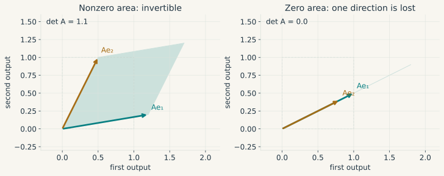{#fig-determinant-invertibility}

For actual calculations, row operations solve systems without changing their solutions. From $x_1+x_2=5$ and $2x_1-x_2=1$, subtracting twice the first equation from the second gives $-3x_2=-9$, hence $(x_1,x_2)=(2,3)$. Gaussian elimination extends this operation to larger systems. Numerical software ordinarily solves a system directly rather than constructing an inverse.

Invertibility also need not imply precision. The condition number $\kappa_2(A)=\|A\|_2\|A^{-1}\|_2$, using the induced operator norm, measures worst-case relative sensitivity to perturbations in the right-hand side. Nearly proportional columns can make it very large. This is a numerical difficulty related to, though not synonymous with, weak statistical identification.

### Least squares with one regressor: fitting a line {#sec-ols-scalar}

Suppose we observe consumption $y_t$ and income $x_t$ for $T$ households, and would like to summarise their relation by a straight line. For the moment this is a fitting exercise, not a claim that income is exogenous or that the line measures a causal effect. In the **simple regression**, each $x_t$ and $y_t$ is a scalar. The line nevertheless has two coefficients: an intercept $a$ and a slope $b$.

For given coefficients, the fitted value is $a+bx_t$ and the residual is $y_t-a-bx_t$. Ordinary least squares (OLS) chooses the line which minimises the sum of squared residuals:

$$
S(a,b)=\sum_{t=1}^T(y_t-a-bx_t)^2.
$$

Squaring prevents positive and negative residuals from cancelling and penalises a large discrepancy more than a small one. The residual is a vertical distance in a plot of $y$ against $x$: income is treated as the given horizontal coordinate, and the discrepancy concerns the response. OLS does not minimise perpendicular distances to the line in that plot.

We can derive the solution using only algebra. Write $\bar x=T^{-1}\sum_t x_t$ and $\bar y=T^{-1}\sum_t y_t$. Adding and subtracting these means in each residual, then expanding the square, gives

$$
\begin{aligned}
S(a,b)={}&\sum_{t=1}^T\big[(y_t-\bar y)-b(x_t-\bar x)\big]^2\\
&+T(\bar y-a-b\bar x)^2.
\end{aligned}
$$

The cross term is zero because each centred variable sums to zero. For any slope $b$, the second term is minimised by $a=\bar y-b\bar x$. Thus the best line passes through the sample means. We are left with choosing its slope.

Define the two sample sums

$$
\begin{aligned}
S_{xx}&=\sum_{t=1}^T(x_t-\bar x)^2,\\
S_{xy}&=\sum_{t=1}^T(x_t-\bar x)(y_t-\bar y).
\end{aligned}
$$

If $S_{xx}>0$, completing the square in $b$ yields the unique estimates

$$
\hat b=\frac{S_{xy}}{S_{xx}},\qquad
\hat a=\bar y-\hat b\bar x.
$$ {#eq-ols-scalar}

Indeed, after setting $a=\bar y-b\bar x$, the objective equals its minimum plus $S_{xx}(b-\hat b)^2$. No other slope can improve it. The slope is a ratio of sample covariance to sample variance, since the common divisor used in these two statistics cancels. If all incomes are identical, $S_{xx}=0$: the observations cannot distinguish a change in the slope from a compensating change in the intercept. This is the scalar form of exact collinearity.

For a small numerical example, take four pairs

$$
(x_t,y_t)\in\{(0,1),(1,2),(2,2),(3,4)\}.
$$

Then $\bar x=1.5$, $\bar y=2.25$, $S_{xx}=5$ and $S_{xy}=4.5$. Hence $\hat a=\hat b=.9$. The fitted values are $.9,1.8,2.7,3.6$, giving residuals $.1,.2,-.7,.4$ and a sum of squares of $.70$. The proposed line $1+x$ instead gives a sum of squares of $1$. These calculations show exactly what is being compared.

The OLS residuals $\hat u_t=y_t-\hat a-\hat b x_t$ satisfy

$$
\sum_{t=1}^T\hat u_t=0,\qquad
\sum_{t=1}^Tx_t\hat u_t=0.
$$

These are the **normal equations**: the residuals are orthogonal to the constant and to the regressor in the observed sample. After introducing derivatives, one can obtain the same equations by setting the two partial derivatives of $S(a,b)$ to zero. Importantly, they are identities created by the fit. They are not evidence that the unobserved economic error is exogenous.

If the intercept is deliberately excluded, the line is restricted to pass through zero. Minimising $\sum_t(y_t-bx_t)^2$ then gives

$$
\hat b_{\text{no intercept}}
=\frac{\sum_t x_ty_t}{\sum_t x_t^2},
\qquad \sum_t x_t^2>0.
$$

This is a different model. Its residuals need not sum to zero, and the centred formula in @eq-ols-scalar no longer applies.

### From the scalar normal equations to matrix OLS {#sec-ols-matrix}

To write the same simple regression in matrix form, place the observations in rows and the regressors in columns:

$$
X=\begin{pmatrix}
1&x_1\\1&x_2\\\vdots&\vdots\\1&x_T
\end{pmatrix},\qquad
\beta=\begin{pmatrix}a\\b\end{pmatrix}.
$$

The first column of $X$ supplies the intercept. Multiplication gives $(X\beta)_t=a+bx_t$, so stacking the observations has not changed a single fitted value. The two scalar normal equations become $X'(y-X\hat\beta)=0$. Written out, this is

$$
\begin{pmatrix}
T&\sum_t x_t\\
\sum_t x_t&\sum_t x_t^2
\end{pmatrix}
\begin{pmatrix}\hat a\\\hat b\end{pmatrix}
=\begin{pmatrix}\sum_t y_t\\\sum_t x_ty_t\end{pmatrix}.
$$

Solving its first row for $\hat a$, then substituting into its second row, reproduces @eq-ols-scalar. The determinant of this $2\times2$ matrix is $TS_{xx}$, so invertibility imposes exactly the same variation requirement as before.

With several regressors, we add columns to $X$. Let $X\in\mathbb R^{T\times k}$, where $k$ counts all coefficients including an intercept when present, and let $y\in\mathbb R^T$. The fitted vector $X\beta$ is a linear combination of these columns. We therefore seek a vector in $\mathcal C(X)$ as close as possible to $y$. At the closest point $\hat y$, the residual $r=y-\hat y$ must be orthogonal to every available direction: otherwise moving a little in one of those directions would reduce the distance.

Indeed, if $X'r=0$, then for any coefficient change $d$,

$$
\begin{aligned}
\|y-X(\hat\beta+d)\|_2^2
&=\|r-Xd\|_2^2\\
&=\|r\|_2^2+\|Xd\|_2^2.
\end{aligned}
$$

This proves optimality without yet using differentiation. When $X$ has full column rank, $\|Xd\|_2^2>0$ for $d\neq0$, so the coefficients are unique:

$$
\begin{gathered}
X'(y-X\hat\beta)=0,\\
\hat\beta=(X'X)^{-1}X'y.
\end{gathered}
$$ {#eq-ols-projection}

Check the dimensions in @eq-ols-projection: $X'X$ and its inverse have size $k\times k$, $X'y$ has size $k\times1$, and $\hat\beta$ has size $k\times1$. The projection matrix $P_X=X(X'X)^{-1}X'$ instead has size $T\times T$, since it sends the observed response vector to its fitted vector. It satisfies $P_X'=P_X$ and $P_X^2=P_X$. Thus $y=P_Xy+(I_T-P_X)y$ is a decomposition into orthogonal components. With deficient rank the fitted vector remains unique, although several coefficient vectors produce it. None of these geometric statements requires a distribution for the data.

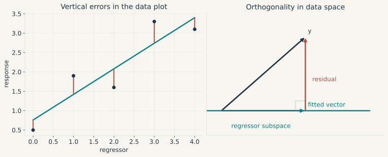{#fig-ols-geometry}

[Explore regression and projection in the Interactive Lab](../interactive-lab.html?method=linear-projection).

### Repeated movements and eigenvalues {#sec-eigenvalues-stability}

Return to @eq-maths-state-system and switch off new shocks. After $h$ periods the state is $A^hx_t$. For this particular matrix,

$$
A\begin{pmatrix}1\\1\end{pmatrix}
=.9\begin{pmatrix}1\\1\end{pmatrix},
\qquad
A\begin{pmatrix}2\\-1\end{pmatrix}
=.6\begin{pmatrix}2\\-1\end{pmatrix}.
$$

These two directions retain their orientation. An **eigenvector** is a nonzero vector $v$ satisfying $Av=\lambda v$; $\lambda$ is its eigenvalue. Along it, $A^hv=\lambda^hv$. Here every initial state is a combination of the two displayed directions, which decay at rates $.9^h$ and $.6^h$.

The eigenvalues solve $\det(A-\lambda I)=0$. For a $2\times2$ matrix their sum is the trace and their product the determinant. A negative real eigenvalue reverses the sign at each step. Nonreal eigenvalues of a real matrix come in conjugate pairs and describe rotation and scaling on a real invariant plane; a complex number's modulus, not its real part alone, governs discrete-time decay.

For any finite square matrix,

$$
A^h\longrightarrow0
\quad\Longleftrightarrow\quad
\rho(A):=\max_i|\lambda_i|<1.
$$

This is an asymptotic statement. A matrix can first amplify a disturbance and only later attenuate it. Nor does a unit-modulus eigenvalue always imply bounded paths: the matrix $\left(\begin{smallmatrix}1&1\\0&1\end{smallmatrix}\right)$ has powers $\left(\begin{smallmatrix}1&h\\0&1\end{smallmatrix}\right)$. For continuous time, $\dot x=Ax$, the decay condition instead requires every eigenvalue to have strictly negative real part.

::: {#fig-dynamics-film .math-film}

```{=html}
<video controls preload="none" playsinline poster="../figures/mathematics/animations/Stability.png" aria-label="Animation: stable and explosive rotating trajectories">
<source src="../figures/mathematics/animations/Stability.mp4" type="video/mp4">
<a href="../figures/mathematics/animations/Stability.mp4">Download the animation.</a>
</video>
```


The same initial displacement is propagated by two rotation matrices, scaled by 0.88 and 1.06. Dots mark discrete dates. Joining them helps follow the sequence; the joining segments are not continuous-time solutions.
:::

### Decompositions and covariance matrices {#sec-decompositions}

In the example just considered, placing the eigenvectors in $V$ gives $A=V\Lambda V^{-1}$, with $\Lambda$ diagonal. This **diagonalisation** changes coordinates so that the dynamics separate. It requires a full basis of eigenvectors, over $\mathbb C$ if necessary. A repeated eigenvalue is not in itself an obstacle: its eigenspace must have the same dimension as its algebraic multiplicity. When this fails, Jordan blocks introduce polynomial factors in $h$; these still decay when multiplied by $\lambda^h$ with $|\lambda|<1$.

For a real symmetric matrix $S$, an orthonormal eigenbasis always exists:

$$
S=Q\Lambda Q',\qquad Q'Q=I.
$$

It follows that $x'Sx=\sum_i\lambda_i (Q'x)_i^2$. Thus $S$ is positive semidefinite if all its eigenvalues are nonnegative, and positive definite if they are all positive. These are the curvature properties used below. They also explain why a covariance matrix has no negative eigenvalues: $a'\Sigma a=\operatorname{Var}(a'X)\geq0$, provided second moments exist.

For a rectangular matrix $X\in\mathbb R^{T\times k}$ the full singular-value decomposition is $X=UDV'$, where $U$ and $V$ are square orthogonal matrices and $D$ is rectangular with nonnegative diagonal entries. The singular values are the square roots of the eigenvalues of $X'X$; they measure stretching rather than dynamic persistence. PCA selects the directions of greatest variance. QR, with $X=QR$ and orthonormal columns of $Q$ when $X$ has full column rank, instead lets us solve the triangular system $R\hat\beta=Q'y$ without forming $X'X$.

If $\Sigma$ is positive definite, Cholesky gives $\Sigma=PP'$ with $P$ lower triangular and positive diagonal. This factor is unique for a chosen ordering. But $\Sigma=(PQ)(PQ)'$ for every orthogonal $Q$. A covariance matrix therefore does not identify a unique set of structural shocks. A recursive interpretation of its Cholesky factor imposes an economic restriction beyond the algebra.

Finally, $\operatorname{vec}(B)$ stacks columns, and $A\otimes B$ replaces each entry $a_{ij}$ by the block $a_{ij}B$. The useful identity

$$
\operatorname{vec}(AXB)=(B'\otimes A)\operatorname{vec}(X)
$$

keeps track of equations and observations simultaneously. Under the multivariate regression model $Y=XB+U$ with $\operatorname{Var}(\operatorname{vec}U\mid X)=\Sigma_u\otimes I_T$, it gives $\operatorname{Var}(\operatorname{vec}\hat B\mid X)=\Sigma_u\otimes(X'X)^{-1}$. These covariance assumptions require particular care when regressors include lagged dependent variables.

## Analysis: when is a local approximation justified? {#sec-analysis-foundations}

### A growth calculation exposes the need for a limit {#sec-functions-transformations}

If output rises from 100 to 102, its proportional growth rate is $.02$, whereas its log change is $\log(1.02)\simeq .019803$. The two numbers are close, but not identical. For a fall from 100 to 50 they are $-.5$ and $\log(.5)\simeq-.693147$. We would like to explain both the approximation and the way its accuracy deteriorates.

A function is specified by a domain, a codomain, and a rule assigning exactly one output to each input. Here $f(g)=\log(1+g)$ is defined for $g>-1$. The boundary is substantive: a percentage loss cannot take a positive level below zero while leaving its logarithm defined. In several variables, a production function $F(K,L)=K^\alpha L^{1-\alpha}$ is conveniently studied on $(0,\infty)^2$, with $0<\alpha<1$.

To say precisely that $f(g)$ is close to $g$ near zero, we need limits. A sequence $x_n\in\mathbb R^d$ converges to $a$ when, for every $\varepsilon>0$, there is an $N$ such that $n\geq N$ implies $\|x_n-a\|_2<\varepsilon$. The threshold $N$ may depend on the requested accuracy, but every subsequent term must meet it. Seeing a few small discrepancies is not enough.

For a function on $D\subseteq\mathbb R^d$, a limit at an accumulation point $a$ is the corresponding statement about *all* nearby inputs. We write

$$
\lim_{\substack{x\to a\\x\in D}}f(x)=\ell
$$

if, for every $\varepsilon>0$, there exists $\delta>0$ such that every $x\in D$ satisfying $0<\|x-a\|_2<\delta$ also satisfies

$$
\|f(x)-\ell\|_2<\varepsilon.
$$

Equivalently, every sequence in $D\setminus\{a\}$ converging to $a$ must have images converging to $\ell$. The order of the quantifiers is crucial: one $\delta$ must control every admissible approach within that neighbourhood.

### Several approaches to the same point

Consider $f(x,y)=xy/(x^2+y^2)$ away from the origin. Along either coordinate axis its value is zero. It might therefore seem reasonable to fill in the value zero at the origin. However, along $y=x$ the value is $1/2$, however close the point lies to zero. The limit does not exist.

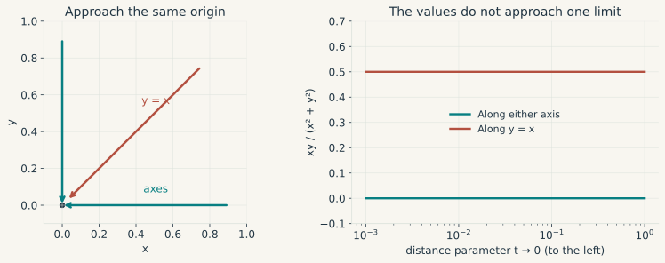{#fig-limit-paths}

Checking paths can disprove a limit, but checking finitely many paths cannot generally prove one. A useful proof instead bounds all directions at once. For example,

$$
\left|\frac{x^2y}{x^2+y^2}\right|
\leq |y|\leq\sqrt{x^2+y^2}
\longrightarrow0.
$$

Consequently this second function does have limit zero. A norm bound supplies the uniform control across directions which a few plotted paths lack.

A function is **continuous at $a\in D$** if $f(x)\to f(a)$ as $x\to a$ within $D$. Continuity preserves limits; it neither requires a slope nor prevents sharp corners. The absolute-value function is continuous at zero even though its left and right slopes differ.

### Neighbourhoods, boundaries, and existence

An unconstrained minimum of $(x-2)^2$ is attained at $2$. On the open interval $(0,1)$, however, the values approach $1$ as $x\uparrow1$, but never attain it. The infimum is $1$ and there is no minimiser. “Find the minimum” thus presupposes an existence question.

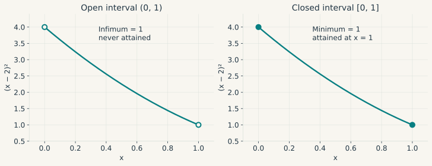{#fig-compactness}

An **open ball** $B(a,r)=\{x:\|x-a\|_2<r\}$ describes a neighbourhood. A point is interior to a set if some such ball lies inside it. A set is open if every point is interior; it is closed if it contains the limits of its convergent sequences. Boundary points have arbitrarily close points in both the set and its complement. These definitions distinguish unrestricted local movement from movement constrained by a boundary.

In $\mathbb R^d$, **compactness** is equivalent to being closed and bounded, and also to every sequence having a convergent subsequence with its limit still in the set. This provides the missing existence argument: a continuous real function on a nonempty compact set attains its minimum and maximum. To prove the minimum claim, continuity and compactness first imply boundedness; choose a sequence of values approaching the infimum, extract a convergent subsequence, and use continuity at its limit. Without closedness, the limiting candidate may escape through an excluded boundary; without boundedness, it may escape to infinity.

Compactness also strengthens pointwise continuity to **uniform continuity**: for each $\varepsilon$, a single $\delta$ works throughout the domain. On $(0,1)$, $f(x)=1/x$ is continuous but not uniformly continuous. Taking $x_n=1/n$ and $y_n=1/(n+1)$ makes the inputs arbitrarily close while the outputs remain one unit apart. This is why an approximation on a fixed compact region can be controlled more easily than an approximation near a singularity.

### From a secant to a derivative

We can now return to log growth. The slope between $(a,f(a))$ and $(a+h,f(a+h))$ is a finite change divided by $h$. If the slopes converge as $h\to0$ from both sides, their limit is

$$
f'(a)=\lim_{h\to0}\frac{f(a+h)-f(a)}h.
$$

Rearranging this definition gives $f(a+h)=f(a)+f'(a)h+r(h)$, where $r(h)/h\to0$. A derivative therefore supplies a linear approximation with an error negligible relative to the displacement. We write $r(h)=o(|h|)$. In contrast, $r(h)=O(|h|)$ only means that $|r(h)|/|h|$ remains bounded; it need not tend to zero.

::: {#fig-taylor-film .math-film}

```{=html}
<video controls preload="none" playsinline poster="../figures/mathematics/animations/Taylor.png" aria-label="Animation: secants converge to the tangent of log one plus g, then a quadratic approximation is added">
<source src="../figures/mathematics/animations/Taylor.mp4" type="video/mp4">
<a href="../figures/mathematics/animations/Taylor.mp4">Download the animation.</a>
</video>
```


The slope of a secant to $\log(1+g)$ approaches one at zero. The tangent captures the first-order change. Adding $-g^2/2$ accounts for curvature but remains a local approximation.
:::

Differentiability implies continuity by the remainder formula. The converse fails at the corner of $|x|$. The product and quotient rules follow by expanding increments; the chain rule says $(f\circ g)'(a)=f'(g(a))g'(a)$ whenever the two derivatives exist at the required points.

The **mean value theorem** makes a local derivative informative about a finite interval. If $f$ is continuous on $[a,b]$ and differentiable on $(a,b)$, some $c\in(a,b)$ satisfies $f(b)-f(a)=f'(c)(b-a)$. One proof subtracts the secant line from $f$: the resulting function has equal endpoint values, so Rolle's theorem gives a zero derivative at an interior extremum. In particular, $|f'|\leq M$ throughout an interval implies $|f(b)-f(a)|\leq M|b-a|$.

### Integration and the size of the Taylor remainder

An accumulated flow motivates integration. If a marginal cost $c(q)$ varies continuously with output, partition an interval into small quantities $\Delta q_j$ and sum $c(q_j)\Delta q_j$. As the largest interval width tends to zero, these sums define the Riemann integral. Continuous functions on a compact interval are integrable. The fundamental theorem of calculus gives

$$
\begin{gathered}
F(x)=\int_a^x c(s)\,ds \ \Rightarrow\ F'(x)=c(x),\\
f(b)-f(a)=\int_a^b f'(s)\,ds
\end{gathered}
$$

when $c$ is continuous and, for the second identity, $f$ is continuously differentiable. Integration by parts, $\int u v'=[uv]-\int u'v$, follows by integrating the product rule. Substitution follows in the same way from the chain rule.

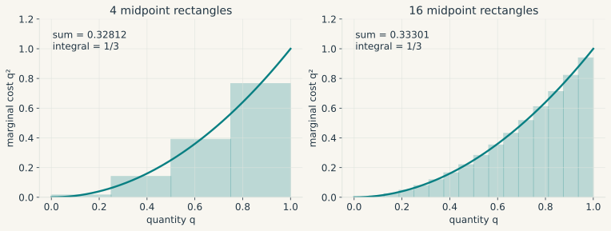{#fig-integration}

Suppose $f$ has continuous derivatives through order two near $a$, which we write as $f\in C^2$ near $a$. Integrating twice along the segment from $a$ to $a+h$ gives

$$
\begin{aligned}
f(a+h)={}&f(a)+f'(a)h\\
&+h^2\int_0^1(1-t)f''(a+th)\,dt.
\end{aligned}
$$

Replacing the second derivative inside the integral by $f''(a)$ yields

$$
f(a+h)=f(a)+f'(a)h+\tfrac12 f''(a)h^2+o(h^2).
$$

This is the second-order **Taylor expansion**. The little-$o$ statement follows from continuity of $f''$, since the maximum of $|f''(a+th)-f''(a)|$ on the shrinking segment tends to zero. If $f$ is $C^3$ and $|f'''|\leq M$ on that segment, the remainder after the quadratic term is at most $M|h|^3/6$.

For log growth, $f'(0)=1$, $f''(0)=-1$, and $f'''(g)=2/(1+g)^3$. Hence, for $|g|\leq r<1$,

$$
\begin{gathered}
\log(1+g)=g-\frac{g^2}{2}+R(g),\\
|R(g)|\leq\frac{|g|^3}{3(1-r)^3}.
\end{gathered}
$$ {#eq-log-taylor}

The bound explicitly identifies where the approximation is controlled. It deteriorates near $g=-1$. At $g=.02$, the quadratic gives $.0198$, within about $2.63\times10^{-6}$ of the exact value.

::: {.math-explorer data-math="taylor"}
**Try a different growth rate.** Move $g$ to compare the exact logarithm, its tangent and its quadratic approximation.
:::

A finite Taylor formula should not be confused with an infinite power series. The series $\log(1+g)=\sum_{k\geq1}(-1)^{k+1}g^k/k$ converges for $|g|<1$, but smoothness alone does not imply equality with a Taylor series. The function $e^{-1/x^2}$ for $x\neq0$, extended by zero at zero, has all derivatives zero there and is positive elsewhere. It is infinitely differentiable but not analytic at zero.

### Partial derivatives are only the beginning {#sec-multivariate-differentiability}

Suppose output is $F(K,L)=K^\alpha L^{1-\alpha}$. Increasing capital while holding labour fixed gives $\partial_KF=\alpha K^{\alpha-1}L^{1-\alpha}$. Increasing labour alone gives $\partial_LF=(1-\alpha)K^\alpha L^{-\alpha}$. These **partial derivatives** describe movements along the coordinate axes. For simultaneous input changes we need one linear rule valid in every direction.

A map $F:U\subseteq\mathbb R^n\to\mathbb R^m$, with $U$ open, is **differentiable at $a\in U$** if there is a linear map $J$ for which the remainder

$$
r(h)=F(a+h)-F(a)-Jh
$$

satisfies, as $h\to0$ with $h\neq0$,

$$
\frac{\|r(h)\|_2}{\|h\|_2}\longrightarrow0.
$$ {#eq-total-derivative}

The linear map is unique. Indeed, if two such maps existed, setting $h=tv$ would imply $(J_1-J_2)v=0$ for every $v$. Taking $v$ successively as the basis vectors shows that $J_{ij}=\partial F_i/\partial x_j$. The matrix $J=J_F(a)\in\mathbb R^{m\times n}$ is the **Jacobian**: one row per output, one column per input.

For a scalar function, its gradient is a column, $\nabla f=(\partial_1f,\ldots,\partial_nf)'$, whereas $J_f=\nabla f'$. Consequently $df=\nabla f'\,dx$. For the production function,

$$
dF=F\left(\alpha\frac{dK}{K}+(1-\alpha)\frac{dL}{L}\right).
$$

Dividing by $F$ explains the familiar first-order relation between proportional changes. For Cobb-Douglas the *log-level* identity $\log F=\alpha\log K+(1-\alpha)\log L$ is exact; replacing log changes by proportional changes is the approximation.

The existence of partial derivatives does not by itself establish @eq-total-derivative. Extend $f(x,y)=x^2y/(x^2+y^2)$ by $f(0,0)=0$. We already proved continuity. Both partial derivatives at zero are zero, so any total derivative would have to vanish. Yet along $(x,y)=(t,t)$, $f=t/2$ and

$$
\frac{|f(t,t)|}{\|(t,t)\|_2}=\frac1{2\sqrt2}\not\to0.
$$

The function is not differentiable there. Even existence of every directional derivative is insufficient: here the derivative along $v$ is $v_1^2v_2/(v_1^2+v_2^2)$ for $v\neq0$, which is not linear in $v$. A practical sufficient condition is that all first partial derivatives exist in a neighbourhood of $a$ and are continuous at $a$. To see why, telescope a displacement coordinate by coordinate, apply the one-dimensional mean value theorem to each increment, and use continuity to bound the sum of the errors by $o(\|h\|_2)$.

### Composition, curvature, and a local picture {#sec-jacobian-foundations}

Consider the nonlinear two-equation map

$$
G(x_1,x_2)=
\begin{pmatrix}x_1+.4x_2+.12x_1^2\\-.2x_1+.8x_2+.08x_2^2\end{pmatrix},
$$

whose Jacobian is

$$
J_G(x)=
\begin{pmatrix}1+.24x_1&.4\\-.2&.8+.16x_2\end{pmatrix}.
$$

At zero, the error of the linear approximation is exactly $(.12h_1^2,.08h_2^2)'$. Reducing a displacement by half reduces this error by a factor of four. The Jacobian describes a local map because this quadratic error becomes negligible relative to the first-order displacement.

::: {#fig-jacobian .math-film}

```{=html}
<video controls preload="none" playsinline poster="../figures/mathematics/animations/Jacobian.png" aria-label="Animation: nonlinear and Jacobian images of a shrinking neighbourhood">
<source src="../figures/mathematics/animations/Jacobian.mp4" type="video/mp4">
<a href="../figures/mathematics/animations/Jacobian.mp4">Download the animation.</a>
</video>
```


The teal grid is the nonlinear image of a neighbourhood of zero; the ochre grid is its Jacobian approximation. The view rescales by the neighbourhood radius as it shrinks, so their agreement shows an error small *relative* to the displacement.
:::

If $G:\mathbb R^n\to\mathbb R^m$ is differentiable at $a$ and $F:\mathbb R^m\to\mathbb R^p$ is differentiable at $G(a)$, composition gives

$$
J_{F\circ G}(a)=J_F(G(a))J_G(a).
$$

The dimensions are $(p\times m)(m\times n)$. For scalar $f$ and a unit vector $v$, the directional derivative is $\nabla f(a)'v$. Cauchy-Schwarz bounds it above by $\|\nabla f(a)\|_2$, attained by $v=\nabla f(a)/\|\nabla f(a)\|_2$ when the gradient is nonzero. This proves the steepest-ascent interpretation in the Euclidean metric.

For a $C^2$ scalar function, the derivative of the gradient is the **Hessian**, $H_f=(\partial_i\partial_j f)_{ij}$. Continuity of second partial derivatives ensures symmetry. Applying the one-dimensional expansion to $\varphi(t)=f(a+th)$ gives

$$
\begin{aligned}
f(a+h)={}&f(a)+\nabla f(a)'h\\
&+\tfrac12h'H_f(a)h+o(\|h\|_2^2).
\end{aligned}
$$ {#eq-multivariate-taylor}

The quadratic term includes interactions: in two dimensions it is $\tfrac12 f_{11}h_1^2+f_{12}h_1h_2+\tfrac12 f_{22}h_2^2$. If $\|H_f(x)-H_f(y)\|_2\leq L\|x-y\|_2$ near the segment, the remainder is bounded by $L\|h\|_2^3/6$. For a vector-valued function, each output has its own Hessian; the Jacobian alone is the first-order object.

### Equilibrium, local inversion, and comparative statics {#sec-implicit-function}

Suppose an equilibrium price $p$ solves $D(p,\tau)-S(p)=0$, where $\tau$ shifts demand. Take $D=a+\tau-bp$ and $S=cp$, with $b,c>0$. Solving gives $p=(a+\tau)/(b+c)$ and $\partial p/\partial\tau=1/(b+c)$. The derivative is large when demand and supply together adjust little to a price change.

The same logic works without explicit solution. Write a system as $F(z,\theta)=0$, with $z\in\mathbb R^n$ endogenous and $\theta\in\mathbb R^k$. Suppose $F$ is $C^1$ on an open neighbourhood of $(z_0,\theta_0)$, $F(z_0,\theta_0)=0$, and the square matrix $F_z(z_0,\theta_0)$ is invertible. The **implicit function theorem** provides neighbourhoods in which the solutions are exactly $z=z(\theta)$ for a unique $C^1$ function. Differentiating the identity gives

$$
F_z\,D_\theta z+F_\theta=0,
\qquad
D_\theta z=-F_z^{-1}F_\theta.
$$

The theorem justifies differentiating a locally existing solution; the algebra alone would not establish existence. The closely related **inverse function theorem** says that a $C^1$ square map with nonsingular Jacobian at a point has a $C^1$ local inverse, with derivative equal to the inverse Jacobian. Neither theorem asserts global uniqueness.

For $F(z,\theta)=z^2-\theta$, the positive branch has derivative $1/(2\sqrt\theta)$ for $\theta>0$. At zero the Jacobian with respect to $z$ vanishes; two solutions exist for positive $\theta$ and none for negative $\theta$. Singularity means the theorem is unavailable, not that every singular system must exhibit exactly this failure.

Finally, if $x_{t+1}=G(x_t)$ and $G(x^*)=x^*$, @eq-total-derivative gives $x_{t+1}-x^*=J_G(x^*)(x_t-x^*)+o(\|x_t-x^*\|)$. For a $C^1$ map, $\rho(J_G(x^*))<1$ implies local asymptotic stability; an eigenvalue with modulus greater than one implies instability. Eigenvalues on the unit circle leave the linear test inconclusive. For instance, near zero, $x_{t+1}=x_t-x_t^3$ converges to zero while $x_{t+1}=x_t+x_t^3$ moves away, although both derivatives at zero equal one. In models with forward-looking variables, equilibrium determinacy additionally depends on boundary conditions and the number of freely adjusting variables.

## Optimisation: which movements remain available? {#sec-optimisation-foundations}

### Existence, stationarity, and curvature

The least-squares criterion is $S(\beta)=\|y-X\beta\|_2^2$. Our geometric argument already found its minimiser. Differentiation now gives $\nabla S=2X'(X\beta-y)$ and $H_S=2X'X$. Full column rank makes the Hessian positive definite, confirming the unique minimum.

A **local minimum** $x^*$ minimises $f$ among feasible points in some neighbourhood; a **global minimum** does so over the entire feasible set. A strict minimum requires a strict inequality for other points in the relevant set. Existence precedes these classifications. Compactness and continuity provide one sufficient condition; on a nonempty closed unbounded set, continuity and **coercivity**, $f(x)\to+\infty$ as $\|x\|\to\infty$ within the set, provide another by restricting attention to a compact sublevel set.

If $x^*$ is an interior local minimum of a differentiable function, then $\nabla f(x^*)=0$. Indeed, both $v$ and $-v$ are feasible small directions, so $\nabla f(x^*)'v$ can be neither positive nor negative for every $v$. This is a necessary condition, not a guarantee: $x^3$ has zero derivative at zero and keeps increasing through it.

For a $C^2$ function, an interior minimum must also have $H_f(x^*)$ positive semidefinite. If the gradient vanishes and the Hessian is positive definite, the point is a strict local minimum. To prove sufficiency, let $m>0$ be the smallest eigenvalue. The Taylor quadratic is at least $m\|h\|^2/2$ and eventually dominates the $o(\|h\|^2)$ remainder. A negative definite Hessian gives a strict maximum; an indefinite one gives a saddle.

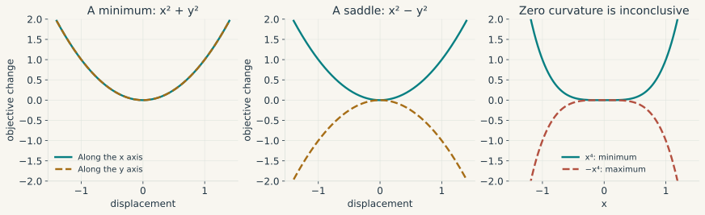{#fig-curvature}

Semidefiniteness alone leaves the test undecided. For $x^4$ and $-x^4$, both the derivative and the second derivative vanish at zero, but the conclusions are opposite. A plot or an optimiser reporting “gradient close to zero” cannot remove this ambiguity.

### Convexity turns a local statement into a global one {#sec-convexity}

With a quadratic loss, averaging two candidate coefficient vectors cannot make the loss exceed the corresponding average of their losses. This is the useful property to generalise. A set $C$ is convex if it contains $(1-t)x+ty$ for $x,y\in C$ and $t\in[0,1]$. A function on a convex domain is **convex** if

$$
f((1-t)x+ty)\leq(1-t)f(x)+tf(y).
$$

Strict convexity requires strict inequality for $x\neq y$ and $0<t<1$. For a differentiable function on an open convex domain, convexity is equivalent to

$$
f(y)\geq f(x)+\nabla f(x)'(y-x).
$$

To obtain this supporting-plane inequality, apply the chord inequality to $x+t(y-x)$, divide by $t$, and let $t\downarrow0$. Conversely, applying the supporting-plane inequality at the intermediate point to both endpoints and taking weighted sums recovers convexity. If the function is $C^2$, these conditions are equivalent to $H_f(x)\succeq0$ everywhere on the open convex domain.

The consequence for optimisation is substantial. A stationary point of a differentiable convex function is a global minimum. Every local minimum over a convex feasible set is global: otherwise a short step toward a better feasible point would already improve the objective. Strict convexity gives at most one minimiser, but does not ensure that one exists. The strictly convex function $e^x$ on $\mathbb R$ has an unattained infimum of zero. Nor is a positive definite Hessian necessary for strict convexity, as $x^4$ illustrates.

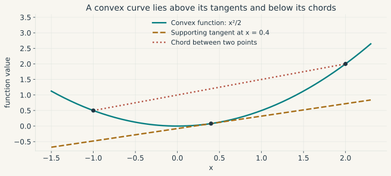{#fig-convexity}

### An equality constraint and the Lagrangian

Consider a two-period household choosing $c_1,c_2>0$ to maximise $\log c_1+\beta\log c_2$, with $\beta>0$, subject to $c_1+c_2/R=w$, where $R,w>0$. Eliminating $c_2$ gives $\log c_1+\beta\log(R(w-c_1))$ on $0<c_1<w$. Its derivative is $1/c_1-\beta/(w-c_1)$, and it vanishes at

$$
c_1^*=\frac{w}{1+\beta},
\qquad
c_2^*=\frac{\beta Rw}{1+\beta}.
$$

The second derivative is negative, and utility tends to $-\infty$ at the endpoints. This verifies existence and the unique maximum on the open feasible segment.

For many choices and constraints, elimination becomes cumbersome. We use a minimisation convention throughout: minimise $f=-\log c_1-\beta\log c_2$ and set $h(c,w)=c_1+c_2/R-w$. The **Lagrangian** is $\mathcal L=f+\lambda h$. Stationarity gives $-1/c_1+\lambda=0$ and $-\beta/c_2+\lambda/R=0$, together with $h=0$, recovering the allocation above.

The multiplier has a geometric origin. At a feasible point with linearly independent equality gradients, first-order feasible displacements satisfy $J_h d=0$. A constrained optimum cannot improve in either direction along a feasible curve, so $\nabla f'd=0$ for every tangent $d$. The orthogonal complement of this null space is the span of the constraint gradients. Consequently

$$
\nabla f(x^*)+J_h(x^*)'\lambda=0,\qquad h(x^*)=0.
$$

For $C^1$ equalities, full row rank of $J_h$ allows the implicit function theorem to identify these linearised displacements with the actual tangent space. Equality multipliers have no sign restriction.

### A borrowing bound makes an inequality bind {#sec-kkt}

Now take a simpler allocation problem in which a scalar choice cannot exceed a cap:

$$
\min_x\ \tfrac12(x-a)^2
\qquad\text{subject to}\qquad x-b\leq0.
$$

If $a<b$, the preferred choice $a$ is feasible and the cap is slack. If $a>b$, the best feasible choice is $b$. At $a=b$, the cap binds but changing it slightly has no first-order value. The solution and multiplier are

$$
x^*=\min(a,b),
\qquad
\mu^*=\max(a-b,0).
$$ {#eq-cap-solution}

They satisfy $x^*-a+\mu^*=0$, $x^*-b\leq0$, $\mu^*\geq0$, and $\mu^*(x^*-b)=0$. The last equation says that a constraint can have a positive multiplier only when it binds. Its converse is false: a binding constraint may have a zero multiplier.

::: {.math-explorer data-math="kkt"}
**Move the cap.** The unconstrained choice is $a=1$. As $b$ passes through one, compare the optimum, the multiplier and the optimised loss.
:::

These are the **Karush-Kuhn-Tucker (KKT) conditions**. For the problem

$$
\begin{aligned}
&\min_{x\in U} f(x)\\
&\text{subject to }g_i(x)\leq0\quad(i=1,\ldots,m),\\
&\phantom{\text{subject to }}h_j(x)=0\quad(j=1,\ldots,r),
\end{aligned}
$$

where $U$ is open, define

$$
\begin{aligned}
\mathcal L(x,\mu,\lambda)
={}&f(x)+\sum_{i=1}^m\mu_i g_i(x)\\
&+\sum_{j=1}^r\lambda_j h_j(x).
\end{aligned}
$$

At a candidate $(x^*,\mu^*,\lambda^*)$, the four requirements concern different parts of the problem.

**Stationarity:** the gradient of the Lagrangian with respect to the choice is zero:

$$
\begin{aligned}
0={}&\nabla f(x^*)+\sum_i\mu_i^*\nabla g_i(x^*)\\
&+\sum_j\lambda_j^*\nabla h_j(x^*).
\end{aligned}
$$ {#eq-kkt}

**Primal feasibility:** the choice satisfies the original constraints, $g_i(x^*)\leq0$ for every inequality and $h_j(x^*)=0$ for every equality.

**Dual feasibility:** each inequality multiplier satisfies $\mu_i^*\geq0$. Equality multipliers are unrestricted.

**Complementary slackness:** for each inequality,

$$
\mu_i^*g_i(x^*)=0.
$$

Hence a slack inequality has a zero multiplier. An active inequality may have a positive or a zero multiplier, as the scalar cap example showed.

The signs follow from the stated minimisation convention and the form $g_i\leq0$. A lower bound $x\geq0$ must be written $-x\leq0$. Maximisation can be converted to minimisation by negating the objective.

### Why a constraint qualification is necessary

Consider $\min_x x$ subject to $x^2\leq0$. Only $x=0$ is feasible, so it is certainly a global minimum. Yet stationarity would require $1+\mu(2x)=0$, which is impossible at zero. The gradient of the constraint vanishes at the very point where it must describe the restriction.

KKT conditions are therefore necessary only under an appropriate **constraint qualification**. A useful sufficient qualification is **LICQ**: the gradients of all equalities and of the active inequalities

$$
\mathcal A(x^*)=\{i:g_i(x^*)=0\}
$$

are linearly independent. If the objective and constraints are $C^1$ near a feasible local minimiser and LICQ holds there, KKT multipliers exist and are unique. A weaker common qualification, MFCQ, requires independent equality gradients and a direction $d$ satisfying $J_hd=0$ and $\nabla g_i'd<0$ for every active inequality. We will usually verify LICQ in worked examples; neither qualification should be silently presumed.

Under the qualification, the geometric argument behind KKT can be expressed as follows. Feasible first-order movements lie in $J_hd=0$, $\nabla g_i'd\leq0$ for active $i$. At a minimum there can be no such direction with $\nabla f'd<0$. A separating-hyperplane result, the finite-dimensional alternative known as Farkas' lemma, expresses this absence of an improving direction by the multiplier equation in @eq-kkt. Nonnegative inequality multipliers reflect the one-sided restriction.

### When KKT proves a global optimum

Suppose $U$ is open and convex, $f$ and all $g_i$ are differentiable and convex on $U$, and the $h_j$ are affine. Any feasible point satisfying KKT is a global minimiser. To prove it, use convexity of $\mathcal L(\,\cdot\,,\mu^*,\lambda^*)$ and stationarity to obtain $\mathcal L(x,\mu^*,\lambda^*)\geq\mathcal L(x^*,\mu^*,\lambda^*)=f(x^*)$. For feasible $x$, nonnegative multipliers give $\mathcal L(x,\mu^*,\lambda^*)\leq f(x)$. Together these inequalities establish $f(x)\geq f(x^*)$.

No constraint qualification is needed for this sufficiency argument once a KKT point has been found. To ensure necessity in a convex problem, **Slater's condition** is a standard alternative: there exists $\bar x\in U$ satisfying every equality and every inequality strictly, $g_i(\bar x)<0$. With a finite attained optimum it ensures the existence of KKT multipliers and strong duality. Strict convexity of the objective also gives uniqueness of the primal solution.

For a nonconvex problem, KKT only identifies candidates. The Lagrangian's curvature must be examined in relevant directions. For $C^2$ functions define the **critical cone** at a KKT point by

$$
\mathcal C=\{d:J_hd=0,\ \nabla g_i'd\leq0\ (i\in\mathcal A),\
\nabla f'd=0\}.
$$

All derivatives here are evaluated at $x^*$. KKT implies $\nabla g_i'd=0$ for active constraints with $\mu_i^*>0$; weakly active constraints with zero multiplier retain an inequality. Under LICQ a local minimum must satisfy

$$
d'\nabla_{xx}^2\mathcal L(x^*,\mu^*,\lambda^*)d\geq0
\quad\text{for every }d\in\mathcal C.
$$

If a KKT point instead satisfies strict positivity for every nonzero $d\in\mathcal C$, it is a strict local minimum. For equality constraints this reduces to testing the Lagrangian Hessian on the tangent space. Testing only the unconstrained objective Hessian would omit the curvature of nonlinear constraints.

### A two-variable problem, solved in full

Suppose two nonnegative instruments jointly use a limited resource. Consider

$$
\begin{gathered}
\min_{x,y\geq0}q(x,y),\\
q(x,y)=(x-1)^2+2(y-1)^2,\\
\text{subject to }x+y\leq b,\quad b>0.
\end{gathered}
$$

At $b=1$, the unconstrained optimum $(1,1)$ is infeasible. Write $g_1=x+y-b$, $g_2=-x$, $g_3=-y$. If only the resource cap binds, stationarity gives $2(x-1)+\mu=0$, $4(y-1)+\mu=0$, and $x+y=b$. Hence

$$
x=\frac{2b-1}{3},\qquad y=\frac{b+1}{3},\qquad
\mu=\frac{4(2-b)}3.
$$

These candidates are positive for $1/2<b<2$, with $\mu>0$. At $b=1$, the solution is $(1/3,2/3)$ with $\mu=4/3$. LICQ holds because only the nonzero resource gradient $(1,1)'$ is active. The objective is strictly convex and all constraints are affine, so KKT proves the unique global optimum.

For a smaller resource, the formula would make $x$ negative. We must change the active set rather than keep using it. At $0<b<1/2$, set $x=0$, $y=b$. The resource multiplier is $4(1-b)$ and the multiplier on $-x\leq0$ is $2-4b\geq0$. For $b>2$, both instruments can attain their preferred levels and the cap is slack. Combining the regimes,

$$
\begin{gathered}
x^*=
\begin{cases}
0,&0<b\leq1/2,\\
\tfrac{2b-1}{3},&1/2\leq b\leq2,\\
1,&b\geq2,
\end{cases}\\[.7em]
y^*=
\begin{cases}
b,&0<b\leq1/2,\\
\tfrac{b+1}{3},&1/2\leq b\leq2,\\
1,&b\geq2.
\end{cases}
\end{gathered}
$$ {#eq-two-instruments}

The formulas agree at the junctions. Binding constraints have zero multipliers at the transitions, so imposing strict complementarity would unnecessarily exclude those valid optima.

::: {#fig-kkt-film .math-film}

```{=html}
<video controls preload="none" playsinline poster="../figures/mathematics/animations/KKT.png" aria-label="Animation: a resource cap changes the feasible region, optimum, and active constraints">
<source src="../figures/mathematics/animations/KKT.mp4" type="video/mp4">
<a href="../figures/mathematics/animations/KKT.mp4">Download the animation.</a>
</video>
```


The feasible region is the triangle beneath $x+y=b$ in the positive quadrant. As the cap relaxes, the optimum first follows the vertical axis, then the resource boundary, and finally remains at $(1,1)$. The contours are levels of the stated objective.
:::

### Shadow values, duality, and the envelope theorem

Let $v(b)$ be the optimised loss in the preceding example. Substitution gives

$$
v(b)=
\begin{cases}
1+2(b-1)^2,&0<b\leq1/2,\\
\tfrac23(2-b)^2,&1/2\leq b\leq2,\\
0,&b\geq2.
\end{cases}
$$

Differentiating on each regime gives $v'(b)=-\mu(b)$. Relaxing the cap reduces the minimum loss. With $\mathcal L=f+\mu(c-b)$, the multiplier is the *negative* derivative with respect to the right-hand side. In a utility maximisation problem expressed as minimisation of negative utility, the derivative of maximised utility has the opposite sign.

More generally, along a differentiable local solution and multiplier branch with a stable active set and the required regularity, the **envelope theorem** gives

$$
\frac{dv}{d\theta}
=\partial_\theta\mathcal L(x^*(\theta),\mu^*(\theta),\lambda^*(\theta);\theta).
$$

The terms containing the derivative of the choice cancel through stationarity and the differentiated active constraints. At changes in the active set the value function may have a kink, so an ordinary derivative cannot be assumed. In our quadratic example the first derivatives happen to match at both transitions.

There is also a global interpretation. The dual function $d(\mu,\lambda)=\inf_{x\in U}\mathcal L(x,\mu,\lambda)$ supplies a lower bound on the primal minimum whenever $\mu\geq0$: at any feasible $x$, $d\leq\mathcal L\leq f(x)$. Maximising this lower bound is the dual problem. This **weak duality** needs no convexity. In a convex problem under Slater's condition, the best bound equals the primal optimum; this is **strong duality**.

### Nonsmooth objectives and numerical optimisation

A lasso coefficient can be exactly zero, precisely where the absolute-value penalty has no ordinary derivative. For a convex function, a **subgradient** $s$ at $x$ satisfies $f(y)\geq f(x)+s'(y-x)$ for all $y$ in its domain. For $|x|$, the subdifferential is $\{1\}$ if $x>0$, $\{-1\}$ if $x<0$, and $[-1,1]$ at zero. The minimum condition becomes $0\in\partial f(x)$.

For $\tfrac12(x-a)^2+\lambda|x|$ with $\lambda\geq0$, solving that condition yields $x^*=\operatorname{sign}(a)\max(|a|-\lambda,0)$. The interval of admissible subgradients accounts for the entire region in which the optimum is zero. Differentiating as though the penalty were smooth would miss it.

For a smooth objective, gradient descent takes $x_{k+1}=x_k-\eta\nabla f(x_k)$. If the gradient is $L$-Lipschitz on the relevant domain, the Taylor integral bound gives

$$
f(x-\eta\nabla f(x))
\leq f(x)-\eta(1-L\eta/2)\|\nabla f(x)\|^2.
$$

Thus $0<\eta<2/L$ guarantees a decrease for a nonzero gradient when the segment stays in the domain. It does not establish global optimality in a nonconvex problem. Newton's method solves $H_f(x_k)d_k=-\nabla f(x_k)$ and updates $x_{k+1}=x_k+d_k$; a singular or indefinite Hessian can require regularisation or a line search.

::: {.math-explorer data-math="descent"}
**Change the step size.** For $f(x,y)=(x^2+4y^2)/2$, the gradient has Lipschitz constant four. Compare a step below $1/2$ with one at or above that boundary.
:::

For constrained problems, numerical checking should report feasibility, stationarity, multiplier signs and complementarity. Solver success alone establishes none of the theorem's economic assumptions. The mathematical conditions and the computational tolerances answer different questions.

## Probability: what is unknown before the observation? {#sec-probability-foundations}

### Outcomes, events, and random variables

Before a monetary-policy meeting, a rate cut, a hold and a hike are possible outcomes. After the meeting, one is observed. Let $\Omega=\{\text{cut},\text{hold},\text{hike}\}$ and assign probabilities $.2,.5,.3$. An event such as “no cut” is a subset of $\Omega$, with probability $.8$. A random variable $X$ might assign rate changes $-25,0,25$ basis points to the three outcomes. Its expectation is then $2.5$ basis points, although that is not itself a possible decision.

In a general probability space $(\Omega,\mathcal F,\mathbb P)$, $\mathcal F$ is a sigma-algebra: it contains $\Omega$ and is closed under complements and countable unions. A probability measure is nonnegative, assigns one to $\Omega$, and is **countably additive** over disjoint events. A real random variable is a measurable map $X:\Omega\to\mathbb R$, meaning $\{X\leq a\}\in\mathcal F$ for every real $a$. This makes probabilities of its thresholds well defined.

Countability matters when limits and infinite histories enter a model. With continuous shocks, individual outcomes can all have probability zero, while intervals have positive probability. Assigning masses to individual points no longer suffices. The cumulative distribution function $F_X(x)=\Pr(X\leq x)$ describes the law in both discrete and continuous cases; it is nondecreasing, right-continuous, and has limits zero and one at the two infinities.

For events $A,B$, $\Pr(A\cup B)=\Pr(A)+\Pr(B)-\Pr(A\cap B)$. If $\Pr(B)>0$, conditioning gives $\Pr(A\mid B)=\Pr(A\cap B)/\Pr(B)$. Independence means $\Pr(A\cap B)=\Pr(A)\Pr(B)$; independence of random variables requires this relation for all measurable sets of their values.

### Densities, expectations, and moments

Suppose instead that next quarter's inflation has a density $p$. The probability of lying in an interval is $\Pr(a\leq X\leq b)=\int_a^b p(x)\,dx$. The density is nonnegative and integrates to one, but its height need not be below one. For a uniform law on $(0,.1)$ the density is ten.

For a discrete variable $E[X]=\sum_x x\Pr(X=x)$; with a density, $E[X]=\int_{\mathbb R}xp(x)\,dx$. A finite expectation is guaranteed by $E|X|<\infty$. Cancellation of undefined positive and negative parts is not a legitimate definition of a mean; the Cauchy law provides a familiar example where no finite mean exists.

With $E[X^2]<\infty$,

$$
\operatorname{Var}(X)=E[(X-\mu)^2]=E[X^2]-\mu^2,\qquad \mu=E[X].
$$

For two square-integrable variables, $\operatorname{Cov}(X,Y)=E[(X-EX)(Y-EY)]$. Dividing by positive standard deviations gives correlation, which is bounded by one in absolute value by Cauchy-Schwarz. Independence implies zero covariance when these moments exist. The converse fails: for $X\sim\mathrm{Uniform}(-1,1)$ and $Y=X^2$, covariance is zero by symmetry, yet $Y$ is entirely determined by $X$.

Skewness is $E[(X-\mu)^3]/\sigma^3$ and kurtosis is $E[(X-\mu)^4]/\sigma^4$, assuming the required absolute moments exist and $\sigma>0$. The Gaussian benchmark has skewness zero and kurtosis three. Kurtosis weights large standardised deviations to the fourth power; it does not order every tail probability or by itself identify a density's shape. Two laws with the same first four moments can still differ.

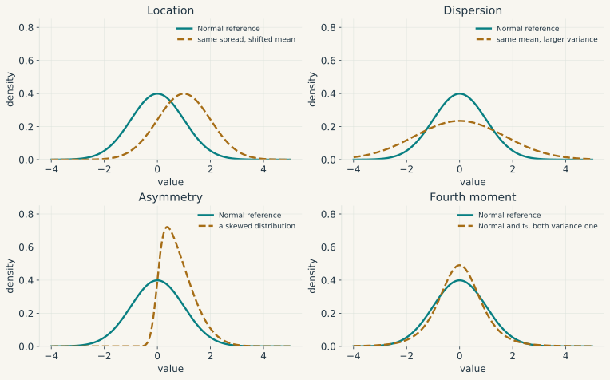{#fig-distribution-moments}

### Integrating in several variables {#sec-multivariate-integration}

For two random quantities with joint density $p(x,y)$, the probability of a region $A$ is $\iint_A p(x,y)\,dx\,dy$. Integrating out $y$ gives the marginal density $p_X(x)=\int p(x,y)\,dy$. For $p_X(x)>0$, the conditional density is $p_{Y\mid X}(y\mid x)=p(x,y)/p_X(x)$. Conditioning on an exact continuous observation therefore uses densities, not division by $\Pr(X=x)=0$.

Two integration results justify these calculations. **Tonelli's theorem** permits interchange of integrals for nonnegative measurable integrands, even if the value is infinite. **Fubini's theorem** permits it for absolutely integrable signed integrands. For example, calculating $E[XY]$ by either order of integration is justified when $E|XY|<\infty$.

A change of coordinates requires an area correction. If $z=T(x)$ is a $C^1$ one-to-one map between open subsets of $\mathbb R^d$, with a $C^1$ inverse and nonsingular Jacobian, then

$$
\int_{T(U)}q(z)\,dz
=\int_U q(T(x))\,|\det J_T(x)|\,dx
$$

for nonnegative measurable $q$, or under absolute integrability. Locally, a small box is mapped to a parallelepiped whose volume is multiplied by $|\det J_T|$. This connects the determinant from linear algebra to probability densities.

If $X=\mu+PZ$ with invertible $P$ and $Z$ standard Gaussian in $\mathbb R^d$, then

$$
p_X(x)=(2\pi)^{-d/2}|\det P|^{-1}
\exp\left[-\tfrac12\|P^{-1}(x-\mu)\|_2^2\right].
$$

Since $\Sigma=PP'$ and $\det\Sigma=(\det P)^2$, this is the multivariate Normal density with covariance $\Sigma$. A singular covariance still defines a Gaussian law on a lower-dimensional affine space, but no density with respect to full-dimensional volume.

Limits cannot always be moved through integrals. Let $f_n(x)=n\,\mathbf1_{(0,1/n)}(x)$ on $(0,1)$. Then $f_n(x)\to0$ pointwise, while every integral equals one. **Dominated convergence** supplies a sufficient condition: if $f_n\to f$ almost everywhere and $|f_n|\leq g$ for an integrable $g$, then $\int f_n\to\int f$. Similarly, differentiating $\int q(x,\theta)\,dx$ with respect to $\theta$ is justified by integrability at a reference parameter and an integrable local bound on the existing parameter derivative, with the usual measurability assumptions. Such a bound must cover a parameter neighbourhood, not only the point of interest. These conditions later support likelihood scores and posterior calculations.

### Information and conditional expectation {#sec-joint-distributions}

Let $Y$ be next quarter's inflation and $X$ today's indicators. A forecast $m(X)$ may use those indicators but cannot use tomorrow's observation. If $E[Y^2]<\infty$, the best forecast under squared loss is $m(X)=E[Y\mid X]$. Indeed, for any square-integrable forecast $a(X)$,

$$
\begin{aligned}
E[(Y-a(X))^2]
={}&E[(Y-m(X))^2]\\
&+E[(m(X)-a(X))^2].
\end{aligned}
$$

The cross term vanishes because $E[Y-m(X)\mid X]=0$. This is the probability version of the projection argument for OLS, except that the space now contains all square-integrable functions of the information rather than just linear combinations of regressors.

Formally, $E[Y\mid\mathcal G]$ for integrable $Y$ is a $\mathcal G$-measurable variable $M$ satisfying $E[M\mathbf1_A]=E[Y\mathbf1_A]$ for every $A\in\mathcal G$. It is unique up to events of probability zero. Under square integrability the error is orthogonal to every square-integrable $\mathcal G$-measurable variable. The tower property, for $\mathcal H\subseteq\mathcal G$, and the variance decomposition are

$$
E[E(Y\mid\mathcal G)\mid\mathcal H]=E[Y\mid\mathcal H],
$$

and

$$
\begin{aligned}
\operatorname{Var}(Y)={}&E[\operatorname{Var}(Y\mid\mathcal G)]\\
&+\operatorname{Var}(E[Y\mid\mathcal G]).
\end{aligned}
$$

For a vector $X$, $\Sigma=E[(X-EX)(X-EX)']$ collects variances and covariances. In a jointly Gaussian law, conditional means are affine and conditional covariance does not depend on the observed value. These useful properties belong to that distributional model; zero correlation alone does not imply them.

### Some laws arise from different sampling questions

A default indicator $D$ has the Bernoulli law when $\Pr(D=1)=p$: $E[D]=p$, $\operatorname{Var}(D)=p(1-p)$. Counting defaults among $n$ independent firms with the same $p$ gives the Binomial mass $\Pr(N=k)=\binom nk p^k(1-p)^{n-k}$, with mean $np$ and variance $np(1-p)$. Common exposures can invalidate independence and substantially change portfolio risk.

For arrivals in a time interval, a Poisson count instead has mass $e^{-\lambda}\lambda^k/k!$ and both mean and variance $\lambda$. A homogeneous Poisson process additionally has independent increments and a constant rate. Its waiting times have the Exponential density $\lambda e^{-\lambda x}$ for $x\geq0$, mean $1/\lambda$, and survival probability $e^{-\lambda x}$. The identity $\Pr(X>s+t\mid X>s)=\Pr(X>t)$ follows by division: its remaining waiting time has no memory of elapsed duration.

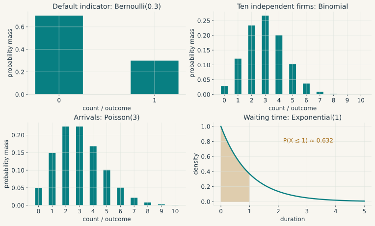{#fig-basic-distributions}

For $X\sim N(\mu,\sigma^2)$, the standardised variable $Z=(X-\mu)/\sigma$ has density $\phi(z)=(2\pi)^{-1/2}e^{-z^2/2}$. If $Z_1,\ldots,Z_\nu$ are independent standard Normals, then $V=\sum_iZ_i^2\sim\chi_\nu^2$. If $Z$ is an independent standard Normal, $Z/\sqrt{V/\nu}\sim t_\nu$. Finally, independent $V_1\sim\chi^2_{\nu_1}$ and $V_2\sim\chi^2_{\nu_2}$ give $(V_1/\nu_1)/(V_2/\nu_2)\sim F_{\nu_1,\nu_2}$. The independence conditions explain why these reference laws cannot be assigned to arbitrary ratios.

For matrices, $E\sim\mathcal{MN}(0,U,V)$ means $\operatorname{vec}(E)\sim N(0,V\otimes U)$. A Wishart matrix is a sum of outer products of independent Gaussian vectors. For positive definite scale and an integer number of draws at least equal to dimension, it is positive definite almost surely; with fewer draws it is singular. In its nonsingular density formulation the degrees of freedom may be real and must exceed dimension minus one. The inverse-Wishart then defines a law on positive definite covariance matrices. These conventions matter in Bayesian VAR formulas.

## Statistics: what can one sample establish? {#sec-probability-versus-statistics}

### A mean across repeated samples {#sec-lln-clt}

Suppose expenditures $X_1,\ldots,X_n$ are independent and identically distributed, with finite mean $\mu$ and variance $\sigma^2$. Their sample mean has variance $\sigma^2/n$. Chebyshev's inequality therefore gives

$$
\Pr(|\bar X_n-\mu|\geq\varepsilon)
\leq\frac{\sigma^2}{n\varepsilon^2}\longrightarrow0.
$$

This proves a **weak law of large numbers** under the stated assumptions. In fact, for i.i.d. observations the **strong law** only requires $E|X_1|<\infty$: $\bar X_n\to\mu$ almost surely. Finite variance is convenient for the elementary proof, not necessary for that stronger i.i.d. result.

If the variance is finite and strictly positive, the i.i.d. **central limit theorem** additionally gives

$$
\frac{\sqrt n(\bar X_n-\mu)}{\sigma}\xrightarrow{d}N(0,1).
$$

The LLN describes convergence of the estimate; the CLT describes its remaining error after rescaling. The parent distribution may be skewed. This is why the distribution of a sample mean can be nearly Gaussian even when the observations are not.

::: {#fig-clt-film .math-film}

```{=html}
<video controls preload="none" playsinline poster="../figures/mathematics/animations/Sampling.png" aria-label="Animation: exact sampling densities of standardised Exponential sample means approach a standard Normal density">
<source src="../figures/mathematics/animations/Sampling.mp4" type="video/mp4">
<a href="../figures/mathematics/animations/Sampling.mp4">Download the animation.</a>
</video>
```


For i.i.d. Exponential observations of rate one, the sum has a Gamma law. The teal curves are the exact densities of $\sqrt n(\bar X_n-1)$ at the labelled sample sizes; the ochre standard Normal reference is drawn with StatAnim. Every curve uses the same density scale.
:::

[Simulate repeated samples in the Interactive Lab](../interactive-lab.html?method=sampling). The video shows exact densities; the laboratory adds the variability of a finite simulation.

### Modes of convergence, and a transformed estimator

Before sampling, an estimator $\hat\theta_n$ is a random variable. After sampling, its realised value is an estimate. **Consistency** means $\hat\theta_n\xrightarrow{p}\theta_0$: the probability of an error exceeding any fixed tolerance tends to zero.

Almost sure convergence means that the realised sequence converges outside an event of probability zero. Convergence in distribution means that distribution functions converge at all continuity points of the limiting distribution function. Almost sure convergence implies convergence in probability, which implies convergence in distribution; the reverse implications generally fail. A sequence of independent $N(0,1)$ draws already has the limiting Normal law at every date, but it does not settle down to a fixed draw.

The continuous mapping theorem transfers convergence through a map continuous at the limit almost surely, with the corresponding mode of convergence. Slutsky's theorem gives joint convergence $(X_n,Y_n)\xrightarrow{d}(X,c)$ if $X_n\xrightarrow{d}X$ and $Y_n\xrightarrow{p}c$, for a constant $c$. Hence an estimated standard deviation converging to $\sigma>0$ may replace $\sigma$ in a CLT.

Suppose we estimate a persistent coefficient $\phi$ and report its long-run multiplier $g(\phi)=1/(1-\phi)$. Errors in $\hat\phi$ are amplified by $g'(\phi)=1/(1-\phi)^2$. The **delta method** formalises this calculation. If $\sqrt n(\hat\theta_n-\theta_0)\xrightarrow{d}N(0,V)$ and scalar $g$ is differentiable at $\theta_0$, then

$$
\sqrt n\{g(\hat\theta_n)-g(\theta_0)\}
\xrightarrow{d}
N\!\left(0,\nabla g(\theta_0)'V\nabla g(\theta_0)\right).
$$ {#eq-delta-method}

For vector $g$, the covariance is $J_g(\theta_0)VJ_g(\theta_0)'$. The proof is @eq-total-derivative with a random increment: $\sqrt n$ times the remainder tends to zero in probability because the scaled estimation error is bounded in probability. Close to a singular denominator the approximation can be poor in finite samples. If the gradient is zero, the displayed limit is degenerate and second-order terms may be needed; differentiability does not guarantee a useful first-order confidence interval.

### Moment restrictions lead to estimators {#sec-gmm}

Estimating a mean replaces $E[X-\mu]=0$ by its sample analogue. The same construction applies when a model implies $E[g(W_t,\theta_0)]=0$. Define $\bar g_T(\theta)=T^{-1}\sum_tg(W_t,\theta)$. With as many independent moments as parameters, one seeks a root $\bar g_T(\hat\theta)=0$; its existence and uniqueness require checking. With more moments, sample noise generally prevents setting all of them to zero, so **GMM** minimises

$$
Q_T(\theta)=\bar g_T(\theta)'W_T\bar g_T(\theta),\qquad W_T\succ0.
$$

An LLN at each fixed parameter is not by itself a consistency proof for a data-dependent minimiser. One sufficient argument assumes a compact parameter set, a continuous population criterion $Q$ uniquely minimised at $\theta_0$, uniform convergence $\sup_\theta|Q_T(\theta)-Q(\theta)|\xrightarrow{p}0$, and an approximate minimiser whose objective error tends to zero in probability. Outside any neighbourhood of $\theta_0$, compactness and uniqueness create a positive population loss gap; uniform convergence eventually preserves it.

For inference, let $D=E[\partial g(W_t,\theta_0)/\partial\theta']$ have full column rank, and suppose $\sqrt T\bar g_T(\theta_0)\xrightarrow{d}N(0,S)$. With additional differentiability and stochastic regularity and $W_T\xrightarrow{p}W\succ0$, the asymptotic covariance is

$$
(D'WD)^{-1}D'WSWD(D'WD)^{-1}.
$$

When $S\succ0$, choosing $W=S^{-1}$ reduces it to $(D'S^{-1}D)^{-1}$. For dependent observations $S$ is a long-run covariance, not merely the contemporaneous variance of $g_t$. Overidentification tests examine joint compatibility of the moments under their maintained assumptions; they do not establish instrument validity one instrument at a time.

For example, in a centred scalar model $Y=\beta X+u$, a valid instrument $Z$ satisfies $E[Zu]=0$ and $E[ZX]\neq0$. Its sample moment gives $\hat\beta_{IV}=\sum_tZ_tY_t/\sum_tZ_tX_t$. In a model with an intercept, this formula applies to demeaned variables. A weak denominator makes inference unstable. Two-stage least squares generalises the projection onto instrument variation; exclusion and relevance remain substantive requirements.

### Bias, variance, and likelihood

An estimate can vary little across samples yet miss its target systematically. Bias is $E[\hat\theta]-\theta_0$; variance measures sample-to-sample dispersion. For a scalar estimator with a finite second moment,

$$
E[(\hat\theta-\theta_0)^2]
=\operatorname{Var}(\hat\theta)+\{E[\hat\theta]-\theta_0\}^2.
$$

Ridge can trade bias for a sufficient variance reduction to lower mean squared error. Consistency concerns a sequence of sample sizes and is distinct from finite-sample unbiasedness. Efficiency likewise needs a comparison class and assumptions; no estimator is unconditionally “most efficient”.

A statistical model is a family $\{P_\theta:\theta\in\Theta\}$. The **likelihood** is its mass or density at the observed sample, regarded as a function of $\theta$. With continuous data it is a density value, not the probability of the exact sample. Maximum likelihood maximises this function, or its logarithm $\ell_T(\theta)$.

For a regular correctly specified i.i.d. model with an interior identified parameter, appropriate smoothness and domination, and nonsingular per-observation Fisher information $\mathcal I(\theta_0)$, a consistent MLE is asymptotically Normal with covariance $\mathcal I(\theta_0)^{-1}$ after $\sqrt T$ scaling. The expected score is zero when differentiation and integration can be interchanged on a fixed support. Parameter-dependent support, boundaries or misspecification require a separate argument; the information identity is not automatic.

### The five OLS assumptions {#sec-ols-assumptions}

In @sec-ols-scalar we fitted a line without specifying how the observations were generated. We now ask a different question: when do its coefficients estimate a population relation, and when can we attach valid confidence intervals to them? The distinction matters because the least-squares calculation will return coefficients even when their proposed economic interpretation is wrong.

Start again with one scalar regressor:

$$
y_t=\beta_0+\beta_1x_t+u_t.
$$

Here $u_t$ is the unobserved error in the population model, not the fitted residual $\hat u_t$. With several regressors, write

$$
y=X\beta+u,\qquad X\in\mathbb R^{T\times k}.
$$ {#eq-ols-model}

In this section the five assumptions describe the classical **conditional, finite-sample** model. We condition on the full observed regressor matrix $X$, take $\beta$ as a fixed parameter, and assume $T>k$. Assumption 4 has two distinct parts, 4a and 4b. Large-sample arguments will be introduced separately; they should not be silently substituted for these assumptions.

#### Assumption 1: a model linear in its coefficients {#sec-ols-assumption-1}

The observations satisfy @eq-ols-model with the same coefficient vector $\beta$ across observations. “Linear” refers to the unknown coefficients. For instance,

$$
y_t=\beta_0+\beta_1x_t+\beta_2x_t^2+u_t
$$

is linear in its coefficients even though it is curved in $x_t$. The columns of $X$ are then a constant, $x_t$, and $x_t^2$. In contrast, a coefficient inside an exponential, as in $y_t=\exp(\beta x_t)+u_t$, gives a nonlinear estimation problem.

**If relaxed.** A genuinely nonlinear parameterisation requires an appropriate estimator, such as nonlinear least squares. If the issue is instead a missing square term or a coefficient which changes across regimes, one may still use linear regression after adding the relevant transformed variables or interactions. But a misspecified fitted line need not estimate the intended economic relation. Since any proposed $\beta$ allows us to define $u=y-X\beta$, the decomposition alone says little: Assumption 3 supplies its conditional-mean content. Misspecification can therefore also appear as a failure of that assumption.

#### Assumption 2: no exact collinearity {#sec-ols-assumption-2}

The columns of $X$ are linearly independent:

$$
\operatorname{rank}(X)=k.
$$

Equivalently, $X'X$ is invertible. Indeed, $d'X'Xd=\|Xd\|_2^2$ is positive for every nonzero $d$ exactly when no nontrivial column combination vanishes. In the simple regression with an intercept, this condition reduces to $S_{xx}>0$. We need variation in income to distinguish its slope from the intercept.

**If relaxed.** Separate coefficients are not identified by the sample: several coefficient vectors give the same fitted values. Including a constant and one dummy for every category is a familiar example, since the dummies sum to the constant. Removing a redundant column or imposing an economically justified restriction restores a unique parameterisation. A generalised inverse or a ridge penalty can select one coefficient vector, but does not create the missing identifying variation. Near collinearity is different: coefficients remain unique, although estimates can be very imprecise and numerically sensitive.

#### Assumption 3: zero conditional mean {#sec-ols-assumption-3}

The errors have zero mean conditional on the full regressor matrix:

$$
E[u\mid X]=0.
$$

For the simple time-indexed regression, this says $E[u_t\mid x_1,\ldots,x_T]=0$ for every $t$. It is stronger than $E[u_t]=0$ and stronger than merely $E[x_tu_t]=0$. It implies that the conditional mean of $y$ is $X\beta$, so the regressors do not systematically predict the omitted part of the response.

**If relaxed.** OLS need not be unbiased or consistent for the intended coefficient. Consider an omitted variable $z_t$ in the population relation

$$
y_t=\beta_0+\beta_1x_t+\gamma z_t+\varepsilon_t.
$$

Under sampling conditions giving convergence of the relevant sample moments, positive $\operatorname{Var}(x_t)$, and $\operatorname{Cov}(x_t,\varepsilon_t)=0$, regressing $y_t$ only on a constant and $x_t$ gives

$$
\operatorname{plim}\hat\beta_1
=\beta_1+\gamma\frac{\operatorname{Cov}(x_t,z_t)}{\operatorname{Var}(x_t)}.
$$

The slope attributes to $x_t$ the part of the omitted effect which moves with it. Simultaneity, selection and measurement error can create related failures. Additional controls, a valid instrument or a research design may address particular sources of endogeneity, but each requires its own assumptions. Changing standard errors does not remove this problem. Conversely, replacing strict exogeneity by weaker moment restrictions can preserve consistency in some time-series models; it does not preserve the finite-sample unbiasedness result automatically.

#### Assumption 4a: homoskedasticity {#sec-ols-assumption-4a}

Every error has the same finite conditional variance, for a common parameter $\sigma^2>0$:

$$
\operatorname{Var}(u_t\mid X)=\sigma^2
\quad\text{for every }t.
$$

For example, the dispersion of unexplained consumption around the conditional mean is assumed not to grow with income. This concerns the errors, not the unconditional variance of consumption itself.

**If relaxed.** Conditional variances can differ, giving **heteroskedasticity**. Under Assumptions 1 to 3, OLS remains conditionally unbiased, but the classical variance formula is generally wrong and the usual efficiency guarantee is lost. With independent observations and appropriate moment and leverage conditions, heteroskedasticity-robust standard errors give asymptotically valid inference. Weighted least squares can improve efficiency when the variance structure is correctly specified. Neither approach repairs a nonzero conditional mean.

#### Assumption 4b: no serial correlation {#sec-ols-assumption-4b}

Different errors have zero conditional covariance:

$$
\operatorname{Cov}(u_t,u_s\mid X)=0
\quad\text{whenever }t\neq s.
$$

For time-indexed observations, this is the absence of serial correlation, also called **autocorrelation**, in the errors. Homoskedasticity alone does not imply it: a sequence can have a constant variance and still be persistent. Nor does zero covariance generally imply independence. The two parts of Assumption 4 address different entries of the conditional covariance matrix:

$$
\Omega:=\operatorname{Var}(u\mid X).
$$

Assumption 4a fixes its diagonal entries at $\sigma^2$; Assumption 4b sets its off-diagonal entries to zero. Only together do they imply $\Omega=\sigma^2I_T$.

**If relaxed.** Under Assumptions 1 to 3, correlated errors do not by themselves bias OLS, but its classical standard errors and efficiency guarantee generally fail. In time series, HAC standard errors estimate a long-run covariance under suitable weak-dependence, moment and bandwidth conditions. Ordinary heteroskedasticity-robust standard errors do not suffice if the regression scores remain serially correlated. For grouped data, cluster-robust inference instead requires an appropriate cluster structure and enough independent or suitably weakly dependent clusters. Generalised least squares can exploit a correctly specified covariance matrix. With lagged dependent variables, however, serial correlation can also violate Assumption 3, in which case a covariance correction alone is insufficient.

#### Assumption 5: joint conditional normality {#sec-ols-assumption-5}

The error vector is jointly Gaussian conditional on $X$. Together with Assumptions 3, 4a and 4b, this gives

$$
u\mid X\sim N(0,\sigma^2I_T).
$$

Joint normality is stronger than requiring each error to have a Normal marginal distribution. Combined with zero conditional covariances, it also implies conditional independence of the errors.

**If relaxed.** The OLS formula, conditional unbiasedness and the Gauss-Markov efficiency result remain valid under Assumptions 1 to 4. What is lost is the general guarantee of exact finite-sample Student and Fisher reference distributions. Large-sample inference may still be justified by a CLT for the regression scores. It requires moment and sampling conditions, not simply a large number printed next to the sample size. Normality is thus an assumption for a particular form of exact inference, not a condition which makes a regression causal.

### What the assumptions allow us to conclude {#sec-ols-results}

The implications can be derived from one identity. Under Assumptions 1 and 2, substitute $y=X\beta+u$ into the OLS formula:

$$
\hat\beta-\beta=(X'X)^{-1}X'u.
$$ {#eq-ols-error-decomposition}

In the scalar regression with an intercept, its slope component is

$$
\hat\beta_1-\beta_1
=\frac{\sum_t(x_t-\bar x)u_t}{S_{xx}}.
$$

This makes the issue visible: estimation error depends on how the unexplained response moves with the observed regressor. Under Assumption 3, taking the conditional expectation makes the numerator zero. The matrix argument is the same, since $X$ is fixed inside the conditional expectation:

$$
E[\hat\beta\mid X]=\beta.
$$

The conditional covariance under a general finite $\Omega$ is

$$
\operatorname{Var}(\hat\beta\mid X)
=(X'X)^{-1}X'\Omega X(X'X)^{-1}.
$$ {#eq-ols-sandwich}

With both 4a and 4b, this simplifies to

$$
\operatorname{Var}(\hat\beta\mid X)=\sigma^2(X'X)^{-1}.
$$ {#eq-ols-variance}

For the scalar slope, it becomes $\operatorname{Var}(\hat\beta_1\mid X)=\sigma^2/S_{xx}$. More variation in the regressor improves precision, while more unexplained variation reduces it. This interpretation was already present in the scalar calculation; the matrix notation extends it to several coefficients at once.

**Gauss-Markov theorem.** Under Assumptions 1 to 4, OLS is the best linear unbiased estimator (BLUE), conditional on $X$. Here “linear” means linear in the observed response $y$, and “best” means smallest covariance in the positive-semidefinite ordering, within that class of unbiased estimators. It does not compare OLS with every nonlinear or biased estimator.

For a short proof, write another linear estimator as $Cy$, where $C$ may depend on $X$. Unbiasedness for every $\beta$ requires $CX=I_k$. Define $L=(X'X)^{-1}X'$ and $D=C-L$. Then $DX=0$, and the cross terms in $CC'$ vanish because $LD'=0$. Consequently,

$$
\operatorname{Var}(Cy\mid X)
-\operatorname{Var}(\hat\beta\mid X)
=\sigma^2DD'\succeq0.
$$

The last inequality follows from $a'DD'a=\|D'a\|^2\geq0$ for every $a$. Nothing in this argument invokes normality.

Adding Assumption 5 yields exact finite-sample inference. Let $\hat u=y-X\hat\beta$ and

$$
\hat\sigma^2=\frac{\hat u'\hat u}{T-k}.
$$

The residual projection has rank $T-k$. Under the Gaussian model, $(T-k)\hat\sigma^2/\sigma^2$ has a chi-square distribution with $T-k$ degrees of freedom and is independent of $\hat\beta$. Thus, under $H_0:\beta_j=\beta_{j,0}$,

$$
\frac{\hat\beta_j-\beta_{j,0}}
{\hat\sigma\sqrt{[(X'X)^{-1}]_{jj}}}
\sim t_{T-k}.
$$

For $q$ independent linear restrictions, the usual restricted-versus-unrestricted sum-of-squares statistic has an $F_{q,T-k}$ distribution under the null. Without normality, $\hat\sigma^2$ is still conditionally unbiased under Assumptions 1 to 4, but these exact distributional conclusions do not follow in general.

To keep the hierarchy in view: Assumptions 1 and 2 give a unique coefficient estimate; adding 3 gives conditional unbiasedness; adding both parts of 4 gives the classical variance formula and BLUE; adding 5 gives exact Gaussian-model tests. A violation should be assessed against the conclusion it invalidates, rather than treated as a single undifferentiated failure of “the OLS assumptions”.

### Weaker assumptions and robust inference {#sec-ols-relaxations}

The finite-sample model is a useful benchmark, but strict exogeneity is particularly demanding in macroeconometrics. A current innovation can be uncorrelated with its own past regressors while entering future rows of the full matrix $X$. In an autoregression, for example, $u_t$ affects $y_t$, and $y_t$ is a regressor at date $t+1$. Consequently, conditioning on all rows of $X$ is not the same as conditioning on information available before $u_t$ occurs.

Consistency can instead follow from the two limits

$$
T^{-1}X'X\xrightarrow{p}Q\succ0,\qquad
T^{-1}X'u\xrightarrow{p}0.
$$

Dividing both sample products in @eq-ols-error-decomposition by $T$ then gives $\hat\beta\xrightarrow{p}\beta$. A suitable LLN must justify these limits. For inference, a further CLT is needed for $T^{-1/2}X'u$. If its limiting covariance is $S$, then the limiting covariance of $\sqrt T(\hat\beta-\beta)$ is $Q^{-1}SQ^{-1}$. These arguments can allow heteroskedasticity and dependence, but do not follow from dropping assumptions without replacing them.

For independent heteroskedastic observations with suitable regularity, define $x_t$ here as the $k$-component regressor vector, so row $t$ of $X$ is $x_t'$. The HC0 estimator is

$$
\widehat V_{\mathrm{HC0}}
=(X'X)^{-1}\widehat M(X'X)^{-1},
$$

where

$$
\widehat M=\sum_{t=1}^T x_tx_t'\hat u_t^2.
$$

The formula estimates the covariance of $\hat\beta$, not that of its $\sqrt T$-scaled error. HAC estimators add weighted sample lag covariances of the scores $x_t\hat u_t$. These procedures modify estimated uncertainty, while leaving the OLS coefficients unchanged. If the coefficients converge to the wrong target because of endogeneity, robust standard errors do not change that target.

### Intervals, tests, and resampling

Suppose a coefficient estimate is $.4$ with standard error $.2$. Under a Normal approximation, its 95 percent interval is approximately $[.008,.792]$. The procedure refers to repetitions of the sampling experiment: for each fixed true parameter under the assumptions, it covers that parameter in approximately 95 percent of samples. It does not assign a 95 percent probability to the fixed parameter after the interval is observed.

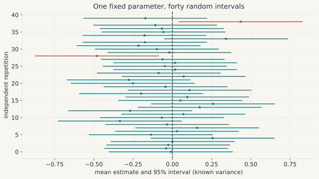{#fig-confidence-intervals}

For $H_0:\beta_j=\beta_{j,0}$, the statistic $t=(\hat\beta_j-\beta_{j,0})/\operatorname{se}(\hat\beta_j)$ compares the discrepancy with its sampling scale. A level-$\alpha$ exact test has null rejection probability at most $\alpha$ for every parameter in the null. An asymptotic test generally has this guarantee only in the limit, with uniformity requiring further care. Rejecting at five percent is not a claim that the null has probability five percent.

A $p$-value is the null probability of a statistic at least as extreme as observed, using the specified reference law. Power is rejection probability under a particular alternative; failure to reject is a Type II error under that alternative. Larger samples can reveal tiny effects, while imprecise samples can fail to detect economically large ones. Confidence intervals retain more of this distinction than a significance star.

::: {#fig-normal-film .math-film}

```{=html}
<video controls preload="none" playsinline poster="../figures/mathematics/animations/NormalArea.png" aria-label="Animation: shaded standard Normal rejection tails and acceptance region">
<source src="../figures/mathematics/animations/NormalArea.mp4" type="video/mp4">
<a href="../figures/mathematics/animations/NormalArea.mp4">Download the animation.</a>
</video>
```


For a standard Normal statistic, the two shaded tails beyond $\pm1.959964$ have total probability 0.05. StatAnim constructs the density; the shaded areas use the same coordinates and numerical quantiles.
:::

Inverting a family of two-sided tests gives the corresponding confidence set. In the simple symmetric setting it is $\hat\beta_j\pm c_{1-\alpha/2}\operatorname{se}(\hat\beta_j)$. Exact Gaussian regression uses a Student quantile; asymptotic Normal inference uses a Normal quantile.

The nonparametric bootstrap replaces the unknown i.i.d. population by the empirical distribution, resamples with replacement and recomputes the estimator. Its validity depends on the estimator and sampling scheme; it can fail for boundary parameters and other nonregular problems. Independent resampling destroys time dependence. Block bootstrap methods instead resample stretches of a series, with block length and dependence conditions chosen for the intended asymptotics.

## Stochastic processes: learning from a single history {#sec-stochastic-processes-foundations}

### Stationarity does not imply that averages reveal everything

A country supplies one time series, not a new independent economy at every date. A **stochastic process** $(X_t)_{t\in\mathbb Z}$ assigns a random variable to each date; the observed series is one realisation. A filtration $(\mathcal F_t)$ is an increasing sequence of sigma-algebras representing information available through time. A process is adapted if $X_t$ is $\mathcal F_t$-measurable.

Suppose a random draw $Z$ selects a permanent level and $X_t=Z$ for all $t$. The law is unchanged by shifting dates, so this process is strictly stationary. Yet its sample average is always $Z$, rather than converging to $E[Z]$ unless $Z$ is degenerate. A stable distribution through time is insufficient for one history to reveal its population mean.

**Strict stationarity** requires every finite-dimensional joint distribution to be invariant under a common time shift. **Weak stationarity** requires finite second moments, a constant mean, and covariance $\operatorname{Cov}(X_t,X_{t-h})=\gamma(h)$ depending only on the lag. Strict stationarity with finite second moments implies weak stationarity; the converse holds for Gaussian processes but not in general.

Ergodicity rules out nontrivial events invariant under time shifts. For a strictly stationary ergodic process with $E|X_0|<\infty$, the ergodic theorem gives $T^{-1}\sum_{t=1}^TX_t\to E[X_0]$ almost surely. This supplies an LLN, not automatically a CLT. Under additional dependence and moment conditions, such as an appropriate mixing CLT, the scaled sample mean can have limiting variance

$$
S=\gamma(0)+2\sum_{h=1}^{\infty}\gamma(h).
$$

Absolute summability makes this expression finite, but alone is not a general CLT theorem. Positive serial covariance often raises $S$ above $\gamma(0)$; negative serial covariance can lower it. Treating observations as independent is therefore not always conservative or always anticonservative.

### Persistence, initial conditions, and unit roots

A mean-zero **white-noise** sequence has constant finite variance and zero covariance at nonzero lags. It need not be independent, nor have constant conditional variance. I.i.d. mean-zero finite-variance shocks are one special case.

For $X_t=\phi X_{t-1}+\varepsilon_t$ with mean-zero white noise of variance $\sigma^2$, $|\phi|<1$ gives the causal stationary solution

$$
X_t=\sum_{j=0}^{\infty}\phi^j\varepsilon_{t-j},
\qquad
\operatorname{Var}(X_t)=\frac{\sigma^2}{1-\phi^2},
\qquad
\gamma(h)=\frac{\sigma^2\phi^{|h|}}{1-\phi^2}.
$$

The series converges in mean square because the squared coefficients sum to a finite number. Starting a simulation at an arbitrary fixed $X_0$ does not make it exactly stationary at the first observation; the initial-condition effect decays with $\phi^t$. Exact strict stationarity follows, for example, from a two-sided i.i.d. innovation sequence and the stationary construction.

At $\phi=1$, a random walk started at zero has $X_t=\sum_{s=1}^t\varepsilon_s$ and variance $t\sigma^2$. New shocks permanently change its forecast level. For $|\phi|>1$, one can mathematically construct some stationary *noncausal* solutions using future shocks; these do not give the causal innovation model considered here.

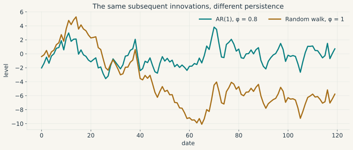{#fig-stationary-random-walk}

This distinction becomes central to estimation and inference in @sec-time-series. A unit root changes both the object being modelled and the distribution of common test statistics.

### Innovations, lags, and the Wold representation {#sec-lag-operator-foundations}

An AR(2) becomes $(1-\phi_1L-\phi_2L^2)X_t=\varepsilon_t$ when the **lag operator** is defined by $LX_t=X_{t-1}$. First differences are $(1-L)X_t$ and seasonal differences are $(1-L^s)X_t$. Causal AR stability requires roots of the lag polynomial outside the unit circle; these are reciprocals of the nonzero companion eigenvalues used in the matrix stability test.

There are two prediction errors to distinguish. The conditional-mean error $X_t-E[X_t\mid\mathcal F_{t-1}]$ has zero conditional mean and is a martingale difference, assuming integrability. The **linear innovation** instead subtracts the orthogonal projection of $X_t$ onto the closed linear span of past observations and a constant. With second moments, it is orthogonal to the linear past, but need not have zero conditional mean given all past information.

For a covariance-stationary, purely nondeterministic scalar process with positive innovation variance, **Wold's theorem** gives

$$
X_t=\mu+\sum_{j=0}^{\infty}\psi_j e_{t-j},
\qquad \psi_0=1,\qquad \sum_j\psi_j^2<\infty,
$$

with convergence in mean square and $e_t$ the linear innovations. Pure nondeterminism removes the component perfectly linearly predictable from the remote past. Wold innovations coincide with conditional-mean innovations in a Gaussian process, but not generally. The coefficients describe linear forecast responses, which need additional identification assumptions to become causal responses to economic shocks.

### Regimes and unobserved states {#sec-state-space-foundations}

Suppose a business-cycle regime is expansion or recession and its next-state distribution depends only on the current regime. A **Markov chain** with transition matrix

$$
P=\begin{pmatrix}.92&.08\\.35&.65\end{pmatrix}
$$

has rows describing current states and columns describing next states. For a row probability vector $\pi_t$, $\pi_{t+1}=\pi_tP$. This finite chain is irreducible and aperiodic, so it has a unique invariant distribution and converges to it from every initial distribution. Solving $\pi=\pi P$ gives $\pi=(35/43,8/43)$, approximately $(.814,.186)$.

When the state is hidden, write a **state-space model**

$$
s_t=F_ts_{t-1}+G_t\eta_t,\qquad
y_t=H_ts_t+\varepsilon_t.
$$

The first equation evolves the latent state; the second links it to measurements. With Gaussian initial state and independent Gaussian state and measurement disturbances under the usual covariance specification, the Kalman filter recursively calculates the exact conditional mean and covariance. With suitable second-moment assumptions but non-Gaussian variables, the same recursion gives a best linear estimate, which need not be the full conditional mean.

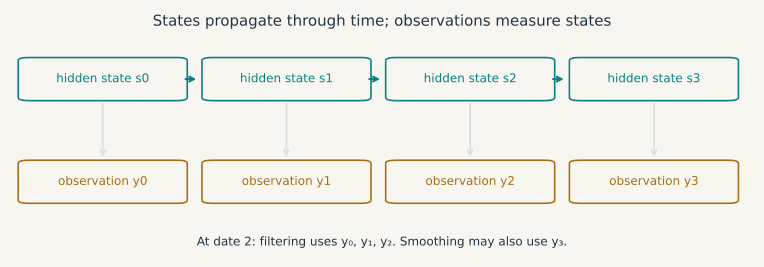{#fig-state-space}

Filtering estimates $s_t$ from $y_1,\ldots,y_t$; smoothing estimates it using $y_1,\ldots,y_T$ with $T>t$. Comparing an ex post smoothed output gap with a policy decision made at $t$ requires attention to this information difference.

## Bayesian inference: revising uncertainty about parameters {#sec-bayes-foundations}

Suppose recessions occur with probability $.05$. An alarm sounds in $.80$ of recessions and in $.10$ of non-recessions. Out of a hypothetical 1,000 repetitions, the expected counts are 40 recession alarms and 95 false alarms. Hearing an alarm therefore gives

$$
\Pr(\text{recession}\mid\text{alarm})
=\frac{.80\times.05}{.80\times.05+.10\times.95}
=\frac{8}{27}\simeq .296.
$$

The alarm is informative, but most alarms still occur outside recessions in this example. Its sensitivity and the probability of recession after an alarm answer different questions.

The same identity applies to an unknown parameter with prior density $p(\theta)$ and sampling density $p(y\mid\theta)$:

$$
p(\theta\mid y)=\frac{p(y\mid\theta)p(\theta)}
{\int p(y\mid v)p(v)\,dv}.
$$ {#eq-bayes-rule}

The denominator is a marginal density for continuous data, or a probability mass for discrete data. It must be finite and strictly positive for this normalisation to define a posterior. Improper priors require a separate posterior-propriety check.

For a concrete update, let $\theta\sim N(m_0,s_0^2)$ and, conditional on $\theta$, let $y_i$ be independent $N(\theta,\sigma^2)$ observations, with all variances known and positive. Completing the square in the log posterior gives

$$
s_n^2=\left(s_0^{-2}+n\sigma^{-2}\right)^{-1},
\qquad
m_n=s_n^2\left(m_0s_0^{-2}+n\bar y\,\sigma^{-2}\right).
$$

The posterior mean averages the prior mean and sample mean using their precisions, and posterior variance is the inverse of combined precision.

::: {.math-explorer data-math="bayes"}
**Add observations.** The prior is $N(0,1)$, the sample mean is fixed at one, and the observation variance is four. Increase $n$ to see how the posterior mean and variance change.
:::

A Bayesian credible interval contains a stated posterior probability conditional on the model, prior and data. A frequentist confidence interval has a repeated-sample coverage property. One interpretation does not imply the other without further assumptions.

When integration is impractical, Monte Carlo approximates posterior expectations by averages of simulated draws. MCMC constructs a Markov chain with the posterior as invariant distribution. Invariance alone does not guarantee convergence from a chosen starting point or reliability of finite averages: suitable irreducibility and recurrence conditions, mixing, and an appropriate law of large numbers are needed. Diagnostics across chains and effective sample size help assess the simulation, but do not prove its adequacy.

[Explore posterior simulation in the Interactive Lab](../interactive-lab.html?method=samplers). Priors and computation for multivariate dynamic models are developed in @sec-bvar.

## Fourier analysis: which movements repeat? {#sec-signal-fourier-foundations}

Suppose monthly production combines a seasonal rhythm, a slower cycle and irregular noise. In calendar time they overlap. We can instead ask how much of the sample aligns with a wave of a particular period. This is another projection problem, now onto trigonometric directions.

A sinusoid $\cos(\omega t+\varphi)$ has angular frequency $\omega$, period $2\pi/\omega$ when $\omega>0$, and phase $\varphi$. Euler's identity $e^{i\omega t}=\cos(\omega t)+i\sin(\omega t)$ packages two real coordinates into one complex number. For $T$ equally spaced observations, define

$$
\widetilde X_j=\sum_{t=0}^{T-1}x_t e^{-2\pi ijt/T},
\qquad
x_t=\frac1T\sum_{j=0}^{T-1}\widetilde X_j e^{2\pi ijt/T}.
$$

The inverse follows from orthogonality: $\sum_{t=0}^{T-1}e^{2\pi i(j-k)t/T}$ equals $T$ when $j=k$ modulo $T$ and zero otherwise, by the finite geometric-sum formula. The transform is exact on the observed grid. Real data have conjugate-symmetric coefficients.

::: {#fig-fourier-film .math-film}

```{=html}
<video controls preload="none" playsinline poster="../figures/mathematics/animations/Fourier.png" aria-label="Animation: two waves are added and their frequencies located in a periodogram">
<source src="../figures/mathematics/animations/Fourier.mp4" type="video/mp4">
<a href="../figures/mathematics/animations/Fourier.mp4">Download the animation.</a>
</video>
```


Two waves with periods 12 and 4 observations add into one signal. With 48 observations both fall exactly on Fourier frequencies, so their periodogram peaks remain separated without leakage in this noiseless example.
:::

Parseval's identity, $\sum_t|x_t|^2=T^{-1}\sum_j|\widetilde X_j|^2$, expresses preservation of squared length up to normalisation. One convention for the periodogram is $I_T(\omega_j)=|\widetilde X_j|^2/(2\pi T)$, usually applied after removing the sample mean. A large ordinate indicates alignment with that frequency in the sample. The raw periodogram is generally not a pointwise consistent density estimator; smoothing trades frequency resolution for reduced variance.

Sampling also makes $\omega$ and $\omega+2\pi k$ indistinguishable at integer dates. For real-valued data one can restrict frequencies to $[-\pi,\pi]$, with Nyquist frequency $\pi$ radians per observation, or one cycle every two observations. Higher underlying frequencies can alias into this interval. Quarterly observations do not identify a monthly rhythm without additional assumptions.

For a weakly stationary process with absolutely summable autocovariances, the **spectral density** is

$$
f_X(\omega)=\frac1{2\pi}\sum_{h=-\infty}^{\infty}\gamma(h)e^{-i\omega h},
\qquad
\gamma(h)=\int_{-\pi}^{\pi}e^{i\omega h}f_X(\omega)\,d\omega.
$$

At $h=0$ the integral is the variance. Weak stationarity alone ensures a spectral *measure*, which need not have a density: a random-amplitude sinusoid can concentrate spectral mass at individual frequencies. Absolute summability is a convenient sufficient condition for the displayed density representation.

A filter $Y_t=\sum_jb_jX_{t-j}$ with $\sum_j|b_j|<\infty$ acts in mean square on a second-order stationary input. Its transfer function $B(e^{-i\omega})=\sum_jb_je^{-i\omega j}$ gives, when the input has a spectral density,

$$
f_Y(\omega)=|B(e^{-i\omega})|^2f_X(\omega).
$$

The modulus is the gain; the argument is the phase shift. For a causal stable AR(1), this produces $f_X(\omega)=\sigma^2/[2\pi|1-\phi e^{-i\omega}|^2]$. Positive $\phi$ near one concentrates power at low frequencies. A unit-root level series falls outside this stationary formula. @sec-frequency-filtering develops these ideas for empirical filtering.

## Exercises with worked answers {#sec-maths-exercises}

### Distinguishing generation from independence

In $\mathbb R^2$, let $u=(1,0)'$, $v=(0,1)'$ and $w=(1,1)'$. For each family $(u)$, $(u,v)$ and $(u,v,w)$, give its span and say whether it is independent, spanning in $\mathbb R^2$, and a basis of $\mathbb R^2$. Give two representations of $(2,1)'$ using the last family.

::: {.callout-note collapse="true" title="Worked answer"}
The family $(u)$ is independent and spans the horizontal axis, but does not span $\mathbb R^2$. The family $(u,v)$ is independent and spans the plane, hence is a basis. The family $(u,v,w)$ spans the plane but is dependent because $u+v-w=0$. For example, $(2,1)'=2u+v=u+w$. The coefficient triples $(2,1,0)$ and $(1,0,1)$ describe the same vector. The dimension of the span is two, not the number of vectors in the redundant family.
:::

### Predicting a composition before multiplying

Let $A=\left(\begin{smallmatrix}1&1\\0&1\end{smallmatrix}\right)$ and $B=\left(\begin{smallmatrix}2&0\\0&1\end{smallmatrix}\right)$. Find the columns of $AB$ by following the basis vectors through $B$ and then $A$. Compare $AB(1,1)'$ and $BA(1,1)'$. Finally, if $M$ is $2\times3$ and $N$ is $3\times4$, which of $MN$ and $NM$ is defined?

::: {.callout-note collapse="true" title="Worked answer"}
The first basis vector becomes $(2,0)'$ after $B$ and stays there after $A$. The second becomes $(0,1)'$ after $B$, then $(1,1)'$ after $A$. Thus $AB=\left(\begin{smallmatrix}2&1\\0&1\end{smallmatrix}\right)$ and $AB(1,1)'=(3,1)'$. In the reverse order, $BA=\left(\begin{smallmatrix}2&2\\0&1\end{smallmatrix}\right)$ and $BA(1,1)'=(4,1)'$. The product $MN$ is defined and has size $2\times4$. The product $NM$ is not defined because its inner dimensions would be 4 and 2. It is not enough that each matrix is rectangular.
:::

### Separating an OLS fit from its assumptions

Reproduce the intercept and slope for the four observations in @sec-ols-scalar and verify both normal equations. Does the fact that the fitted residuals sum to zero establish Assumption 3? If the population errors have unequal conditional variances but are uncorrelated across observations, which assumption fails and which OLS results can remain valid?

::: {.callout-note collapse="true" title="Worked answer"}
The centred sums are $S_{xx}=5$ and $S_{xy}=4.5$, so both coefficients equal $.9$. The residuals $.1,.2,-.7,.4$ sum to zero; their products with $x_t$ sum to $.2-1.4+1.2=0$. These equalities follow from the minimisation problem, not from a population restriction on $u_t$. Unequal conditional variances violate 4a, not 4b. If 1 to 3 still hold, OLS is conditionally unbiased. Its covariance is the general expression in @eq-ols-sandwich, rather than @eq-ols-variance; heteroskedasticity-robust inference needs the additional large-sample regularity described in @sec-ols-relaxations.
:::

### Recovering two coefficients

Let $X=\left(\begin{smallmatrix}1&1\\2&2\\3&3\end{smallmatrix}\right)$ and $y=(1,2,4)'$. Find the fitted vector and all least-squares coefficient vectors. Does the absence of an inverse prevent a fitted value from existing?

::: {.callout-note collapse="true" title="Worked answer"}
Writing $v=(1,2,3)'$ gives $X\beta=(\beta_1+\beta_2)v$. The best sum is $v'y/(v'v)=17/14$. Thus $\hat y=(17/14)v$ and all coefficients with $\beta_1+\beta_2=17/14$ minimise the loss. The residual is $(-3,-6,5)'/14$ and is orthogonal to $v$. The fitted vector is unique; the decomposition between coefficients is not.
:::

### Approximating a recession

For a proportional change $g=-.1$, calculate the exact log change and its first- and second-order approximations. Verify the bound in @eq-log-taylor with $r=.1$.

::: {.callout-note collapse="true" title="Worked answer"}
The exact change is $\log(.9)\simeq-.105360516$. The tangent gives $-.1$, and the quadratic gives $-.105$. The quadratic error is about $.000360516$, below $.1^3/[3(.9)^3]\simeq .000457247$. Multiply log changes by 100 to express log percentage points; the exact proportional percentage loss remains ten percent.
:::

### A gradient which fails to describe simultaneous changes

For $f(x,y)=x^2y/(x^2+y^2)$ off the origin and $f(0,0)=0$, show continuity and existence of both partial derivatives at zero. Then disprove differentiability. Why is continuity insufficient?

::: {.callout-note collapse="true" title="Worked answer"}
The bound $|f(x,y)|\leq|y|\leq\|(x,y)\|$ proves continuity. Along both axes $f$ vanishes, hence both partial derivatives are zero. A derivative would therefore be the zero linear map. Along $(t,t)$, the error divided by distance is $1/(2\sqrt2)$, not a sequence tending to zero. Continuity controls absolute errors; differentiability requires an error negligible relative to the displacement.
:::

### A lower bound and a failed qualification

First minimise $(x+2)^2/2$ subject to $x\geq0$ using the chapter's sign convention. Then compare with minimising $x$ subject to $x^2\leq0$. Identify exactly which hypotheses differ.

::: {.callout-note collapse="true" title="Worked answer"}
For the first problem, $g(x)=-x$ and $\mathcal L=(x+2)^2/2-\mu x$. The solution is $x^*=0$, $\mu^*=2$, so stationarity, feasibility and complementarity hold. The active gradient is $-1$, which satisfies LICQ; convexity makes KKT sufficient. In the second problem the feasible set is $\{0\}$, but its stated constraint has gradient zero there. LICQ and MFCQ fail, Slater fails, and no KKT multiplier solves $1+2\mu x=0$. Optimality survives while this necessary-condition theorem becomes unavailable.
:::

### Relaxing a resource cap

Solve the two-instrument problem at $b=.25$, $b=1$ and $b=3$. Give every inequality multiplier and verify $v'(b)=-\mu$ in each regime.

::: {.callout-note collapse="true" title="Worked answer"}
In the order resource cap, $-x$, $-y$, the multipliers are $(3,1,0)$ at $(0,.25)$; $(4/3,0,0)$ at $(1/3,2/3)$; and $(0,0,0)$ at $(1,1)$. The value derivatives are respectively $-3$, $-4/3$ and zero. Each solution satisfies KKT and global optimality follows from convexity. The positive lower-bound multiplier in the first case is essential for stationarity.
:::

### Curvature of a constraint

Minimise $f(x,y)=y$ subject to $h(x,y)=x^2-y=0$. Show that the optimum is strict even though the objective Hessian is zero.

::: {.callout-note collapse="true" title="Worked answer"}
Feasibility gives $y=x^2$, so $(0,0)$ is the unique global minimum. With $\mathcal L=y+\lambda(x^2-y)$, stationarity at zero gives $\lambda=1$. The tangent space has $d_y=0$. On it, $d'\nabla^2_{xx}\mathcal L\,d=2d_x^2>0$ for $d\neq0$. The constraint's curvature supplies what the objective Hessian alone misses.
:::

### Uncertainty after a nonlinear transformation

Suppose $\sqrt n(\hat\theta-\theta_0)\xrightarrow{d}N(0,\sigma^2)$. Find the delta-method variance for $g(\theta)=\theta^2$. What changes if $\theta_0=0$?

::: {.callout-note collapse="true" title="Worked answer"}
The first-order variance is $4\theta_0^2\sigma^2$. At zero it vanishes, so the $\sqrt n$ limit is degenerate. Instead $n\hat\theta^2\xrightarrow{d}\sigma^2\chi_1^2$ by the continuous mapping theorem. A nondegenerate approximation uses a different rate and a non-Normal law.
:::

### A stationary series that does not average out

Draw $Z\sim N(0,1)$ once and set $X_t=Z$ at every date. Calculate its mean, autocovariance and sample average. Which result in the chapter cannot be invoked?

::: {.callout-note collapse="true" title="Worked answer"}
The process is strictly and weakly stationary, with mean zero and $\gamma(h)=1$ for every lag. Its sample average equals $Z$ for every sample size, so it does not converge in probability to zero. It is not ergodic; the stationary ergodic LLN cannot be invoked. Its spectral measure has an atom at frequency zero rather than a density given by an absolutely convergent covariance series.
:::

## Returning to the economic question

We can now be more precise about the interest-rate and output movement with which we began. A regression needs independent directions of variation to distinguish coefficients. A local approximation needs a derivative with a controlled remainder. An estimated optimum needs a feasible set, an existence argument and conditions appropriate to its curvature and active constraints. An uncertainty statement needs moments, dependence assumptions and a sampling argument. Causal interpretation needs further restrictions on how shocks and observed responses are related.

The following chapters specialise these requirements to time series. It is useful to return here whenever a calculation appears to work only by convention: the order of Jacobian multiplication, the sign of a multiplier, the covariance scaling in a standard error, or the information used by a forecast each follows from a definition and an argument.

## Further reading and visual sources

For linear algebra and projection geometry, see Strang [@Strang2016]. The open textbook *Interactive Linear Algebra* also develops [span](https://textbooks.math.gatech.edu/ila/spans.html) and [matrix multiplication as composition](https://textbooks.math.gatech.edu/ila/matrix-multiplication.html). Lebl's open textbook [*Basic Analysis*, volumes I and II](https://www.jirka.org/ra/) develops real and multivariable analysis, including the inverse and implicit function theorems. Boyd and Vandenberghe's [*Convex Optimization*, chapters 2 to 5](https://web.stanford.edu/~boyd/cvxbook/bv_cvxbook.pdf) covers convexity, duality, Slater's condition and KKT sufficiency. For nonconvex first- and second-order conditions, see Nocedal and Wright [@NocedalWright2006], chapter 12. Casella and Berger [@CasellaBerger2002] cover probability and inference; van der Vaart [@vanDerVaart1998] develops asymptotic arguments, and Hamilton [@Hamilton1994] connects them to time series. For the conditional OLS efficiency argument, see also Taboga's [proof of the Gauss-Markov theorem](https://www.statlect.com/fundamentals-of-statistics/Gauss-Markov-theorem).

The animations were made for this chapter with [Manim Community](https://github.com/ManimCommunity/manim) and [StatAnim](https://github.com/rishabhbhartiya/statanim). Their [Python sources and reproduction instructions](https://github.com/Camille-Souffron/macroeconometrics-course/tree/main/code/python/mathematics) specify the formulas, dependency versions and numerical checks. The still figures and interactive displays use the same examples. Animations illustrate the arguments; their still images and the surrounding text remain available without playback.
