# Chapter 0: Mathematical Foundations {.unnumbered #sec-mathematical-foundations}

Macroeconometrics asks a recurring question: given a finite, noisy history, what can be learned about an economy whose relevant mechanisms are partly unobserved? The models in the following chapters provide different answers, but they repeatedly use the same language. A vector collects several variables at one date; a matrix maps today’s state into tomorrow’s; a probability distribution distinguishes a model from a realization; an estimator turns a sample into a statement about an unknown quantity.

This chapter develops that common language from problems rather than from a list of definitions. Its purpose is not to replace a course in mathematics. It is to make the mathematics used in macroeconometrics legible enough that every later formula can be read as an economic statement.

## A small model that contains most of the course {#sec-maths-motivating-system}

Imagine that the state of an economy is summarized by output and inflation deviations,

$$
x_t=
\begin{pmatrix}y_t\\ \pi_t\end{pmatrix},
\qquad
x_{t+1}=Ax_t+u_{t+1},
$$ {#eq-maths-state-system}

where $A$ describes internal propagation and $u_{t+1}$ collects new disturbances. Questions that look different at first are all contained in this compact expression:

- What does it mean to multiply a matrix by a vector, and when can a system of equations be solved?
- Does the economy return after a shock, oscillate, or explode? The answer is in the eigenvalues of $A$.
- What does it mean for $u_t$ to be random? How do we describe its mean, variance, and dependence over time?
- With only $T$ observations, how can we estimate $A$, attach uncertainty to it, or revise beliefs about it?
- If a component repeats slowly, how can its periodicity be read from the data?

The rest of the chapter unpacks these questions in that order.

## Linear algebra: describing several movements at once {#sec-linear-algebra-foundations}

### Vectors, distances, and directions

Suppose first that an economy is described by output and inflation gaps. Writing the two numbers separately is possible, but it conceals a basic fact: they belong to the same state, at the same date, and later operations will act on them jointly. The column

$$
x=\begin{pmatrix}y_t\\ \pi_t\end{pmatrix}
=\begin{pmatrix}1.2\\-0.4\end{pmatrix}
$$

records one point in a two-dimensional state space. A scalar records one quantity; a **vector** records several quantities as one object. More generally, $x=(x_1,\ldots,x_n)'\in\mathbb R^n$ has $n$ coordinates. The coordinates depend on the ruler and axes chosen to describe the state; the state itself does not. Changing units from percentages to basis points changes numerical coordinates, not the underlying economic situation.

Two operations preserve the nature of the object. Vectors can be added, which combines movements coordinate by coordinate, and multiplied by a scalar, which changes their magnitude and possibly their direction. Thus, if output and inflation move by $a$ in one disturbance and by $b$ in another, $\alpha a+\beta b$ is the combined movement when the disturbances are scaled by $\alpha$ and $\beta$. The zero vector is the state with no displacement; every vector has an opposite, $-x$, which exactly offsets it. These elementary rules are what make the set of vectors into a vector space.

For example, with $a=(1,.5)'$, $b=(-.2,1)'$, $\alpha=2$, and $\beta=-1$, the combined movement is

$$
2a-b
=2\begin{pmatrix}1\\.5\end{pmatrix}
-\begin{pmatrix}-.2\\1\end{pmatrix}
=\begin{pmatrix}2.2\\0\end{pmatrix}.
$$

The calculation is coordinate by coordinate, but its meaning is geometric: the inflation movements cancel while the output movement remains. Addition is associative and commutative, $(a+b)+c=a+(b+c)$ and $a+b=b+a$; scalar multiplication distributes, $\alpha(a+b)=\alpha a+\alpha b$. These identities are why a complicated combination of shocks can be rearranged without changing the resulting state.

The next question is economic as much as geometric: which movements can the directions already at hand generate? Given vectors $v_1,\ldots,v_k$, their **span**, also written $\operatorname{Vect}(v_1,\ldots,v_k)$, is

$$
\operatorname{Vect}(v_1,\ldots,v_k)
=\left\{a_1v_1+\cdots+a_kv_k: a_1,\ldots,a_k\in\mathbb R\right\}.
$$

One non-zero direction in the plane generates a line through the origin. Two non-parallel directions generate the entire plane. A plane translated away from the origin may look similar, but it is not a vector subspace: it does not contain the zero vector and cannot be closed under scalar multiplication. This distinction later separates a linear model from a model with an intercept.

{#fig-bases-span}

A family is **linearly independent** (or free) when the only way to combine its vectors and obtain zero is the trivial one:

$$
a_1v_1+\cdots+a_kv_k=0
\quad\Longrightarrow\quad
a_1=\cdots=a_k=0.
$$

If a non-trivial combination gives zero, the family is linearly dependent (or linked): at least one vector can be reconstructed from the others. For instance, $(1,2)'$ and $(2,4)'$ are linked because the latter equals twice the former. Adding the second vector supplies no new direction, even though it supplies another column of numbers. A **basis** is a family that is both free and generating. It is the smallest non-redundant coordinate system for the space. In $\mathbb R^2$, the familiar vectors $e_1=(1,0)'$ and $e_2=(0,1)'$ form the canonical basis, so every $x$ has the unique representation $x=x_1e_1+x_2e_2$.

The number of vectors in any basis of the same space is always the same; it is its **dimension**. Dimension counts independent directions, not the number of labels written down. A two-column matrix can have rank one, and a dataset with a thousand variables can vary almost entirely along a few directions. That is why dimension is central to identification, factor models, and principal components.

Coordinates are always relative to a basis. If $B=(v_1,\ldots,v_n)$ is a basis and $x=c_1v_1+\cdots+c_nv_n$, then $[x]_B=(c_1,\ldots,c_n)'$ is the coordinate vector of $x$ in that basis. Write $P_B=[v_1\ \cdots\ v_n]$, whose columns are the new basis vectors expressed in the canonical coordinates. Then $x=P_B[x]_B$. A change of basis is therefore an invertible matrix operation: $[x]_B=P_B^{-1}x$. The economic state has not changed; only the language used to describe its directions has changed. Diagonalization later uses exactly this idea to find coordinates in which dynamics separate.

Geometry makes the preceding language quantitative. The **inner product** $a'b=\sum_i a_ib_i$ measures alignment. It generates the Euclidean norm, or length, $\|a\|_2=\sqrt{a'a}$, and hence the distance between two states, $d(a,b)=\|a-b\|_2$. If $a$ and $b$ are two quarterly observations, this distance aggregates their coordinate-by-coordinate differences; it is meaningful only after deciding how variables should be scaled. Measuring output in euros and inflation in percent without standardisation makes the unit with larger numerical scale dominate the distance.

The angle between non-zero vectors is defined by

$$
\cos\angle(a,b)=\frac{a'b}{\|a\|\,\|b\|}.
$$

Orthogonality, $a'b=0$, means that the directions have no linear overlap. In two dimensions it is a right angle; in higher dimensions it carries the same algebraic meaning. The Cauchy–Schwarz inequality, $|a'b|\leq\|a\|_2\|b\|_2$, guarantees that the cosine lies between $-1$ and $1$. Pythagoras then becomes $\|a+b\|_2^2=\|a\|_2^2+\|b\|_2^2$ whenever $a'b=0$. Least squares, principal components, and structural-shock orthogonalization are all ways of exploiting this geometry.

The Euclidean norm is not the only useful measure of size. The $\ell_1$ norm $\|x\|_1=\sum_i|x_i|$ adds absolute movements; the max norm $\|x\|_\infty=\max_i|x_i|$ records the largest coordinate. In finite dimensions they describe the same notion of convergence, but they weight discrepancies differently. Penalising $\|\beta\|_2^2$ produces ridge regression; penalising $\|\beta\|_1$ can set coefficients exactly to zero in the lasso. A norm must be non-negative, vanish only at zero, scale as $\|ax\|=|a|\|x\|$, and obey the triangle inequality $\|a+b\|\leq\|a\|+\|b\|$. These conditions make it a coherent measure of distance rather than a convenient score.

The useful abstraction is an **inner-product space**: a collection of objects that can be added, multiplied by scalars, and compared through a notion of angle and length. Ordinary vectors are the first example, but random variables with inner product $\langle X,Y\rangle=E[XY]$ form another. There, orthogonality means zero covariance after centring. This is why the language of projection works in both linear algebra and probability.

### Subspaces, rank, and the information a matrix loses

Start with a simple data problem. If two columns of a regression matrix are exact multiples of one another, changing the coefficient of the first column can be undone by changing the coefficient of the second. The data cannot distinguish the two effects. The issue is not computational inconvenience; it is absence of identification.

The **column space** of $A$ is the span of its columns: every outcome $Ax$ that the transformation can generate. The **null space** is the set of inputs that disappear, $\{x:Ax=0\}$. The rank–nullity theorem says

$$
\mathrm{rank}(A)+\dim\mathcal N(A)=n,
$$

for an $m\times n$ matrix. Every missing rank dimension is a direction in which the input cannot be recovered. A square matrix is invertible precisely when its null space contains only zero, its rank is $n$, and its determinant is non-zero. These are different faces of the same fact.

There are four related spaces worth keeping distinct. The column space lives in $\mathbb R^m$ and describes feasible outputs. The row space lives in $\mathbb R^n$ and describes the independent restrictions imposed on inputs. The null space lives in $\mathbb R^n$ and contains input directions that vanish under $A$. The left null space contains vectors $w$ with $w'A=0$; it describes output restrictions that every feasible $Ax$ must satisfy. In a regression, the column space of $X$ contains all fitted-value vectors, while the residual belongs to its orthogonal complement, the left null space of $X'$.

One can recognise a vector subspace without listing a basis. A non-empty subset $V\subseteq\mathbb R^n$ is a subspace if, for any $u,v\in V$ and scalar $a$, both $u+v$ and $av$ remain in $V$. The solution set of a homogeneous system $Ax=0$ is always a subspace because sums and scalar multiples of solutions are again solutions. The solution set of $Ax=b$ with $b\neq0$ is generally not a subspace: it is an affine translation of the null space. This difference explains why the set of regression residuals is a vector space while the set of coefficient vectors satisfying a non-zero restriction is usually a shifted plane.

### Matrices are transformations, not tables {#sec-matrices-transformations}

A matrix is often introduced as a rectangular table of numbers. Its useful meaning is more active: an $m\times n$ matrix $A$ is a linear rule that takes each $n$-vector $x$ into an $m$-vector $Ax$. It can rotate, stretch, compress, shear, or project a space. The columns of $A$ are simply the images of the basis vectors.

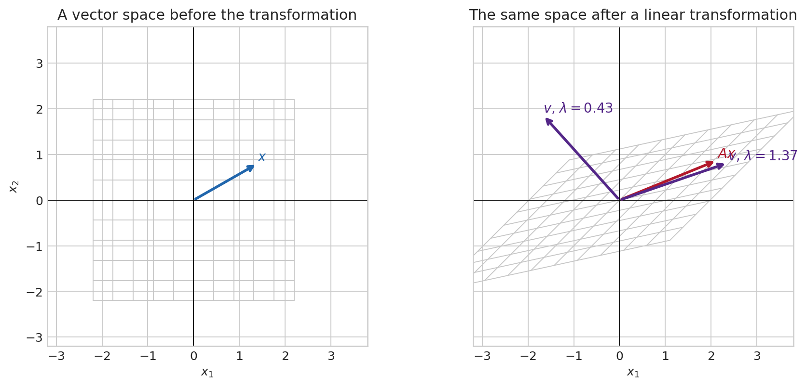{#fig-linear-transformation}

Matrix multiplication is composition of transformations. If $z=Bx$ and $y=Az$, then $y=(AB)x$: $B$ acts first, then $A$. The order matters because economic mechanisms need not commute. In a VAR, for example, multiplying the companion matrix repeatedly traces how today’s state propagates through future dates.

The dimensions tell the same story before any arithmetic is done. An $m\times n$ matrix takes an $n$-vector into an $m$-vector. Its entry in row $i$, column $j$ is $a_{ij}$, and matrix–vector multiplication is

$$
(Ax)_i=\sum_{j=1}^{n}a_{ij}x_j,\qquad
A\in\mathbb R^{m\times n},\quad x\in\mathbb R^n,\quad Ax\in\mathbb R^m.
$$

Each output coordinate is therefore a weighted sum of all input coordinates. With $A=\begin{pmatrix}.8&.1\\ .2&.6\end{pmatrix}$ and $x=(1,-.5)'$, the first output is $.8(1)+.1(-.5)=.75$ and the second is $.2(1)+.6(-.5)=-.1$. The first row describes the first equation; the first column describes the effect of the first input on both equations.

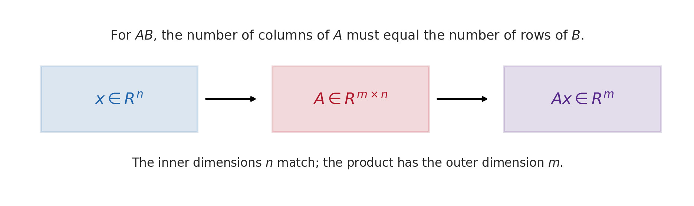{#fig-matrix-dimensions}

The dimensions are a discipline rather than a decoration. A column vector has shape $n\times1$; its transpose $x'$ has shape $1\times n$. Thus $x'x$ is a $1\times1$ scalar, while $xx'$ is an $n\times n$ matrix. For $x=(x_1,x_2)'$,

$$
x'x=x_1^2+x_2^2,
\qquad
xx'=
\begin{pmatrix}
x_1^2&x_1x_2\\
x_2x_1&x_2^2
\end{pmatrix}.
$$

The first measures length squared; the second is a rank-one matrix that projects onto the direction $x$ after appropriate normalisation. Confusing them is a dimension error, but it also confuses two different mathematical objects.

For $A\in\mathbb R^{m\times n}$ and $B\in\mathbb R^{n\times p}$, the product $AB\in\mathbb R^{m\times p}$ is defined by

$$
(AB)_{ij}=\sum_{k=1}^{n}a_{ik}b_{kj}.
$$

The columns of $AB$ are $A$ applied to the columns of $B$. Dimensions therefore provide a first error check: $(3\times2)(2\times4)$ is defined and yields a $3\times4$ matrix, whereas $(3\times2)(3\times4)$ is not defined. Products associate, $(AB)C=A(BC)$, because both describe the same sequence of maps. They generally do not commute: $AB$ and $BA$, when both exist, represent different orders of intervention and need not even have the same dimensions.

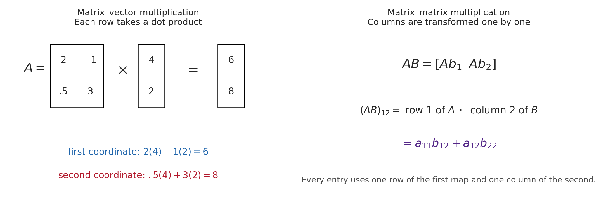{#fig-matrix-calculation}

Some useful identities follow from this interpretation. The transpose reverses the order of composition, $(AB)'=B'A'$. If $A$ and $B$ are invertible, so is their composition and $(AB)^{-1}=B^{-1}A^{-1}$: undo the last operation first. A diagonal matrix multiplies each coordinate independently; a triangular matrix couples coordinates only in one direction. These forms are computationally valuable because solving a triangular system proceeds one coordinate at a time.

The identity matrix $I$ leaves every vector unchanged. A transpose $A'$ exchanges rows and columns. A symmetric matrix satisfies $A=A'$; covariance matrices are the most important example. A positive semidefinite matrix satisfies $x'Ax\geq0$ for every $x$; covariance matrices have this property because $a'\Sigma a$ is a variance. Positive definiteness, $x'Ax>0$ for every non-zero $x$, guarantees invertibility for a symmetric matrix and is the curvature condition behind a unique least-squares minimum. The **rank** of $A$ is the number of independent directions that survive its transformation. If rank is below $n$, some distinct input vectors produce the same output, so information has been lost.

Rows and columns play different roles. The $j$th column describes what happens when only the $j$th input coordinate is activated; the $i$th row gives the weights used to construct output coordinate $i$. This makes matrix notation economical without making it mysterious. For a VAR, each row of a coefficient matrix is one equation, while each column traces how one lagged variable enters all equations.

### Systems, inversion, determinant, and projection

Suppose two prices must clear two markets. The equations can be written $Ax=b$, where $x$ contains the unknown prices and $b$ the external quantities. Solving the system means asking which input $x$ produces the observed outcome $b$. In two dimensions, each equation is a line. Their intersection, if it exists, is the vector satisfying both restrictions at once.

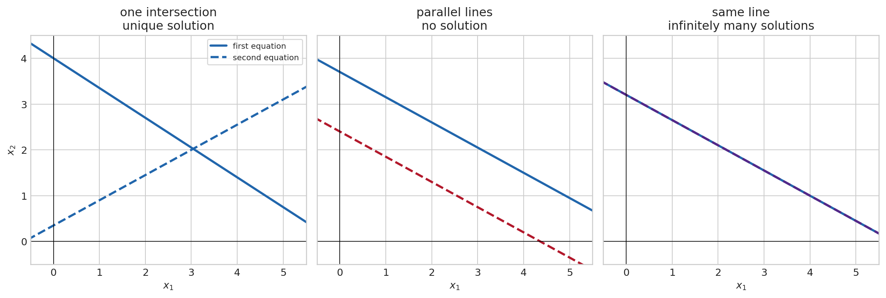{#fig-linear-systems}

The three panels clarify why equation counting alone is not enough. Two non-parallel lines intersect once, so the two restrictions identify one point. Parallel distinct lines impose incompatible restrictions, so there is no solution. Coincident lines repeat the same restriction, so an entire line of candidates remains. In higher dimensions the exact criterion is

$$
\operatorname{rank}(A)=\operatorname{rank}([A\mid b])
$$

for existence, where $[A\mid b]$ is the augmented matrix. If a solution exists, it is unique precisely when $\operatorname{rank}(A)=n$, the number of unknowns. A system with fewer independent restrictions than unknowns is underidentified and generally admits many solutions. A system with more restrictions than unknowns is overidentified; exact consistency is then demanding, and in empirical work noise usually prevents it. Least squares selects the point whose implied outcome is closest to $b$.

For a square matrix, a unique solution for every $b$ exists exactly when $A$ is invertible:

$$
x=A^{-1}b,\qquad A^{-1}A=AA^{-1}=I.
$$

Inversion is a strong condition, not a routine operation. It means that the transformation is a bijection: every admissible output has one antecedent, and distinct inputs never end at the same output. It fails when the columns of $A$ are linearly dependent, because the system contains redundant information or lacks a direction needed to identify $x$. If a transformation sends two different vectors to the same point, no procedure using only the output can decide which input occurred. One cannot return uniquely to the starting point.

The **determinant** of a square matrix gives a geometric test. In two dimensions, $|\det A|$ is the factor by which areas are scaled; in $n$ dimensions it scales volume. A determinant of zero means that an area or volume has been flattened into a lower-dimensional object, hence no inverse exists. The sign records an orientation reversal.

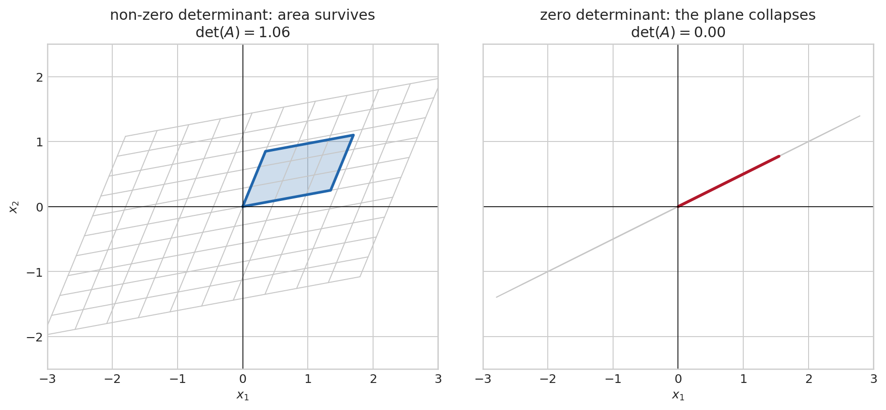{#fig-determinant-invertibility}

The right panel makes the loss of information concrete. Moving an input in the collapsed direction changes nothing in the output. This direction belongs to the null space. The determinant is therefore not merely a formula for $2\times2$ arrays; it detects whether a square linear map shrinks volume all the way down and destroys the one-to-one relation. Determinants are useful for theory, though numerical work normally solves $Ax=b$ directly rather than forming $A^{-1}$.

For a two-equation system,

$$
\begin{pmatrix}a&b\\c&d\end{pmatrix}
\begin{pmatrix}x_1\\x_2\end{pmatrix}
=\begin{pmatrix}r_1\\r_2\end{pmatrix},
\qquad \det A=ad-bc,
$$

the two equations are two lines. If $ad-bc\neq0$, they meet once. If it is zero, they are parallel or identical: no solution or infinitely many. **Gaussian elimination** generalises this picture. It exchanges equations, rescales one, or adds a multiple of one equation to another; each operation preserves the solution set. The resulting pivots reveal independent restrictions and the zero rows reveal redundancy or inconsistency. Numerically, QR or LU decompositions are preferred to explicit inversion because they are more stable.

For instance, the system $x_1+x_2=5$, $2x_1-x_2=1$ becomes an augmented matrix. Subtracting twice the first row from the second produces one equation in $x_2$; substitution then recovers $x_1$. The calculation is elementary, but the pivot structure continues to work with hundreds of equations.

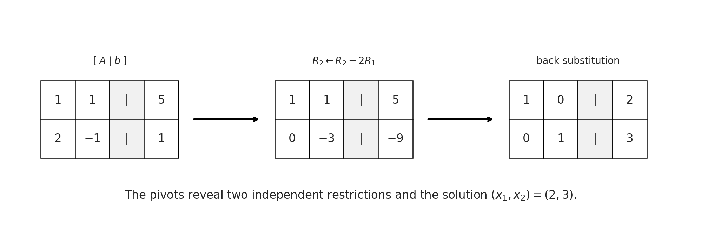{#fig-gaussian-elimination}

Even when a square system is formally invertible, it may be nearly singular. If two columns are almost proportional, a small change in $b$ can require a large change in $x$. The **condition number**, often written $\kappa(A)=\|A\|\|A^{-1}\|$, measures this sensitivity. A large condition number is the numerical counterpart of weak identification: the inverse exists, but recovering the underlying direction is unstable. This is why econometrics distinguishes exact collinearity from severe multicollinearity.

Many econometric systems have no exact solution because data contain noise: $X\beta\approx y$. Ordinary least squares chooses the coefficient vector whose fitted value $X\hat\beta$ is closest to $y$ in Euclidean distance. The residual $y-X\hat\beta$ is orthogonal to every column of $X$,

$$
X'(y-X\hat\beta)=0,
\qquad
\hat\beta=(X'X)^{-1}X'y,
$$ {#eq-ols-projection}

when $X$ has full column rank. Equation @eq-ols-projection is a projection theorem: regression decomposes data into the component explained by the regressors and an orthogonal remainder. It is not, by itself, a causal theorem.

{#fig-ols-geometry}

The matrix derivation is short and worth knowing. Define the sum of squared residuals

$$
S(\beta)=(y-X\beta)'(y-X\beta)
=y'y-2\beta'X'y+\beta'X'X\beta.
$$

Differentiating with respect to $\beta$ gives $\partial S/\partial\beta=-2X'y+2X'X\beta$. Setting the derivative to zero yields the **normal equations** $X'X\hat\beta=X'y$, and full column rank makes $X'X$ invertible. The second derivative is $2X'X$, positive definite under the same condition, so the stationary point is the unique minimum. The formula is a consequence of geometry, not an assumption about Gaussian errors.

### Eigenvalues: the directions a dynamic system recognises {#sec-eigenvalues-stability}

Iterating @eq-maths-state-system without new shocks gives $x_{t+h}=A^hx_t$. Directly multiplying $A$ many times hides the structure. An **eigenvector** $v\neq0$ is a direction which the matrix does not turn; it only scales it:

$$
Av=\lambda v.
$$

The scalar $\lambda$ is its **eigenvalue**. Along that direction, $A^hv=\lambda^h v$. In discrete time, $|\lambda|<1$ means decay, $|\lambda|>1$ explosion, and $|\lambda|=1$ persistence without decay. A negative eigenvalue flips the sign each period. A complex-conjugate pair creates rotation, so that trajectories oscillate; its modulus governs whether the oscillation is damped or amplified.

An eigenvector is not simply a vector that happens to be stretched in one picture. It is a direction that remains internally coherent under the map. If the initial deviation is decomposed into eigenvector directions, repeated application of $A$ changes the coefficient on each direction by its own factor. The directions with the largest modulus eventually dominate, which explains why a high-dimensional system can display a small number of visible long-run patterns. Not every real matrix has enough real eigenvectors to form a basis: a rotation by ninety degrees has no non-zero real direction that it leaves unchanged. Complex eigenvectors, or an invariant two-dimensional plane, then provide the appropriate description.

Eigenvalues are obtained from the **characteristic equation** $\det(A-\lambda I)=0$. For a $2\times2$ matrix, the roots satisfy

$$
\lambda_1+\lambda_2=\mathrm{tr}(A),
\qquad
\lambda_1\lambda_2=\det(A),
$$

where $\mathrm{tr}(A)$ is the sum of diagonal elements. Trace records the total local self-feedback; determinant records the product of eigenvalues and the local area scaling. The discriminant decides whether the roots are real or complex. In a second-order scalar recurrence or a two-variable system, this gives a direct way to diagnose monotone adjustment, sign alternation, or oscillation before simulation.

The calculation is worth doing once. For $A=\begin{pmatrix}.7&.2\\.1&.8\end{pmatrix}$,

$$
\det(A-\lambda I)
=\det\begin{pmatrix}.7-\lambda&.2\\.1&.8-\lambda\end{pmatrix}
=(.7-\lambda)(.8-\lambda)-.02.
$$

Setting this expression to zero gives $\lambda^2-1.5\lambda+.54=0$, hence eigenvalues $.9$ and $.6$. Both are inside the unit circle, so repeated multiplication shrinks every initial condition. The associated eigenvectors tell us the two combinations of output and inflation that decay at those separate speeds. The eigenvalue alone tells us the speed; the eigenvector tells us which economic combination has that speed.

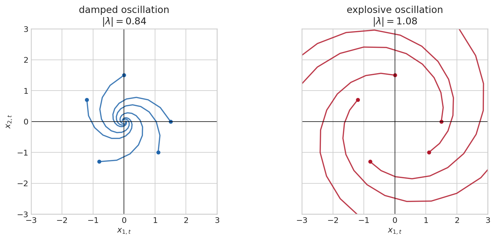{#fig-matrix-stability}

The matrix is stable precisely when its **spectral radius** $\rho(A)=\max_i|\lambda_i|$ is below one. This condition appears throughout the course: stationarity of a VAR, convergence of an impulse response, stability of a state-space model, and local determinacy of a linearized DSGE model. For a continuous-time system $\dot x_t=Ax_t$, the corresponding condition is $\mathrm{Re}(\lambda_i)<0$.

For a linearized dynamic model, the same calculation is often described in terms of stable and unstable dimensions. Each eigenvalue inside the unit circle supplies a stable direction; each one outside supplies an unstable direction that must be ruled out by an appropriate forward-looking choice or boundary condition. The familiar saddle-path logic in macroeconomics is therefore a dimension-matching problem, not a separate kind of mathematics.

The distinction between an eigenvalue and a singular value is worth retaining. Eigenvalues describe a square transformation acting repeatedly on its own state, hence stability. Singular values describe how much a general matrix stretches lengths in its most and least amplified directions. A non-normal matrix can have stable eigenvalues while producing large temporary amplification; this matters for short-horizon responses even when long-run stability holds.

For a nonlinear law $x_{t+1}=g(x_t)$, a steady state $x^*$ satisfies $g(x^*)=x^*$. The **Jacobian** collects every first partial derivative:

$$
J_g(x)=
\begin{pmatrix}
\partial g_1(x)/\partial x_1&\cdots&\partial g_1(x)/\partial x_n\\
\vdots&\ddots&\vdots\\
\partial g_n(x)/\partial x_1&\cdots&\partial g_n(x)/\partial x_n
\end{pmatrix}.
$$

Its $(i,j)$ entry is the local effect of the $j$th state coordinate on the $i$th next-period coordinate, holding the other coordinates fixed. For $g(x_1,x_2)=(x_1+.4x_2+.12x_1^2,\,-.2x_1+.8x_2+.08x_2^2)'$, for example,

$$
J_g(x_1,x_2)=
\begin{pmatrix}
1+.24x_1&.4\\
-.2&.8+.16x_2
\end{pmatrix}.
$$

In differential notation, a small change $dx$ produces $dg\approx J_g(x)\,dx$. The chain rule is consequently a matrix product. If a model first maps a state through $g$ and then maps the result through $f$, then

$$
J_{f\circ g}(x)=J_f(g(x))J_g(x).
$$

The rightmost Jacobian acts first, exactly as for ordinary matrix composition. This identity is the local version of a sequence of economic mechanisms: the sensitivity of a final outcome combines the direct sensitivities of each stage.

The Jacobian enters through a **Taylor expansion**. Begin with one variable. If a smooth function $f$ is evaluated close to $a$, then

$$
f(a+h)=f(a)+f'(a)h+\frac12f''(a)h^2+R_3(h),
$$

where the remainder $R_3(h)$ is of smaller order than $h^2$ under the usual smoothness conditions. The constant term is the level at the reference point; the first derivative gives the tangent-line response; the second derivative measures curvature. For $f(x)=\log x$ around $a=1$, this becomes $\log(1+h)=h-\tfrac12h^2+\cdots$. Retaining only $h$ is useful for small changes, but it is not an identity. Curvature becomes quantitatively important as the deviation grows.

For a vector-valued map, the same argument is applied to each equation. Writing $h=x-x^*$, the first-order expansion is

$$
g(x^*+h)=g(x^*)+J_g(x^*)h+r(h),
\qquad
\frac{\|r(h)\|}{\|h\|}\longrightarrow0
\quad\text{as }\|h\|\longrightarrow0.
$$

The remainder collects second and higher-order terms. At second order, each equation has a **Hessian** matrix of second partial derivatives, so the curvature contribution takes the form $\tfrac12h'H_i(x^*)h$ in equation $i$. Cross derivatives in the Hessian capture interactions: the marginal effect of output on inflation can itself depend on the level of inflation.

Near the steady state, the nonlinear map is therefore approximated by

$$
x_{t+1}-x^*\approx J_g(x^*)(x_t-x^*),
$$

where $J_g$ is the **Jacobian**, the matrix of first derivatives. Local stability is therefore a matrix-stability question. A linear approximation only describes nearby paths; if trajectories move far away, nonlinearities can change the conclusion.

The steady-state condition is what removes the constant term. Defining the deviation $z_t=x_t-x^*$ gives $z_{t+1}\approx J_g(x^*)z_t$. The eigenvalues of the Jacobian then describe the fate of a small displacement: they are not eigenvalues of the original nonlinear economy everywhere, but of its tangent dynamics at that particular equilibrium. A fully linear model has no Taylor remainder at all; its Jacobian is the same matrix at every point and the approximation is exact. A nonlinear model has a state-dependent Jacobian and a remainder whose importance must be assessed rather than assumed away.

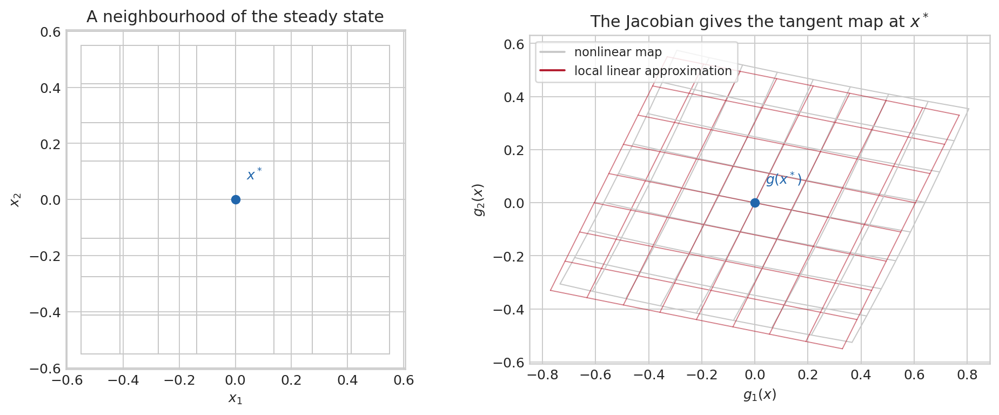{#fig-jacobian}

The qualification “local” is substantive. Eigenvalues of the Jacobian describe the evolution of small deviations from $x^*$; they do not rule out other steady states, constraints, or regime changes far away. In macroeconomic models, log-linearisation is valuable precisely because it replaces a difficult nonlinear equilibrium map with this locally faithful matrix map, while leaving the scope of the approximation visible.

### Decompositions: choose coordinates that reveal structure

If $A$ has enough independent eigenvectors, $A=V\Lambda V^{-1}$, where the columns of $V$ are eigenvectors and $\Lambda$ is diagonal. This **diagonalization** is a change of basis. In the original coordinates, the components may interact at every period; in eigenvector coordinates, each coordinate is simply multiplied by its eigenvalue. It explains why the eigenvalues determine $A^h=V\Lambda^hV^{-1}$. Diagonalization fails for some matrices, including certain matrices with repeated eigenvalues, but the stability conclusion still follows from the eigenvalues through more general decompositions.

A repeated eigenvalue is not itself a problem. The question is whether it comes with enough independent eigenvectors. The **algebraic multiplicity** counts how often an eigenvalue appears as a root of the characteristic polynomial; the **geometric multiplicity** is the dimension of its eigenspace, $\ker(A-\lambda I)$. Diagonalization requires that the total number of independent eigenvectors be $n$. When this fails, a Jordan block couples directions even after the best possible change of coordinates. Repeated multiplication can then contain polynomial factors such as $h\lambda^h$, although the criterion $|\lambda|<1$ still ensures eventual decay in discrete time.

Symmetric matrices are especially well behaved. The **spectral theorem** states that a real symmetric matrix has real eigenvalues and an orthonormal eigenbasis:

$$
S=Q\Lambda Q',\qquad Q'Q=I.
$$

For a covariance matrix $\Sigma$, eigenvalues are non-negative because $a'\Sigma a=\mathrm{Var}(a'X)\geq0$. The eigenvectors are uncorrelated directions of variation. PCA uses exactly this decomposition: it rotates the data into directions ranked by variance.

For a general rectangular matrix, the singular-value decomposition is the more universal result,

$$
X=U\,D\,V',
$$

with orthonormal $U,V$ and non-negative singular values on the diagonal of $D$. It separates a transformation into a rotation, independent stretches, and another rotation. PCA, low-rank factor models, and regularization all rely on this geometry. The Cholesky factorization $\Sigma=PP'$ is another important decomposition for a positive-definite covariance matrix, used to turn independent shocks into correlated reduced-form innovations.

The QR decomposition, $X=QR$, is especially useful for regression calculations. Its columns in $Q$ are orthonormal directions spanning the column space of $X$, and $R$ is upper triangular. Solving $X\beta\approx y$ can then proceed by projecting $y$ onto $Q$ and solving a triangular system, avoiding the numerical amplification that may arise from explicitly forming $X'X$. The decompositions differ in form, but share one purpose: replace coordinates that obscure the problem with coordinates that expose its independent directions.

::: {.callout-tip title="A practical stability checklist"}
For a scalar AR(1), inspect $|\phi|$. For a VAR, companion matrix, or Jacobian, compute eigenvalues and inspect their moduli. A stable reduced form does not identify an economic mechanism, but an unstable one cannot be treated as covariance stationary. If the result lies near one, numerical precision and sampling uncertainty matter: “below one” is not the same as “confidently stable.”
:::

## Calculus and optimisation: choosing an estimator or an allocation {#sec-optimisation-foundations}

Econometric estimators and economic equilibria frequently arise from the same mathematical question: among feasible candidates, which one makes an objective largest or smallest? A household chooses consumption and labour subject to a budget; a firm chooses inputs; OLS chooses coefficients that minimise squared residuals; maximum likelihood chooses a parameter that makes the observed data most compatible with a model. The economic interpretation differs, but the local calculations are shared.

### From a slope to a gradient

For a one-variable function $f(x)$, the derivative $f'(x)$ describes the first-order change caused by a small movement in $x$. At an interior optimum, a differentiable objective has no direction in which a small move improves it, so $f'(x^*)=0$. A zero derivative alone is not enough: $f(x)=x^3$ has derivative zero at zero but no minimum or maximum there. Curvature decides the local shape. If $f''(x^*)>0$, the graph bends upward and the point is a local minimum; if $f''(x^*)<0$, it bends downward and the point is a local maximum.

With several choice variables, the derivative becomes a **gradient**,

$$
\nabla f(x)=
\begin{pmatrix}
\partial f(x)/\partial x_1\\
\vdots\\
\partial f(x)/\partial x_n
\end{pmatrix}.
$$

The gradient points in the direction of the steepest local increase. Its derivative is the **Hessian** $H_f(x)$, the matrix of second partial derivatives. A positive-definite Hessian means that every non-zero local displacement raises the objective to second order, so an interior stationary point is a strict local minimum. A negative-definite Hessian gives a strict local maximum; an indefinite Hessian signals a saddle. Convex objectives have positive semidefinite Hessians everywhere, which turns a local minimum into a global one. This is why least squares and many likelihood problems are easier to solve than a general nonlinear equilibrium problem.

### Constraints and shadow values

Most economic choices are constrained. Consider minimising

$$
q(x,y)=(x-1.1)^2+2(y-.5)^2
\qquad\text{subject to}\qquad x+y=1.1.
$$

Without the constraint, the bottom of the quadratic bowl is $(1.1,.5)$. It is unavailable on the feasible line. The best feasible point is where the lowest attainable contour of the objective just touches that line.

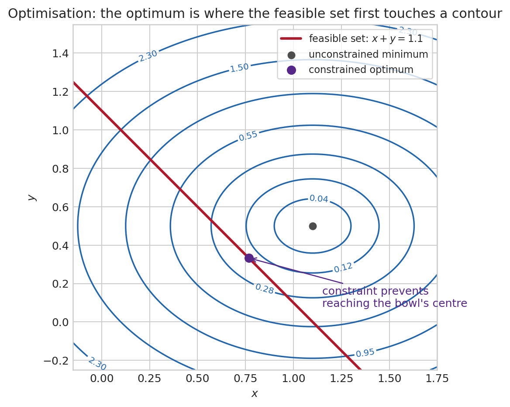{#fig-constrained-optimisation}

The **Lagrangian** puts the objective and equality constraint in one expression:

$$
\mathcal L(x,y,\lambda)=q(x,y)+\lambda(x+y-1.1).
$$

The first-order conditions are $\partial\mathcal L/\partial x=0$, $\partial\mathcal L/\partial y=0$, and the constraint itself. At the optimum, $\nabla q(x,y)=-\lambda(1,1)'$: the objective’s steepest direction is perpendicular to the feasible line. The multiplier $\lambda$ is a **shadow value**. Under regularity conditions, it measures how much the optimised objective changes when the right-hand side of the constraint is relaxed slightly.

Inequality constraints add a further logical condition. For a constraint $c(x)\leq0$, the Kuhn–Tucker conditions combine feasibility, a non-negative multiplier, and **complementary slackness**, $\lambda c(x)=0$. A slack constraint has zero shadow value; a binding constraint can have a non-zero one. Borrowing limits, non-negativity restrictions, and occasionally binding policy rules use this same language.

### Equilibrium systems and comparative statics

Many economic models define an endogenous vector $z$ implicitly through $F(z,\theta)=0$, where $\theta$ is a policy or structural parameter. The implicit function theorem gives the local comparative static when the Jacobian with respect to the endogenous variables is invertible:

$$
\frac{\partial z}{\partial\theta}
=-\left[\frac{\partial F(z,\theta)}{\partial z'}\right]^{-1}
\frac{\partial F(z,\theta)}{\partial\theta'}.
$$

The formula says that a parameter changes the system’s residuals directly, and the inverse Jacobian translates those residual changes into movements of the endogenous variables needed to restore equilibrium. The same invertibility condition seen in linear systems reappears here. When the Jacobian is singular or nearly singular, local uniqueness and comparative statics can fail or become highly sensitive.

## Probability: describing uncertainty before observing data {#sec-probability-foundations}

### A gamble, an event, and a random variable

Imagine that the next FOMC decision can be a cut, no change, or a hike. Before the meeting, there is a list of possible outcomes and a judgement about their relative plausibility. After the meeting, exactly one outcome is observed. Probability is the language that keeps those two statements separate.

The complete list of possibilities is the **sample space** $\Omega$. An **event** is a question whose answer can be yes or no: “there is a hike,” “inflation exceeds target,” or “a recession begins within four quarters.” If $\Omega=\{\text{cut},\text{hold},\text{hike}\}$, the event “no change or hike” is the subset $\{\text{hold},\text{hike}\}$. A probability measure $\mathbb P$ assigns a number between zero and one to such events. It assigns zero to the impossible event, one to the entire sample space, and adds probabilities across mutually exclusive events.

The formal object is a probability space $(\Omega,\mathcal F,\mathbb P)$. The notation is compact, but each component has a distinct role. $\Omega$ says what could happen; $\mathcal F$ says which questions are meaningful; $\mathbb P$ quantifies their probability. The collection $\mathcal F$ is a **sigma-algebra**: it contains the whole space, and whenever it contains an event it also contains its complement and any countable union of admissible events. These closure properties are the bookkeeping required to say consistently “not $A$,” “$A$ or $B$,” and “one of an infinite sequence of events occurs.”

Why introduce this apparatus when a coin toss seems to need none? With finitely many outcomes, one can assign probabilities one by one. Macroeconometric models routinely use continuous shocks, infinite histories, conditional distributions, and limits of estimators. For a continuously distributed shock, each exact value has probability zero while an interval has positive probability. One needs a rule that continues to assign sensible probabilities after taking complements, limits, and countable combinations. Measure theory provides precisely that rule. It removes ambiguities before they infect expectations or convergence arguments; it does not add economic content to a model.

A **random variable** $X:\Omega\to\mathbb R$ turns an outcome into a number. The FOMC outcome itself may be categorical, while $X$ could record the policy-rate change in basis points. “Measurable” means that for every threshold $a$, the question $\{X\leq a\}$ belongs to $\mathcal F$. Put less formally, the variable is defined finely enough that probabilities of economically meaningful statements can be evaluated. A random vector, a time series, and a likelihood are all extensions of this same idea.

Probability obeys three rules. It assigns zero to the impossible event and one to the whole sample space; it is non-negative; and it adds over mutually exclusive events. From these rules follow familiar identities:

$$
\Pr(A^c)=1-\Pr(A),\qquad
\Pr(A\cup B)=\Pr(A)+\Pr(B)-\Pr(A\cap B).
$$

The subtraction prevents double-counting outcomes which belong to both events. Events are **independent** when $\Pr(A\cap B)=\Pr(A)\Pr(B)$. Independence is a statement about the full joint probability law, not merely zero correlation. It is much stronger than “no linear relationship.”

### Distribution, expectation, variance, and conditioning

Suppose one wants to describe quarterly inflation before it is released. Giving only a mean forecast, say two percent, is incomplete. A forecast can be centered at two percent and yet be very precise, highly uncertain, asymmetric, or exposed to rare but severe outcomes. A **distribution** records how probability is allocated across possible values.

For a discrete variable, $\Pr(X=x)$ can be positive. A default indicator has mass at zero and one; a count of bank failures has mass at the non-negative integers. For a continuous variable with density $f_X$, individual points have probability zero and intervals have probability

$$
\Pr(a\leq X\leq b)=\int_a^b f_X(x)\,dx.
$$

The expectation is a probability-weighted average, $E[X]=\sum_xxp(x)$ or $E[X]=\int xf_X(x)dx$. It need not be an outcome that will occur. A lottery paying zero with probability one half and two with probability one half has expectation one, although it never pays one. The expectation is instead the centre of a probability law and the long-run average under suitable repetition.

Variance answers a different question: how far are draws spread around that centre? It is

$$
\operatorname{Var}(X)=E[(X-E[X])^2]=E[X^2]-E[X]^2.
$$

Squaring stops positive and negative deviations from cancelling and gives larger deviations more weight. Covariance, $\operatorname{Cov}(X,Y)=E[(X-E[X])(Y-E[Y])]$, records joint linear variation. Correlation divides covariance by the two standard deviations, making it unit-free and bounded between minus one and one. Zero correlation is not independence except in special families such as the jointly Normal distribution.

Variance has a concrete unit. If GDP growth is measured in percentage points, its variance is measured in squared percentage points, which is hard to read. The **standard deviation** $\sigma=\sqrt{\mathrm{Var}(X)}$ returns to the original unit. A standard deviation of two percentage points means that a typical draw lies on a scale of two percentage points around the mean. It does not mean that every draw lies in that interval, nor that a large realization is impossible.

Four summaries are especially useful when a distribution is not fully specified:

$$
\begin{aligned}
\text{mean:}&\quad \mu=E[X],\\
\text{variance:}&\quad \sigma^2=E[(X-\mu)^2],\\
\text{skewness:}&\quad E[(X-\mu)^3]/\sigma^3,\\
\text{kurtosis:}&\quad E[(X-\mu)^4]/\sigma^4.
\end{aligned}
$$

The first moment locates a distribution; the second records its spread; the third records asymmetry; the fourth records tail weight relative to the variance. The distinction between variance and kurtosis deserves care. Variance says how wide a distribution is on average. Kurtosis asks, after putting distributions on the same variance scale, whether probability is relatively concentrated near the centre and in the far tails rather than in the shoulders. Two return distributions can both have variance one, while one produces substantially more observations beyond two standard deviations. Variance cannot see that difference.

Skewness is equally concrete. Household income is usually right-skewed: most observations lie below a long upper tail, so a small number of high incomes pull the mean above the median. The median describes the household at the fiftieth percentile; the mean allocates equal weight to every euro and is pulled toward the tail. Neither is intrinsically the “right” summary. The choice depends on whether the question concerns a typical household, total resources, or inequality.

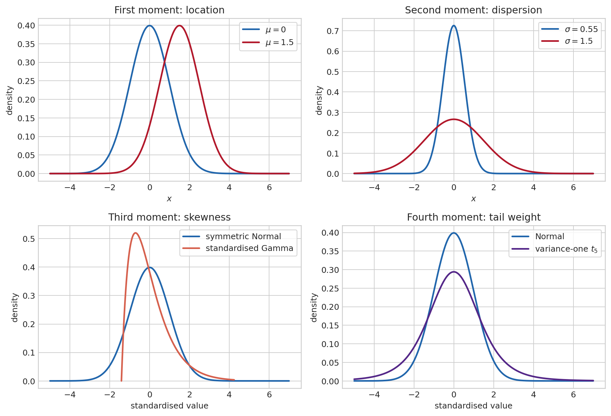{#fig-distribution-moments}

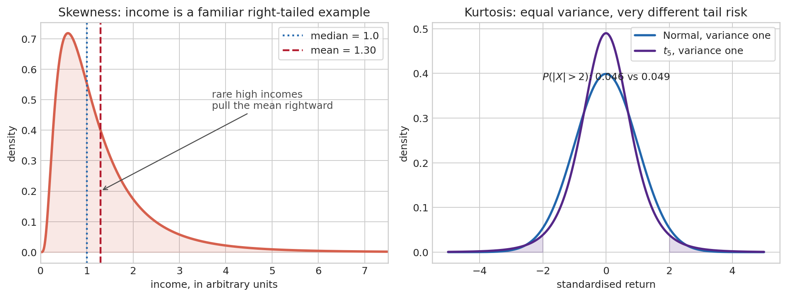{#fig-income-skewness-kurtosis}

### Joint distributions, information, and prediction

Macroeconometric questions rarely concern an isolated variable. Output and inflation, consumption and income, or a return and a financial spread move jointly. Their **joint distribution** assigns probabilities to pairs or vectors. From it one obtains the marginal distribution of each component by integrating or summing out the other, and the conditional distribution by asking how the possibilities for one variable change after observing the other.

The covariance matrix of a random vector $X=(X_1,\ldots,X_n)'$ is

$$
\Sigma=\operatorname{Var}(X)
=E\left[(X-E[X])(X-E[X])'\right].
$$

Its diagonal entries are variances and its off-diagonal entries are covariances. The matrix is symmetric and positive semidefinite because, for any portfolio or linear combination $a$, $a'\Sigma a=\operatorname{Var}(a'X)\geq0$. This compact expression is the bridge from separate uncertainty to portfolio risk, VAR innovations, factor models, and multivariate forecasting.

The multivariate Normal law is the benchmark in which a mean vector and covariance matrix completely determine the joint distribution. If $X\sim\mathcal N(\mu,\Sigma)$, every linear combination $a'X$ is Normal with mean $a'\mu$ and variance $a'\Sigma a$. Conditional means are linear functions of observed components, and conditional variances do not depend on the realised value. These properties make Gaussian state-space and Kalman-filter calculations tractable. They are useful modelling assumptions, not universal facts about macroeconomic shocks or financial returns.

Conditional expectation turns joint variation into a prediction. If $Y$ is next quarter’s inflation and $\mathcal I_t$ contains today’s indicators, $E[Y\mid\mathcal I_t]$ is the forecast that minimises expected squared forecast error among all functions of $\mathcal I_t$. The forecast error $Y-E[Y\mid\mathcal I_t]$ is orthogonal to every variable known at date $t$. The law of total variance separates uncertainty into

$$
\operatorname{Var}(Y)
=E\!\left[\operatorname{Var}(Y\mid\mathcal I_t)\right]
+\operatorname{Var}\!\left(E[Y\mid\mathcal I_t]\right).
$$

The first term is uncertainty that remains after using the information set; the second is variation in predictable conditional means. Better information can reduce the first term, but it does not create certainty. Conditional association is not causation either: a forecast can use a variable because it is informative without the variable being an intervention lever.

### Elementary probability laws begin with economic situations

The **Bernoulli** law begins with the simplest uncertainty: one event either occurs or does not. Let $X=1$ if a firm defaults over the next year and $X=0$ otherwise. If the default probability is $p$, then $X\sim\mathrm{Bernoulli}(p)$, $\Pr(X=1)=p$, $E[X]=p$, and $\operatorname{Var}(X)=p(1-p)$. The mean is a probability because averaging many zeroes and ones estimates the event frequency. The variance is largest at $p=.5$, where the outcome is most uncertain, and vanishes when the event is certain.

The **Binomial** law counts successes in $n$ independent Bernoulli trials. It is appropriate for a fixed number of opportunities, such as defaults in a homogeneous portfolio under a simple benchmark. If $N\sim\operatorname{Binomial}(n,p)$, then $E[N]=np$ and $\operatorname{Var}(N)=np(1-p)$. The word “independent” is doing heavy work here: common macro shocks make portfolio defaults move together, generally giving more dispersion than a Binomial benchmark.

The **Poisson** law starts from a different question: not a fixed number of trials, but arrivals over time. It counts events in a fixed interval when they arrive independently at a constant average rate: insurance claims per month or rare operational failures. Its defining feature is $E[X]=\operatorname{Var}(X)=\lambda$. The equality is often empirically restrictive: extra dispersion signals heterogeneity, contagion, seasonality, or omitted dynamics.

The **Exponential** law describes a waiting time until the next Poisson arrival. With rate $\lambda$, its density is $f(x)=\lambda e^{-\lambda x}$ for $x\geq0$, mean $1/\lambda$, and survival probability $\Pr(X>x)=e^{-\lambda x}$. Its memoryless property,

$$
\Pr(X>s+t\mid X>s)=\Pr(X>t),
$$

means that surviving until today does not change the expected remaining wait. That is plausible for a constant-hazard benchmark, but not for unemployment duration, firm failure, or credit distress when duration changes the hazard.

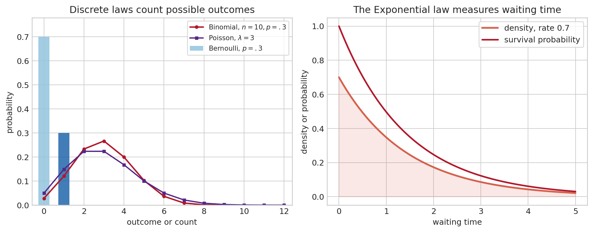{#fig-basic-distributions}

The Normal law deserves special care. It is symmetric, determined by mean and variance, and mathematically convenient. It is not a default description of all economic uncertainty. It arises exactly in some models and approximately for properly aggregated quantities through the CLT. Counts, waiting times, bounded probabilities, and heavy-tailed financial returns often call for other laws.

Conditional probability updates a description after information arrives. Suppose an analyst asks for the probability of a recession, but then observes a financial-stress indicator. The relevant object is no longer the unconditional $\Pr(\text{recession})$, but $\Pr(\text{recession}\mid\text{stress})$. If $B$ has positive probability, $\Pr(A\mid B)=\Pr(A\cap B)/\Pr(B)$. Conditional expectation $E[X\mid\mathcal I]$ is the best mean-square prediction of $X$ using the information set $\mathcal I$. It is itself a random variable: the forecast changes when the information set changes. The law of iterated expectations,

$$
E\big[E(X\mid\mathcal I)\big]=E[X],
$$

is the logic behind forecasts, regressions, and filtering.

Bayes’ rule already follows from the definition of conditioning:

$$
\Pr(A\mid B)=\frac{\Pr(B\mid A)\Pr(A)}{\Pr(B)}.
$$

The same identity later updates a prior on a parameter after observing data. The law of total probability, $\Pr(B)=\sum_j\Pr(B\mid A_j)\Pr(A_j)$ for a partition $(A_j)$, supplies its denominator. Consider a recession alarm that rings in 80 percent of recessions but also in 10 percent of non-recessions. If the prior probability of recession is 5 percent, an alarm raises the recession probability, but not to 80 percent: the false alarms among the much larger set of non-recessions matter. Bayes’ rule forces the base rate into the calculation. The algebra is elementary; the difficult part in applications lies in choosing the events, the model, and the relevant information set.

### Probability is not statistics {#sec-probability-versus-statistics}

**Probability** starts with a model and derives the behaviour of possible data. If $Y_t=\beta X_t+\varepsilon_t$ and the distribution of $(X_t,\varepsilon_t)$ is known, probability describes the distribution of $Y_t$. **Statistics** starts with one realized sample $(y_1,\ldots,y_T)$ and asks what can be learned about the unknown distribution, parameter, or model that generated it.

A **statistical model** is a family of distributions $\{P_\theta:\theta\in\Theta\}$. The parameter $\theta$ indexes possible data-generating mechanisms: an AR coefficient, a variance, a regression slope, a VAR matrix, or an entire latent state path. Data do not reveal $\theta$ directly. An estimator $\hat\theta(Y_1,\ldots,Y_T)$ is itself random before the sample is drawn. Its sampling distribution is the bridge between an estimate and an inference claim.

### Why averages become reliable: LLN and CLT {#sec-lln-clt}

Take a sample of household expenditures and calculate its average. Repeating the survey with another random sample does not give exactly the same number, but a larger well-designed sample should make the average less sensitive to the particular households selected. The **law of large numbers** formalises this intuition. If $X_1,\ldots,X_n$ are independent draws with finite mean $\mu$ and variance $\sigma^2$, then

$$
\bar X_n=\frac1n\sum_{i=1}^nX_i\xrightarrow{p}\mu.
$$

It justifies replacing a population moment by a sample moment. The statement is about convergence in probability, not exact equality in a finite sample. It does not promise that every larger sample is closer than the preceding one, and it does not tell us how much uncertainty remains at a given $n$.

The **central limit theorem** adds the shape and scale of the remaining uncertainty:

$$
\frac{\sqrt n(\bar X_n-\mu)}{\sigma}\xrightarrow{d}\mathcal N(0,1).
$$

The parent distribution need not be Normal. Expenditures may be skewed, defaults may be binary, and firm sizes may be highly unequal. Averages of many finite-variance contributions become approximately Normal after centring and scaling. The factor $\sqrt n$ is essential: doubling the sample does not halve standard error; it reduces it by a factor $\sqrt2$. This is why Normal approximations are so widespread in econometrics.

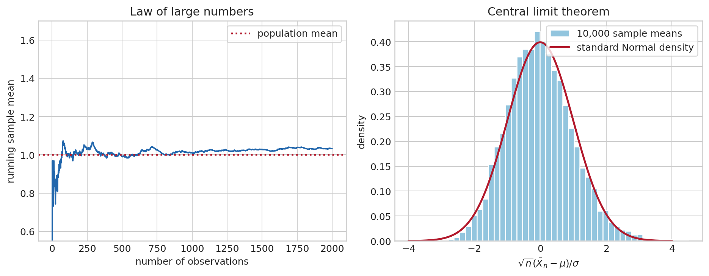{#fig-lln-clt}

Time series are not i.i.d., so the theorem cannot simply be invoked. Stationarity, ergodicity, and sufficiently weak dependence replace independence in time-series LLNs and CLTs. Persistent data contain less independent information than equally many independent observations, which is why naive standard errors are too small in serially correlated settings.

### From population restrictions to estimators

The LLN becomes an estimation method once a model supplies a population restriction. Suppose a parameter $\theta_0$ is characterised by

$$
E[g(W_t,\theta_0)]=0,
$$

where $W_t$ denotes the observed data and $g$ is a vector of functions called **moments**. Replacing the expectation by its sample average gives the sample moment $\bar g_T(\theta)=T^{-1}\sum_t g(W_t,\theta)$. The **method of moments** chooses $\hat\theta$ so that $\bar g_T(\hat\theta)=0$ when the number of independent restrictions equals the number of unknown parameters.

The familiar sample mean is the first example: $E[X-\mu]=0$ becomes $T^{-1}\sum_t(X_t-\hat\mu)=0$, whose solution is $\hat\mu=\bar X$. OLS is another. Exogeneity gives $E[x_t(y_t-x_t'\beta_0)]=0$; the sample version is the normal equation $X'(y-X\hat\beta)=0$. The apparent variety of estimators therefore conceals a common logic: a model says that certain population discrepancies vanish, and the data select the parameter that makes their sample counterparts as small as possible.

When there are more valid moments than parameters, they cannot usually all be made exactly zero in a finite sample. **Generalised method of moments** chooses the parameter that minimises

$$
Q_T(\theta)=\bar g_T(\theta)'W_T\bar g_T(\theta),
$$

where the positive-definite weight matrix $W_T$ decides how discrepancies are scaled and combined. The efficient choice weights moments by their precision and correlation. The extra restrictions become testable: if a model cannot make them jointly small even in a large sample, the problem may lie in the instrument validity, the specification, or the maintained stochastic assumptions. GMM is the common language behind instrumental variables, many Euler-equation estimates, and numerous DSGE estimators.

### Convergence is a language for increasingly informative samples

Asymptotics do not say that a finite sample is infinite. They provide a controlled approximation by describing what happens along a sequence of larger samples. Different questions require different forms of convergence.

- $X_n\xrightarrow{p}X$, **convergence in probability**, means that for every fixed tolerance $\varepsilon>0$, $\Pr(|X_n-X|>\varepsilon)\to0$. The estimate need not be close in every imaginable sample, but the fraction of samples in which it is noticeably wrong vanishes. Consistency is this property with $X=\theta_0$. The LLN is the central example.

- $X_n\xrightarrow{d}X$, **convergence in distribution**, means that the cumulative distribution functions converge at continuity points. The CLT is of this kind. It permits approximation of quantiles, confidence intervals, and rejection probabilities, but does not say that realised values become close path by path. A useful warning is $Z_n\sim\mathcal N(0,1)$ for every $n$: then $Z_n\xrightarrow{d}Z$ for $Z\sim\mathcal N(0,1)$, even though there is no reason for $Z_n-Z$ to shrink.

- $X_n\xrightarrow{a.s.}X$, **almost sure convergence**, means that with probability one a realised sequence eventually approaches $X$. It is stronger than convergence in probability and is a natural formalisation of a long-run average settling down along one path. The strong LLN gives this result under stronger conditions.

There is a hierarchy: almost sure convergence implies convergence in probability; convergence in probability implies convergence in distribution. The reverse implications generally fail. The distinction matters because an estimator can be consistent while its scaled error has a non-degenerate limiting distribution. Thus $\bar X_n\xrightarrow{p}\mu$, but $\sqrt n(\bar X_n-\mu)$ does not converge to zero; it has an approximately Normal distribution.

Two results make these statements usable. The **continuous mapping theorem** says that if $X_n\to X$ and $g$ is continuous, then $g(X_n)\to g(X)$. **Slutsky’s theorem** says that a consistent estimated nuisance quantity can replace its population counterpart in a limiting distribution: if $X_n\xrightarrow{d}X$ and $Y_n\xrightarrow{p}c$, then $X_nY_n\xrightarrow{d}cX$. Studentising a mean by an estimated standard deviation is the familiar example.

The **delta method** linearises a smooth transformation. If $\sqrt n(\hat\theta-\theta_0)\xrightarrow{d}\mathcal N(0,V)$ and $g$ is differentiable, then

$$
\sqrt n\big(g(\hat\theta)-g(\theta_0)\big)
\xrightarrow{d}\mathcal N\big(0,\nabla g(\theta_0)'V\nabla g(\theta_0)\big).
$$ {#eq-delta-method}

For a scalar $g$, this is the familiar rule $\mathrm{Var}(g(\hat\theta))\approx[g'(\theta_0)]^2\mathrm{Var}(\hat\theta)$. It produces standard errors for elasticities, ratios, correlations, long-run multipliers, and impulse-response transformations. The approximation can fail near a boundary, a kink, or a weakly identified denominator; differentiability is doing real work.

### What makes an estimator reliable?

Before asking whether an estimate is significant, it helps to separate several properties that are often conflated. The **bias** of $\hat\theta$ is $E[\hat\theta]-\theta_0$. Its **variance** describes how much it changes across repeated samples. The **mean squared error** combines both,

$$
E[(\hat\theta-\theta_0)^2]
=\operatorname{Var}(\hat\theta)+\operatorname{Bias}(\hat\theta)^2.
$$

An unbiased estimator need not be preferable in a small sample if it is much more variable. Ridge regression deliberately introduces bias in exchange for lower variance when regressors are highly collinear; its possible value is a direct consequence of this decomposition. **Consistency** is different again: it asks whether the estimator approaches the true parameter as the sample grows. An estimator can be biased in finite samples yet consistent, or unbiased at every sample size but too noisy to be useful in a particular application.

**Efficiency** is always relative to a class of estimators and maintained assumptions. Gauss–Markov efficiency concerns linear unbiased estimators under spherical errors; maximum-likelihood efficiency is an asymptotic statement under a correctly specified likelihood. No estimator is “efficient” without completing that sentence. This language disciplines comparisons between procedures rather than attaching a universal quality label to one of them.

### Why Normal, Student, chi-square, and Fisher distributions appear {#sec-sampling-distributions}

These distributions are not an arbitrary taxonomy. They arise from different unknown pieces of a model.

| Distribution | What it standardizes | Typical econometric appearance |
|-|-|-|
| Normal | A mean with known scale, or a large-sample estimator | asymptotic $z$ statistic |
| Student $t$ | A mean or coefficient with estimated scale | finite-sample regression test under Gaussian errors |
| Chi-square | A sum of squared standardized Normal quantities | variance test, Wald test, likelihood-ratio limit |
| Fisher $F$ | A ratio of two independent scaled chi-square variables | joint restriction test, comparison of residual variances |

The Student distribution has heavier tails than the Normal because estimating a scale introduces uncertainty. The chi-square is non-negative because it is built from squares. The $F$ distribution is non-negative and right-skewed because it compares two sources of variation. In large samples, many tests become asymptotically Normal or chi-square even when finite-sample exact distributions are unavailable.

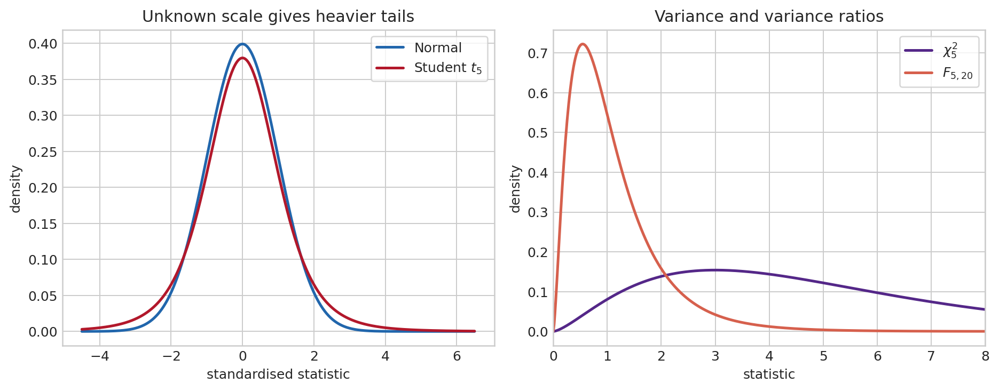{#fig-sampling-distributions}

### Estimation, confidence intervals, and tests

Suppose a regression reports an estimate of .4 for the elasticity of employment with respect to output. The number alone does not tell us whether another random sample would have produced .39, .1, or minus .2. Inference starts by representing that sample-to-sample variation. The likelihood $L(\theta;y)$ is the model’s density or mass for the observed data, viewed as a function of $\theta$. Maximum likelihood chooses $\hat\theta$ that makes the observed sample most probable under the maintained model. Under regularity conditions,

$$
\sqrt T(\hat\theta-\theta_0)\xrightarrow{d}\mathcal N\big(0,\mathcal I(\theta_0)^{-1}\big),
$$

where $\mathcal I$ is information. This asymptotic statement supplies standard errors, confidence intervals, Wald tests, score tests, and likelihood-ratio tests.

A 95 percent confidence interval is a procedure which covers the fixed true parameter in 95 percent of repeated samples under the model. The parameter does not move from sample to sample in the frequentist interpretation; the interval does. If the entire exercise were repeated many times, about 95 percent of constructed intervals would contain the same fixed truth. For one realised interval, the parameter is either in it or not. This is a statement about the procedure’s long-run calibration, not a probability assigned to the parameter.

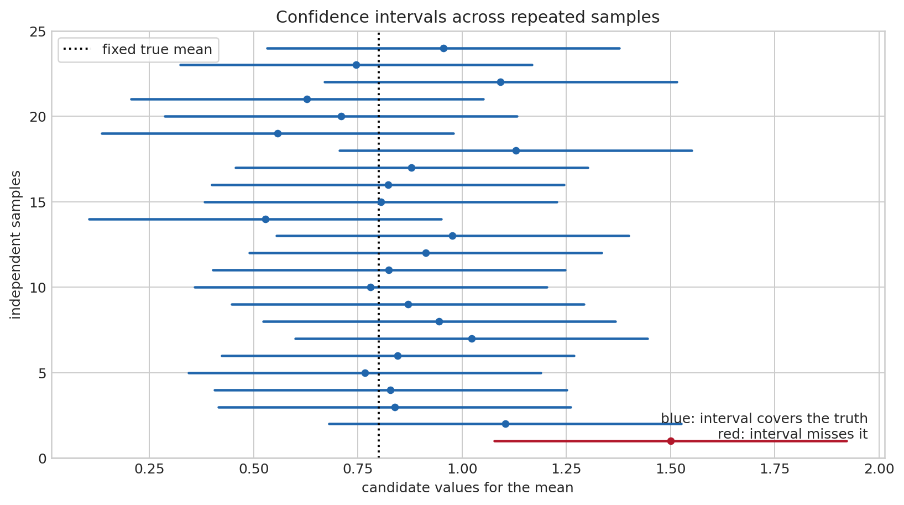{#fig-confidence-intervals}

A $p$-value is different again: under a specified null hypothesis, it is the probability of a statistic at least as incompatible with that null as the realised one. It is not the probability that the null is true, and a large $p$-value is not evidence that two values are exactly equal. It says that the observed discrepancy is not unusual relative to the null and the maintained sampling model.

### OLS as an inferential model, not only a minimisation problem {#sec-ols-assumptions}

The projection in @eq-ols-projection exists with few assumptions. Interpreting $\hat\beta$ as evidence about an economic relation requires more. Write the linear model as

$$
y=X\beta+u,\qquad X=(x_1',\ldots,x_T')'.
$$ {#eq-ols-model}

Here “linear” means linear in the unknown coefficients, not necessarily linear in observed variables: $y=\beta_0+\beta_1x+\beta_2x^2+u$ is linear in $\beta$. The usual assumptions can be separated by what they buy us.

| Assumption | Technical statement | Economic reading | If relaxed |
|-|-|-|-|
| Correct conditional mean | $E[u\mid X]=0$ | regressors contain no systematically omitted force moving $y$ | omitted variables, simultaneity, selection, or measurement error can bias and invalidate consistency |
| No exact collinearity | $X'X$ invertible | the sample contains independent variation in each regressor | coefficients are not separately identified |
| Finite, well-behaved moments | $E\|x_tu_t\|^2<\infty$ | no observation dominates the sample permanently | LLN and CLT can fail or converge slowly |
| Homoskedasticity | $\mathrm{Var}(u\mid X)=\sigma^2I$ | conditional uncertainty is constant and uncorrelated across observations | OLS remains conditionally unbiased under exogeneity, but classical standard errors and efficiency fail |
| Independent observations | observations are independent conditional on $X$ | one observation gives no residual information about another | serial, spatial, or cluster dependence requires adapted inference |
| Normal errors, when invoked | $u\mid X\sim\mathcal N(0,\sigma^2I)$ | a fully specified finite-sample error law | not needed for OLS consistency; exact small-sample $t$ and $F$ results no longer follow |

The first two assumptions govern identification. Homoskedasticity and Normality do not repair endogeneity. Conversely, a non-Normal but exogenous, sufficiently regular error can still support large-sample inference. This hierarchy prevents a common mistake: treating a normality test as if it validated a causal regression.

Substituting @eq-ols-model into the OLS formula gives the estimator’s basic decomposition,

$$
\hat\beta-\beta=(X'X)^{-1}X'u.
$$ {#eq-ols-error-decomposition}

Conditional mean zero implies $E[\hat\beta\mid X]=\beta$. Under spherical errors, its conditional variance is

$$
\mathrm{Var}(\hat\beta\mid X)=\sigma^2(X'X)^{-1}.
$$ {#eq-ols-variance}

The Gauss–Markov theorem says that among linear unbiased estimators, OLS has the smallest variance under these spherical-error assumptions. With heteroskedasticity, the correct asymptotic covariance takes the sandwich form,

$$
(X'X)^{-1}\left(\sum_{t=1}^T x_tx_t'\hat u_t^2\right)(X'X)^{-1},
$$

up to the relevant $T$ scaling. HAC estimators extend this middle term to serially correlated residuals. Clustered estimators allow arbitrary dependence within a cluster. These corrections address the uncertainty calculation, not the bias caused by $E[u\mid X]\neq0$.

### Confidence intervals and tests are constructed from a reference distribution

Suppose the question is whether a policy coefficient differs from zero. The null hypothesis $H_0:\beta_j=0$ is a benchmark used to construct a reference distribution; the alternative $H_1:\beta_j\neq0$ says that values away from zero are admissible. A test does not begin by reading the estimate and then inventing a rule favourable to it. It begins with a discrepancy statistic that would be near zero if $H_0$ were true,

$$
t=\frac{\hat\beta_j-\beta_{j,0}}{\mathrm{se}(\hat\beta_j)}.
$$

Under the null and the maintained assumptions, this statistic has either an exact Student distribution in the Gaussian finite-sample model or an approximately Normal distribution asymptotically. For a two-sided five-percent test, the null distribution’s outer 2.5 percent on each side become rejection regions. A significance level $\alpha=.05$ is chosen before seeing the statistic, so the procedure satisfies $\Pr(\text{reject }H_0\mid H_0)\leq.05$. This is the **Type I error** or false-alarm probability. The phrase “five percent significant” refers to this long-run false-alarm control; it does not mean there is a 95 percent probability that the estimate is non-zero.

If $H_1$ is true, failure to reject is a **Type II error**. Its probability is $\beta$; power is $1-\beta$. The two distributions overlap because samples are noisy. Moving the critical value outward lowers false alarms but enlarges the region in which an actual effect is missed. Power rises with sample size, signal size, regressor variation, and lower noise. A non-significant estimate can mean “no economically relevant effect,” but it can also mean that the data are too imprecise to distinguish the effect from zero. Report the interval, not only the star.

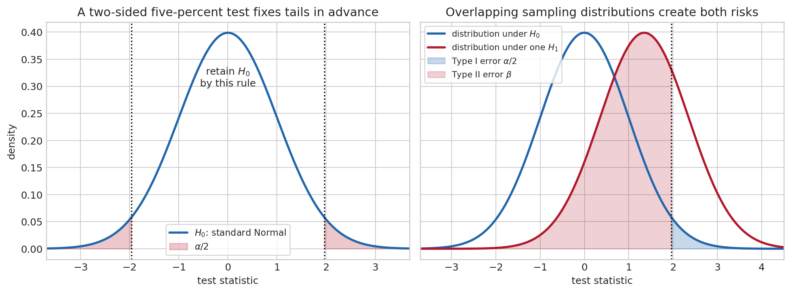{#fig-hypothesis-testing}

A two-sided $(1-\alpha)$ confidence interval,

$$
\hat\beta_j\pm c_{1-\alpha/2}\,\mathrm{se}(\hat\beta_j),
$$

contains exactly the parameter values not rejected by the corresponding two-sided test. The equivalence is useful: if a 95 percent interval excludes zero, the corresponding two-sided five-percent test rejects zero. Its width is an estimand-relevant measure of precision. An elasticity estimated at .02 with a narrow interval can be highly significant and economically negligible; an elasticity estimated at .5 with a wide interval may be economically important but statistically unresolved. Statistical significance is therefore not effect size, economic importance, or model validity.

When an estimator has no convenient analytical reference distribution, **resampling** can approximate its sampling variation. The non-parametric bootstrap draws many new samples with replacement from the observed observations, recomputes the estimator in each sample, and uses the resulting empirical distribution for standard errors or intervals. Its intuition is direct: the empirical distribution of a sufficiently representative sample stands in for the unknown population distribution. The approximation has assumptions of its own. Independent resampling is inappropriate for serially dependent data; block bootstrap methods preserve short stretches of a time series. Bootstrap inference cannot repair endogeneity, misspecification, or lack of identification, but it can avoid forcing a complicated statistic into an unsuitable Normal approximation.

## Stochastic processes: probability arranged through time {#sec-stochastic-processes-foundations}

A cross-section asks what differs across households at one date. A macroeconomic series asks what may happen next after a particular past has occurred. A **stochastic process** $(X_t)_{t\in\mathbb Z}$ is a sequence of random variables indexed by time. The observed series $x_1,\ldots,x_T$ is one path drawn from a model that assigns probability to many possible histories. This distinction matters because the same process can generate a quiet path, a volatile path, or a path that resembles a crisis.

The **information set** at date $t$, often denoted $\mathcal F_t$, collects the events and variables observed by then. Dynamics are statements about conditional distributions such as $p(X_{t+1}\mid\mathcal F_t)$, not only unconditional distributions. A process is **strictly stationary** when every finite sequence $(X_t,\ldots,X_{t+k})$ has the same joint distribution after a shift in calendar time. This is a strong distributional statement. **Weak stationarity** asks only for a constant mean and a covariance that depends on the lag:

$$
E[X_t]=\mu,
\qquad
\operatorname{Cov}(X_t,X_{t-h})=\gamma(h).
$$

For Gaussian processes, weak and strict stationarity coincide; in general they need not. Weak stationarity is often enough for linear prediction and spectral analysis because those tools use second moments. Its unconditional probabilistic environment does not drift over time, even though each realised observation does.

A **white-noise** sequence has mean zero, constant finite variance, and zero autocovariance at every non-zero lag. It need not be independent: a process can have no linear serial correlation while its conditional variance changes with past volatility. Independent and identically distributed shocks are white noise, but the converse need not hold. The autocorrelation function $\rho(h)=\gamma(h)/\gamma(0)$ rescales persistence between minus one and one. It is a descriptive property of the process, not a proof that a particular model has captured all dependence.

Stationarity alone describes the population law; it does not guarantee that one long realised history reveals its moments. **Ergodicity** supplies that bridge. In its familiar mean form, it says that the time average $T^{-1}\sum_{t=1}^TX_t$ converges to $E[X_t]$. A process that randomly selects one permanent level at its start can be stationary in distribution yet non-ergodic: a single observed history remains trapped at its selected level and does not reveal the population mean. Macroeconometrics relies on an ergodic or otherwise justified LLN whenever it treats a long time average as evidence about a population moment.

An AR(1),

$$
X_t=\phi X_{t-1}+\varepsilon_t,
$$

is stationary for $|\phi|<1$: shocks fade at rate $\phi^h$. A random walk has $\phi=1$; shocks never fade, variance accumulates, and the level has no fixed unconditional distribution. The algebra makes the contrast transparent. Iterating the AR(1) gives $X_t=\phi^hX_{t-h}+\sum_{j=0}^{h-1}\phi^j\varepsilon_{t-j}$; the weight on a distant initial condition vanishes only when $|\phi|<1$. A random walk instead sums every past innovation with weight one.

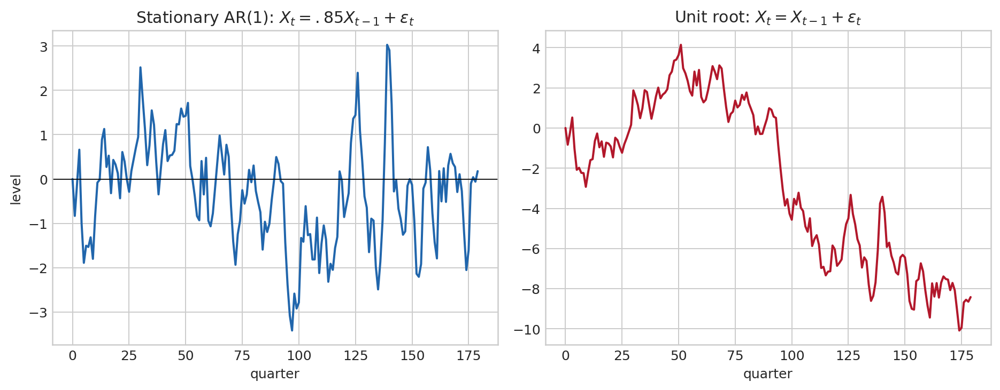{#fig-stationary-random-walk}

The economic distinction is substantial. A temporary demand shock in a stable system eventually disappears. A shock to a random-walk component permanently changes the forecast level. A unit-root test is therefore not a ritual preliminary: it asks which sort of persistence is compatible with the data, and thus which transformations and inferential approximations are defensible. The time-series chapter returns to these distinctions in detail (@sec-time-series).

Some processes have a useful economy of memory. A **Markov process** satisfies

$$
\Pr(X_{t+1}\in A\mid X_t,X_{t-1},\ldots)=\Pr(X_{t+1}\in A\mid X_t)
$$

for every admissible future event $A$. Conditional on the present state, earlier history adds no predictive information about the next state. This does not mean the past is irrelevant: it shaped the present state. It means that the present state is a sufficient summary of the past for one-step prediction.

For a two-regime business-cycle model, let $X_t$ be expansion or recession and let the transition matrix be

$$
P=
\begin{pmatrix}
.92&.08\\
.35&.65
\end{pmatrix}.
$$

The first row says that an expansion remains an expansion next quarter with probability .92; the second says that a recession persists with probability .65. If $\pi_t$ is the row vector of probabilities over the two regimes today, then $\pi_{t+1}=\pi_tP$. Repeated multiplication produces multi-step forecasts and, when it exists, a stationary distribution satisfying $\pi=\pi P$. Markov chains underlie regime-switching models, hidden Markov filters, and many state-space algorithms.

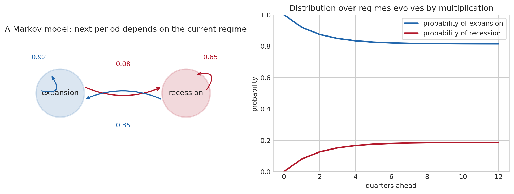{#fig-markov-process}

## Bayesian inference: uncertainty about parameters as well as data {#sec-bayes-foundations}

Return to the recession alarm. Suppose recessions occur with prior probability .05, the alarm sounds in .80 of recessions, and it sounds spuriously in .10 of non-recessions. On hearing an alarm, the relevant probability is

$$
\Pr(\text{recession}\mid\text{alarm})
=\frac{.80\times.05}{.80\times.05+.10\times.95}
\approx .296.
$$

The alarm is informative: the probability rises from 5 to almost 30 percent. It is not conclusive, because non-recessions are far more common and some produce false alarms. This small calculation contains the logic of Bayesian inference: begin with a prior probability, ask how compatible the observed evidence is with each competing explanation, and renormalise.

Frequentist inference treats $\theta$ as fixed and data as random. Bayesian inference represents prior uncertainty about $\theta$ with a density $p(\theta)$, then updates it with the likelihood $p(y\mid\theta)$:

$$
p(\theta\mid y)=\frac{p(y\mid\theta)p(\theta)}{p(y)},
\qquad
p(y)=\int p(y\mid\theta)p(\theta)\,d\theta.
$$ {#eq-bayes-rule}

The denominator is the probability of the observed data under all parameter values; it makes the posterior integrate to one. The content of Bayes’ rule is proportionality: posterior $\propto$ likelihood $\times$ prior. If the likelihood is sharp, the data dominate; if it is flat or the sample is short, the prior remains influential. The dependence is explicit and can therefore be examined rather than left implicit.

For example, a prior centred near a persistent but stable AR coefficient can prevent a short sample from assigning implausibly high posterior weight to explosive values merely because of a few unusual observations. A prior need not be “subjective” in a casual sense: it can encode parameter restrictions, historical evidence, regularisation, or a disciplined belief that a large VAR should not have implausibly large coefficients. It should nevertheless be reported and its influence examined, particularly when the data are weak.

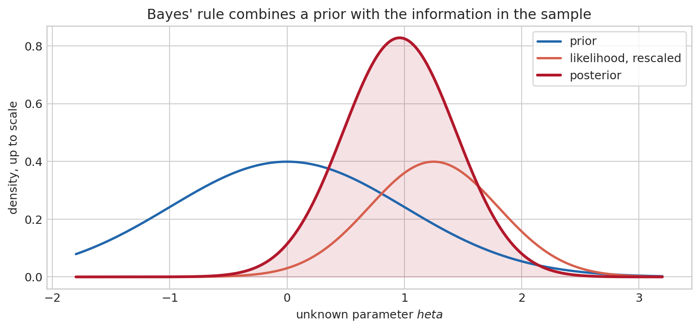{#fig-bayesian-update}

Bayesian credible intervals have a direct conditional interpretation: given the model, prior, and data, the posterior assigns a stated probability to the interval. This differs from a frequentist confidence interval, whose coverage is evaluated across repeated samples. Neither interpretation is unconditional truth. The former depends on the model and prior; the latter depends on the sampling model and calibration of the procedure. The later Bayesian VAR chapter develops computation and prior choice in the setting where this distinction is most useful (@sec-bvar).

## Signals and Fourier analysis: another coordinate system for time series {#sec-signal-fourier-foundations}

Consider a monthly industrial-production series. A graph in calendar time may contain an expansion, a seasonal pattern, a six-year cycle, and irregular measurement noise all at once. If the purpose is to identify recurring periodicities, dates are not always the most revealing coordinates. Fourier analysis asks a different question: rather than describing the value at date $t$, how much of the observed variation is associated with movements that repeat every two, seven, or twenty-four observations?

The building blocks are sines and cosines. A sinusoid with angular frequency $\omega$ completes one full cycle after $2\pi/\omega$ observations. Low frequency means a long period and slow movement; high frequency means a short period and rapid alternation. A phase shift moves the crest in time without changing the frequency. The central mathematical fact is that, on a finite equally spaced grid, these waves provide a coordinate system: a sufficiently rich sum of sinusoidal components can reconstruct the observed series.

Euler’s identity $e^{i\omega t}=\cos(\omega t)+i\sin(\omega t)$ packages sine and cosine in one complex exponential. The complex notation is convenient, not mystical. Its modulus measures amplitude and its argument records phase. For $T$ observations, the discrete Fourier transform is

$$
\widetilde X(\omega_j)=\sum_{t=0}^{T-1}x_t e^{-i\omega_jt},
\qquad \omega_j=\frac{2\pi j}{T}.
$$

The inverse transform reconstructs the data from these frequency coordinates. The squared modulus $|\widetilde X(\omega_j)|^2$, after normalisation, gives the **periodogram**. A large value indicates that a sinusoidal component of that frequency helps describe the observed path. It is evidence about regular variation in the sample, not proof of a literal clock inside the economy.

Sampling imposes a hard limit. With observations one period apart, frequencies above the **Nyquist frequency** cannot be separately recovered: a component that oscillates too quickly can masquerade as a slower one, a phenomenon called aliasing. Quarterly data cannot identify a monthly rhythm; annual data cannot distinguish seasonal patterns. Finite samples also blur nearby frequencies, which is why periodograms are often smoothed and interpreted alongside economic knowledge.

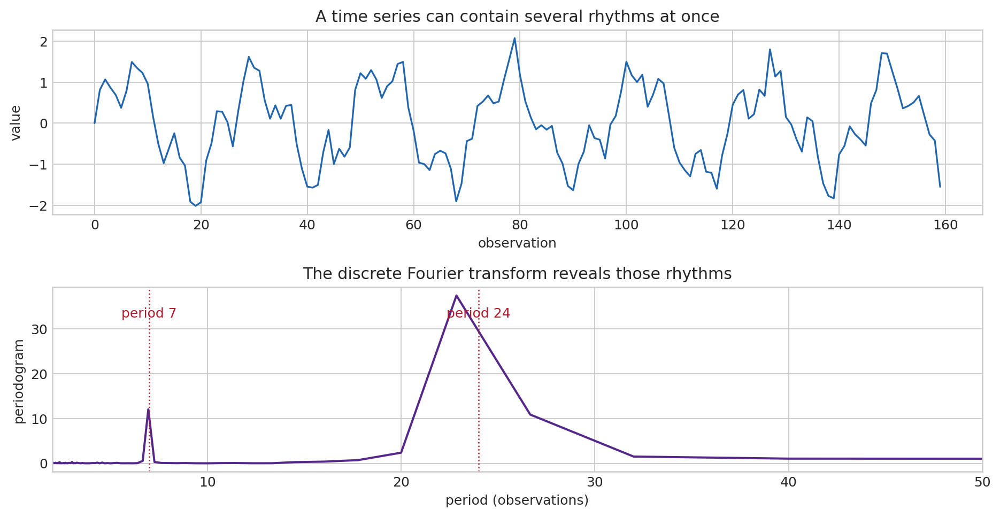{#fig-fourier-foundations}

For a weakly stationary process, the Fourier transform of the autocovariance is the **spectral density**,

$$
f_X(\omega)=\frac{1}{2\pi}\sum_{h=-\infty}^{\infty}\gamma(h)e^{-i\omega h}.
$$

It allocates the variance of the process over frequencies: integrating the spectral density over all frequencies returns $\gamma(0)=\operatorname{Var}(X_t)$. A persistent process places relatively more power at low frequencies; a seasonal process produces peaks at its seasonal frequency and harmonics. This statement requires weak stationarity because a spectrum describes a stable allocation of variance across time. A deterministic trend or unit root must be modelled or removed with care before assigning a stationary spectrum to the level series.

A linear time-invariant filter first appears in the time domain as a weighted moving average,

$$
y_t=\sum_{j=-\infty}^{\infty}b_jx_{t-j}.
$$

This operation is a **convolution**: it combines the present output with shifted inputs using the sequence of impulse-response weights $b_j$. Fourier coordinates turn convolution into multiplication. The transfer function $B(e^{-i\omega})=\sum_jb_je^{-i\omega j}$ multiplies each frequency component, so the output spectrum is

$$
f_Y(\omega)=|B(e^{-i\omega})|^2f_X(\omega).
$$

The modulus $|B(e^{-i\omega})|$ is the **gain** and its argument is the **phase** shift. This identity unifies ARMA dynamics, signal extraction, seasonal adjustment, and cycle filters. The frequency-domain chapter develops estimation, cross-spectra, coherence, and the economic interpretation of filtering (@sec-frequency-filtering).

## Summary: a map for the rest of the course

Matrices organise simultaneous variables and dynamic feedback. Their eigenvalues determine whether local dynamics decay, oscillate, or explode. Calculus and optimisation show how first-order conditions, constraints, and Jacobians turn economic questions into solvable local systems. Probability describes possible data under a model; statistics uses one realised sample to learn about the unknown model; moment restrictions and asymptotic theory make that learning quantifiable. Stochastic processes add temporal dependence, so stationarity, ergodicity, and unit roots become questions about what can be inferred from one history. Fourier analysis offers a second coordinate system in which persistence is described by frequency rather than lag.

The purpose of these tools is disciplined interpretation. Algebra tells us what a model can do; probability tells us what it implies before data; statistics tells us how uncertain an empirical conclusion remains after data.

## Further reading

For linear algebra, Strang [@Strang2016] is exceptionally clear on geometry, eigenvalues, and decompositions. Casella and Berger [@CasellaBerger2002] provide a rigorous introduction to probability and statistical inference; van der Vaart [@vanDerVaart1998] develops asymptotic statistics. Hamilton [@Hamilton1994] connects these foundations to time-series econometrics.
