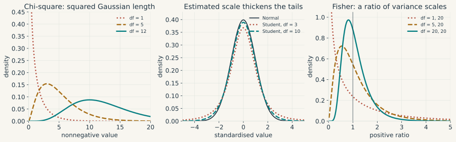

---
format:
  html:
    css: ../styles/mathematics.css
    html-math-method:
      method: mathjax
      url: https://cdn.jsdelivr.net/npm/mathjax@4.0.0/tex-chtml.js
    include-in-header: ../interactive/math/mathjax.html
    include-after-body: ../interactive/math/include.html
---

# Chapter 0: Mathematical Foundations {.unnumbered #sec-mathematical-foundations}

Macroeconometrics uses a small number of mathematical objects in many different forms. A vector may collect observations, coefficients or shocks. A matrix may represent a linear map, a covariance or a system of equations. A derivative may describe a local approximation, a comparative-static response or an optimisation condition. Confusion begins when the notation changes but the underlying object is left implicit.

This chapter therefore proceeds from the general object to the particular calculation. Definitions come first. Results follow with their assumptions stated beside them. Economic examples then show what the result says and where its interpretation stops. The order matters: an example can illustrate a theorem, but it cannot define the theorem's scope.

The main objects are arranged as follows.

| Object | General form | Main question |
|---|---|---|
| Set, statement and map | $A\subseteq B$, $P\Rightarrow Q$, $f:A\to B$ | Which objects are in scope, and what follows from the assumptions? |
| Vector space and linear map | $V$, $L:V\to W$ | Which combinations and directions are available? |
| Function and derivative | $F:U\subseteq\mathbb R^n\to\mathbb R^m$ | How does the output change near a point? |
| Optimisation problem | $\min_{x\in C}f(x)$ | Does an optimum exist, and how can it be characterised? |
| Probability model | $(\Omega,\mathcal F,\mathbb P)$ and $X:\Omega\to\mathbb R^d$ | How is uncertainty represented before observation? |
| Statistical model | $\{P_\theta:\theta\in\Theta\}$ and $\hat\theta(Y)$ | What can a sample reveal about an unknown parameter? |
| Stochastic process | $(X_t)_{t\in\mathbb Z}$ | What can one dependent history reveal over time? |

Four distinctions will recur. An abstract object differs from its coordinates in a chosen basis. A deterministic calculation differs from a probabilistic claim. A population parameter differs from an estimate computed from one sample. A local statement differs from a global one. Each section will say explicitly which side of these distinctions it uses.

::: {.math-route}
**How to read the notation.** Vectors are columns, and a prime denotes transpose. A displayed definition fixes an object; a theorem or proposition states what follows under listed assumptions; an example comes afterwards. The figures and animations, produced with Manim and StatAnim, illustrate the geometry after the formal argument has been given. Every result remains available in the equations and fixed figures without video playback.
:::

## Sets, statements, and maps {#sec-sets-statements-maps}

A set fixes the collection of objects under discussion. The notation $x\in A$ says that $x$ belongs to $A$, while $A\subseteq B$ says that every element of $A$ also belongs to $B$. The empty set $\varnothing$ has no elements. Set-builder notation records a membership rule, as in

$$
A=\{x\in\mathbb R:x^2\leq1\}=[-1,1].
$$

The union $A\cup B$ contains elements found in at least one of the two sets. Their intersection $A\cap B$ contains those found in both, $A\setminus B$ removes the elements of $B$ from $A$, and the Cartesian product $A\times B$ consists of ordered pairs $(a,b)$. Order matters here. In a dataset, $(\text{date},\text{inflation})$ is a different kind of object from $(\text{inflation},\text{date})$.

Quantifiers state the scope of a claim. The expression

$$
\forall x\in A,\quad P(x)
$$

says that $P(x)$ holds for every element of $A$. The expression $\exists x\in A$ asks for at least one. Their negations swap the quantifiers: denying a universal claim means finding an $x$ for which the claim fails, while denying an existence claim means showing failure for every $x$. One counterexample therefore disproves a universal statement. A hundred favourable examples still do not prove it.

An implication $P\Rightarrow Q$ says that $Q$ follows whenever $P$ holds, which makes $P$ sufficient for $Q$ and $Q$ necessary for $P$. The converse $Q\Rightarrow P$ is a separate claim. The symbol $P\Leftrightarrow Q$ means that both directions hold. For a theorem, the assumptions sit on the left of an implication and the conclusion sits on the right. The conclusion alone does not verify them.

A **map** $f:A\to B$ assigns one element of the codomain $B$ to every element of the domain $A$. For $C\subseteq A$, its image is $f(C)=\{f(x):x\in C\}$. For $D\subseteq B$, the preimage $f^{-1}(D)=\{x\in A:f(x)\in D\}$ is defined even when the map has no inverse function.

The map is **injective** when equal outputs imply equal inputs, **surjective** when every element of the codomain is reached, and **bijective** when both properties hold. A bijection has an inverse map $f^{-1}:B\to A$. Domain and codomain are part of these statements. The rule $f(x)=x^2$ from $\mathbb R$ to $\mathbb R$ is neither injective nor surjective. Changing the codomain to $[0,\infty)$ makes it surjective. Restricting the domain as well, to $[0,\infty)$, makes it bijective with inverse $f^{-1}(y)=\sqrt y$.

These definitions carry much of the chapter. A matrix represents a map after bases are chosen. An identification argument asks whether a parameter-to-distribution map is injective. A random variable is a measurable map from outcomes to recorded values. The extra adjectives change from section to section, but the underlying object does not.

## Linear algebra and systems of equations {#sec-linear-algebra-foundations}

Linear algebra studies vector spaces and the maps that preserve their linear combinations. The abstract objects are a domain space $V$, a codomain space $W$ and a linear map $L:V\to W$. Coordinates enter only after bases have been chosen. A matrix is then the coordinate representation of $L$.

The section follows that order. It defines spaces and bases, introduces linear maps, represents them by matrices, and then studies composition, rank, projections and repeated application. Regression and dynamic systems appear only after the required structure is available.

### Vectors and vector spaces {#sec-vector-spaces}

A **vector space** is a set whose elements can be added and multiplied by real numbers without leaving the set. Its elements are called vectors, whether they are coordinate lists, functions, polynomials or matrices. The word describes the allowed operations, rather than a particular geometric picture.

The familiar space $\mathbb R^n$ consists of ordered lists of $n$ real coordinates. We write them as columns:

$$
x=\begin{pmatrix}x_1\\x_2\end{pmatrix},\qquad
z=\begin{pmatrix}z_1\\z_2\end{pmatrix}.
$$

Addition is coordinate by coordinate, and scalar multiplication applies the same real number to each coordinate:

$$
x+z=\begin{pmatrix}x_1+z_1\\x_2+z_2\end{pmatrix},\qquad
\alpha x=\begin{pmatrix}\alpha x_1\\\alpha x_2\end{pmatrix}.
$$

Here a **scalar** is a real number. The coordinate order is part of the definition: output and inflation cannot exchange positions during a calculation. Negative scalars reverse a direction, and the zero vector represents no movement. An arrow in the plane is a useful representation of a vector in $\mathbb R^2$, but it is only one representation.

**Definition (real vector space).** A real vector space $V$ is a nonempty set equipped with addition $V\times V\to V$ and scalar multiplication $\mathbb R\times V\to V$. For every $u,v,w\in V$ and every $\alpha,\beta\in\mathbb R$, these operations satisfy:

1. Addition is associative and commutative: $(u+v)+w=u+(v+w)$ and $u+v=v+u$.
2. There is a zero vector $0_V$ such that $v+0_V=v$, and every $v$ has an additive inverse $-v$ satisfying $v+(-v)=0_V$.
3. Scalar multiplication satisfies $1v=v$ and $\alpha(\beta v)=(\alpha\beta)v$.
4. The two distributive laws hold: $\alpha(u+v)=\alpha u+\alpha v$ and $(\alpha+\beta)v=\alpha v+\beta v$.

Both operations must return an element of $V$, a requirement called **closure**. Once the listed rules hold, familiar identities such as $0v=0_V$ and $(-1)v=-v$ follow from them. They do not have to be added as separate assumptions.

Our main example is $\mathbb R^n$ with coordinatewise operations. Fixed-size matrices and real polynomials also form vector spaces. Add two polynomials and the result is still a polynomial. Multiply one by any real number and the same remains true. Nonnegative consumption bundles fail this test because multiplication by $-1$ leaves the feasible set. Economic feasibility and vector-space structure answer different questions.

Now take two possible movements of output and inflation, $a=(1,.5)'$ and $b=(-.2,1)'$. The vector-space operations give

$$
2a-b=\begin{pmatrix}2.2\\0\end{pmatrix}.
$$

The inflation coordinates cancel. This calculation is an instance of the general operations above: addition combines two movements, while scalar multiplication changes their size and possibly their direction.

### Linear combinations, span, and subspaces {#sec-span-subspaces}

Let $v_1,\ldots,v_k$ be vectors in a real vector space $V$. The expression

$$
\alpha_1v_1+\cdots+\alpha_kv_k,
\qquad \alpha_1,\ldots,\alpha_k\in\mathbb R,
$$

is a **linear combination** of these vectors. There is no requirement that the coefficients be positive or sum to one. Imposing those restrictions would give a convex combination instead.

**Definition (span).** The span of a finite family is the set of all its linear combinations:

$$
\operatorname{span}(v_1,\ldots,v_k)
=\left\{\sum_{j=1}^k\alpha_jv_j:
\alpha_1,\ldots,\alpha_k\in\mathbb R\right\}.
$$

The braces describe a set, and the colon reads "such that". Thus $x\in\operatorname{span}(v_1,\ldots,v_k)$ says that some choice of coefficients satisfies $x=\sum_j\alpha_jv_j$. Several choices may work. French texts often denote the same set by $\operatorname{Vect}(v_1,\ldots,v_k)$.

For a nonzero vector $a$, its span is the line through zero in direction $a$. For our two disturbances $a=(1,.5)'$ and $b=(-.2,1)'$, the span is the whole plane. Indeed, any target $(r,s)'$ can be obtained by choosing

$$
\alpha=\frac{r+.2s}{1.1},\qquad
\beta=\frac{s-.5r}{1.1}.
$$

Substitution gives $\alpha a+\beta b=(r,s)'$. Replace $b$ by $2a$, however, and every combination collapses to $(\alpha+2\beta)a$. The result is a line. Two listed vectors can therefore supply only one direction.

**Definition (vector subspace).** A subset $W$ of a vector space $V$ is a vector subspace if it contains zero and is closed under addition and scalar multiplication. Equivalently, it is nonempty and $\alpha u+\beta v\in W$ for every $u,v\in W$ and every real $\alpha,\beta$. It then inherits the vector-space rules from $V$.

The span is itself a subspace. Adding two combinations merely adds their coefficients, and scaling a combination scales those same coefficients. Either operation stays within the span. Any subspace containing the original family must also contain every such combination, which makes the span the **smallest vector subspace containing that family**.

{#fig-bases-span}

A budget line such as $c_1+c_2=1$ misses the origin, so it is an **affine set**, a translated subspace. Its feasible displacements satisfy $dc_1+dc_2=0$ and form the line $\operatorname{span}((1,-1)')$. This is exactly the distinction needed in constrained optimisation. The choices themselves may form an affine set even though their feasible directions form a vector space.

### Independent, dependent, and spanning families {#sec-vector-families}

Two issues have been bundled together so far. The proposed vectors may or may not produce the whole space, and a given vector may or may not have a unique representation. The first issue is **generation**. The second is **independence**.

**Definition (spanning family, or famille génératrice).** A family $v_1,\ldots,v_k$ is a spanning family of $V$ if

$$
V=\operatorname{span}(v_1,\ldots,v_k).
$$

The ambient space is part of the statement. The single vector $(1,0)'$ spans the horizontal axis, though it leaves the rest of $\mathbb R^2$ unreachable. Every family spans its own span. That span can be a proper subspace of the space in which the vectors are drawn.

**Definition (linearly independent family, or famille libre).** A family is linearly independent if the only combination giving zero is the one with every coefficient equal to zero:

$$
\sum_{j=1}^k\alpha_jv_j=0
\quad\Longrightarrow\quad
\alpha_j=0\ \text{for every }j.
$$

**Definition (linearly dependent family, or famille liée).** A family is linearly dependent if there exist coefficients, not all zero, such that $\sum_j\alpha_jv_j=0$. Choosing an index with a nonzero coefficient and rearranging shows that at least one vector is a combination of the others. This is the precise sense in which that vector provides no additional direction. A family containing the zero vector is necessarily dependent.

Take $e_1=(1,0)'$ and $e_2=(0,1)'$. Together they are independent and span $\mathbb R^2$. Adding $e_1+e_2$ leaves the span unchanged but creates dependence, as the coefficients $1,1,-1$ produce zero. The single-vector family $(e_1)$ gives the opposite case: it is independent and reaches only the horizontal axis. Generation and independence have to be checked separately.

**Definition (basis and dimension).** A **basis** of $V$ is a family which is both independent and spanning. A vector space is finite-dimensional if it has a finite spanning family. In such a space all bases have the same number of vectors; this number is its **dimension**, written $\dim V$. The zero space has dimension zero and the empty family as its basis. The vectors $e_1,\ldots,e_n$, each with a single coordinate equal to one and all others zero, form the **canonical basis** of $\mathbb R^n$.

Coordinates in a basis are unique for a simple reason. Generation supplies a representation. If two representations existed, subtracting them would give $\sum_j(\alpha_j-\beta_j)v_j=0$, and independence would force every coefficient difference to vanish. A dependent family allows several coefficient lists for the same vector. Collinear regressors will create precisely this ambiguity.

In an $n$-dimensional space, an independent family contains at most $n$ vectors and a spanning family contains at least $n$. An independent family can be extended to a basis. A finite spanning family can be pared down to one by removing redundant vectors. It follows that $n$ vectors form a basis as soon as either independence or generation has been established. The basis-exchange argument proves these claims by replacing, one at a time, vectors in a spanning family with independent vectors that have nonzero coefficients in their representations.

Coordinates still depend on the chosen basis. The vector $(2.2,0)'$ has coordinates $(2.2,0)$ in the canonical basis and $(2,-1)$ in the basis $(a,b)$ introduced above. The vector stays put. We have changed the directions used to measure it. Matrix notation for this change will come after matrix multiplication.

### Length, orthogonality, and the choice of units

An **inner product** on a real vector space is a symmetric bilinear form $\langle\cdot,\cdot\rangle$ satisfying $\langle x,x\rangle>0$ for every nonzero $x$. It induces the norm $\|x\|=\sqrt{\langle x,x\rangle}$ and the distance $d(x,y)=\|x-y\|$. In $\mathbb R^n$, the Euclidean choices are

$$
\begin{aligned}
\langle a,b\rangle&=a'b=\sum_i a_ib_i,\\
\|a\|_2&=\sqrt{a'a},\\
d(a,b)&=\|a-b\|_2.
\end{aligned}
$$

For nonzero vectors, the angle satisfies $\cos\theta=a'b/(\|a\|_2\|b\|_2)$. The Cauchy-Schwarz inequality $|a'b|\leq\|a\|_2\|b\|_2$ makes this definition possible. Orthogonality means $a'b=0$ and gives Pythagoras' identity $\|a+b\|_2^2=\|a\|_2^2+\|b\|_2^2$.

There is a quick geometric proof of Cauchy-Schwarz. For $b\neq0$, minimise the squared distance $\|a-tb\|_2^2$ over $t$. At $t=a'b/(b'b)$, its value is $\|a\|_2^2-(a'b)^2/\|b\|_2^2$. A squared distance cannot be negative, which gives the inequality.

Units do not disappear inside a norm. A distance that adds squared euros to squared percentage points will be driven by whichever coordinate is numerically larger. Standardising the variables changes that comparison, as does a weighted inner product $\langle a,b\rangle_W=a'Wb$ with $W$ symmetric positive definite. Even the "steepest" direction of a gradient depends on this choice of metric.

Other norms are $\|x\|_1=\sum_i|x_i|$ and $\|x\|_\infty=\max_i|x_i|$. A norm is positive except at zero, satisfies $\|cx\|=|c|\|x\|$, and obeys the triangle inequality. In finite dimensions these norms define the same convergent sequences, since

$$
\|x\|_\infty\leq\|x\|_2\leq\|x\|_1\leq\sqrt n\,\|x\|_2.
$$

This chain is to be proved, rather than taken as a convention, and the worked exercise in @sec-exercise-norm-comparison derives each inequality from the coordinate definitions and Cauchy-Schwarz.

They nevertheless penalise coefficients differently. This will separate ridge regression from the lasso.

### Linear transformations and their columns

**Definition (linear transformation).** A map $L:V\to W$ between real vector spaces is linear if, for all $u,v\in V$ and real $\alpha,\beta$,

$$
L(\alpha u+\beta v)=\alpha L(u)+\beta L(v).
$$

It preserves every finite linear combination. In particular, $L(0)=0$. Once coordinates are chosen, the map $x\mapsto Ax$ satisfies this definition because matrix multiplication distributes over vector addition and scalar multiplication. By contrast, $x\mapsto Ax+c$ with $c\neq0$ is affine, since it sends zero to $c$.

Now write $x=x_1e_1+\cdots+x_ne_n$. Linearity implies

$$
L(x)=x_1L(e_1)+\cdots+x_nL(e_n).
$$

Once the images of the basis vectors are known, the image of every vector follows. In the canonical bases, the matrix representing $L$ has columns $L(e_1),\ldots,L(e_n)$. Each column records the image of one input direction. The dimensions now have a direct meaning: columns count input coordinates and rows count output coordinates.

::: {#fig-matrix-film .math-film}

```{=html}
<video controls preload="none" playsinline poster="../figures/mathematics/animations/LinearMap.png" aria-label="Animation: two basis vectors and a grid under a linear transformation">
<source src="../figures/mathematics/animations/LinearMap.mp4" type="video/mp4">
<a href="../figures/mathematics/animations/LinearMap.mp4">Download the animation.</a>
</video>
```


A matrix acts on the entire plane. The teal and ochre arrows show the two basis vectors; their images determine the image of every linear combination. The intermediate frames interpolate between maps and are not successive periods of the economic model.
:::

::: {.math-explorer data-math="matrix"}
**Choose a matrix and follow its action.** Start with the shear: its first column leaves $e_1$ unchanged, while its second column sends $e_2$ to $(1,1)'$. Compare the image of $x=e_1+e_2$ with the sum of the two column images. Then choose the projection preset and observe which direction is lost. The fixed figure and video above remain available without JavaScript.
:::

### A matrix acts on a vector {#sec-matrices-transformations}

A matrix $A=(a_{ij})\in\mathbb R^{m\times n}$ is a rectangular array with $m$ **rows** and $n$ **columns**. The first index $i$ selects an output coordinate and the second index $j$ selects an input coordinate. The notation $m\times n$ always means rows first, columns second.

Once bases have been chosen, every linear map from $\mathbb R^n$ to $\mathbb R^m$ is represented by such a matrix. Conversely, every $m\times n$ matrix defines a linear map $x\mapsto Ax$. The array and the map are related objects: the entries of the array depend on the chosen bases, while the linear map itself does not.

Write down the dimensions before multiplying. A column vector with $n$ coordinates is an $n\times1$ matrix. A matrix with $n$ columns accepts exactly those $n$ input coordinates and returns $m$ outputs:

$$
\underbrace{A}_{m\times n}\,
\underbrace{x}_{n\times1}
=\underbrace{Ax}_{m\times1}.
$$

For a numerical example, take

$$
M=\begin{pmatrix}1&2&-1\\0&1&3\end{pmatrix},
\qquad x=\begin{pmatrix}2\\1\\-1\end{pmatrix}.
$$

The matrix has two rows and three columns. Hence it takes a vector in $\mathbb R^3$ and returns a vector in $\mathbb R^2$. To obtain the first output, multiply the three entries in the first row by the corresponding entries in $x$, then add. Repeat with the second row:

$$
Mx=\begin{pmatrix}
1\cdot2+2\cdot1+(-1)\cdot(-1)\\
0\cdot2+1\cdot1+3\cdot(-1)
\end{pmatrix}
=\begin{pmatrix}5\\-2\end{pmatrix}.
$$

This calculation is the **row-by-column rule**. In general,

$$
(Ax)_i=\sum_{j=1}^n a_{ij}x_j.
$$

The same product has a second interpretation. If $a_j$ is column $j$ of $A$, then

$$
Ax=x_1a_1+\cdots+x_na_n.
$$

In the numerical example, the output is $2(1,0)'+(2,1)'-(-1,3)'=(5,-2)'$. The entries of $x$ weight the columns of $M$. This **column-combination reading** puts every output of a matrix in the span of its columns. Later, the same observation will place a fitted regression vector in the span of the regressors.

{#fig-matrix-vector}

### Multiplying matrices means composing transformations {#sec-matrix-composition}

Let $B\in\mathbb R^{n\times p}$ and $A\in\mathbb R^{m\times n}$. Matrix $B$ maps $p$ input coordinates into $n$ intermediate coordinates, which are then accepted by $A$. Their composition is represented by the product $AB\in\mathbb R^{m\times p}$:

$$
\mathbb R^p\xrightarrow{B}\mathbb R^n
\xrightarrow{A}\mathbb R^m,
\qquad (AB)x=A(Bx).
$$

**Definition (matrix product).** The entries of the product are

$$
(AB)_{ij}=\sum_{\ell=1}^n a_{i\ell}b_{\ell j}.
$$

Entry $(i,j)$ applies row $i$ of $A$ to column $j$ of $B$. The inner dimensions must agree, while the outer dimensions give the size of the result:

$$
(m\times n)(n\times p)=(m\times p).
$$

This order follows composition. The map on the right acts first. Matrix multiplication is associative and distributive, but it is generally not commutative.

For an example, first double the horizontal coordinate and then add the vertical coordinate to the horizontal one. The two maps are represented by

$$
B=\begin{pmatrix}2&0\\0&1\end{pmatrix},\qquad
A=\begin{pmatrix}1&1\\0&1\end{pmatrix}.
$$

Starting from $x=(1,1)'$, applying $B$ gives $(2,1)'$, then applying $A$ gives $(3,1)'$.

Its columns can be found without memorising another formula. Send $e_1$ through both maps. It becomes $(2,0)'$ under $B$ and remains $(2,0)'$ under $A$, giving the first column of $AB$. The second basis vector becomes $(0,1)'$ and then $(1,1)'$, giving the second column. Hence

$$
AB=\begin{pmatrix}2&1\\0&1\end{pmatrix}.
$$

{#fig-matrix-composition}

::: {#fig-composition-film .math-film}

```{=html}
<video controls preload="none" playsinline poster="../figures/mathematics/animations/MatrixComposition.png" aria-label="Animation: apply a horizontal stretch B then a shear A, and compare with the reversed order">
<source src="../figures/mathematics/animations/MatrixComposition.mp4" type="video/mp4">
<a href="../figures/mathematics/animations/MatrixComposition.mp4">Download the animation.</a>
</video>
```

The grid, unit square and vector all pass through the same two transformations. Applying B and then A ends at (3, 1). Reversing the order ends at (4, 1). The labels stay fixed as the geometry moves. Intermediate frames only make the motion visible and add no factor to the matrix product.
:::

A $2\times3$ matrix, for example, can multiply a $3\times4$ matrix and produces a $2\times4$ result. A $2\times4$ matrix on its right would return two coordinates where three are required, so that product is undefined. Entrywise multiplication is a separate operation and requires matrices of the same size.

Even when both orders are defined, the result usually differs. In the example,

$$
BA=\begin{pmatrix}2&2\\0&1\end{pmatrix}
\neq AB.
$$

Applying the shear first and the stretch second gives $BAx=(4,1)'$, whereas $ABx=(3,1)'$. Matrix multiplication is generally **noncommutative**. It remains associative, so $(AB)C=A(BC)$ whenever the dimensions work. Either side applies $C$, then $B$, then $A$. It also distributes over addition, as in $A(B+C)=AB+AC$.

The identity matrix $I_n$ has ones on its diagonal and zeros elsewhere; it leaves every vector of $\mathbb R^n$ unchanged. For $A\in\mathbb R^{m\times n}$, this gives $I_mA=A=AI_n$. An **inverse** of a square matrix $A$ is a matrix $A^{-1}$ satisfying $A^{-1}A=AA^{-1}=I_n$. It reverses the transformation. If $A$ and $B$ are invertible, reversing their composition requires reversing the order: $(AB)^{-1}=B^{-1}A^{-1}$.

### Transposes and a check on dimensions

The **transpose** $A'$ exchanges rows and columns, so $(A')_{ij}=a_{ji}$. An $m\times n$ matrix becomes an $n\times m$ matrix. Transposition and inversion are unrelated operations. When a column vector $x\in\mathbb R^n$ becomes the row vector $x'$, the two possible products have different meanings:

$$
\underbrace{x'}_{1\times n}\underbrace{x}_{n\times1}
=\sum_{i=1}^n x_i^2,
$$

whereas

$$
\underbrace{x}_{n\times1}\underbrace{x'}_{1\times n}
=(x_ix_j)_{i,j=1}^n.
$$

The first product is the squared length, a scalar. The second is an $n\times n$ **outer product**. If $X$ holds $T$ observations on $k$ regressors, the same distinction gives a $k\times k$ matrix $X'X$ and a $T\times T$ matrix $XX'$. Their dimensions already rule out substitution. Transposing a product reverses its order, $(AB)'=B'A'$, as a direct calculation of the entries confirms.

A change of basis now fits into one line. Put a basis of $\mathbb R^n$ in the columns of $P=[v_1\ \cdots\ v_n]$, and write $[x]_B$ for the coordinates of $x$ in that basis. Then $x=P[x]_B$. Unique coordinates make $P$ invertible, so $[x]_B=P^{-1}x$. The multiplication changes the description of $x$ while leaving the vector itself fixed.

### Rank, null space, and recoverability

For a matrix $A\in\mathbb R^{m\times n}$, the **null space**

$$
\mathcal N(A)=\{x\in\mathbb R^n:Ax=0\}
$$

contains the input directions erased by the map. The **column space**

$$
\mathcal C(A)=\{Ax:x\in\mathbb R^n\}
$$

contains every attainable output and equals the span of the columns. The two spaces usually have different ambient spaces: $\mathcal N(A)\subseteq\mathbb R^n$ and $\mathcal C(A)\subseteq\mathbb R^m$.

The **rank** of $A$ is the dimension of $\mathcal C(A)$, or equivalently the maximum number of independent columns. The rank-nullity theorem states that

$$
\operatorname{rank}(A)+\dim\mathcal N(A)=n.
$$

The row space is $\mathcal C(A')=\mathcal N(A)^\perp$ inside $\mathbb R^n$. The left null space is $\mathcal N(A')=\mathcal C(A)^\perp$ inside $\mathbb R^m$. Regression residuals live in $\mathcal N(X')$, orthogonal to the columns of $X$. Writing down the ambient dimensions prevents a common transpose mistake.

If two columns of a regressor matrix are identical, raising one coefficient and lowering the other by the same amount leaves every fitted value unchanged. The coefficient change lies in $\mathcal N(X)$. This is the linear-algebraic reason separate coefficients cannot be recovered under exact collinearity.

A system $Ax=b$ has a solution if and only if $b\in\mathcal C(A)$, equivalently $\operatorname{rank}(A)=\operatorname{rank}([A\mid b])$. Once one solution $x_0$ exists, every solution is $x_0+v$ with $v\in\mathcal N(A)$. Uniqueness therefore requires full column rank. For a square matrix these conditions reduce to invertibility, or $\det A\neq0$.

The determinant measures the signed volume scaling of a square map. In two dimensions, $\det\left(\begin{smallmatrix}a&b\\c&d\end{smallmatrix}\right)=ad-bc$. A zero value means that a square has collapsed onto a line or a point. Once a direction has been lost in this way, the map cannot be inverted.

{#fig-determinant-invertibility}

Row operations solve systems without changing their solution set. Starting from $x_1+x_2=5$ and $2x_1-x_2=1$, subtract twice the first equation from the second. This gives $-3x_2=-9$, hence $(x_1,x_2)=(2,3)$. Gaussian elimination repeats the same idea for larger systems. Numerical software usually solves the system directly instead of constructing an inverse.

An invertible system may still be numerically fragile. Using the induced operator norm, the condition number $\kappa_2(A)=\|A\|_2\|A^{-1}\|_2$ measures its worst relative sensitivity to perturbations in the right-hand side. Nearly proportional columns can send this number soaring. The resulting numerical problem is related to weak statistical identification, though the two concepts are distinct.

### Least squares as orthogonal projection {#sec-ols-matrix}

Let $y\in\mathbb R^T$ be an observed response and let $X\in\mathbb R^{T\times k}$. Each coefficient vector $\beta\in\mathbb R^k$ produces the fitted vector $X\beta\in\mathcal C(X)$. **Ordinary least squares** is the projection problem

$$
\hat\beta=\arg\min_{\beta\in\mathbb R^k}\|y-X\beta\|_2^2.
$$

Thus OLS first has a deterministic meaning: among all vectors in the column space of $X$, it selects the one closest to $y$. No probability model is required for this definition. A projection onto the finite-dimensional space $\mathcal C(X)$ always exists and is unique. The coefficient vector producing it is unique exactly when $X$ has full column rank. At any minimiser, the residual $r=y-X\hat\beta$ is orthogonal to every column of $X$, which gives the normal equations $X'r=0$.

Indeed, if $X'r=0$, then for any coefficient change $d$,

$$
\begin{aligned}
\|y-X(\hat\beta+d)\|_2^2
&=\|r-Xd\|_2^2\\
&=\|r\|_2^2+\|Xd\|_2^2.
\end{aligned}
$$

This identity proves optimality directly. If $X$ has full column rank, then $\|Xd\|_2^2>0$ whenever $d\neq0$, which also proves uniqueness of the coefficients:

$$
\begin{gathered}
X'(y-X\hat\beta)=0,\\
\hat\beta=(X'X)^{-1}X'y.
\end{gathered}
$$ {#eq-ols-projection}

The dimensions in @eq-ols-projection offer a useful check. Both $X'X$ and its inverse are $k\times k$, while $X'y$ and $\hat\beta$ are $k\times1$. By comparison, $P_X=X(X'X)^{-1}X'$ is $T\times T$ because it sends the observed response vector to its fitted value. The identities $P_X'=P_X$ and $P_X^2=P_X$ split $y$ into the orthogonal components $P_Xy$ and $(I_T-P_X)y$. If $X$ is rank deficient, several coefficient vectors produce the same unique fitted vector. This geometry uses no probability model.

{#fig-ols-geometry}

[Explore regression and projection in the Interactive Lab](../interactive-lab.html?method=linear-projection).

### Simple regression as a special case {#sec-ols-scalar}

The general projection becomes a straight-line fit when the design matrix has a column of ones and one observed regressor:

$$
X=\begin{pmatrix}
1&x_1\\1&x_2\\\vdots&\vdots\\1&x_T
\end{pmatrix},\qquad
\beta=\begin{pmatrix}a\\b\end{pmatrix}.
$$

Then $(X\beta)_t=a+bx_t$. Suppose, for example, that $y_t$ is consumption and $x_t$ is income for household $t$. At this stage the line only summarises the observations. Exogeneity and causality have yet to enter.

For given coefficients, the fitted value is $a+bx_t$ and the residual is $y_t-a-bx_t$. Ordinary least squares (OLS) chooses the line which minimises the sum of squared residuals:

$$
S(a,b)=\sum_{t=1}^T(y_t-a-bx_t)^2.
$$

Squaring stops positive and negative residuals from cancelling and gives large discrepancies extra weight. On a plot of $y$ against $x$, each residual is a vertical distance because income is treated as the given horizontal coordinate. Perpendicular distance to the line would define another fitting problem.

We can derive the solution using only algebra. Write $\bar x=T^{-1}\sum_t x_t$ and $\bar y=T^{-1}\sum_t y_t$. Adding and subtracting these means in each residual, then expanding the square, gives

$$
\begin{aligned}
S(a,b)={}&\sum_{t=1}^T\big[(y_t-\bar y)-b(x_t-\bar x)\big]^2\\
&+T(\bar y-a-b\bar x)^2.
\end{aligned}
$$

Both centred variables sum to zero, so the cross term vanishes. For any fixed slope $b$, choosing $a=\bar y-b\bar x$ minimises the second term. Every best-fitting line therefore passes through $(\bar x,\bar y)$. Only the slope remains to be chosen.

Define the two sample sums

$$
\begin{aligned}
S_{xx}&=\sum_{t=1}^T(x_t-\bar x)^2,\\
S_{xy}&=\sum_{t=1}^T(x_t-\bar x)(y_t-\bar y).
\end{aligned}
$$

If $S_{xx}>0$, completing the square in $b$ yields the unique estimates

$$
\hat b=\frac{S_{xy}}{S_{xx}},\qquad
\hat a=\bar y-\hat b\bar x.
$$ {#eq-ols-scalar}

After substituting $a=\bar y-b\bar x$, the objective equals its minimum plus $S_{xx}(b-\hat b)^2$. Any departure from $\hat b$ raises the loss. The formula is a ratio of sample covariance to sample variance, with their common divisor cancelled. If every household has the same income, then $S_{xx}=0$ and the observations cannot separate a slope change from an offsetting intercept change. This is exact collinearity in its simplest form.

For a small numerical example, take four pairs

$$
(x_t,y_t)\in\{(0,1),(1,2),(2,2),(3,4)\}.
$$

Then $\bar x=1.5$, $\bar y=2.25$, $S_{xx}=5$ and $S_{xy}=4.5$. Hence $\hat a=\hat b=.9$. The fitted values are $.9,1.8,2.7,3.6$, giving residuals $.1,.2,-.7,.4$ and a sum of squares of $.70$. The proposed line $1+x$ instead gives a sum of squares of $1$. These calculations show exactly what is being compared.

The OLS residuals $\hat u_t=y_t-\hat a-\hat b x_t$ satisfy

$$
\sum_{t=1}^T\hat u_t=0,\qquad
\sum_{t=1}^Tx_t\hat u_t=0.
$$

These **normal equations** say that the fitted residuals are orthogonal to the constant and the observed regressor. Setting the two partial derivatives of $S(a,b)$ to zero will produce the same equations once derivatives have been introduced. The equations are mechanical consequences of the fit. They supply no evidence about the exogeneity of the unobserved economic error.

If the intercept is deliberately excluded, the line is restricted to pass through zero. Minimising $\sum_t(y_t-bx_t)^2$ then gives

$$
\hat b_{\text{no intercept}}
=\frac{\sum_t x_ty_t}{\sum_t x_t^2},
\qquad \sum_t x_t^2>0.
$$

This is a different model. Its residuals need not sum to zero, and the centred formula in @eq-ols-scalar no longer applies.

### Eigenvalues and repeated linear maps {#sec-eigenvalues-stability}

Let $A:\mathbb R^n\to\mathbb R^n$ be a linear map represented by a square matrix. A nonzero vector $v$ is an **eigenvector** if

$$
Av=\lambda v
$$

for some scalar $\lambda$, called its **eigenvalue**. The direction spanned by $v$ is invariant under $A$: the map only rescales it. Repeated application is therefore immediate,

$$
A^hv=\lambda^hv.
$$

Eigenvalues are the roots of $\det(A-\lambda I)=0$. A negative real eigenvalue reverses the direction at each application. A nonreal conjugate pair combines rotation with scaling on a real invariant plane. The **spectral radius** is $\rho(A)=\max_i|\lambda_i|$.

**Stability result.** For every finite square matrix,

$$
A^h\longrightarrow0
\quad\Longleftrightarrow\quad
\rho(A)<1.
$$

The result is asymptotic. Powers of a nonnormal matrix may first grow and only later decay. Eigenvalues on the unit circle also require care: the powers of $\left(\begin{smallmatrix}1&1\\0&1\end{smallmatrix}\right)$ equal $\left(\begin{smallmatrix}1&h\\0&1\end{smallmatrix}\right)$ and are unbounded even though both eigenvalues equal one. In continuous time, the system $\dot x=Ax$ decays when every eigenvalue has a strictly negative real part.

::: {#fig-dynamics-film .math-film}

```{=html}
<video controls preload="none" playsinline poster="../figures/mathematics/animations/Stability.png" aria-label="Animation: stable and explosive rotating trajectories">
<source src="../figures/mathematics/animations/Stability.mp4" type="video/mp4">
<a href="../figures/mathematics/animations/Stability.mp4">Download the animation.</a>
</video>
```


The same initial displacement is propagated by two rotation matrices, scaled by 0.88 and 1.06. Dots mark discrete dates. Joining them helps follow the sequence; the joining segments are not continuous-time solutions.
:::

### A small dynamic model {#sec-maths-motivating-system}

Let $y_t$ and $\pi_t$ denote deviations of output and inflation from reference levels. Collect them in a state vector and consider the linear system

$$
\begin{gathered}
x_t=\begin{pmatrix}y_t\\\pi_t\end{pmatrix},\qquad
A=\begin{pmatrix}.7&.2\\.1&.8\end{pmatrix},\\
x_{t+1}=Ax_t+u_{t+1}.
\end{gathered}
$$ {#eq-maths-state-system}

Conditional on the specification, the first column of $A$ gives the next-period change produced by a unit displacement in output with inflation held at zero. The second column does the same for an inflation displacement. If $x_t=(1,0)'$ and $u_{t+1}=0$, then $x_{t+1}=(.7,.1)'$.

To study repeated propagation, set future disturbances to zero. Then $x_{t+h}=A^hx_t$. This matrix has two independent eigenvectors:

$$
A\begin{pmatrix}1\\1\end{pmatrix}
=.9\begin{pmatrix}1\\1\end{pmatrix},
\qquad
A\begin{pmatrix}2\\-1\end{pmatrix}
=.6\begin{pmatrix}2\\-1\end{pmatrix}.
$$

Every initial state is a unique combination of these directions, so its two components decay at rates $.9^h$ and $.6^h$. The spectral radius is $.9<1$, which proves asymptotic stability.

This calculation has a narrow interpretation. It describes propagation inside the stated linear system. It does not establish that $.1$ is a causal effect, that the coefficients are known, or that the same matrix remains accurate far from the reference state. Those questions belong respectively to identification, statistical uncertainty and nonlinear approximation.

### Decompositions and covariance matrices {#sec-decompositions}

A square matrix is **diagonalisable** when it has a basis of eigenvectors. Placing those eigenvectors in the columns of $V$ gives

$$
A=V\Lambda V^{-1},
$$

where $\Lambda$ contains the eigenvalues on its diagonal. In these coordinates, repeated application separates into scalar powers. The dynamic matrix above is diagonalisable because its two displayed eigenvectors form a basis. A repeated eigenvalue causes no difficulty when its eigenspace has the same dimension as its algebraic multiplicity. Otherwise Jordan blocks add polynomial factors in $h$. Multiplication by $\lambda^h$ still makes those terms decay when $|\lambda|<1$.

For a real symmetric matrix $S$, an orthonormal eigenbasis always exists:

$$
S=Q\Lambda Q',\qquad Q'Q=I.
$$

This decomposition gives $x'Sx=\sum_i\lambda_i (Q'x)_i^2$. Nonnegative eigenvalues make $S$ positive semidefinite, and strictly positive eigenvalues make it positive definite. These are the curvature conditions used in optimisation below. They also rule out negative eigenvalues for a covariance matrix because $a'\Sigma a=\operatorname{Var}(a'X)\geq0$ whenever second moments exist.

For a rectangular $X\in\mathbb R^{T\times k}$, the full singular-value decomposition is $X=UDV'$. Here $U$ and $V$ are square orthogonal matrices, while $D$ is rectangular with nonnegative diagonal entries. Its singular values are the square roots of the eigenvalues of $X'X$ and measure stretching. PCA uses them to select directions of greatest variance. A QR decomposition, $X=QR$, gives another route to least squares: when $X$ has full column rank, the columns of $Q$ are orthonormal and $\hat\beta$ solves the triangular system $R\hat\beta=Q'y$. This avoids forming $X'X$.

For positive definite $\Sigma$, the Cholesky decomposition gives $\Sigma=PP'$ with $P$ lower triangular and a positive diagonal. Once an ordering is fixed, this factor is unique. Yet every orthogonal $Q$ also satisfies $\Sigma=(PQ)(PQ)'$. The covariance matrix alone leaves the structural shocks unidentified. Reading its Cholesky factor recursively adds an economic restriction.

Column stacking is denoted by $\operatorname{vec}(B)$, while $A\otimes B$ replaces entry $a_{ij}$ with the block $a_{ij}B$. The identity

$$
\operatorname{vec}(AXB)=(B'\otimes A)\operatorname{vec}(X)
$$

keeps equations and observations in the same calculation. Under $Y=XB+U$ and $\operatorname{Var}(\operatorname{vec}U\mid X)=\Sigma_u\otimes I_T$, it yields $\operatorname{Var}(\operatorname{vec}\hat B\mid X)=\Sigma_u\otimes(X'X)^{-1}$. Regressions with lagged dependent variables call for special care with these covariance assumptions.

## Analysis and local approximation {#sec-analysis-foundations}

Analysis studies limits and the approximations built from them. The basic object is a function $F:D\to C$. Its domain determines admissible movements, continuity controls the behaviour of nearby values, and differentiability supplies a linear approximation. Integration accumulates local changes. Compactness and curvature turn these local statements into existence or approximation results.

The assumptions become stronger as the conclusions become sharper. Continuity does not imply differentiability. The existence of partial derivatives does not imply a total derivative. A finite Taylor expansion does not imply convergence of an infinite Taylor series.

### Functions, domains, and limits {#sec-functions-transformations}

A function $f:D\to C$ consists of a **domain** $D$, a **codomain** $C$ and a rule assigning exactly one value $f(x)\in C$ to each $x\in D$. The rule alone is incomplete. Its domain determines which inputs and which limiting movements are admissible, while its codomain determines the type of output.

A sequence $x_n\in\mathbb R^d$ converges to $a$ if, for every tolerance $\varepsilon>0$, there is an integer $N$ such that $\|x_n-a\|_2<\varepsilon$ whenever $n\geq N$. The threshold may depend on the tolerance. After it has been crossed, every later term must satisfy the bound.

For a function on $D\subseteq\mathbb R^d$, a limit at an accumulation point $a$ is the corresponding statement about *all* nearby inputs. We write

$$
\lim_{\substack{x\to a\\x\in D}}f(x)=\ell
$$

if, for every $\varepsilon>0$, there exists $\delta>0$ such that every $x\in D$ satisfying $0<\|x-a\|_2<\delta$ also satisfies

$$
\|f(x)-\ell\|_2<\varepsilon.
$$

Equivalently, take any sequence in $D\setminus\{a\}$ that converges to $a$. Its images must converge to $\ell$. The order of the quantifiers matters here because a single $\delta$ has to control every admissible route through the neighbourhood.

Consider $f(g)=\log(1+g)$, whose domain is $g>-1$. Output rising from 100 to 102 has proportional growth $.02$ and log change $\log(1.02)\simeq .019803$. A fall from 100 to 50 has proportional growth $-.5$ and log change $\log(.5)\simeq-.693147$. The first pair is close because $\log(1+g)/g\to1$ as $g\to0$. The domain boundary at $-1$ explains why the approximation cannot remain uniform over arbitrarily large losses. With several inputs, the same discipline applies: $F(K,L)=K^\alpha L^{1-\alpha}$ is naturally defined on $(0,\infty)^2$ when $0<\alpha<1$.

### Infinite sums and stable recursions {#sec-infinite-series}

An infinite sum is defined by a limit. Given terms $a_0,a_1,\ldots$, form the partial sums

$$
S_n=\sum_{j=0}^n a_j.
$$

The series $\sum_{j=0}^{\infty}a_j$ converges to $S$ when the sequence $(S_n)$ converges to $S$. Thus the infinity sign does not instruct us to finish an endless addition. It names the limit of finite calculations. Convergence forces $a_j\to0$, yet the harmonic series $\sum_{j=1}^{\infty}1/j$ has vanishing terms and partial sums that grow without bound.

For scalar terms, **absolute convergence** means $\sum_j|a_j|<\infty$. This stronger condition guarantees convergence and permits regrouping or rearranging the terms without changing the answer. For vectors or matrices, $\sum_j\|a_j\|<\infty$ is sufficient under any norm, and changing the norm in finite dimensions may alter a numerical bound without altering convergence.

The geometric series supplies the basic dynamic example. For a scalar $r$,

$$
\sum_{j=0}^{\infty}r^j=\frac1{1-r}
\quad\Longleftrightarrow\quad |r|<1.
$$

Its matrix counterpart uses the same partial-sum argument. If $A$ is square and $\rho(A)<1$, then $A^n\to0$ and

$$
\sum_{j=0}^{\infty}A^j=(I-A)^{-1}.
$$ {#eq-matrix-geometric-series}

Indeed, $(I-A)\sum_{j=0}^nA^j=I-A^{n+1}$. The right side tends to $I$, and $I-A$ is invertible because one is not an eigenvalue of $A$. The resulting inverse is the long-run multiplier. Iterating $x_{t+1}=Ax_t+u_{t+1}$ gives

$$
x_t=A^tx_0+\sum_{j=0}^{t-1}A^ju_{t-j}.
$$

When $\rho(A)<1$, the initial state fades. If the input is the same vector $b$ at every date, the limiting state is $(I-A)^{-1}b$. Random infinite sums require a stated mode of convergence, such as mean-square or almost-sure convergence, because those are probabilistic claims. A deterministic matrix series instead converges in norm, even when the two settings use the same summation sign.

### Limits in several dimensions

The definition of a multivariate limit quantifies over every route to the point. To disprove a proposed limit, it is enough to find two sequences approaching the same point whose images have different limits. To prove a limit, one needs an argument that controls all admissible directions at once.

Consider $f(x,y)=xy/(x^2+y^2)$ away from the origin. It equals zero on either coordinate axis, which makes zero look like a plausible missing value at the origin. The diagonal $y=x$ gives $1/2$ all the way in. Those approaches disagree, so the limit does not exist.

{#fig-limit-paths}

Two conflicting paths are enough to disprove a limit. A finite collection of agreeing paths cannot establish one, because another route may behave differently. A bound that covers every direction can. For example,

$$
\left|\frac{x^2y}{x^2+y^2}\right|
\leq |y|\leq\sqrt{x^2+y^2}
\longrightarrow0.
$$

The second function therefore converges to zero. The norm bound controls every direction at once, including paths that were never drawn.

A function is **continuous at $a\in D$** when $f(x)\to f(a)$ as $x\to a$ within $D$. Continuity preserves limits and allows sharp corners. The absolute-value function, for instance, is continuous at zero even though its left and right slopes differ.

### Neighbourhoods, boundaries, and existence

An **open ball** $B(a,r)=\{x:\|x-a\|_2<r\}$ is a neighbourhood of $a$. A point is interior to a set when some open ball around it lies entirely inside the set. A set is open when all its points are interior. A set is closed when it contains the limits of all its convergent sequences. Every neighbourhood of a boundary point meets both the set and its complement. These definitions determine which local movements remain available near a constraint.

In $\mathbb R^d$, a set is **compact** exactly when it is closed and bounded. Equivalently, every sequence in the set has a convergent subsequence whose limit stays there. This is enough to prove existence: a continuous real function on a nonempty compact set attains its minimum and maximum. For the minimum, take a sequence of points whose values approach the infimum. Compactness supplies a convergent subsequence, and continuity makes its limit attain that infimum. An open set can lose the candidate at an excluded boundary. An unbounded set can lose it at infinity.

Compactness also upgrades pointwise continuity to **uniform continuity**, meaning one $\delta$ works throughout the domain for each $\varepsilon$. The function $f(x)=1/x$ on $(0,1)$ shows what can go wrong elsewhere. Although $x_n=1/n$ and $y_n=1/(n+1)$ draw arbitrarily close, their images remain one unit apart. Approximations are correspondingly easier to control on a fixed compact region than near a singularity.

The distinction is visible in a simple optimisation problem. The function $(x-2)^2$ attains its unconstrained minimum at $2$. Restricted to the open interval $(0,1)$, its values approach $1$ as $x\uparrow1$, but the endpoint is excluded. The infimum is $1$ and no minimiser exists. On the closed interval $[0,1]$, the same function attains that value at $1$.

{#fig-compactness}

### Derivatives and first-order approximation

Let $f$ be defined on an open interval containing $a$. It is **differentiable at $a$** if the difference quotients have a finite limit

$$
f'(a)=\lim_{h\to0}\frac{f(a+h)-f(a)}h.
$$

Equivalently,

$$
f(a+h)=f(a)+f'(a)h+r(h),
\qquad \frac{r(h)}{|h|}\longrightarrow0.
$$

The derivative is therefore the coefficient of the best first-order local approximation. The notation $r(h)=o(|h|)$ says that the error is negligible relative to the displacement. The weaker statement $r(h)=O(|h|)$ only says that the ratio stays bounded.

For $f(g)=\log(1+g)$ at zero, $f'(0)=1$. Hence $\log(1+g)=g+o(|g|)$. The nearby secant slopes explain the approximation geometrically; the definition above states exactly what must converge.

::: {#fig-taylor-film .math-film}

```{=html}
<video controls preload="none" playsinline poster="../figures/mathematics/animations/Taylor.png" aria-label="Animation: secants converge to the tangent of log one plus g, then a quadratic approximation is added">
<source src="../figures/mathematics/animations/Taylor.mp4" type="video/mp4">
<a href="../figures/mathematics/animations/Taylor.mp4">Download the animation.</a>
</video>
```


The slope of a secant to $\log(1+g)$ approaches one at zero. The tangent captures the first-order change. Adding $-g^2/2$ accounts for curvature but remains a local approximation.
:::

The remainder formula makes every differentiable function continuous. The corner of $|x|$ shows that continuity alone does not supply a derivative. Expanding increments gives the product and quotient rules. For a composition, the chain rule reads $(f\circ g)'(a)=f'(g(a))g'(a)$ whenever both derivatives exist at the relevant points.

The **mean value theorem** connects this local object to a finite interval. If $f$ is continuous on $[a,b]$ and differentiable on $(a,b)$, then some $c\in(a,b)$ satisfies $f(b)-f(a)=f'(c)(b-a)$. Subtracting the secant line from $f$ proves the result: the new function has equal endpoint values, so Rolle's theorem finds an interior point with zero derivative. One immediate consequence is that $|f'|\leq M$ throughout an interval implies $|f(b)-f(a)|\leq M|b-a|$.

### Integration and the size of the Taylor remainder

For a bounded function on $[a,b]$, a tagged partition produces sums $\sum_j f(\xi_j)\Delta x_j$. If all such sums converge to the same finite value as the largest interval width tends to zero, that value is the **Riemann integral** $\int_a^b f(x)\,dx$. Every continuous function on a compact interval is Riemann integrable.

The **fundamental theorem of calculus** links this accumulated quantity to differentiation:

$$
\begin{gathered}
F(x)=\int_a^x c(s)\,ds \ \Rightarrow\ F'(x)=c(x),\\
f(b)-f(a)=\int_a^b f'(s)\,ds
\end{gathered}
$$

when $c$ is continuous and, for the second identity, $f$ is continuously differentiable. Integration by parts, $\int u v'=[uv]-\int u'v$, follows by integrating the product rule. Substitution follows in the same way from the chain rule.

If $c(q)$ is marginal cost, the sum $\sum_jc(q_j)\Delta q_j$ approximates total cost over an output interval. The integral is the limit of these approximations.

{#fig-integration}

Suppose $f$ has continuous derivatives through order two near $a$, which we write as $f\in C^2$ near $a$. Integrating twice along the segment from $a$ to $a+h$ gives

$$
\begin{aligned}
f(a+h)={}&f(a)+f'(a)h\\
&+h^2\int_0^1(1-t)f''(a+th)\,dt.
\end{aligned}
$$

Separate $f''(a)$ from the variation of the second derivative inside the integral. This yields

$$
f(a+h)=f(a)+f'(a)h+\tfrac12 f''(a)h^2+o(h^2).
$$

This is the second-order **Taylor expansion**. Continuity of $f''$ makes the maximum of $|f''(a+th)-f''(a)|$ on the shrinking segment tend to zero, which proves the little-$o$ claim. If $f$ is $C^3$ and $|f'''|\leq M$ along the segment, the quadratic remainder is bounded by $M|h|^3/6$.

For log growth, $f'(0)=1$, $f''(0)=-1$, and $f'''(g)=2/(1+g)^3$. Hence, for $|g|\leq r<1$,

$$
\begin{gathered}
\log(1+g)=g-\frac{g^2}{2}+R(g),\\
|R(g)|\leq\frac{|g|^3}{3(1-r)^3}.
\end{gathered}
$$ {#eq-log-taylor}

This bound states where the approximation is reliable and shows its deterioration near $g=-1$. At $g=.02$, the quadratic value $.0198$ differs from the exact log change by about $2.63\times10^{-6}$.

::: {.math-explorer data-math="taylor"}
**Try a different growth rate.** Move $g$ to compare the exact logarithm, its tangent and its quadratic approximation.
:::

A finite Taylor formula and an infinite power series are different claims. The series $\log(1+g)=\sum_{k\geq1}(-1)^{k+1}g^k/k$ converges for $|g|<1$. Smoothness by itself does not make a function equal to its Taylor series. The standard counterexample isolates this point: define $e^{-1/x^2}$ for $x\neq0$ and set its value to zero at the origin. Every derivative at zero vanishes, so its Taylor series is identically zero, while the function is positive away from zero. The example is included only to mark the gap between smoothness and analyticity.

### From partial to total derivatives {#sec-multivariate-differentiability}

Partial derivatives measure changes along the coordinate axes. Multivariate differentiability requires more: a single linear map must approximate simultaneous changes in every direction, with an error small relative to the size of the displacement.

A map $F:U\subseteq\mathbb R^n\to\mathbb R^m$, with $U$ open, is **differentiable at $a\in U$** if there is a linear map $J$ for which the remainder

$$
r(h)=F(a+h)-F(a)-Jh
$$

satisfies, as $h\to0$ with $h\neq0$,

$$
\frac{\|r(h)\|_2}{\|h\|_2}\longrightarrow0.
$$ {#eq-total-derivative}

This linear map is unique. If $J_1$ and $J_2$ both worked, setting $h=tv$ would give $(J_1-J_2)v=0$ for every $v$. Apply that result to each basis vector and the entries must satisfy $J_{ij}=\partial F_i/\partial x_j$. The matrix $J=J_F(a)\in\mathbb R^{m\times n}$ is the **Jacobian**, with one row for each output and one column for each input.

For a scalar function, its gradient is a column, $\nabla f=(\partial_1f,\ldots,\partial_nf)'$, whereas $J_f=\nabla f'$. Consequently $df=\nabla f'\,dx$.

For example, let $F(K,L)=K^\alpha L^{1-\alpha}$ on $(0,\infty)^2$. Its partial derivatives are $\partial_KF=\alpha K^{\alpha-1}L^{1-\alpha}$ and $\partial_LF=(1-\alpha)K^\alpha L^{-\alpha}$. Since they are continuous on the domain, $F$ is differentiable there. Its total differential is

$$
dF=F\left(\alpha\frac{dK}{K}+(1-\alpha)\frac{dL}{L}\right).
$$

After division by $F$, this becomes the familiar first-order relation between proportional changes. The Cobb-Douglas *log-level* identity $\log F=\alpha\log K+(1-\alpha)\log L$ is exact. The approximation enters when log changes are replaced by proportional changes.

Partial derivatives alone do not establish @eq-total-derivative. Extend $f(x,y)=x^2y/(x^2+y^2)$ by setting $f(0,0)=0$. We already know it is continuous. Both partial derivatives vanish at zero, which would force any total derivative to be the zero map. Along $(x,y)=(t,t)$, however, $f=t/2$ and

$$
\frac{|f(t,t)|}{\|(t,t)\|_2}=\frac1{2\sqrt2}\not\to0.
$$

so differentiability fails. This example even has a directional derivative along every nonzero $v$, namely $v_1^2v_2/(v_1^2+v_2^2)$, but that expression is nonlinear in $v$. A useful sufficient condition is continuity at $a$ of all first partial derivatives defined in a neighbourhood. The proof moves through the coordinates one at a time, applies the one-dimensional mean value theorem to each increment, and uses continuity to make their combined error $o(\|h\|_2)$.

### Composition, curvature, and a local picture {#sec-jacobian-foundations}

If $G:\mathbb R^n\to\mathbb R^m$ is differentiable at $a$ and $F:\mathbb R^m\to\mathbb R^p$ is differentiable at $G(a)$, then their composition is differentiable and

$$
J_{F\circ G}(a)=J_F(G(a))J_G(a).
$$

The dimensions are $(p\times m)(m\times n)$, exactly as for the composition of linear maps. For scalar $f$ and unit vector $v$, the directional derivative is $\nabla f(a)'v$. Cauchy-Schwarz bounds it by $\|\nabla f(a)\|_2$. When the gradient is nonzero, the bound is attained at $v=\nabla f(a)/\|\nabla f(a)\|_2$, the direction of steepest ascent under the Euclidean metric.

For a $C^2$ scalar function, the derivative of the gradient is the **Hessian**, $H_f=(\partial_i\partial_j f)_{ij}$. Continuity of the second partial derivatives makes it symmetric. Applying the one-dimensional Taylor expansion to $\varphi(t)=f(a+th)$ gives

$$
\begin{aligned}
f(a+h)={}&f(a)+\nabla f(a)'h\\
&+\tfrac12h'H_f(a)h\\
&+o(\|h\|_2^2).
\end{aligned}
$$ {#eq-multivariate-taylor}

The quadratic term records both curvature along individual coordinates and interactions between them. In two dimensions it is $\tfrac12 f_{11}h_1^2+f_{12}h_1h_2+\tfrac12 f_{22}h_2^2$. If the Hessian satisfies $\|H_f(x)-H_f(y)\|_2\leq L\|x-y\|_2$ near the segment, the remainder is bounded by $L\|h\|_2^3/6$. A vector-valued function has one Hessian for each output, while its Jacobian remains the first-order object.

Now consider the nonlinear two-equation map

$$
G(x_1,x_2)=
\begin{pmatrix}x_1+.4x_2+.12x_1^2\\-.2x_1+.8x_2+.08x_2^2\end{pmatrix},
$$

whose Jacobian is

$$
J_G(x)=
\begin{pmatrix}1+.24x_1&.4\\-.2&.8+.16x_2\end{pmatrix}.
$$

At zero, the linear approximation has error $(.12h_1^2,.08h_2^2)'$. Halving the displacement divides this error by four. That quadratic decay is what makes the Jacobian an accurate local description relative to the first-order movement.

::: {#fig-jacobian .math-film}

```{=html}
<video controls preload="none" playsinline poster="../figures/mathematics/animations/Jacobian.png" aria-label="Animation: nonlinear and Jacobian images of a shrinking neighbourhood">
<source src="../figures/mathematics/animations/Jacobian.mp4" type="video/mp4">
<a href="../figures/mathematics/animations/Jacobian.mp4">Download the animation.</a>
</video>
```


The teal grid is the nonlinear image of a neighbourhood of zero; the ochre grid is its Jacobian approximation. The view rescales by the neighbourhood radius as it shrinks, so their agreement shows an error small *relative* to the displacement.
:::

### Equilibrium, local inversion, and comparative statics {#sec-implicit-function}

Write an equilibrium system as $F(z,\theta)=0$, where $z\in\mathbb R^n$ is endogenous and $\theta\in\mathbb R^k$ is a parameter. Suppose $F$ is $C^1$ on an open neighbourhood of $(z_0,\theta_0)$, satisfies $F(z_0,\theta_0)=0$, and has invertible square matrix $F_z(z_0,\theta_0)$. The **implicit function theorem** gives neighbourhoods in which the solution can be written uniquely as a $C^1$ function $z=z(\theta)$. Its derivative is

$$
F_z\,D_\theta z+F_\theta=0,
\qquad
D_\theta z=-F_z^{-1}F_\theta.
$$

The theorem supplies the locally existing solution before we differentiate it. Algebraic manipulation of the displayed identity cannot do that. Its close relative, the **inverse function theorem**, says that a $C^1$ square map with nonsingular Jacobian at a point has a $C^1$ local inverse whose derivative is the inverse Jacobian. Both results are local and leave global uniqueness open.

For a transparent example, let an equilibrium price solve $D(p,\tau)-S(p)=0$, where $D=a+\tau-bp$, $S=cp$ and $b,c>0$. Here $F_p=-(b+c)\neq0$, so the theorem applies. Direct solution gives $p=(a+\tau)/(b+c)$, while the derivative formula gives $\partial p/\partial\tau=1/(b+c)$. The response is large when demand and supply together adjust little to a price change.

For $F(z,\theta)=z^2-\theta$, the positive branch has derivative $1/(2\sqrt\theta)$ for $\theta>0$. At zero the Jacobian with respect to $z$ vanishes; two solutions exist for positive $\theta$ and none for negative $\theta$. Singularity means the theorem is unavailable, not that every singular system must exhibit exactly this failure.

If $x_{t+1}=G(x_t)$ and $G(x^*)=x^*$, @eq-total-derivative gives $x_{t+1}-x^*=J_G(x^*)(x_t-x^*)+o(\|x_t-x^*\|)$. For a $C^1$ map, $\rho(J_G(x^*))<1$ gives local asymptotic stability, while an eigenvalue outside the unit circle gives instability. The linear test says nothing conclusive about eigenvalues on the unit circle. Near zero, $x_{t+1}=x_t-x_t^3$ converges to zero and $x_{t+1}=x_t+x_t^3$ moves away, even though both derivatives at zero equal one. Forward-looking models add another issue because determinacy depends on boundary conditions and on how many variables can adjust freely.

## Optimisation with feasible directions {#sec-optimisation-foundations}

An optimisation problem combines an objective with a feasible set. Three questions must be answered in order: does an optimum exist, which conditions must a local optimum satisfy, and which additional assumptions make those conditions sufficient or global? The distinction between these questions prevents a first-order condition from being mistaken for a solution.

### Existence, stationarity, and curvature

An optimisation problem consists of an objective $f:C\to\mathbb R$ and a feasible set $C$. A point $x^*\in C$ is a **local minimum** if it minimises $f$ over some neighbourhood within $C$. It is a **global minimum** if $f(x^*)\leq f(x)$ for every $x\in C$. At a strict minimum, the inequality is strict for every other point in the relevant set.

These labels describe an optimum only after existence has been established. Continuity on a nonempty compact set guarantees that a minimum and a maximum are attained. On a closed unbounded set, continuity together with **coercivity**, $f(x)\to+\infty$ as $\|x\|\to\infty$ within $C$, reduces the search to a compact sublevel set.

At an interior local minimum of a differentiable function, $\nabla f(x^*)=0$. Every small direction $v$ and its reverse $-v$ are feasible, forcing $\nabla f(x^*)'v$ to vanish for all $v$. This condition is only necessary. The function $x^3$ has zero derivative at the origin and continues increasing through it.

For a $C^2$ function, the Hessian at an interior minimum must be positive semidefinite. A zero gradient together with a positive definite Hessian is enough for a strict local minimum. If $m>0$ is the smallest eigenvalue, the Taylor quadratic is at least $m\|h\|^2/2$ and eventually dominates the $o(\|h\|^2)$ remainder. Negative definiteness gives a strict maximum, while an indefinite Hessian gives a saddle.

For the least-squares objective $S(\beta)=\|y-X\beta\|_2^2$, differentiation gives $\nabla S=2X'(X\beta-y)$ and $H_S=2X'X$. Full column rank makes the Hessian positive definite. The normal equations then identify the unique global minimiser.

{#fig-curvature}

Semidefiniteness leaves the second-order test undecided. Both $x^4$ and $-x^4$ have zero first and second derivatives at the origin, yet one has a minimum and the other a maximum. A plot or an optimiser reporting "gradient close to zero" does not resolve the ambiguity.

### Convexity and global minima {#sec-convexity}

A set $C$ is **convex** when $(1-t)x+ty$ belongs to $C$ for every $x,y\in C$ and $t\in[0,1]$. A function on a convex domain is **convex** if

$$
f((1-t)x+ty)\leq(1-t)f(x)+tf(y).
$$

Strict convexity requires strict inequality for $x\neq y$ and $0<t<1$. For a differentiable function on an open convex domain, convexity is equivalent to

$$
f(y)\geq f(x)+\nabla f(x)'(y-x).
$$

Apply the chord inequality to $x+t(y-x)$, divide by $t$, and let $t\downarrow0$ to obtain the supporting-plane inequality. For the reverse implication, apply the supporting-plane inequality at the intermediate point to both endpoints and take their weighted sum. When $f$ is $C^2$, either condition is equivalent to $H_f(x)\succeq0$ throughout the open convex domain.

For a quadratic loss, this says that the loss at an average of two coefficient vectors cannot exceed the corresponding average of their losses. Positive semidefiniteness of the Hessian verifies the property directly.

This changes the optimisation problem. Any stationary point of a differentiable convex function is a global minimum. A local minimum over a convex feasible set is also global, since a short step toward any better feasible point would contradict local optimality. Strict convexity permits at most one minimiser, though it does not guarantee existence. The strictly convex function $e^x$ on $\mathbb R$ approaches an unattained infimum of zero. The example $x^4$ also shows that strict convexity can hold without a positive definite Hessian everywhere.

{#fig-convexity}

### An equality constraint and the Lagrangian

Consider $\min_x f(x)$ subject to $h(x)=0$, where $h:\mathbb R^n\to\mathbb R^r$ is $C^1$. At a feasible point where $J_h$ has full row rank, first-order feasible displacements satisfy $J_hd=0$. At a local optimum, movement in either tangent direction cannot improve the objective, so $\nabla f(x^*)'d=0$ for every $d$ in this null space. Its orthogonal complement is spanned by the constraint gradients. Therefore some multiplier $\lambda\in\mathbb R^r$ satisfies

$$
\nabla f(x^*)+J_h(x^*)'\lambda=0,\qquad h(x^*)=0.
$$

The **Lagrangian** $\mathcal L(x,\lambda)=f(x)+\lambda'h(x)$ collects these equations as $\nabla_x\mathcal L=0$ and $h=0$. Full row rank lets the implicit function theorem identify the linearised directions with the actual tangent space. Equality multipliers have no sign restriction.

For an application, let a household choose $c_1,c_2>0$ to maximise $\log c_1+\beta\log c_2$, with $\beta>0$, subject to $c_1+c_2/R=w$, where $R,w>0$. Under the minimisation convention, set $f=-\log c_1-\beta\log c_2$ and $h=c_1+c_2/R-w$. The stationarity equations are $-1/c_1+\lambda=0$ and $-\beta/c_2+\lambda/R=0$. Together with $h=0$, they give

$$
c_1^*=\frac{w}{1+\beta},
\qquad
c_2^*=\frac{\beta Rw}{1+\beta}.
$$

The objective is strictly convex after the sign change, and it diverges at the boundary of the positive feasible segment. The candidate is therefore the unique optimum. Direct elimination gives the same solution, but the Lagrangian extends without change to many choices and constraints.

### Inequality constraints and KKT conditions {#sec-kkt}

Consider the constrained problem

$$
\begin{aligned}
&\min_{x\in U} f(x)\\
&\text{subject to }g_i(x)\leq0\quad(i=1,\ldots,m),\\
&\phantom{\text{subject to }}h_j(x)=0\quad(j=1,\ldots,r),
\end{aligned}
$$

where $U$ is open, define

$$
\begin{aligned}
\mathcal L(x,\mu,\lambda)
={}&f(x)+\sum_{i=1}^m\mu_i g_i(x)\\
&+\sum_{j=1}^r\lambda_j h_j(x).
\end{aligned}
$$

At a candidate $(x^*,\mu^*,\lambda^*)$, four conditions have to be checked separately.

**Stationarity:** the gradient of the Lagrangian with respect to the choice is zero:

$$
\begin{aligned}
0={}&\nabla f(x^*)+\sum_i\mu_i^*\nabla g_i(x^*)\\
&+\sum_j\lambda_j^*\nabla h_j(x^*).
\end{aligned}
$$ {#eq-kkt}

**Primal feasibility:** the choice satisfies the original constraints, $g_i(x^*)\leq0$ for every inequality and $h_j(x^*)=0$ for every equality.

**Dual feasibility:** each inequality multiplier satisfies $\mu_i^*\geq0$. Equality multipliers are unrestricted.

**Complementary slackness:** for each inequality,

$$
\mu_i^*g_i(x^*)=0.
$$

A slack inequality therefore has multiplier zero. The scalar cap example shows that an active one may have either a positive or a zero multiplier.

The signs follow from the stated minimisation convention and the form $g_i\leq0$. A lower bound $x\geq0$ must be written $-x\leq0$. Maximisation can be converted to minimisation by negating the objective.

The **Karush-Kuhn-Tucker (KKT) conditions** are necessary at a regular local optimum and sufficient under the convexity conditions stated below. Keeping those two directions separate is essential: writing down KKT equations does not by itself prove either necessity or optimality.

For a scalar example, minimise a quadratic loss subject to an upper bound:

$$
\min_x\ \tfrac12(x-a)^2
\qquad\text{subject to}\qquad x-b\leq0.
$$

When $a<b$, the preferred choice $a$ is feasible and the cap is slack. When $a>b$, the best feasible choice is $b$. At $a=b$, the cap binds but has zero first-order value. The solution and multiplier are

$$
x^*=\min(a,b),
\qquad
\mu^*=\max(a-b,0).
$$ {#eq-cap-solution}

They satisfy stationarity $x^*-a+\mu^*=0$, primal feasibility $x^*-b\leq0$, dual feasibility $\mu^*\geq0$ and complementary slackness $\mu^*(x^*-b)=0$. This example also shows why a binding constraint need not have a positive multiplier.

::: {.math-explorer data-math="kkt"}
**Move the cap.** The unconstrained choice is $a=1$. As $b$ passes through one, compare the optimum, the multiplier and the optimised loss.
:::

### Why a constraint qualification is necessary

The following deliberately artificial problem isolates the role of regularity: minimise $x$ subject to $x^2\leq0$. Only $x=0$ is feasible, so it is a global minimum. Yet KKT stationarity would require $1+\mu(2x)=0$, which is impossible at zero. The problem is not an economic model. It shows that a constraint whose gradient vanishes can have a feasible set that its first-order approximation fails to describe.

KKT necessity requires an appropriate **constraint qualification**. One convenient sufficient condition is **LICQ**: the gradients of every equality and every active inequality

$$
\mathcal A(x^*)=\{i:g_i(x^*)=0\}
$$

must be linearly independent. If the objective and constraints are $C^1$ near a feasible local minimiser and LICQ holds there, KKT multipliers exist uniquely. The weaker MFCQ condition requires independent equality gradients and a direction $d$ with $J_hd=0$ and $\nabla g_i'd<0$ for every active inequality. The worked examples will verify LICQ when they use it.

Under such a qualification, feasible first-order movements satisfy $J_hd=0$ and $\nabla g_i'd\leq0$ for active $i$. None can have $\nabla f'd<0$ at a minimum. Farkas' lemma, a finite-dimensional separating-hyperplane result, translates the absence of an improving direction into the multiplier equation in @eq-kkt. The one-sided inequalities produce nonnegative multipliers.

### When KKT proves a global optimum

Suppose $U$ is open and convex, $f$ and every $g_i$ are differentiable and convex on $U$, and the $h_j$ are affine. Then any feasible KKT point is a global minimiser. Convexity of $\mathcal L(\,\cdot\,,\mu^*,\lambda^*)$ and stationarity give $\mathcal L(x,\mu^*,\lambda^*)\geq\mathcal L(x^*,\mu^*,\lambda^*)=f(x^*)$. For feasible $x$, the nonnegative multipliers give $\mathcal L(x,\mu^*,\lambda^*)\leq f(x)$. Combining the two inequalities yields $f(x)\geq f(x^*)$.

Once a KKT point has been found, this sufficiency argument needs no constraint qualification. Necessity in a convex problem can instead follow from **Slater's condition**, which asks for some $\bar x\in U$ satisfying every equality and all inequalities strictly, $g_i(\bar x)<0$. With a finite attained optimum, Slater's condition gives KKT multipliers and strong duality. A strictly convex objective also makes the primal solution unique.

In a nonconvex problem, KKT identifies candidates whose local curvature still needs examination. For $C^2$ functions, define the **critical cone** at a KKT point by

$$
\mathcal C=\{d:J_hd=0,\ \nabla g_i'd\leq0\ (i\in\mathcal A),\
\nabla f'd=0\}.
$$

All derivatives here are evaluated at $x^*$. KKT implies $\nabla g_i'd=0$ for active constraints with $\mu_i^*>0$; weakly active constraints with zero multiplier retain an inequality. Under LICQ a local minimum must satisfy

$$
d'\nabla_{xx}^2\mathcal L(x^*,\mu^*,\lambda^*)d\geq0
\quad\text{for every }d\in\mathcal C.
$$

Strict positivity for every nonzero $d\in\mathcal C$ makes the KKT point a strict local minimum. With equality constraints alone, this reduces to testing the Lagrangian Hessian on the tangent space. The Hessian of the objective by itself misses curvature contributed by nonlinear constraints.

### A two-variable problem, solved in full

Suppose two nonnegative instruments jointly use a limited resource. Consider

$$
\begin{gathered}
\min_{x,y\geq0}q(x,y),\\
q(x,y)=(x-1)^2+2(y-1)^2,\\
\text{subject to }x+y\leq b,\quad b>0.
\end{gathered}
$$

At $b=1$, the unconstrained optimum $(1,1)$ is infeasible. Write $g_1=x+y-b$, $g_2=-x$, $g_3=-y$. If only the resource cap binds, stationarity gives $2(x-1)+\mu=0$, $4(y-1)+\mu=0$, and $x+y=b$. Hence

$$
x=\frac{2b-1}{3},\qquad y=\frac{b+1}{3},\qquad
\mu=\frac{4(2-b)}3.
$$

These candidates are positive for $1/2<b<2$, with $\mu>0$. At $b=1$, the solution is $(1/3,2/3)$ with $\mu=4/3$. LICQ holds because only the nonzero resource gradient $(1,1)'$ is active. The objective is strictly convex and all constraints are affine, so KKT proves the unique global optimum.

For a smaller resource, the interior-boundary formula makes $x$ negative and signals a change in the active set. When $0<b<1/2$, the solution is $x=0$, $y=b$. The resource multiplier is $4(1-b)$ and the multiplier on $-x\leq0$ is $2-4b\geq0$. Once $b>2$, both instruments reach their preferred levels and the cap becomes slack. Across the three regimes,

$$
\begin{gathered}
x^*=
\begin{cases}
0,&0<b\leq1/2,\\
\tfrac{2b-1}{3},&1/2\leq b\leq2,\\
1,&b\geq2,
\end{cases}\\[.7em]
y^*=
\begin{cases}
b,&0<b\leq1/2,\\
\tfrac{b+1}{3},&1/2\leq b\leq2,\\
1,&b\geq2.
\end{cases}
\end{gathered}
$$ {#eq-two-instruments}

The formulas meet at both junctions. A binding constraint has multiplier zero at each transition, so strict complementarity would exclude these valid optima.

::: {#fig-kkt-film .math-film}

```{=html}
<video controls preload="none" playsinline poster="../figures/mathematics/animations/KKT.png" aria-label="Animation: a resource cap changes the feasible region, optimum, and active constraints">
<source src="../figures/mathematics/animations/KKT.mp4" type="video/mp4">
<a href="../figures/mathematics/animations/KKT.mp4">Download the animation.</a>
</video>
```


The feasible region is the triangle beneath $x+y=b$ in the positive quadrant. As the cap relaxes, the optimum first follows the vertical axis, then the resource boundary, and finally remains at $(1,1)$. The contours are levels of the stated objective.
:::

### Shadow values, duality, and the envelope theorem

For a parameterised problem with optimum value $v(\theta)$, suppose a differentiable local solution and multiplier branch exists near the parameter of interest, the active set is stable, and the required regularity conditions hold. The **envelope theorem** then gives

$$
\frac{dv}{d\theta}
=\partial_\theta\mathcal L(x^*(\theta),\mu^*(\theta),\lambda^*(\theta);\theta).
$$

Stationarity and the differentiated active constraints cancel the derivatives of the optimal choice. A change in the active set can create a kink in the value function, so the formula applies only where differentiability has been established.

Let $v(b)$ be the optimised loss in the preceding example. Substitution gives

$$
v(b)=
\begin{cases}
1+2(b-1)^2,&0<b\leq1/2,\\
\tfrac23(2-b)^2,&1/2\leq b\leq2,\\
0,&b\geq2.
\end{cases}
$$

Differentiation within each regime gives $v'(b)=-\mu(b)$. Relaxing the cap lowers the minimum loss. Under the convention $\mathcal L=f+\mu(c-b)$, the multiplier is the negative derivative with respect to the right-hand side. In this quadratic example, the first derivatives agree at both transitions even though the active set changes. Other problems may produce a kink there.

The multiplier also has a global interpretation. For $\mu\geq0$, the dual function $d(\mu,\lambda)=\inf_{x\in U}\mathcal L(x,\mu,\lambda)$ bounds the primal minimum from below because $d\leq\mathcal L\leq f(x)$ at every feasible $x$. The dual problem maximises this bound. This **weak duality** result holds without convexity. Under convexity and Slater's condition, the best bound equals the primal optimum, giving **strong duality**.

### Nonsmooth objectives and numerical optimisation

For a convex function $f$, a **subgradient** at $x$ is a vector $s$ satisfying $f(y)\geq f(x)+s'(y-x)$ throughout the domain. The set of all such vectors is the subdifferential $\partial f(x)$. A point minimises a proper convex function when $0\in\partial f(x)$, under the usual domain conditions.

For the absolute-value function, $\partial|x|=\{1\}$ when $x>0$, $\{-1\}$ when $x<0$, and the interval $[-1,1]$ at zero. This last case matters for the lasso because a coefficient can land exactly where the penalty has no ordinary derivative.

For $\tfrac12(x-a)^2+\lambda|x|$ with $\lambda\geq0$, solving that condition yields $x^*=\operatorname{sign}(a)\max(|a|-\lambda,0)$. The interval of admissible subgradients accounts for the entire region in which the optimum is zero. Differentiating as though the penalty were smooth would miss it.

For a smooth objective, gradient descent takes $x_{k+1}=x_k-\eta\nabla f(x_k)$. If the gradient is $L$-Lipschitz on the relevant domain, the Taylor integral bound gives

$$
f(x-\eta\nabla f(x))
\leq f(x)-\eta(1-L\eta/2)\|\nabla f(x)\|^2.
$$

Thus $0<\eta<2/L$ decreases the objective when the gradient is nonzero and the step segment stays inside the domain. In a nonconvex problem, this says nothing about global optimality. Newton's method instead solves $H_f(x_k)d_k=-\nabla f(x_k)$ and sets $x_{k+1}=x_k+d_k$. A singular or indefinite Hessian may require regularisation or a line search.

::: {.math-explorer data-math="descent"}
**Change the step size.** For $f(x,y)=(x^2+4y^2)/2$, the gradient has Lipschitz constant four. Compare a step below $1/2$ with one at or above that boundary.
:::

For a constrained problem, a numerical check should report feasibility, stationarity, multiplier signs and complementarity. A solver's success flag only describes its own stopping rule. Economic assumptions and theorem hypotheses still need to be checked against the model.

## Probability before the observation {#sec-probability-foundations}

Probability describes uncertainty inside a specified model before the outcome is observed. It begins with a space of outcomes and events, then maps outcomes into numerical random variables. Distributions, expectations and conditional expectations are properties of those random variables under the probability measure.

### Outcomes, events, and random variables

A **probability space** is a triple $(\Omega,\mathcal F,\mathbb P)$. The set $\Omega$ contains the possible elementary outcomes. The sigma-algebra $\mathcal F$ contains the events to which probabilities are assigned; it includes $\Omega$ and is closed under complements and countable unions. The probability measure $\mathbb P$ is nonnegative, assigns probability one to $\Omega$, and is countably additive over disjoint events.

A real **random variable** is a measurable map $X:\Omega\to\mathbb R$. Measurability means that $\{X\leq a\}\in\mathcal F$ for every real $a$. The outcome $\omega$ is what occurs; $X(\omega)$ is the numerical quantity recorded from that outcome. The distinction matters because several random variables can be defined on the same underlying experiment.

Countable operations become essential once a model contains limits or an infinite history. Under a continuous shock, each individual outcome may have probability zero even though intervals have positive probability, so point masses cannot describe the law. The cumulative distribution function $F_X(x)=\Pr(X\leq x)$ works in both discrete and continuous settings. It is nondecreasing and right-continuous, approaching zero and one at the two infinities.

For events $A,B$, $\Pr(A\cup B)=\Pr(A)+\Pr(B)-\Pr(A\cap B)$. If $\Pr(B)>0$, conditioning gives $\Pr(A\mid B)=\Pr(A\cap B)/\Pr(B)$. Independence means $\Pr(A\cap B)=\Pr(A)\Pr(B)$; independence of random variables requires this relation for all measurable sets of their values.

For example, before a monetary-policy meeting let $\Omega=\{\text{cut},\text{hold},\text{hike}\}$ with probabilities $.2,.5,.3$. The event "no cut" contains the last two outcomes and has probability $.8$. A random variable can attach changes of $-25,0,25$ basis points to the three outcomes. Its expectation is $2.5$ basis points, although no elementary outcome takes that value.

### Densities, expectations, and moments

A probability law is **discrete** when it can be described by masses $p(x)=\Pr(X=x)$ on a countable set. It is **absolutely continuous** when some nonnegative density $p$ integrates to one and satisfies

$$
\Pr(a\leq X\leq b)=\int_a^b p(x)\,dx.
$$

A density value is a height, rather than a probability. It may exceed one: the uniform density on $(0,.1)$ equals ten, while the area under it remains one.

For a discrete variable, $E[X]=\sum_x x\Pr(X=x)$. With a density, $E[X]=\int_{\mathbb R}xp(x)\,dx$. The condition $E|X|<\infty$ guarantees a finite expectation. Undefined positive and negative parts cannot be cancelled to manufacture a mean. The Cauchy law is the standard example of a distribution with no finite expectation.

With $E[X^2]<\infty$,

$$
\operatorname{Var}(X)=E[(X-\mu)^2]=E[X^2]-\mu^2,\qquad \mu=E[X].
$$

For square-integrable $X$ and $Y$, $\operatorname{Cov}(X,Y)=E[(X-EX)(Y-EY)]$. Dividing by positive standard deviations gives correlation, whose absolute value is at most one by Cauchy-Schwarz. Independent variables have zero covariance whenever the moments exist. Zero covariance permits strong dependence. If $X\sim\mathrm{Uniform}(-1,1)$ and $Y=X^2$, symmetry makes their covariance zero even though $Y$ is determined by $X$.

Skewness is $E[(X-\mu)^3]/\sigma^3$ and kurtosis is $E[(X-\mu)^4]/\sigma^4$, provided the required absolute moments exist and $\sigma>0$. A Gaussian law has skewness zero and kurtosis three. Since kurtosis weights standardised deviations to the fourth power, it is sensitive to large observations. It neither orders every tail probability nor determines the shape of a density. Different laws may share their first four moments.

{#fig-distribution-moments}

### Integrating in several variables {#sec-multivariate-integration}

For random quantities with joint density $p(x,y)$, a region $A$ has probability $\iint_A p(x,y)\,dx\,dy$. Integrating over $y$ gives the marginal density $p_X(x)=\int p(x,y)\,dy$. Wherever $p_X(x)>0$, the conditional density is $p_{Y\mid X}(y\mid x)=p(x,y)/p_X(x)$. Conditioning on an exact continuous value uses this density ratio because $\Pr(X=x)$ itself is zero.

Two theorems justify changing the order of integration. **Tonelli's theorem** covers nonnegative measurable integrands, including those with an infinite integral. **Fubini's theorem** covers signed integrands that are absolutely integrable. Thus $E[XY]$ may be calculated in either order when $E|XY|<\infty$.

A change of coordinates requires a volume correction. If $z=T(x)$ is a one-to-one $C^1$ map between open subsets of $\mathbb R^d$, with a $C^1$ inverse and nonsingular Jacobian, then

$$
\int_{T(U)}q(z)\,dz
=\int_U q(T(x))\,|\det J_T(x)|\,dx
$$

for nonnegative measurable $q$, and also for signed $q$ under absolute integrability. Locally, the map sends a small box to a parallelepiped and multiplies its volume by $|\det J_T|$. This is where the determinant from linear algebra enters a transformed density.

If $X=\mu+PZ$ with invertible $P$ and $Z$ standard Gaussian in $\mathbb R^d$, then

$$
p_X(x)=(2\pi)^{-d/2}|\det P|^{-1}
\exp\left[-\tfrac12\|P^{-1}(x-\mu)\|_2^2\right].
$$

Since $\Sigma=PP'$ and $\det\Sigma=(\det P)^2$, this is the multivariate Normal density with covariance $\Sigma$. A singular covariance still defines a Gaussian law on a lower-dimensional affine space, but no density with respect to full-dimensional volume.

Limits do not pass through every integral. On $(0,1)$, let $f_n(x)=n\,\mathbf1_{(0,1/n)}(x)$. The sequence converges pointwise to zero, while each integral remains one. **Dominated convergence** gives a sufficient condition for interchange: if $f_n\to f$ almost everywhere and $|f_n|\leq g$ for an integrable $g$, then $\int f_n\to\int f$. Differentiating $\int q(x,\theta)\,dx$ with respect to $\theta$ likewise needs integrability at a reference parameter and an integrable local bound on the parameter derivative, together with measurability. The bound must hold throughout a parameter neighbourhood. Likelihood scores and posterior calculations will use these conditions later.

### Information and conditional expectation {#sec-joint-distributions}

For an integrable random variable $Y$ and a sub-sigma-algebra $\mathcal G\subseteq\mathcal F$, the **conditional expectation** $E[Y\mid\mathcal G]$ is a $\mathcal G$-measurable random variable $M$. It satisfies $E[M\mathbf1_A]=E[Y\mathbf1_A]$ for every $A\in\mathcal G$ and is unique up to events of probability zero. Under square integrability, the error $Y-M$ is orthogonal to every square-integrable $\mathcal G$-measurable random variable. The tower property, for $\mathcal H\subseteq\mathcal G$, and the variance decomposition are

$$
E[E(Y\mid\mathcal G)\mid\mathcal H]=E[Y\mid\mathcal H],
$$

and

$$
\begin{aligned}
\operatorname{Var}(Y)={}&E[\operatorname{Var}(Y\mid\mathcal G)]\\
&+\operatorname{Var}(E[Y\mid\mathcal G]).
\end{aligned}
$$

The definition now gives the forecasting result. Let $Y$ denote next quarter's inflation and $X$ today's indicators. A forecast $m(X)$ can use the sigma-algebra generated by those indicators. With $E[Y^2]<\infty$, the forecast minimising squared loss is $m(X)=E[Y\mid X]$. For any square-integrable alternative $a(X)$,

$$
\begin{aligned}
E[(Y-a(X))^2]
={}&E[(Y-m(X))^2]\\
&+E[(m(X)-a(X))^2].
\end{aligned}
$$

The cross term vanishes because $E[Y-m(X)\mid X]=0$. This is the projection argument for OLS in a larger space: every square-integrable function of the available information is now allowed, rather than only linear combinations of regressors.

For a vector $X$, $\Sigma=E[(X-EX)(X-EX)']$ collects its variances and covariances. Under a jointly Gaussian law, conditional means are affine and conditional covariance is constant in the observed value. Those properties come from the full distributional assumption. Zero correlation alone does not provide them.

### Named laws answer different sampling questions {#sec-reference-laws}

A probability law specifies a support and assigns probability across it, so its choice should follow the quantity being recorded and the mechanism proposed for it. A default flag, a number of defaults among 100 firms, a number of arrivals during one quarter and the time until the next arrival are four different random variables even when their realised values reuse zeros and ones.

| Recorded quantity | Reference law | Generating condition |
|---|---|---|
| One yes-or-no outcome | Bernoulli | One trial with success probability $p$ |
| Successes among a fixed number of trials | Binomial | Independent Bernoulli trials with a common $p$ |
| Arrivals during a fixed interval | Poisson | Constant-rate process with independent increments |
| Time to the first or $k$th arrival | Exponential or Gamma | Waiting time in that Poisson process |
| Additive continuous disturbance | Gaussian | A Gaussian specification, exact or used as an approximation for a sum |
| Squared length of a standard Gaussian vector | Chi-square | Sum of independent squared standard Normals |
| Gaussian quantity divided by an estimated scale | Student | Independent Normal numerator and chi-square scale estimate |
| Ratio of two Gaussian variance components | Fisher $F$ | Ratio of independent scaled chi-square variables |

The assumptions in the third column do the modelling work. Once adopted, the familiar name records their probabilistic consequences.

### Indicators and counts with a fixed number of trials

A Bernoulli variable $D$ takes values zero and one, with

$$
\Pr(D=d)=p^d(1-p)^{1-d},\qquad d\in\{0,1\}.
$$

Its mean is $p$ and its variance is $p(1-p)$. This makes a sample average of indicators a sample proportion. A recession indicator, a loan-default flag or the answer to one survey question can be modelled this way after the event and the observation unit have been fixed.

Now let $D_1,\ldots,D_n$ be independent Bernoulli variables with the same probability $p$. Their sum $N=\sum_iD_i$ is Binomial:

$$
\Pr(N=k)=\binom nkp^k(1-p)^{n-k},
\qquad E[N]=np,
\qquad \operatorname{Var}(N)=np(1-p).
$$

The upper bound $n$ is built into the question. Dependence across firms or different probabilities $p_i$ destroys the Binomial formula, even though the sum is still a count, and common macroeconomic exposure tends to create precisely such dependence. When $n$ is large, $p$ is small and $np\to\lambda$, the Binomial law converges to a Poisson law with parameter $\lambda$. This approximation concerns rare outcomes among many fixed opportunities.

### Arrivals, waiting times, and the Gamma family

A homogeneous Poisson process $(N(t))_{t\geq0}$ is a count process with independent increments and a constant rate $\lambda>0$. Over a short interval of length $h$,

$$
\begin{aligned}
\Pr\{N(t+h)-N(t)=1\}&=\lambda h+o(h),\\
\Pr\{N(t+h)-N(t)\geq2\}&=o(h).
\end{aligned}
$$

These local conditions, together with $N(0)=0$, give

$$
N(t)\sim\operatorname{Poisson}(\lambda t),\qquad
\Pr\{N(t)=k\}=e^{-\lambda t}\frac{(\lambda t)^k}{k!}.
$$

Both the mean and variance equal $\lambda t$. If $t$ is measured in quarters, then $\lambda$ is an arrival rate per quarter, and counts from disjoint intervals or independent sources remain Poisson after their parameters are added.

The model suits unscheduled event counts such as failures or insurance claims when the constant-rate and independence assumptions are credible. Clustering, contagion and changing exposure usually make the variance exceed the mean, producing **overdispersion** that counts against a homogeneous Poisson model. A fixed maximum calls for a Binomial model. With covariates, Poisson regression commonly writes $E[N_i\mid X_i]=\exp(X_i'\beta)$ and obtains an exact likelihood when the full conditional law is Poisson. Consistency under a weaker conditional-mean specification needs the corresponding quasi-likelihood argument and a suitable covariance estimator.

Let $W_1$ denote the first waiting time. Then

$$
\Pr(W_1>w)=\Pr\{N(w)=0\}=e^{-\lambda w},
$$

so $W_1$ has Exponential density $\lambda e^{-\lambda w}$ on $w\geq0$ and mean $1/\lambda$. It is memoryless:

$$
\Pr(W_1>s+t\mid W_1>s)=\Pr(W_1>t).
$$

The wait to the $k$th arrival is a sum of $k$ independent Exponential waiting times. It follows a Gamma law. Under the shape-rate convention,

$$
f(x)=\frac{\lambda^\alpha}{\Gamma(\alpha)}
x^{\alpha-1}e^{-\lambda x},
\qquad x>0,
$$

with mean $\alpha/\lambda$ and variance $\alpha/\lambda^2$. The Poisson count and Gamma waiting time are two readings of the same arrival process: one fixes the interval and counts events, while the other fixes the event number and measures time.

Here $\Gamma(\alpha)=\int_0^\infty t^{\alpha-1}e^{-t}\,dt$ is the Gamma function, with $\Gamma(k)=(k-1)!$ for positive integers, so the Exponential law is the case $\alpha=1$ and the wait to the $k$th arrival uses $\alpha=k$.

{#fig-basic-distributions}

### Gaussian laws and linear combinations

A scalar Gaussian variable $X\sim N(\mu,\sigma^2)$ has density

$$
p(x)=\frac1{\sigma\sqrt{2\pi}}
\exp\left[-\frac{(x-\mu)^2}{2\sigma^2}\right],
\qquad \sigma>0.
$$

Standardisation gives $Z=(X-\mu)/\sigma\sim N(0,1)$. Affine transformations and sums of independent Gaussian variables remain Gaussian, while a random vector is jointly Gaussian when every linear combination of its coordinates is Gaussian. Its mean vector and covariance matrix then determine the whole law, which is why conditional means, regression calculations and state-space filters become especially tractable under Gaussian assumptions.

Two routes lead to a Normal reference. In an exact Gaussian model, the observations or disturbances are assumed Gaussian at the stated sample size, whereas a central limit theorem gives an approximation for a standardised sum or estimator under a particular sequence of sampling conditions. Individual observations remain as they were. Heavy tails, dependence or a parameter on a boundary may also change the limiting law.

### Why chi-square, Student, and Fisher laws appear {#sec-chi-square-student-fisher}

Let $Z_1,\ldots,Z_\nu$ be independent $N(0,1)$ variables. Their squared Euclidean length

$$
U=\sum_{j=1}^{\nu}Z_j^2
$$

has a **chi-square distribution with $\nu$ degrees of freedom**, written $U\sim\chi_\nu^2$. It is a Gamma law with shape $\nu/2$ and rate $1/2$, so

$$
E[U]=\nu,
\qquad
\operatorname{Var}(U)=2\nu.
$$

Its support is $[0,\infty)$. The squared-length construction explains that restriction, while the degrees of freedom count independent Gaussian directions and determine the law used in variance estimation and quadratic-form tests.

Take an i.i.d. Gaussian sample $X_1,\ldots,X_n\sim N(\mu,\sigma^2)$ and define

$$
S^2=\frac1{n-1}\sum_{i=1}^n(X_i-\bar X)^2.
$$

After the sample mean has been fitted, the residual vector lies in an $(n-1)$-dimensional subspace. Orthogonal Gaussian components are independent, which gives

$$
\frac{(n-1)S^2}{\sigma^2}\sim\chi_{n-1}^2,
\qquad
\bar X\ \text{independent of }S^2.
$$

This is an exact finite-sample result. Estimating the mean costs one degree of freedom. In Gaussian regression, fitting $k$ linearly independent coefficients leaves a residual subspace of dimension $T-k$, producing the chi-square result used for the residual sum of squares.

If the scale $\sigma$ were known, $\sqrt n(\bar X-\mu)/\sigma$ would be standard Normal. Replacing it by the random estimate $S$ gives

$$
T=\frac{\sqrt n(\bar X-\mu)}{S}
=\frac{Z}{\sqrt{U/(n-1)}}
\sim t_{n-1},
$$

where $Z\sim N(0,1)$ is independent of $U\sim\chi_{n-1}^2$. This ratio defines Student's law. Randomness in the denominator gives it heavier tails than a standard Normal, so its critical values are wider in small samples. As the degrees of freedom increase, $U/\nu$ concentrates near one, the estimated scale fluctuates less from sample to sample, and the resulting $t_\nu$ law approaches $N(0,1)$. Its variance is $\nu/(\nu-2)$ for $\nu>2$, becomes infinite for $1<\nu\leq2$, and loses even a defined mean when $\nu\leq1$.

For two independent chi-square variables $U_1\sim\chi^2_{\nu_1}$ and $U_2\sim\chi^2_{\nu_2}$, the ratio

$$
F=\frac{U_1/\nu_1}{U_2/\nu_2}
$$

has a **Fisher-Snedecor distribution** $F_{\nu_1,\nu_2}$. It compares two independent Gaussian variance components. In a Gaussian linear regression, testing $q$ linear restrictions compares the extra residual sum of squares imposed by those restrictions with the unrestricted residual variance:

$$
F=
\frac{(\mathrm{RSS}_R-\mathrm{RSS}_U)/q}
{\mathrm{RSS}_U/(T-k)}
\sim F_{q,T-k}
\quad\text{under }H_0.
$$ {#eq-f-test-reference}

The two quadratic forms are independent because they arise from orthogonal Gaussian projections. With one restriction, squared Student is Fisher: $t_{T-k}^2\sim F_{1,T-k}$. These exact reference laws rely on the Gaussian model and the stated independence.

Chi-square also appears asymptotically. Suppose $h(\theta_0)=0$ contains $q$ restrictions and

$$
\sqrt T\,h(\hat\theta)\xrightarrow{d}N(0,\Omega),
\qquad \widehat\Omega\xrightarrow{p}\Omega\succ0.
$$

Then the Wald statistic

$$
W_T=T\,h(\hat\theta)'\widehat\Omega^{-1}h(\hat\theta)
\xrightarrow{d}\chi_q^2.
$$

After whitening by $\Omega^{-1/2}$, the limiting vector has $q$ independent standard Normal coordinates, and $W_T$ is their squared length. Score and likelihood-ratio statistics share this limit under their own regularity conditions. Fisher information, introduced with likelihood below, is a different object from the Fisher-Snedecor distribution.

{#fig-reference-laws}

### Gaussian vectors, matrix-Normal laws, and Wishart laws

The multivariate Gaussian density in @sec-multivariate-integration describes one random vector, while a random matrix $E$ uses the notation

$$
E\sim\mathcal{MN}(M,U,V)
\quad\Longleftrightarrow\quad
\operatorname{vec}(E)\sim N(\operatorname{vec}M,V\otimes U)
$$

separates row covariance $U$ from column covariance $V$. This Kronecker structure is useful in multivariate regressions and Bayesian VARs, but it is a restriction on the full covariance of $\operatorname{vec}(E)$.

Let $Z_1,\ldots,Z_\nu$ be independent $N_p(0,\Sigma)$ vectors. The random matrix

$$
W=\sum_{j=1}^{\nu}Z_jZ_j'
$$

has a **Wishart distribution**, written $W\sim\mathcal W_p(\Sigma,\nu)$, with $E[W]=\nu\Sigma$. It is the matrix analogue of a chi-square variable, and $p=1$ reduces the construction to a scaled chi-square sum. For a Gaussian sample with the usual covariance estimator, $(n-1)S\sim\mathcal W_p(\Sigma,n-1)$ and is independent of the sample mean. With positive definite $\Sigma$ and integer $\nu\geq p$, $W$ is positive definite almost surely. Fewer independent draws leave it singular. In the nonsingular density formulation, the degrees of freedom may be real but must exceed $p-1$, and the inverse-Wishart then places a law on positive definite covariance matrices for use as a conjugate prior in some Bayesian VARs. An application still needs an assessment of the prior dependence and tail behaviour this choice implies.

## Statistics from one sample {#sec-probability-versus-statistics}

A statistical problem begins with observable data $Y$ taking values in a sample space $\mathcal Y$ and a family of candidate laws $\{P_\theta:\theta\in\Theta\}$. The index $\theta$ is the parameter. It may be a scalar, a vector or a function. The family is the **statistical model**; choosing it specifies which features of the data-generating process are maintained and which remain unknown.

A **statistic** is any measurable function of the data. An **estimator** $\hat\theta=\hat\theta(Y)$ is a statistic designed to learn about $\theta$. Before observation it is random and has a sampling distribution under each $P_\theta$. After observation, its realised numerical value is an **estimate**. An estimand is the population quantity being targeted. These three terms refer to different objects and will be kept separate below.

Sampling assumptions enter before any theorem. Independent and identically distributed observations form one design. A time series forms another. The law of large numbers, central limit theorem and standard-error formula must match that design.

### Identification comes before estimation {#sec-identification-foundations}

A statistical model defines a map from parameters to observable laws,

$$
\theta\longmapsto P_\theta.
$$

The parameter $\theta_0$ is **point identified** when no other admissible value produces the same law:

$$
P_\theta=P_{\theta_0}\quad\Longrightarrow\quad\theta=\theta_0.
$$

If this implication holds throughout $\Theta$, the model is globally identified. Local identification only rules out observationally equivalent values in some neighbourhood of $\theta_0$. When uniqueness fails, the **identified set** under an observable law $P$ is

$$
\Theta_I(P)=\{\theta\in\Theta:P_\theta=P\}.
$$

Identification is a population property. It asks what could be learned if the observable law were known exactly. Estimation asks what a finite sample can recover, and no estimator, larger dataset or smaller standard error can choose between two parameter values that imply the same distribution. Every such claim is relative to the maintained model. Injectivity alone establishes neither correct specification nor causal meaning.

Consider the model $Y\sim N(\theta^2,1)$ with $\theta\in\mathbb R$. Values $\theta$ and $-\theta$ generate the same law, so the sign is unidentified while the magnitude $|\theta|$ is identified. Restricting the parameter space to $[0,\infty)$ makes $\theta$ point identified. The restriction adds information to the model. Extra draws do not.

Moment models use the same idea with fewer observables. Point identification then requires a unique admissible root of $m(\theta)=0$. Under suitable smoothness, a full-column-rank Jacobian $J_m(\theta_0)$ can establish local identification, while global uniqueness still requires a separate argument. The scalar map $m(\theta)=\theta^2-1$ has a nonzero derivative at both roots and still admits the two distant solutions $-1$ and $1$.

Linear regression gives a familiar rank condition at the population level. Under $E[Xu]=0$ in $Y=X'\beta+u$, let $Q=E[XX']$. If $Q$ is nonsingular, then

$$
\beta=Q^{-1}E[XY],
$$

so the observable second moments identify $\beta$. If $Q$ is singular, some nonzero $d$ satisfies $X'd=0$ almost surely, so the coefficient vectors $\beta$ and $\beta+d$ produce the same linear predictor. This is population nonidentification. Exact collinearity in one realised design matrix is its sample counterpart, though the two claims should not be confused.

Structural models add another layer. The distribution may identify a reduced-form covariance matrix while leaving its structural impact factor observationally equivalent to many others. If $\Sigma=BB'$, then $BQ$ gives the same covariance for every orthogonal matrix $Q$. Timing assumptions, sign restrictions, long-run restrictions or external instruments narrow that class, sometimes to one point and sometimes to an identified set. Precision within a chosen structure does not measure uncertainty about restrictions that were never imposed.

### A mean across repeated samples {#sec-lln-clt}

Suppose expenditures $X_1,\ldots,X_n$ are independent and identically distributed, with finite mean $\mu$ and variance $\sigma^2$. Their sample mean has variance $\sigma^2/n$. Chebyshev's inequality therefore gives

$$
\Pr(|\bar X_n-\mu|\geq\varepsilon)
\leq\frac{\sigma^2}{n\varepsilon^2}\longrightarrow0.
$$

This proves a **weak law of large numbers** under the stated assumptions. For i.i.d. observations, the **strong law** reaches almost-sure convergence $\bar X_n\to\mu$ under the weaker moment condition $E|X_1|<\infty$. Finite variance is used by the elementary Chebyshev proof above. The stronger i.i.d. theorem does not require it.

If the variance is finite and strictly positive, the i.i.d. **central limit theorem** also gives

$$
\frac{\sqrt n(\bar X_n-\mu)}{\sigma}\xrightarrow{d}N(0,1).
$$

The LLN says where the estimate goes. The CLT describes the error that remains after multiplication by $\sqrt n$. The parent distribution may be skewed, while the sample mean is already close to Gaussian at a useful sample size.

::: {#fig-clt-film .math-film}

```{=html}
<video controls preload="none" playsinline poster="../figures/mathematics/animations/Sampling.png" aria-label="Animation: exact sampling densities of standardised Exponential sample means approach a standard Normal density">
<source src="../figures/mathematics/animations/Sampling.mp4" type="video/mp4">
<a href="../figures/mathematics/animations/Sampling.mp4">Download the animation.</a>
</video>
```


For i.i.d. Exponential observations of rate one, the sum has a Gamma law. The teal curves are the exact densities of $\sqrt n(\bar X_n-1)$ at the labelled sample sizes; the ochre standard Normal reference is drawn with StatAnim. Every curve uses the same density scale.
:::

[Simulate repeated samples in the Interactive Lab](../interactive-lab.html?method=sampling). The video shows exact densities; the laboratory adds the variability of a finite simulation.

### Modes of convergence, and a transformed estimator

Before the data are drawn, an estimator $\hat\theta_n$ is a random variable. Once the sample is observed, its realised value is the estimate. **Consistency** means $\hat\theta_n\xrightarrow{p}\theta_0$, so the probability of missing $\theta_0$ by any fixed tolerance vanishes with the sample size.

Almost-sure convergence says that the realised sequence converges outside an event of probability zero. Convergence in distribution asks for convergence of distribution functions at each continuity point of the limiting law. Almost-sure convergence implies convergence in probability, which in turn implies convergence in distribution. Reverse implications fail in general. A sequence of independent $N(0,1)$ draws has the same Normal distribution at every date and still never settles down to a fixed draw.

The continuous mapping theorem carries a convergence result through a map that is continuous at the limit almost surely. Slutsky's theorem gives $(X_n,Y_n)\xrightarrow{d}(X,c)$ when $X_n\xrightarrow{d}X$ and $Y_n\xrightarrow{p}c$ for a constant $c$. An estimated standard deviation that converges to $\sigma>0$ can therefore replace $\sigma$ in a CLT.

Suppose we estimate a persistent coefficient $\phi$ and report its long-run multiplier $g(\phi)=1/(1-\phi)$. Errors in $\hat\phi$ are amplified by $g'(\phi)=1/(1-\phi)^2$. The **delta method** formalises this calculation. If $\sqrt n(\hat\theta_n-\theta_0)\xrightarrow{d}N(0,V)$ and scalar $g$ is differentiable at $\theta_0$, then

$$
\sqrt n\{g(\hat\theta_n)-g(\theta_0)\}
\xrightarrow{d}
N\!\left(0,\nabla g(\theta_0)'V\nabla g(\theta_0)\right).
$$ {#eq-delta-method}

For vector $g$, the covariance is $J_g(\theta_0)VJ_g(\theta_0)'$. The proof applies @eq-total-derivative to a random increment. Multiplying the remainder by $\sqrt n$ still sends it to zero in probability because the scaled estimation error is bounded in probability. Near a singular denominator, the finite-sample approximation can be poor. A zero gradient makes the displayed limit degenerate and may push the first useful term to second order.

### Moment restrictions lead to estimators {#sec-gmm}

A **moment-restriction model** specifies a function $g$ such that

$$
E[g(W_t,\theta_0)]=0
$$

at the target parameter. Its sample analogue is $\bar g_T(\theta)=T^{-1}\sum_tg(W_t,\theta)$. When the number of independent moments equals the number of parameters, one looks for a root $\bar g_T(\hat\theta)=0$ and checks whether it exists uniquely. With extra moments, sampling noise usually prevents every sample moment from vanishing. **Generalised method of moments (GMM)** then minimises

$$
Q_T(\theta)=\bar g_T(\theta)'W_T\bar g_T(\theta),\qquad W_T\succ0.
$$

Estimating a population mean is the simplest case: $g(X_t,\mu)=X_t-\mu$, and the sample moment equation gives $\hat\mu=\bar X_T$.

A pointwise LLN at each fixed parameter does not prove consistency for a minimiser chosen from the data. One sufficient argument uses a compact parameter set, a continuous population criterion $Q$ with unique minimiser $\theta_0$, uniform convergence $\sup_\theta|Q_T(\theta)-Q(\theta)|\xrightarrow{p}0$, and an approximate minimiser whose objective error vanishes in probability. Compactness and uniqueness create a positive population loss gap outside every neighbourhood of $\theta_0$. Uniform convergence eventually carries that gap into the sample criterion.

For inference, let $D=E[\partial g(W_t,\theta_0)/\partial\theta']$ have full column rank, and suppose $\sqrt T\bar g_T(\theta_0)\xrightarrow{d}N(0,S)$. With additional differentiability and stochastic regularity and $W_T\xrightarrow{p}W\succ0$, the asymptotic covariance is

$$
(D'WD)^{-1}D'WSWD(D'WD)^{-1}.
$$

When $S\succ0$, the choice $W=S^{-1}$ reduces this expression to $(D'S^{-1}D)^{-1}$. For dependent observations, $S$ is a long-run covariance that includes more than the contemporaneous variance of $g_t$. Overidentification tests assess the moments jointly under their maintained assumptions. They cannot certify instruments one at a time.

For example, in a centred scalar model $Y=\beta X+u$, a valid instrument $Z$ satisfies $E[Zu]=0$ and $E[ZX]\neq0$. Its sample moment gives $\hat\beta_{IV}=\sum_tZ_tY_t/\sum_tZ_tX_t$. In a model with an intercept, this formula applies to demeaned variables. A weak denominator makes inference unstable. Two-stage least squares generalises the projection onto instrument variation; exclusion and relevance remain substantive requirements.

### Bias, variance, and likelihood

An estimate may vary little from sample to sample and still miss its target systematically. Bias is $E[\hat\theta]-\theta_0$, while variance measures dispersion across samples. For a scalar estimator with a finite second moment,

$$
E[(\hat\theta-\theta_0)^2]
=\operatorname{Var}(\hat\theta)+\{E[\hat\theta]-\theta_0\}^2.
$$

Ridge may lower mean squared error by accepting some bias in exchange for a larger variance reduction. Consistency is a statement about a sequence of growing sample sizes and differs from finite-sample unbiasedness. Efficiency also depends on a comparison class and a set of assumptions. No estimator is unconditionally "most efficient".

A statistical model is a family $\{P_\theta:\theta\in\Theta\}$. Evaluated at the observed sample and viewed as a function of $\theta$, its mass or density is the **likelihood** $L_T(\theta\mid y)$: the data $y$ are fixed inside this function and the parameter varies. For continuous data, $L_T$ is a density value because the exact sample has probability zero, and it supplies no probability distribution over $\theta$ without a prior and Bayes' rule.

Maximum likelihood chooses the parameter that maximises $L_T$, usually by maximising the log likelihood $\ell_T(\theta)$. In an i.i.d. model with density $p_\theta$,

$$
\ell_T(\theta)=\sum_{t=1}^T\log p_\theta(Y_t).
$$

The **score** is the gradient $s_T(\theta)=\partial\ell_T(\theta)/\partial\theta$, so a differentiable interior maximum solves $s_T(\hat\theta)=0$. For one observation, Fisher information is

$$
\mathcal I(\theta)
=E_\theta[s_1(\theta)s_1(\theta)'].
$$

Under a fixed support and conditions that permit differentiation under the integral, $E_\theta[s_1(\theta)]=0$ and

$$
\mathcal I(\theta)
=-E_\theta\!\left[\frac{\partial^2\log p_\theta(Y_1)}
{\partial\theta\,\partial\theta'}\right].
$$

The first expression measures score variability, the second measures expected log-likelihood curvature, and their equality is the **information identity** under the stated regularity.

A Taylor expansion of the score around the true parameter explains the large-sample variance. With

$$
\overline H_T
=\int_0^1 H_T\!\left(\theta_0+r(\hat\theta-\theta_0)\right)\,dr,
$$

the integral remainder gives

$$
0=s_T(\hat\theta)
=s_T(\theta_0)+\overline H_T(\hat\theta-\theta_0).
$$

Here $H_T$ is the log-likelihood Hessian. A CLT for $T^{-1/2}s_T(\theta_0)$ and a uniform LLN that sends $-T^{-1}\overline H_T$ to $\mathcal I(\theta_0)$ then give

$$
\sqrt T(\hat\theta-\theta_0)
\xrightarrow{d}N\!\left(0,\mathcal I(\theta_0)^{-1}\right)
$$

for a consistent MLE in a regular, correctly specified model with an interior identified parameter and nonsingular information. Parameter-dependent support, a boundary parameter or weak identification changes this argument, while misspecification separates score variance from expected curvature and produces a sandwich covariance.

### The five OLS assumptions {#sec-ols-assumptions}

In @sec-ols-scalar, the line was fitted without a model for how the observations arose. We can now ask when its coefficients estimate a population relation and when confidence intervals are valid. OLS always returns a coefficient vector when the design has full rank, including cases where the proposed economic interpretation is wrong.

Start again with one scalar regressor:

$$
y_t=\beta_0+\beta_1x_t+u_t.
$$

Here $u_t$ is the unobserved error in the population model. It is a different object from the fitted residual $\hat u_t$. With several regressors, write

$$
y=X\beta+u,\qquad X\in\mathbb R^{T\times k}.
$$ {#eq-ols-model}

The five assumptions below describe the classical **conditional, finite-sample** model. We condition on the full observed matrix $X$, treat $\beta$ as fixed, and assume $T>k$. Assumption 4 is split into two parts because equal variances and uncorrelated errors play separate roles. Large-sample arguments appear afterwards with their own conditions.

#### Assumption 1: a model linear in its coefficients {#sec-ols-assumption-1}

The observations satisfy @eq-ols-model with one coefficient vector $\beta$ across the sample. Here "linear" describes the unknown coefficients. For example,

$$
y_t=\beta_0+\beta_1x_t+\beta_2x_t^2+u_t
$$

is linear in its coefficients even though its graph curves with $x_t$. The columns of $X$ are a constant, $x_t$ and $x_t^2$. Placing a coefficient inside an exponential, as in $y_t=\exp(\beta x_t)+u_t$, produces a nonlinear estimation problem.

**When it fails.** A genuinely nonlinear parameterisation calls for an estimator such as nonlinear least squares. A missing square term or a coefficient that changes across regimes can sometimes be handled by adding transformed variables or interactions to a linear regression. A misspecified line need not estimate the intended economic relation. Indeed, $u=y-X\beta$ can be defined for any proposed $\beta$, so the decomposition alone has little content. Assumption 3 gives it a conditional-mean interpretation.

#### Assumption 2: no exact collinearity {#sec-ols-assumption-2}

The columns of $X$ are linearly independent:

$$
\operatorname{rank}(X)=k.
$$

Equivalently, $X'X$ is invertible. The identity $d'X'Xd=\|Xd\|_2^2$ is positive for every nonzero $d$ exactly when every nontrivial column combination remains nonzero. In a simple regression with an intercept, the condition reduces to $S_{xx}>0$. Variation in income is what separates its slope from the intercept.

**When it fails.** The sample cannot identify separate coefficients because several coefficient vectors give the same fitted values. A constant plus one dummy for every category is the standard example: the dummy columns sum to the constant. Removing a redundant column or imposing an economically justified restriction restores a unique parameterisation. A generalised inverse or ridge penalty merely selects one vector from the many observationally equivalent choices. With near collinearity, the coefficients remain unique but can be imprecise and numerically sensitive.

#### Assumption 3: zero conditional mean {#sec-ols-assumption-3}

The errors have zero mean conditional on the full regressor matrix:

$$
E[u\mid X]=0.
$$

For the simple time-indexed regression, this says $E[u_t\mid x_1,\ldots,x_T]=0$ at every date $t$. The restriction is stronger than either $E[u_t]=0$ or $E[x_tu_t]=0$. It makes $X\beta$ the conditional mean of $y$, leaving no systematic predictive content about the omitted response in the regressors.

**When it fails.** OLS may be biased and inconsistent for the intended coefficient. Consider a population relation with omitted variable $z_t$:

$$
y_t=\beta_0+\beta_1x_t+\gamma z_t+\varepsilon_t.
$$

Under sampling conditions giving convergence of the relevant sample moments, positive $\operatorname{Var}(x_t)$, and $\operatorname{Cov}(x_t,\varepsilon_t)=0$, regressing $y_t$ only on a constant and $x_t$ gives

$$
\operatorname{plim}\hat\beta_1
=\beta_1+\gamma\frac{\operatorname{Cov}(x_t,z_t)}{\operatorname{Var}(x_t)}.
$$

The slope absorbs the part of the omitted effect that moves with $x_t$. Simultaneity, selection and measurement error create related problems. Depending on the source, additional controls, a valid instrument or a research design may address the endogeneity, each under its own assumptions. A change of standard errors leaves the coefficient target untouched. Some time-series models obtain consistency from weaker moment restrictions than strict exogeneity, though finite-sample unbiasedness no longer follows automatically.

#### Assumption 4a: homoskedasticity {#sec-ols-assumption-4a}

Every error has the same finite conditional variance, for a common parameter $\sigma^2>0$:

$$
\operatorname{Var}(u_t\mid X)=\sigma^2
\quad\text{for every }t.
$$

In the household example, the dispersion of unexplained consumption around its conditional mean is constant across income levels. The condition concerns the errors. Consumption itself may still have an unconditional variance that changes with income.

**When it fails.** Unequal conditional variances produce **heteroskedasticity**. Assumptions 1 to 3 still make OLS conditionally unbiased, while the classical variance formula and its efficiency result cease to apply. With independent observations and suitable moment and leverage conditions, heteroskedasticity-consistent standard errors support asymptotic inference. Weighted least squares can recover efficiency when its variance model is correct. Both procedures leave a nonzero conditional mean in place.

#### Assumption 4b: no serial correlation {#sec-ols-assumption-4b}

Different errors have zero conditional covariance:

$$
\operatorname{Cov}(u_t,u_s\mid X)=0
\quad\text{whenever }t\neq s.
$$

For time-indexed observations, this is the absence of serial correlation, or **autocorrelation**, in the errors. A sequence can have constant variance and remain persistent, so homoskedasticity does not imply this condition. Zero covariance also falls short of independence in general. The two parts of Assumption 4 govern different entries of the conditional covariance matrix:

$$
\Omega:=\operatorname{Var}(u\mid X).
$$

Assumption 4a fixes the diagonal entries at $\sigma^2$. Assumption 4b sets every off-diagonal entry to zero. Together they give $\Omega=\sigma^2I_T$.

**When it fails.** Under Assumptions 1 to 3, correlated errors leave OLS unbiased but invalidate the classical standard errors and efficiency result. HAC estimators target a long-run covariance under weak-dependence, moment and bandwidth conditions. Standard heteroskedasticity corrections are inadequate when regression scores remain serially correlated. Grouped data call for a defensible cluster structure and enough independent or weakly dependent clusters. A correctly specified covariance matrix can be used through generalised least squares. Regressions with lagged dependent variables need extra care because serial correlation may also violate Assumption 3, which no covariance correction can repair.

#### Assumption 5: joint conditional normality {#sec-ols-assumption-5}

The error vector is jointly Gaussian conditional on $X$. Together with Assumptions 3, 4a and 4b, this gives

$$
u\mid X\sim N(0,\sigma^2I_T).
$$

Joint normality says more than Normality of each marginal error. Combined with zero conditional covariances, it makes the errors conditionally independent.

**When it fails.** Assumptions 1 to 4 still give the OLS formula, conditional unbiasedness and the Gauss-Markov efficiency result. Exact finite-sample Student and Fisher reference distributions are no longer guaranteed. A CLT for the regression scores may support large-sample inference, provided the needed moment and sampling conditions hold. A large sample count by itself proves nothing. Normality supports a particular form of exact inference and carries no causal content.

### What the assumptions allow us to conclude {#sec-ols-results}

The implications can be derived from one identity. Under Assumptions 1 and 2, substitute $y=X\beta+u$ into the OLS formula:

$$
\hat\beta-\beta=(X'X)^{-1}X'u.
$$ {#eq-ols-error-decomposition}

In the scalar regression with an intercept, its slope component is

$$
\hat\beta_1-\beta_1
=\frac{\sum_t(x_t-\bar x)u_t}{S_{xx}}.
$$

The scalar expression makes the source of estimation error visible. It depends on how the unexplained response co-moves with the observed regressor. Under Assumption 3, the conditional expectation of the numerator is zero. The matrix calculation is identical because $X$ is fixed inside that conditional expectation:

$$
E[\hat\beta\mid X]=\beta.
$$

The conditional covariance under a general finite $\Omega$ is

$$
\operatorname{Var}(\hat\beta\mid X)
=(X'X)^{-1}X'\Omega X(X'X)^{-1}.
$$ {#eq-ols-sandwich}

With both 4a and 4b, this simplifies to

$$
\operatorname{Var}(\hat\beta\mid X)=\sigma^2(X'X)^{-1}.
$$ {#eq-ols-variance}

For the scalar slope, the formula becomes $\operatorname{Var}(\hat\beta_1\mid X)=\sigma^2/S_{xx}$. Greater regressor variation improves precision. Greater unexplained variation reduces it. Matrix notation extends this earlier scalar result to several coefficients at once.

**Gauss-Markov theorem.** Under Assumptions 1 to 4, OLS is the best linear unbiased estimator (BLUE), conditional on $X$. "Linear" means linear in the observed response $y$. "Best" means smallest covariance in the positive-semidefinite ordering among unbiased estimators of that form. The theorem makes no comparison with nonlinear or biased estimators.

For a short proof, write any other linear estimator as $Cy$, allowing $C$ to depend on $X$. Unbiasedness for every $\beta$ requires $CX=I_k$. Set $L=(X'X)^{-1}X'$ and $D=C-L$. Then $DX=0$, and $LD'=0$ makes the cross terms in $CC'$ vanish. It follows that

$$
\operatorname{Var}(Cy\mid X)
-\operatorname{Var}(\hat\beta\mid X)
=\sigma^2DD'\succeq0.
$$

The last inequality holds because $a'DD'a=\|D'a\|^2\geq0$ for every $a$. Normality appears nowhere in the proof.

Adding Assumption 5 yields exact finite-sample inference. Let $\hat u=y-X\hat\beta$ and

$$
\hat\sigma^2=\frac{\hat u'\hat u}{T-k}.
$$

The residual projection has rank $T-k$. Under the Gaussian model, $(T-k)\hat\sigma^2/\sigma^2$ has a chi-square distribution with $T-k$ degrees of freedom and is independent of $\hat\beta$. Thus, under $H_0:\beta_j=\beta_{j,0}$,

$$
\frac{\hat\beta_j-\beta_{j,0}}
{\hat\sigma\sqrt{[(X'X)^{-1}]_{jj}}}
\sim t_{T-k}.
$$

For $q$ independent linear restrictions, the usual restricted-versus-unrestricted sum-of-squares statistic has an $F_{q,T-k}$ distribution under the null. Without normality, $\hat\sigma^2$ is still conditionally unbiased under Assumptions 1 to 4, but these exact distributional conclusions do not follow in general.

The assumptions build a hierarchy. Assumptions 1 and 2 give a unique coefficient estimate. Assumption 3 adds conditional unbiasedness. The two parts of Assumption 4 add the classical variance formula and BLUE. Assumption 5 supplies exact tests under the Gaussian model. When an assumption fails, the relevant question is which conclusion depended on it.

### Weaker assumptions and alternative covariance estimates {#sec-ols-relaxations}

The finite-sample model is a useful benchmark, though strict exogeneity is demanding in macroeconometrics. A current innovation may be uncorrelated with past regressors and still enter future rows of the full matrix $X$. In an autoregression, $u_t$ affects $y_t$, which becomes a regressor at date $t+1$. Conditioning on the entire matrix therefore uses information that was unavailable before $u_t$ occurred.

Consistency can instead follow from the two limits

$$
T^{-1}X'X\xrightarrow{p}Q\succ0,\qquad
T^{-1}X'u\xrightarrow{p}0.
$$

Divide both sample products in @eq-ols-error-decomposition by $T$ and these limits give $\hat\beta\xrightarrow{p}\beta$. They still need a suitable LLN. Inference also needs a CLT for $T^{-1/2}X'u$. If its limiting covariance is $S$, then $\sqrt T(\hat\beta-\beta)$ has limiting covariance $Q^{-1}SQ^{-1}$. Heteroskedasticity and dependence can fit within this argument when replacement assumptions justify the LLN and CLT.

For independent heteroskedastic observations with suitable regularity, define $x_t$ here as the $k$-component regressor vector, so row $t$ of $X$ is $x_t'$. The HC0 estimator is

$$
\widehat V_{\mathrm{HC0}}
=(X'X)^{-1}\widehat M(X'X)^{-1},
$$

where

$$
\widehat M=\sum_{t=1}^T x_tx_t'\hat u_t^2.
$$

The formula estimates the covariance of $\hat\beta$ itself. HAC estimators add weighted sample lag covariances of the scores $x_t\hat u_t$. Both procedures change the estimate of uncertainty and leave the OLS coefficients in place. If endogeneity sends those coefficients to the wrong target, a covariance correction cannot redirect them.

### Intervals, tests, and resampling

A **pivot** is a statistic whose distribution under the maintained model does not depend on unknown parameters, or depends on them only through the null value being tested. Pivots turn observed discrepancies into reference-law tail areas. For a Gaussian mean, known variance gives a Normal pivot and estimating that variance from the same sample gives the Student pivot in @sec-chi-square-student-fisher. Gaussian regression produces the corresponding Student and Fisher pivots through orthogonal projections, while large-sample work may replace an exact pivot with an asymptotic one.

A $(1-\alpha)$ **confidence procedure** maps each possible sample $Y$ to a set $C(Y)$ and is designed so that $\Pr_\theta\{\theta\in C(Y)\}\geq1-\alpha$ under the maintained model, either exactly or asymptotically. The probability concerns repetitions of the random sample with $\theta$ fixed. After one interval has been observed, the frequentist statement does not assign a probability to that fixed parameter.

For example, an estimate of $.4$ with standard error $.2$ gives the approximate 95 percent Normal interval $[.008,.792]$. Its interpretation depends on the assumptions that justify the Normal approximation and the standard error.

{#fig-confidence-intervals}

For $H_0:\beta_j=\beta_{j,0}$, the statistic $t=(\hat\beta_j-\beta_{j,0})/\operatorname{se}(\hat\beta_j)$ measures the discrepancy in standard-error units. An exact level-$\alpha$ test rejects with probability at most $\alpha$ under every parameter value in the null. An asymptotic test reaches that guarantee in the limit, and uniformity over parameter values needs extra work. Rejection at five percent does not give the null a five percent probability.

A $p$-value is the probability, under the null and the stated reference law, of a statistic at least as extreme as the one observed. Power is the rejection probability under a specified alternative. Failure to reject under that alternative is a Type II error. A large sample may detect a negligible effect, while an imprecise sample may miss an economically large one. Confidence intervals display this difference better than a significance star.

::: {#fig-normal-film .math-film}

```{=html}
<video controls preload="none" playsinline poster="../figures/mathematics/animations/NormalArea.png" aria-label="Animation: shaded standard Normal rejection tails and acceptance region">
<source src="../figures/mathematics/animations/NormalArea.mp4" type="video/mp4">
<a href="../figures/mathematics/animations/NormalArea.mp4">Download the animation.</a>
</video>
```


For a standard Normal statistic, the two shaded tails beyond $\pm1.959964$ have total probability 0.05. StatAnim constructs the density; the shaded areas use the same coordinates and numerical quantiles.
:::

Inverting a family of two-sided tests produces its corresponding confidence set. In the simple symmetric case, this is $\hat\beta_j\pm c_{1-\alpha/2}\operatorname{se}(\hat\beta_j)$. Exact Gaussian regression takes $c$ from a Student law. Asymptotic Normal inference takes it from a Normal law.

The nonparametric bootstrap substitutes the empirical distribution for an unknown i.i.d. population, draws with replacement, and recomputes the estimator. Validity depends on both the estimator and the sampling scheme. Boundary parameters and other nonregular problems can defeat it. Independent resampling also destroys time dependence, which is why block methods resample stretches of a series under conditions on dependence and block length.

## Stochastic processes and one observed history {#sec-stochastic-processes-foundations}

A stochastic process is a probability model for an indexed collection of random variables. Its law describes possible histories; a dataset contains one realised history. This distinction is the source of the extra assumptions needed to replace cross-sectional averaging by averaging over time.

### Stationarity and time averages

A **stochastic process** $(X_t)_{t\in T}$ is a family of random variables defined on a common probability space and indexed by time. A realised time series is one function $t\mapsto X_t(\omega)$ obtained after the outcome $\omega$ is fixed. In macroeconomic data we usually observe one such history, rather than independent repetitions of the whole economy.

A filtration $(\mathcal F_t)$ is an increasing family of sigma-algebras representing information available through date $t$. The process is **adapted** when $X_t$ is $\mathcal F_t$-measurable. This is a statement about information timing, rather than stationarity.

A process is **strictly stationary** when every finite-dimensional joint distribution is invariant to a common shift in time. It is **weakly stationary** when it has finite second moments, a constant mean and covariance $\operatorname{Cov}(X_t,X_{t-h})=\gamma(h)$ depending only on the lag. Strict stationarity plus finite second moments implies weak stationarity. For Gaussian processes the converse holds because means and covariances determine all finite-dimensional laws. It fails for general non-Gaussian processes.

Stationarity alone does not justify time averaging. Draw a permanent random level $Z$ once and set $X_t=Z$ at every date. The process is strictly stationary, yet its sample average equals $Z$ at every sample size. Unless $Z$ is degenerate, the average does not converge to $E[Z]$.

Ergodicity rules out nontrivial events that remain unchanged under time shifts. If the process is strictly stationary and ergodic with $E|X_0|<\infty$, the ergodic theorem gives $T^{-1}\sum_{t=1}^TX_t\to E[X_0]$ almost surely. This is an LLN. A CLT needs additional moment and dependence conditions, such as those in a suitable mixing theorem, and can give the scaled mean limiting variance

$$
S=\gamma(0)+2\sum_{h=1}^{\infty}\gamma(h).
$$

Absolute summability makes this expression finite but does not by itself prove a CLT. Positive serial covariances tend to raise $S$ above $\gamma(0)$, while negative ones may lower it. An independence calculation can therefore err in either direction.

### Persistence, initial conditions, and unit roots

A mean-zero **white-noise** sequence has constant finite variance and zero covariance at every nonzero lag. Independence and constant conditional variance are extra properties. I.i.d. mean-zero finite-variance shocks form one special case.

For $X_t=\phi X_{t-1}+\varepsilon_t$ with mean-zero white noise of variance $\sigma^2$, $|\phi|<1$ gives the causal stationary solution

$$
X_t=\sum_{j=0}^{\infty}\phi^j\varepsilon_{t-j},
\qquad
\operatorname{Var}(X_t)=\frac{\sigma^2}{1-\phi^2},
\qquad
\gamma(h)=\frac{\sigma^2\phi^{|h|}}{1-\phi^2}.
$$

The squared coefficients sum to a finite number, so the series converges in mean square. A simulation started from an arbitrary fixed $X_0$ is not exactly stationary at its first observation. The initial condition fades at rate $\phi^t$. Exact strict stationarity can instead be obtained from a two-sided i.i.d. innovation sequence and the displayed stationary construction.

At $\phi=1$, a random walk started at zero satisfies $X_t=\sum_{s=1}^t\varepsilon_s$ and has variance $t\sigma^2$. Every new shock permanently shifts its forecast level. For $|\phi|>1$, stationary *noncausal* solutions can sometimes be built from future shocks. They describe a different object from the causal innovation model used here.

{#fig-stationary-random-walk}

This distinction becomes central to estimation and inference in @sec-time-series. A unit root changes both the object being modelled and the distribution of common test statistics.

### Innovations, lags, and the Wold representation {#sec-lag-operator-foundations}

Define the **lag operator** by $LX_t=X_{t-1}$. An AR(2) can then be written $(1-\phi_1L-\phi_2L^2)X_t=\varepsilon_t$. First differences are $(1-L)X_t$, and seasonal differences are $(1-L^s)X_t$. A causal AR model is stable when the roots of its lag polynomial lie outside the unit circle. These roots are the reciprocals of the nonzero companion-matrix eigenvalues used in the earlier stability test.

Two prediction errors appear in time-series work. Assuming integrability, the conditional-mean error $X_t-E[X_t\mid\mathcal F_{t-1}]$ has zero conditional mean and forms a martingale difference. The **linear innovation** subtracts the orthogonal projection of $X_t$ onto the closed linear span of past observations and a constant. Under second moments it is orthogonal to that linear past. Its conditional mean given all past information may still differ from zero.

For a covariance-stationary, purely nondeterministic scalar process with positive innovation variance, **Wold's theorem** gives

$$
X_t=\mu+\sum_{j=0}^{\infty}\psi_j e_{t-j},
\qquad \psi_0=1,\qquad \sum_j\psi_j^2<\infty,
$$

where convergence is in mean square and $e_t$ are the linear innovations. Pure nondeterminism excludes any component perfectly predictable, in the linear sense, from the remote past. In a Gaussian process, Wold innovations also equal conditional-mean innovations. Outside that case the two may differ. The coefficients describe linear forecast responses, and causal responses to economic shocks require further identification assumptions.

### Regimes and unobserved states {#sec-state-space-foundations}

A finite-state **Markov chain** $(S_t)$ satisfies

$$
\Pr(S_{t+1}=j\mid S_t,S_{t-1},\ldots)=\Pr(S_{t+1}=j\mid S_t).
$$

Its transition matrix has entries $p_{ij}=\Pr(S_{t+1}=j\mid S_t=i)$. Rows index current states, columns index next states, and each row sums to one. If $\pi_t$ is a row vector of state probabilities, then $\pi_{t+1}=\pi_tP$.

For an expansion-recession example, take

$$
P=\begin{pmatrix}.92&.08\\.35&.65\end{pmatrix}
$$

This chain is irreducible and aperiodic, so it has a unique invariant distribution reached from every initial distribution. Solving $\pi=\pi P$ gives $\pi=(35/43,8/43)$, or about $(.814,.186)$.

When the state is hidden, write a **state-space model**

$$
s_t=F_ts_{t-1}+G_t\eta_t,\qquad
y_t=H_ts_t+\varepsilon_t.
$$

The first equation evolves the latent state. The second links that state to measurements. With a Gaussian initial state and independent Gaussian state and measurement disturbances under the usual covariance specification, the Kalman filter recursively computes the exact conditional mean and covariance. Under suitable second-moment assumptions with non-Gaussian variables, the same recursion gives the best linear estimate. That estimate may differ from the full conditional mean.

{#fig-state-space}

Filtering estimates $s_t$ from observations $y_1,\ldots,y_t$. Smoothing also uses later observations through $y_T$, where $T>t$. An ex post smoothed output gap therefore contains information that policymakers did not have when they acted at date $t$.

## Bayesian updating of parameter uncertainty {#sec-bayes-foundations}

For events $A$ and $B$ with positive probabilities, the definition of conditional probability gives **Bayes' rule**

$$
\Pr(A\mid B)=\frac{\Pr(B\mid A)\Pr(A)}{\Pr(B)}.
$$

For an unknown parameter $\theta$ with prior density $p(\theta)$ and data density $p(y\mid\theta)$, the continuous version is

$$
p(\theta\mid y)=\frac{p(y\mid\theta)p(\theta)}
{\int p(y\mid v)p(v)\,dv}.
$$ {#eq-bayes-rule}

The denominator is a marginal density for continuous data and a probability mass for discrete data. A posterior exists through this normalisation only when the denominator is finite and strictly positive. An improper prior also requires a separate check that the posterior is proper.

The distinction between $\Pr(B\mid A)$ and $\Pr(A\mid B)$ is already visible in a finite example. Suppose a recession has prior probability $.05$. An alarm sounds during $.80$ of recessions and $.10$ of other periods. Across 1,000 hypothetical repetitions, this gives 40 recession alarms and 95 false alarms in expectation. Hence

$$
\Pr(\text{recession}\mid\text{alarm})
=\frac{.80\times.05}{.80\times.05+.10\times.95}
=\frac{8}{27}\simeq .296.
$$

The alarm is informative, while false alarms remain more numerous in this example. Sensitivity and the posterior probability of recession answer different questions.

For a concrete update, let $\theta\sim N(m_0,s_0^2)$ and, conditional on $\theta$, let $y_i$ be independent $N(\theta,\sigma^2)$ observations, with all variances known and positive. Completing the square in the log posterior gives

$$
s_n^2=\left(s_0^{-2}+n\sigma^{-2}\right)^{-1},
\qquad
m_n=s_n^2\left(m_0s_0^{-2}+n\bar y\,\sigma^{-2}\right).
$$

The posterior mean is a precision-weighted average of the prior and sample means. Its variance is the inverse of their combined precision.

::: {.math-explorer data-math="bayes"}
**Add observations.** The prior is $N(0,1)$, the sample mean is fixed at one, and the observation variance is four. Increase $n$ to see how the posterior mean and variance change.
:::

A Bayesian credible interval carries a stated posterior probability conditional on the model, prior and observed data. A frequentist confidence interval is defined through repeated-sample coverage. Moving from one interpretation to the other requires additional assumptions.

When direct integration is impractical, Monte Carlo approximates posterior expectations with averages of simulated draws. MCMC obtains those draws from a Markov chain whose invariant distribution is the posterior. Invariance alone does not guarantee convergence from a given starting point or reliable finite averages. Those conclusions need suitable irreducibility, recurrence and mixing conditions together with an appropriate law of large numbers. Comparisons across chains and effective sample sizes help diagnose a simulation, though they cannot prove its adequacy.

[Explore posterior simulation in the Interactive Lab](../interactive-lab.html?method=samplers). Priors and computation for multivariate dynamic models are developed in @sec-bvar.

## Fourier analysis and recurring movements {#sec-signal-fourier-foundations}

Fourier analysis represents a finite data vector in an orthogonal basis of oscillating functions. Its compact notation uses complex numbers. A complex number has the form $z=a+ib$, where $i^2=-1$, with conjugate $\bar z=a-ib$ and modulus $|z|=\sqrt{a^2+b^2}$. Writing $z=|z|e^{i\varphi}$ separates its magnitude from its angle $\varphi$. Multiplication then multiplies magnitudes and adds angles.

A sinusoid $\cos(\omega t+\varphi)$ has angular frequency $\omega$, period $2\pi/\omega$ when $\omega>0$, and phase $\varphi$. Euler's identity $e^{i\omega t}=\cos(\omega t)+i\sin(\omega t)$ packages its cosine and sine coordinates into one complex number, which shortens the algebra while conjugate coefficients at opposite frequencies keep the reconstructed signal real.

For $T$ equally spaced observations, the **discrete Fourier transform** and its inverse are

$$
\widetilde X_j=\sum_{t=0}^{T-1}x_t e^{-2\pi ijt/T},
\qquad
x_t=\frac1T\sum_{j=0}^{T-1}\widetilde X_j e^{2\pi ijt/T}.
$$

Orthogonality gives the inverse. By the finite geometric-sum formula, $\sum_{t=0}^{T-1}e^{2\pi i(j-k)t/T}$ equals $T$ when $j=k$ modulo $T$ and zero otherwise. The transform is exact on the observed grid, and real-valued data produce conjugate-symmetric coefficients.

Monthly production may combine a seasonal rhythm, a slower cycle and irregular noise. These movements overlap in calendar time. The Fourier coefficients measure how strongly the observed sample aligns with each admissible frequency, so the calculation is another projection, now onto trigonometric directions.

::: {#fig-fourier-film .math-film}

```{=html}
<video controls preload="none" playsinline poster="../figures/mathematics/animations/Fourier.png" aria-label="Animation: two waves are added and their frequencies located in a periodogram">
<source src="../figures/mathematics/animations/Fourier.mp4" type="video/mp4">
<a href="../figures/mathematics/animations/Fourier.mp4">Download the animation.</a>
</video>
```


Two waves with periods 12 and 4 observations add into one signal. With 48 observations both fall exactly on Fourier frequencies, so their periodogram peaks remain separated without leakage in this noiseless example.
:::

Parseval's identity, $\sum_t|x_t|^2=T^{-1}\sum_j|\widetilde X_j|^2$, preserves squared length up to the normalisation. One common periodogram convention is $I_T(\omega_j)=|\widetilde X_j|^2/(2\pi T)$ after removal of the sample mean. A large ordinate records strong alignment with that frequency in the observed sample. The raw periodogram is generally inconsistent pointwise as a density estimator. Smoothing reduces its variance at the cost of frequency resolution.

At integer dates, sampling makes $\omega$ indistinguishable from $\omega+2\pi k$. Frequencies for real-valued data can be restricted to $[-\pi,\pi]$, whose Nyquist boundary $\pi$ corresponds to one cycle every two observations. Higher underlying frequencies may alias into this interval. Quarterly data alone cannot identify a monthly rhythm.

For a weakly stationary process with absolutely summable autocovariances, the **spectral density** is

$$
f_X(\omega)=\frac1{2\pi}\sum_{h=-\infty}^{\infty}\gamma(h)e^{-i\omega h},
\qquad
\gamma(h)=\int_{-\pi}^{\pi}e^{i\omega h}f_X(\omega)\,d\omega.
$$

At $h=0$, the integral equals the variance. Weak stationarity always gives a spectral *measure*, though that measure may lack a density. A sinusoid with random amplitude, for example, concentrates spectral mass at isolated frequencies. Absolute summability is a convenient sufficient condition for the density representation above.

A filter $Y_t=\sum_jb_jX_{t-j}$ with $\sum_j|b_j|<\infty$ acts in mean square on a second-order stationary input. Its transfer function $B(e^{-i\omega})=\sum_jb_je^{-i\omega j}$ gives, when the input has a spectral density,

$$
f_Y(\omega)=|B(e^{-i\omega})|^2f_X(\omega).
$$

The modulus gives the gain and the argument gives the phase shift. For a causal stable AR(1), the result is $f_X(\omega)=\sigma^2/[2\pi|1-\phi e^{-i\omega}|^2]$. A positive $\phi$ near one concentrates power at low frequencies. The stationary formula does not cover a unit-root series in levels. Empirical filtering returns to these ideas in @sec-frequency-filtering.

## Exercises with worked answers {#sec-maths-exercises}

### Distinguishing generation from independence

In $\mathbb R^2$, let $u=(1,0)'$, $v=(0,1)'$ and $w=(1,1)'$. For each family $(u)$, $(u,v)$ and $(u,v,w)$, give its span and say whether it is independent, spanning in $\mathbb R^2$, and a basis of $\mathbb R^2$. Give two representations of $(2,1)'$ using the last family.

::: {.callout-note collapse="true" title="Worked answer"}
The one-vector family $(u)$ is independent and spans the horizontal axis, leaving the rest of $\mathbb R^2$ unreachable. Adding $v$ gives an independent spanning family, hence a basis of the plane. The third family still spans the plane and is dependent because $u+v-w=0$. For instance, $(2,1)'=2u+v=u+w$, so the coefficient triples $(2,1,0)$ and $(1,0,1)$ describe the same vector. Its span has dimension two even though the redundant family contains three vectors.
:::

### Proving the comparison of norms {#sec-exercise-norm-comparison}

For $x=(x_1,\ldots,x_n)'\in\mathbb R^n$, prove

$$
\|x\|_\infty\leq\|x\|_2\leq\|x\|_1
\leq\sqrt n\,\|x\|_2.
$$

The exercise asks for three proofs, one for each inequality. State when equality can hold.

::: {.callout-note collapse="true" title="Worked answer"}
Choose an index $k$ with $|x_k|=\|x\|_\infty$. Since every squared coordinate is nonnegative,

$$
\|x\|_\infty^2=x_k^2
\leq\sum_{i=1}^n x_i^2=\|x\|_2^2.
$$

Both sides are nonnegative, so taking square roots proves the first inequality. Equality holds when at most one coordinate is nonzero.

For the second, expand the square of the one-norm:

$$
\|x\|_1^2
=\left(\sum_{i=1}^n|x_i|\right)^2
=\sum_{i=1}^n x_i^2+2\sum_{i<j}|x_ix_j|
\geq\|x\|_2^2.
$$

Taking square roots gives $\|x\|_2\leq\|x\|_1$. Equality again requires at most one nonzero coordinate.

For the last inequality, apply Cauchy-Schwarz to the vectors $(|x_1|,\ldots,|x_n|)'$ and $(1,\ldots,1)'$:

$$
\|x\|_1
=\sum_{i=1}^n|x_i|
\leq
\left(\sum_{i=1}^n x_i^2\right)^{1/2}
\left(\sum_{i=1}^n1^2\right)^{1/2}
=\sqrt n\,\|x\|_2.
$$

Here equality holds exactly when all $|x_i|$ are equal, including the zero vector. The constants cannot be improved uniformly over $\mathbb R^n$: a coordinate vector attains equality in the first two bounds, while $(1,\ldots,1)'$ attains equality in the last.
:::

### Predicting a composition before multiplying

Let $A=\left(\begin{smallmatrix}1&1\\0&1\end{smallmatrix}\right)$ and $B=\left(\begin{smallmatrix}2&0\\0&1\end{smallmatrix}\right)$. Find the columns of $AB$ by following the basis vectors through $B$ and then $A$. Compare $AB(1,1)'$ and $BA(1,1)'$. Finally, if $M$ is $2\times3$ and $N$ is $3\times4$, which of $MN$ and $NM$ is defined?

::: {.callout-note collapse="true" title="Worked answer"}
Under $B$, the first basis vector becomes $(2,0)'$, and $A$ leaves that vector fixed. The second becomes $(0,1)'$ and then $(1,1)'$. These images are the columns of $AB=\left(\begin{smallmatrix}2&1\\0&1\end{smallmatrix}\right)$, which gives $AB(1,1)'=(3,1)'$. Reversing the order produces $BA=\left(\begin{smallmatrix}2&2\\0&1\end{smallmatrix}\right)$ and $BA(1,1)'=(4,1)'$. The inner dimensions of $MN$ match, so the product is defined and has size $2\times4$. For $NM$, the inner dimensions would be 4 and 2, so no product is defined.
:::

### Summing a stable recursion

Starting from $x_0=0$, let $x_{t+1}=.8x_t+2$. Express $x_t$ as a finite geometric sum and find its limit. Check the same limit by solving for a fixed point. What happens if $.8$ is replaced by one?

::: {.callout-note collapse="true" title="Worked answer"}
Repeated substitution gives $x_t=2\sum_{j=0}^{t-1}.8^j=10(1-.8^t)$, which converges to ten. A fixed point must satisfy $x=.8x+2$, and this equation gives the same value. With a coefficient of one, the recursion becomes $x_t=2t$. Its increments never fade, the geometric series diverges, and no finite fixed point solves $x=x+2$.
:::

### Separating an OLS fit from its assumptions

Reproduce the intercept and slope for the four observations in @sec-ols-scalar and verify both normal equations. Does the fact that the fitted residuals sum to zero establish Assumption 3? If the population errors have unequal conditional variances but are uncorrelated across observations, which assumption fails and which OLS results can remain valid?

::: {.callout-note collapse="true" title="Worked answer"}
The centred sums are $S_{xx}=5$ and $S_{xy}=4.5$, giving intercept and slope $.9$. The residuals $.1,.2,-.7,.4$ sum to zero, and their products with $x_t$ sum to $.2-1.4+1.2=0$. Both equalities come from the minimisation problem and say nothing about the population error $u_t$. Unequal conditional variances violate Assumption 4a, while 4b may still hold. Under Assumptions 1 to 3, OLS remains conditionally unbiased and its covariance is given by @eq-ols-sandwich. Heteroskedasticity-consistent inference also needs the large-sample conditions in @sec-ols-relaxations.
:::

### Recovering two coefficients

Let $X=\left(\begin{smallmatrix}1&1\\2&2\\3&3\end{smallmatrix}\right)$ and $y=(1,2,4)'$. Find the fitted vector and all least-squares coefficient vectors. Does the absence of an inverse prevent a fitted value from existing?

::: {.callout-note collapse="true" title="Worked answer"}
Let $v=(1,2,3)'$. Then $X\beta=(\beta_1+\beta_2)v$, so only the sum of the coefficients affects the fit. Its least-squares value is $v'y/(v'v)=17/14$. Hence $\hat y=(17/14)v$, and every pair satisfying $\beta_1+\beta_2=17/14$ minimises the loss. The residual $(-3,-6,5)'/14$ is orthogonal to $v$. There is one fitted vector and a whole line of coefficient vectors that produce it.
:::

### Finding an identified set

Let $Y\sim N(\theta^2,1)$ with $\theta\in[-2,2]$. Suppose the observable population law has mean one. Find the identified set for $\theta$. Which simple restriction makes the parameter point identified? Would an arbitrarily large sample choose between the original candidates? Is $|\theta|$ identified?

::: {.callout-note collapse="true" title="Worked answer"}
The population mean satisfies $\theta^2=1$, so $\Theta_I=\{-1,1\}$. Restricting the parameter space to $[0,2]$ selects $\theta=1$. Without that restriction, more observations estimate the common law ever more precisely but cannot distinguish its two parameter labels. The magnitude is identified because both candidates give $|\theta|=1$.
:::

### Approximating a recession

For a proportional change $g=-.1$, calculate the exact log change and its first- and second-order approximations. Verify the bound in @eq-log-taylor with $r=.1$.

::: {.callout-note collapse="true" title="Worked answer"}
The exact log change is $\log(.9)\simeq-.105360516$. Its tangent approximation is $-.1$, and the quadratic approximation is $-.105$. The remaining error, about $.000360516$, lies below the bound $.1^3/[3(.9)^3]\simeq .000457247$. Multiplying log changes by 100 expresses them in log percentage points. The exact proportional loss is still ten percent.
:::

### A gradient which fails to describe simultaneous changes

For $f(x,y)=x^2y/(x^2+y^2)$ off the origin and $f(0,0)=0$, show continuity and existence of both partial derivatives at zero. Then disprove differentiability. Why is continuity insufficient?

::: {.callout-note collapse="true" title="Worked answer"}
The bound $|f(x,y)|\leq|y|\leq\|(x,y)\|$ proves continuity at the origin. Since $f$ vanishes on both axes, both partial derivatives there are zero and any total derivative would have to be the zero map. Along $(t,t)$, the approximation error divided by the distance remains $1/(2\sqrt2)$. Continuity makes the absolute error small. Differentiability asks it to become negligible relative to the displacement, which fails here.
:::

### A lower bound and a failed qualification

First minimise $(x+2)^2/2$ subject to $x\geq0$ using the chapter's sign convention. Then compare with minimising $x$ subject to $x^2\leq0$. Identify exactly which hypotheses differ.

::: {.callout-note collapse="true" title="Worked answer"}
For the first problem, write $g(x)=-x$ and $\mathcal L=(x+2)^2/2-\mu x$. At $x^*=0$ and $\mu^*=2$, stationarity, feasibility and complementarity all hold. The active gradient is $-1$, so LICQ holds, and convexity makes the KKT conditions sufficient. The second feasible set is the singleton $\{0\}$, but its constraint gradient vanishes there. LICQ, MFCQ and Slater's condition all fail, and no multiplier solves $1+2\mu x=0$ at zero. The point remains optimal even though this KKT necessity theorem cannot be applied.
:::

### Relaxing a resource cap

Solve the two-instrument problem at $b=.25$, $b=1$ and $b=3$. Give every inequality multiplier and verify $v'(b)=-\mu$ in each regime.

::: {.callout-note collapse="true" title="Worked answer"}
Order the constraints as the resource cap, $-x$ and $-y$. At $b=.25$, the first regime in @eq-two-instruments gives $(x^*,y^*)=(0,.25)$, with resource multiplier $4(1-b)=3$, multiplier $2-4b=1$ on $-x$, and zero on $-y$. Stationarity reads

$$
2(x^*-1)+3-1=0,
\qquad
4(y^*-1)+3=0.
$$

Substituting $b=.25$ in the value formula gives $v'(.25)=4(.25-1)=-3$, exactly the negative of the resource multiplier found above.

At $b=1$, the middle regime gives $(1/3,2/3)$, multipliers $(4/3,0,0)$ and $v'(1)=-4/3$. At $b=3$, the unconstrained point $(1,1)$ is feasible with zero multipliers and $v'(3)=0$. Convexity and the affine constraints make each KKT point globally optimal, and the first case shows how omitting a nonnegativity multiplier can break stationarity at an otherwise feasible choice.
:::

### Curvature of a constraint

Minimise $f(x,y)=y$ subject to $h(x,y)=x^2-y=0$. Show that the optimum is strict even though the objective Hessian is zero.

::: {.callout-note collapse="true" title="Worked answer"}
Feasibility reduces the problem to $y=x^2$, whose unique global minimum is $(0,0)$. For $\mathcal L=y+\lambda(x^2-y)$, stationarity at the origin gives $\lambda=1$. Feasible tangent directions satisfy $d_y=0$, and along them $d'\nabla^2_{xx}\mathcal L\,d=2d_x^2>0$ whenever $d\neq0$. The positive curvature comes entirely from the constraint.
:::

### Uncertainty after a nonlinear transformation

Suppose $\sqrt n(\hat\theta-\theta_0)\xrightarrow{d}N(0,\sigma^2)$. Find the delta-method variance for $g(\theta)=\theta^2$. What changes if $\theta_0=0$?

::: {.callout-note collapse="true" title="Worked answer"}
Since $g'(\theta_0)=2\theta_0$, the delta method gives

$$
\sqrt n(\hat\theta^2-\theta_0^2)
\xrightarrow{d}N(0,4\theta_0^2\sigma^2)
$$

when $\theta_0\neq0$. At $\theta_0=0$, the first-order variance vanishes, so write the assumed limit as $\sqrt n\hat\theta\xrightarrow{d}\sigma Z$ with $Z\sim N(0,1)$. The continuous mapping theorem then gives

$$
n\hat\theta^2=(\sqrt n\hat\theta)^2
\xrightarrow{d}\sigma^2Z^2
\sim\sigma^2\chi_1^2.
$$

The first nondegenerate approximation therefore has rate $n$ and a chi-square limit. Squaring the Gaussian limit is exactly where $\chi_1^2$ enters.
:::

### Connecting Poisson counts and Gamma waiting times

Events follow a homogeneous Poisson process at rate two per quarter, with $N$ counting one quarter, $W_1$ measuring the first wait and $W_3$ measuring the wait to event three. Calculate $\Pr(N=0)$, $\Pr(N\geq1)$, $E[N]$, $\operatorname{Var}(N)$, $\Pr(W_1>1/2)$ and $E[W_3]$, then identify the law of $D=\mathbf1\{N\geq1\}$.

::: {.callout-note collapse="true" title="Worked answer"}
Multiplying the quarterly rate by one quarter gives parameter two, so $N\sim\operatorname{Poisson}(2)$ and

$$
\Pr(N=0)=e^{-2},
\qquad
\Pr(N\geq1)=1-e^{-2},
\qquad
E[N]=\operatorname{Var}(N)=2.
$$

The first waiting time is Exponential with rate two, so $\Pr(W_1>1/2)=e^{-2(1/2)}=e^{-1}$, while the third waiting time is Gamma with shape three and rate two. Its mean is $3/2$ quarters. The same rate appears because the count and the waiting times describe one arrival process from two directions.

The indicator discards the size of every positive count. It therefore follows a Bernoulli law with success probability $1-e^{-2}$, while $N$ itself keeps its Poisson probabilities over all nonnegative integers.
:::

### Deriving chi-square, Student, and Fisher reference laws

Let $X_1,\ldots,X_{10}$ be i.i.d. $N(\mu,\sigma^2)$ observations with sample variance $S_X^2$ using denominator nine, and independently let $Y_1,\ldots,Y_{16}$ be i.i.d. $N(\eta,\sigma^2)$ observations with sample variance $S_Y^2$ using denominator fifteen.

1. Determine the law of $9S_X^2/\sigma^2$ and explain its degrees of freedom.
2. Derive the law of $\sqrt{10}(\bar X-\mu)/S_X$ and explain why it is not standard Normal.
3. Find the law of $S_X^2/S_Y^2$.
4. State the relation between a squared Student variable and a Fisher variable.

::: {.callout-note collapse="true" title="Worked answer"}
Subtracting $\bar X$ projects the ten-dimensional Gaussian sample onto the nine-dimensional subspace orthogonal to the constant vector. Its squared standardised residual length is therefore

$$
\frac{9S_X^2}{\sigma^2}\sim\chi_9^2.
$$

The standardised mean $Z=\sqrt{10}(\bar X-\mu)/\sigma$ is $N(0,1)$ and is independent of $U=9S_X^2/\sigma^2$. Replacing $\sigma$ by $S_X$ gives

$$
\frac{\sqrt{10}(\bar X-\mu)}{S_X}
=\frac{Z}{\sqrt{U/9}}
\sim t_9.
$$

The denominator is random, and Student's heavier tails account for the uncertainty introduced by estimating it from nine residual degrees of freedom.

The independent second sample gives $15S_Y^2/\sigma^2\sim\chi_{15}^2$, which supplies the denominator in

$$
\frac{S_X^2}{S_Y^2}
=\frac{(9S_X^2/\sigma^2)/9}
{(15S_Y^2/\sigma^2)/15}
\sim F_{9,15}.
$$

Finally, $T\sim t_\nu$ implies $T^2\sim F_{1,\nu}$, which is why a two-sided $t$ test and a one-restriction $F$ test give the same rejection decision when they use the same model and significance level.
:::

### A stationary series that does not average out

Draw $Z\sim N(0,1)$ once and set $X_t=Z$ at every date. Calculate its mean, autocovariance and sample average. Which result in the chapter cannot be invoked?

::: {.callout-note collapse="true" title="Worked answer"}
The process is strictly and weakly stationary, has mean zero, and satisfies $\gamma(h)=1$ at every lag. Its sample average equals $Z$ for all sample sizes and therefore does not converge in probability to zero. The process is nonergodic, putting the stationary ergodic LLN out of reach. Its spectral measure has an atom at frequency zero instead of a density generated by an absolutely convergent covariance series.
:::

## Returning to the economic question

Return to the dynamic system in @sec-maths-motivating-system. Linear algebra determines which state movements the matrix can represent and whether distinct coefficients can be recovered. Analysis determines when that linear system is a defensible local approximation. Optimisation becomes relevant when the equations describe choices subject to constraints. Probability specifies the disturbances, while statistics determines what one sample can reveal about the unknown coefficients. Time-series assumptions then decide whether averages and limiting distributions are available from a single history.

None of these mathematical steps supplies a causal interpretation on its own. Causality requires additional restrictions linking an economic shock to observed variation. The calculation and its interpretation are separate claims, and each needs its own assumptions.

The chapters that follow specialise these requirements to time series. When a later calculation seems to rest on convention alone, the convention usually traces back to an object defined here: the order of Jacobian multiplication, the sign of a multiplier, the scaling of a covariance estimate, or the information set behind a forecast.

## Further reading and visual sources

Strang [@Strang2016] is the main reference here for linear algebra and projection geometry. The open textbook *Interactive Linear Algebra* gives accessible treatments of [span](https://textbooks.math.gatech.edu/ila/spans.html) and [matrix multiplication as composition](https://textbooks.math.gatech.edu/ila/matrix-multiplication.html). For real and multivariable analysis, including the inverse and implicit function theorems, see Lebl's open [*Basic Analysis*, volumes I and II](https://www.jirka.org/ra/). Boyd and Vandenberghe cover convexity, duality, Slater's condition and KKT sufficiency in [chapters 2 to 5 of *Convex Optimization*](https://web.stanford.edu/~boyd/cvxbook/bv_cvxbook.pdf). Nocedal and Wright [@NocedalWright2006], chapter 12, treat first- and second-order conditions beyond convex problems. Casella and Berger [@CasellaBerger2002] develop probability and inference, van der Vaart [@vanDerVaart1998] develops asymptotic theory, and Hamilton [@Hamilton1994] carries these tools into time series. Taboga also gives a concise [proof of the Gauss-Markov theorem](https://www.statlect.com/fundamentals-of-statistics/Gauss-Markov-theorem).

The chapter's animations and figures were made with [Manim Community](https://github.com/ManimCommunity/manim) and [StatAnim](https://github.com/rishabhbhartiya/statanim). The [Python sources and reproduction instructions](https://github.com/Camille-Souffron/macroeconometrics-course/tree/main/code/python/mathematics) record the formulas, dependency versions and numerical checks. The interactive displays reuse the same examples, so every argument remains available without video playback.
