# Introduction to Time Series {#sec-time-series}

A time series is the basic object of this course: a single, ordered trajectory of a random process, observed once. Before we can build models on top of it - AR, MA, ARMA, VAR, and their structural and nonlinear extensions in later chapters - we need to be precise about what kind of object we are modeling, and about the regularity conditions that make statistical inference from a single trajectory possible at all. This chapter introduces time series as realizations of stochastic processes, defines dependence and stationarity, and shows how nonstationary series are diagnosed and transformed into a form that later chapters can build on.

## What is a time series? {#sec-ts-definition}

A **univariate time series** is a set of observations $x_t$ of a real variable $x$, observed at time $t$, $t = 1, \ldots, T$. In macroeconomics, examples include quarterly GDP, annual GDP per capita, quarterly aggregate consumption, monthly industrial production, or a monthly business survey; more broadly, examples range from annual road-traffic accident counts to daily COVID case counts to weekly shop sales.

Two distinctions organize the field:

- **Frequency.** Low-frequency data (annual, quarterly, monthly, weekly) are treated in **discrete time**, $t \in \mathbb{N}$ or $t \in \mathbb{Z}$; high-frequency data (daily, intraday) are naturally treated in **continuous time**, $t \in \mathbb{R}$. This course works exclusively in discrete time.
- **What is studied.** For macroeconomic variables, the object of interest is typically the *growth trend*, addressed with unit-root and cointegration techniques (this chapter, and VAR/cointegration chapters later in the course). For financial variables, it is typically *volatility*, addressed with ARCH-type models.

Estimating any of the models in this course requires enough observations, so the applications here mostly use quarterly or monthly data.

::: {.callout-note title="Time series vs. stochastic process"}
$x_t$ is treated as the **realization of a random variable** $X_t$, defined for every $t \in \mathbb{Z}$; $(X_t)_{t \in \mathbb{Z}}$ is the **stochastic process**, and $\{x_t, t = 1, \ldots, T\}$ is one **trajectory** of it. In practice the realization and the random variable are usually denoted the same way ($x_t$ or $X_t$ indifferently), and "time series" and "stochastic process" are used interchangeably. What distinguishes time-series data from cross-sectional data is that observations are *ordered in time*: what happens today is linked to what happened before.
:::

Equivalently: if history could be rerun $M$ times, each run would produce a different sample path $x_1^{(m)}, \ldots, x_T^{(m)}$, $m = 1, \ldots, M$. In practice only one such path is ever observed. Our (very ambitious) objective is to find the process $(X_t)$ that best generated the single observed path $x_t$.

Once a process has been specified, estimated, and validated, it can be used for **forecasting** and for **assessing the impact of shocks**. We write $\hat X_T(h)$ for the **predictor** of $X_{T+h}$ built from information available at $T$. Since it is a measurable function of random variables, $\hat X_T(h)$ is itself a random variable with its own distribution - which must be characterized, e.g. to quantify macro risks around a forecast.

### The additive and multiplicative decomposition

A simple starting model of a time series combines deterministic components (trend and seasonality) with a stochastic remainder that carries no exploitable pattern. The **additive model** writes

$$
X_t = m_t + s_t + \varepsilon_t, \qquad t = 1, \ldots, T,
$$ {#eq-additive-model}

with $m_t$ the trend (mean level), $s_t$ the seasonal component of period $d$, and $\varepsilon_t$ random noise.

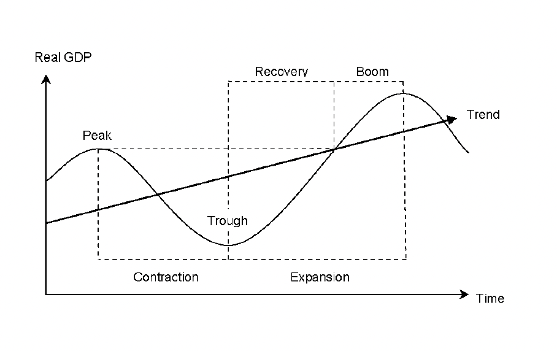{#fig-business-cycle}

The **multiplicative model** replaces sums with products, $X_t = M_t \times S_t \times \varepsilon_t$. Taking logs converts it back into an additive form,

$$
\log X_t = \log M_t + \log S_t + \log \varepsilon_t,
\qquad m_t = \log M_t,\; s_t = \log S_t,\; \text{(noise term in logs)},
$$

which is why working in logs is the default choice for macro series that grow multiplicatively (@sec-ts-logs).

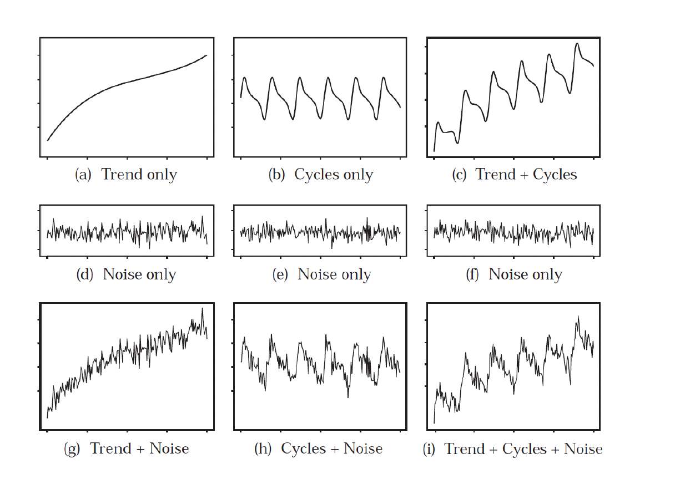{#fig-classical-decomposition}

## Dependence and the autocorrelation function {#sec-ts-acf}

The defining feature of a trajectory $(x_1, \ldots, x_T)$ drawn from a stochastic process is the **non-independence** of $(X_1, \ldots, X_T)$: the "i" of the usual i.i.d. hypothesis no longer holds. The standard tool for measuring this dependence is linear correlation across time, i.e. the **autocorrelation function (ACF)**.

::: {.callout-note title="Definition: autocovariance and autocorrelation"}
Let $(X_t)_{t \in \mathbb{Z}}$ be a second-order process ($E(X_t^2) < \infty$) with constant mean $E(X_t) = m$ and a covariance structure that is stationary (formal definition in @sec-stationarity). For any lag $k$:

**(i) Auto-covariance function (ACVF)**
$$
\gamma(k) = \mathrm{cov}(X_t, X_{t+k}) = E\big[(X_t - m)(X_{t+k} - m)\big].
$$ {#eq-acvf}

**(ii) Auto-correlation function (ACF)**
$$
\rho(k) = \frac{\gamma(k)}{\sigma_{X_t}\,\sigma_{X_{t+k}}}.
$$ {#eq-acf}
:::

Under covariance stationarity (@sec-stationarity), $\gamma(k)$ depends only on the lag $k$, not on $t$ itself - this is what makes the ACF a well-defined function of $k$ alone rather than of $(t, k)$.

### Estimating the ACF from a finite sample

With a single finite trajectory, the theoretical moments above must be estimated. The mean is estimated by the sample mean,

$$
\hat m = \bar X_T = \frac{1}{T}\sum_{t=1}^T X_t,
$$

and the autocovariance at lag $k$ ($0 \le k < T$) by the **empirical autocovariance function**

$$
\hat \gamma(k) = \frac{1}{T} \sum_{t=1}^{T-k} (X_t - \bar X_T)(X_{t+k} - \bar X_T).
$$ {#eq-empirical-acvf}

The divisor $1/T$ (the Bartlett estimator) guarantees that the sample ACVF matrix is positive semi-definite; the unbiased alternative divides by $1/(T-k)$ instead. Both are consistent estimators, but this course uses $1/T$ throughout - the same convention as R's `acf()`.

The **empirical autocorrelation function** is then

$$
\hat \rho(k) = \frac{\hat \gamma(k)}{\hat \sigma_{X_t}\hat \sigma_{X_{t+k}}}.
$$ {#eq-empirical-acf}

Under stationarity, $\sigma_{X_t} = \sigma_{X_{t+k}} = \sqrt{\gamma(0)}$ for every $t, k$, so this simplifies to $\hat \rho(k) = \hat\gamma(k) / \hat\gamma(0)$.

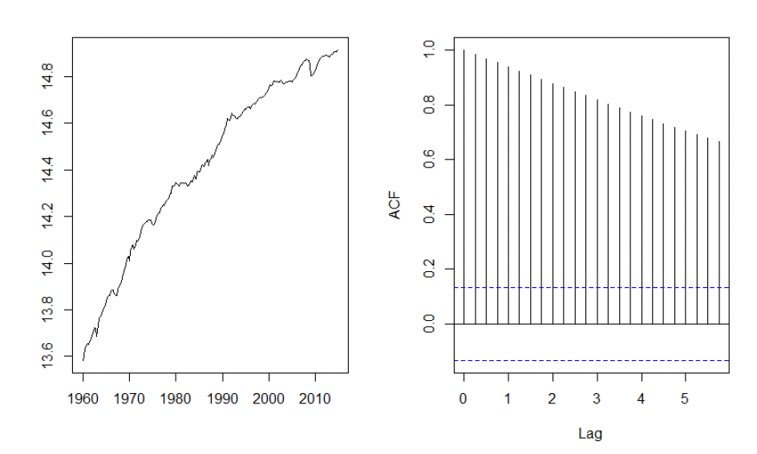{#fig-german-gdp-acf}

## Stationarity {#sec-stationarity}

Non-independence across $(X_t)$ raises an immediate question: if the variables are dependent, can they still be identically distributed? Since only *one* trajectory of $(X_t)_{t \in \mathbb{Z}}$ is ever observed - one realization of nature - statistics on that single path is only possible if the process satisfies some regularity across time. That regularity is **stationarity**.

### Strong and weak stationarity

::: {.callout-note title="Definition: strong stationarity"}
A process $(X_t)_{t \in \mathbb{Z}}$ is **strongly stationary** if, for all $t_1, \ldots, t_n \in \mathbb{Z}$, all $k \in \mathbb{Z}$, and all $n = 1, 2, \ldots$, the distribution of $(X_{t_1}, \ldots, X_{t_n})$ equals the distribution of $(X_{t_1+k}, \ldots, X_{t_n+k})$ - i.e. all finite-dimensional distributions are time-invariant.
:::

::: {.callout-note title="Definition: weak stationarity"}
A second-order process $(X_t)_{t \in \mathbb{Z}}$ is **weakly stationary** if

(i) the mean is constant over time: $\forall t \in \mathbb{Z},\ E(X_t) = \mu$;
(ii) the covariance depends only on the lag: $\forall t, k \in \mathbb{Z},\ \gamma(k) = \mathrm{Cov}(X_t, X_{t+k})$ depends only on $k$.
:::

A weakly stationary process is also called *second-order*, *covariance*, or simply *stationary*. Because its mean is constant, it can be estimated by the empirical mean $\bar X_T$, and the process can be centered by subtracting it: $X_t - \bar X_T$.

::: {.callout-important title="Strong vs. weak stationarity"}
Strong stationarity implies weak stationarity, but the converse does not hold in general. The **Gaussian process** is an important exception, for which the two notions coincide.
:::

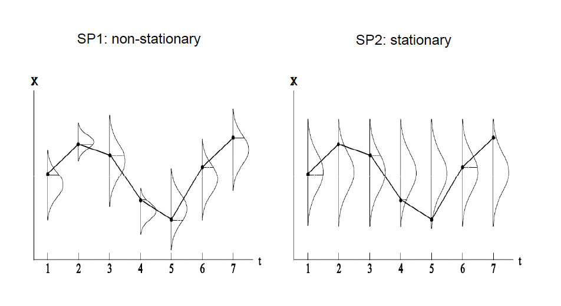{#fig-stationary-illustration}

### Two benchmark examples

::: {.callout-note title="Example: white noise"}
$(X_t)_{t \in \mathbb{Z}}$ is a **white noise**, written $X_t \sim WN(0, \sigma^2)$, if

$$
\forall t,\ E(X_t) = 0, \qquad \forall t,\ \mathbb{V}(X_t) = \sigma^2, \qquad \forall t \ne s,\ \mathrm{Cov}(X_t, X_s) = 0.
$$

White noises are often denoted $(\varepsilon_t)_{t \in \mathbb{Z}}$.
:::

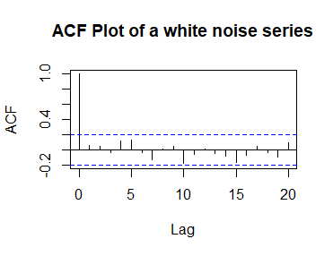{#fig-white-noise-acf}

::: {.callout-warning title="Example: the random walk is not stationary"}
If $\varepsilon_t \sim WN(0, \sigma^2)$, $\mathrm{Cov}(\varepsilon_t, X_0) = 0$, and

$$
X_t = \mu + X_{t-1} + \varepsilon_t, \qquad t > 0,
$$ {#eq-random-walk}

then $(X_t)$ is a **random walk** - with drift if $\mu \ne 0$, without drift if $\mu = 0$. In both cases it is non-stationary, since

$$
X_t = X_0 + \mu t + \sum_{s=1}^{t} \varepsilon_s,
\qquad
\mathbb{V}(X_t) = \mathbb{V}(X_0) + t\sigma^2.
$$

If $\mu = 0$, $(X_t)$ is stationary in expectation but not in variance. If $\mu \ne 0$, $E(X_t) = E(X_0) + \mu t$ and $\mathbb{V}(X_t) = t\sigma^2$. This is fundamentally different from a process that is **stationary around a deterministic trend**, $X_t = a + bt + Y_t$ with $(Y_t)$ stationary - the distinction developed in @sec-ts-transformations.
:::

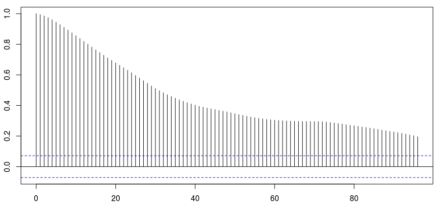{#fig-random-walk-acf}

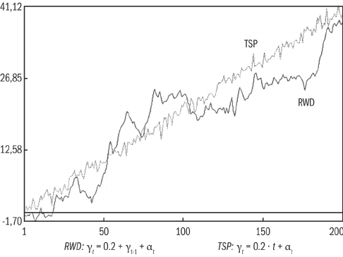{#fig-random-walk-drift-trend}

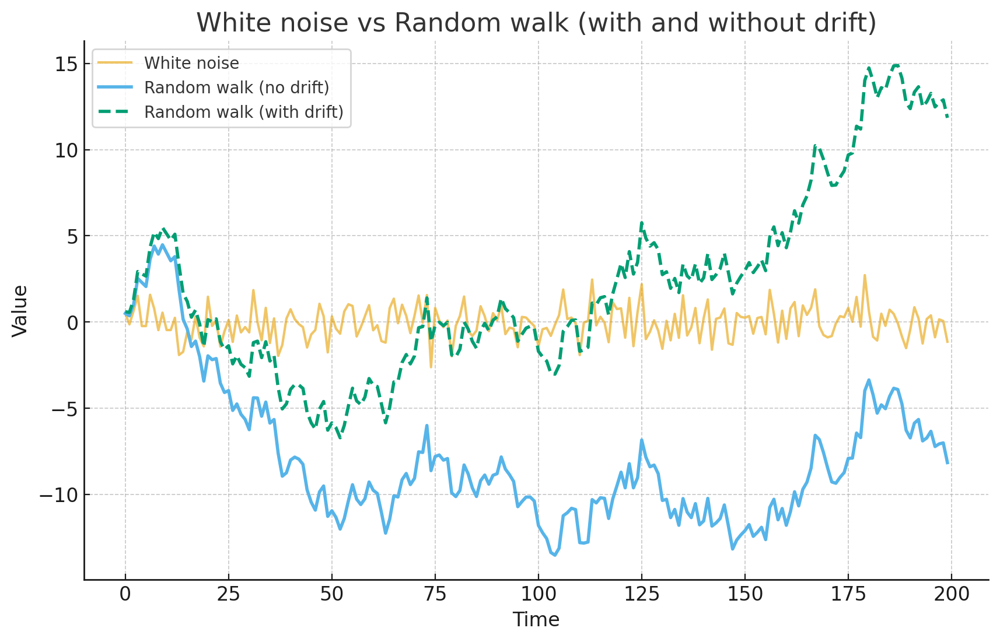{#fig-wn-rw-comparison}

::: {.callout-tip title="Why a random walk does not converge, even with mean-zero shocks"}
For the AR(1) with unit root $\phi = 1$, $X_t = X_{t-1} + \varepsilon_t = X_0 + \sum_{j=1}^t \varepsilon_j$. Even though $E[\varepsilon_t] = 0$ (so $E[X_t] = E[X_0]$, with no drift in mean) and $\tfrac{1}{t}\sum_{j=1}^t \varepsilon_j \xrightarrow{p} 0$ by the law of large numbers, the *level* $\sum_{j=1}^t \varepsilon_j$ is $O_p(\sqrt t)$: fluctuations accumulate even as their average vanishes. This is the "drunkard's walk" intuition - each step is centered on zero, but the position wanders without bound because $\mathrm{Var}(X_t) = t\sigma^2$ grows without bound.
:::

### Why stationarity matters {#sec-why-stationarity}

Stationarity is not a technical nicety; it is what makes inference from a single observed path meaningful at all:

- **Ergodicity / identification from one path.** With time-invariant moments, sample averages from a *single* trajectory can consistently estimate population moments.
- **Valid inference.** LLN/CLT-type results require that mean, variance, and covariances do not drift, so that e.g. $Z'Z/T \to Q$ - the condition under which OLS/MLE are consistent and asymptotically normal.
- **Stable dependence.** A fixed ACF/PACF makes the structure of persistence time-invariant; combined with Wold's theorem (@sec-wold), this motivates linear representations with innovations - AR, MA, ARMA models, developed in the next chapter.
- **Forecastability.** If parameters and shock variances are constant over time, models estimated on the past remain informative about the future.
- **In practice**, if the data are not stationary, the working series is *transformed* - logged, detrended, differenced - until it is (@sec-ts-transformations).

Stationarity is a modeling assumption that underlies inference beyond time-series analysis narrowly defined: without it there is no constant $E(X_t)$ to estimate, no stable parameter to report, and no valid distribution to attach to an estimator. Consider a simple time-series regression,

$$
y_t = a + b x_t + c x_{t-1} + \varepsilon_t = z_t' \beta + \varepsilon_t, \qquad \varepsilon_t \sim WN(0, \sigma^2),
$$

or, in matrix form, $y = Z\beta + \varepsilon$. Asymptotic results (LLN, CLT) require $Z'Z/T \xrightarrow{P} Q$ for some fixed $Q$. Here

$$
\frac{Z'Z}{T} =
\begin{pmatrix}
\frac{1}{T}\sum x_t^2 & \frac{1}{T}\sum x_t x_{t-1} \\
\frac{1}{T}\sum x_t x_{t-1} & \frac{1}{T}\sum x_{t-1}^2
\end{pmatrix},
$$

and this converges in probability to a fixed limit by the LLN precisely when $(x_t)$ is stationary.

::: {.callout-important title="Stationarity vs. ergodicity"}
Weak stationarity fixes $E(X_t) = \mu$, $\mathrm{Var}(X_t) = \sigma^2$, and $\mathrm{Cov}(X_t, X_{t-h}) = \gamma(h)$ across time. **Ergodicity** is the separate property that time averages reproduce ensemble averages, $\frac{1}{T}\sum_{t=1}^T X_t \xrightarrow{a.s.} E[X_t]$.

Ergodicity is defined *within* the class of stationary processes - it is not implied by stationarity alone.[^ergodic-counterexample] Stationarity plus **weak dependence** (mixing, or $\sum_h |\gamma(h)| < \infty$) does imply ergodicity, and ergodicity in turn guarantees consistency of empirical moments, $\bar X_T \xrightarrow{P} \mu$, $\hat\gamma(h) \xrightarrow{P} \gamma(h)$, $\hat\rho(h) \xrightarrow{P} \rho(h)$. In a regression $y_t = z_t'\beta + \varepsilon_t$, ergodicity of $(z_t)$ and $(\varepsilon_t)$ gives $\frac{Z'\varepsilon}{T}\xrightarrow{P} 0$ alongside $\frac{Z'Z}{T}\xrightarrow{P} Q$, so that OLS is consistent. In short: we *assume* stationarity and *require* ergodicity so that inference from one observed path is valid as $T \to \infty$.
:::

[^ergodic-counterexample]: Counter-example: let $Z \sim \mathrm{Bernoulli}(1/2)$ be drawn once and fixed, and set $X_t = Z$ for all $t$. This process is stationary ($E[X_t] = 1/2$, $\gamma(h) = 1/4$ for all $h$), yet its time average equals $Z \ne 1/2$ almost surely: stationary but not ergodic.

### Moments of a stationary process

If $(X_t)_{t \in \mathbb{Z}}$ is stationary, the autocovariance function is **even**, $\gamma(h) = \gamma(-h)$ for all $h$, and

$$
\mathrm{Corr}(X_t, X_{t-h}) = \frac{\mathrm{Cov}(X_t, X_{t-h})}{\sqrt{\mathbb{V}(X_t)\mathbb{V}(X_{t-h})}} = \frac{\gamma(h)}{\gamma(0)} =: \rho(h),
$$

with $|\rho(h)| \le 1$ for all $h$, $\rho$ even, and the graph of $\rho$ for $h \ge 0$ called the **autocorrelogram**.

The corresponding empirical moments are the sample mean $\hat m = \bar X_T$, the sample variance $\hat\gamma(0) = \frac{1}{T}\sum_{t=1}^T (X_t - \bar X_T)^2$, the sample autocovariance of order $h$,

$$
\hat \gamma(h) = \frac{1}{T} \sum_{t=h+1}^T (X_t - \bar X_T)(X_{t-h} - \bar X_T)
$$

- which should not be estimated at lags $h$ too large relative to $T$ - and the sample autocorrelation $\hat\rho(h) = \hat\gamma(h)/\hat\gamma(0)$.

When $(X_t)$ is stationary, all of these estimators are consistent as $T \to \infty$: $\hat m \xrightarrow{P} m$, $\hat\gamma(h) \xrightarrow{P} \gamma(h)$, $\hat\rho(h) \xrightarrow{P} \rho(h)$. The sample mean is moreover asymptotically Gaussian,

$$
\sqrt{T}(\hat m - m) \xrightarrow{d} \mathcal{N}\!\left(0, \sum_{h \in \mathbb{Z}} \gamma(h)\right),
$$

where $\sum_{h \in \mathbb{Z}} \gamma(h)$ is the process's **long-run variance**.

## Diagnosing nonstationarity {#sec-unit-root-tests}

Nonstationarity can arise from several distinct sources, and distinguishing between them matters for how the series should be transformed:

- **Deterministic trends**: predictable changes in mean, $X_t = a + bt + Y_t$ with $Y_t$ stationary - e.g. long-run GDP growth.
- **Seasonality**: $E(X_t)$ changes periodically; typically removed by seasonal differencing, $X_t - X_{t-S}$.
- **Stochastic trends**: accumulation of random shocks, $X_t = X_{t-1} + \varepsilon_t$ - e.g. asset prices, productivity innovations.
- **Structural breaks**: discrete changes in mean, variance (heteroskedasticity), or dynamics (regime-dependence).

::: {.callout-warning title="A cautionary example: the Great Moderation"}
The mid-1980s decline in U.S. macroeconomic volatility (the "Great Moderation") is often attributed to changes in monetary policy or inventory behavior. Romer [-@Romer1986] argues this reading is largely an artifact of how the data were constructed and measured, not a genuine change in the underlying process - a reminder that visual and even formal diagnostics of nonstationarity are only as good as the data feeding them. Tools for this diagnosis include visual inspection, the ACF, and formal unit-root tests (ADF, KPSS, and others, below).
:::

### Trend-stationary vs. difference-stationary processes

The key practical distinction is between:

$$
\text{Trend-stationary (TS):} \quad X_t = a + bt + Y_t, \quad Y_t \text{ stationary},
$$

where removing the deterministic trend $a + bt$ leaves a stationary residual, and

$$
\text{Difference-stationary (DS):} \quad X_t = X_{t-1} + \varepsilon_t, \quad \Delta X_t = \varepsilon_t \text{ stationary},
$$

a stochastic trend (unit root), where *differencing* rather than detrending yields a stationary process. The economic interpretation differs sharply: in a TS process shocks are **transitory** and the series reverts to its deterministic trend; in a DS process shocks are **permanent** and shift the level forever. Consequently the two require different stationarizing transformations (detrending vs. differencing), and testing for a unit root is how one decides which applies.

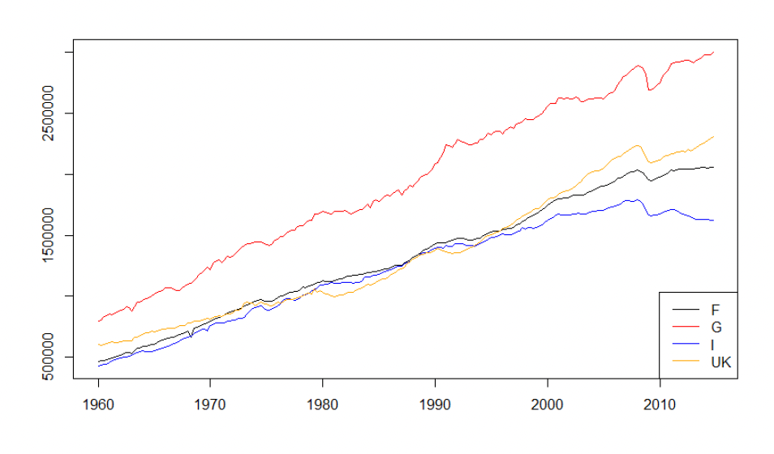{#fig-european-gdp-levels}

### Unit-root and structural-break tests

Formally, the question is whether nonstationarity stems from a **stochastic trend** (unit root - does the series tend to return to a fixed mean/trend after a shock?) or a **deterministic trend** (drift/linear trend - do shocks accumulate permanently?). The choice of a constant vs. a constant-plus-trend in the test equation should match the data pattern: a series fluctuating around a fixed mean needs only a constant; one growing/declining linearly needs a trend as well.

::: {.callout-note title="Unit-root tests"}
1. **ADF (Augmented Dickey-Fuller).** Classical regression-based test,
   $$
   \Delta X_t = \alpha + \beta t + (\phi - 1) X_{t-1} + \sum_{i=1}^{p}\delta_i \Delta X_{t-i} + \varepsilon_t,
   $$
   with $H_0$: unit root ($(\phi-1)=0$, nonstationary) against $H_1$: stationary ($(\phi-1)<0$).
2. **PP (Phillips-Perron).** Same null as ADF, with a nonparametric correction for serial correlation via the long-run variance instead of augmenting lags.
3. **DF-GLS (Elliott-Rothenberg-Stock).** A more powerful variant that detrends the series first, then applies the DF test.
4. **KPSS (Kwiatkowski-Phillips-Schmidt-Shin).** The *opposite* null: $H_0$ is stationarity (around a mean or a trend), $H_1$ is a unit root.

**Rule of thumb:** rejecting ADF/PP/DF-GLS points to stationarity; rejecting KPSS points to nonstationarity. Combining ADF and KPSS gives a more robust diagnosis than either alone.
:::

::: {.callout-warning title="Unit-root tests have near-zero power against structural breaks"}
ADF, PP, and KPSS systematically conclude "unit root" when the series is actually **stationary around a shifted mean or a broken trend** - a critical caveat for applied work. Three tests address this directly:

1. **Chow [-@Chow1960].** Requires a *known* break date $T_b$; splits the sample and tests equality of regression coefficients across sub-samples via an $F$-statistic.
2. **Perron [-@Perron1989].** Also requires a known $T_b$; a modified ADF including a shift dummy (level or trend), with $H_0$: unit root with break vs. $H_1$: stationary with break - avoiding Chow's confounding of a mean/trend shift with a stochastic trend.
3. **Zivot-Andrews [-@ZivotAndrews1992].** Handles an *unknown* $T_b$ by running a Perron-type ADF at every candidate break date and selecting $T_b$ as the date that minimizes the unit-root $t$-statistic; critical values are adjusted for this data-mining.[^bai-perron]

**Practical rule:** inspect the series visually for level shifts or trend changes (crises, policy regime changes, wars); if a break is suspected, apply Zivot-Andrews *before* concluding the series is $I(1)$ - it may appear integrated purely because of an unmodeled break.
:::

[^bai-perron]: Bai and Perron [-@BaiPerron1998] extend this to *multiple* unknown breaks.

![Structural break vs. stochastic trend, illustrated with a Perron-type ADF test with a known break date. Left: a genuine deterministic break at $T_b = 85$ (test statistic $-5.751$ against a 5% critical value of about $-5.08$) - the unit-root null is rejected, so the series is trend-stationary around a broken deterministic trend. Right: a genuine stochastic trend, with a candidate break at $T_b = 75$ (test statistic $-3.320$, not below the critical value) - the unit-root null is not rejected, so the apparent break does not remove the stochastic trend. A deterministic break can mimic a unit root, and a genuine stochastic trend can mimic a break.](../figures/ts/structural-break-vs-stochastic-trend.png){#fig-structural-break}

## Achieving stationarity: transformations and filtering {#sec-ts-transformations}

Once nonstationarity is detected, four transformations are used, alone or in combination, to stabilize a series:

1. **Logarithm** - removes exponential growth and stabilizes variance.
2. **Detrending (OLS)** - removes deterministic trend components.
3. **Differencing** - removes stochastic trends (unit roots).
4. **Filtering** - removes specific frequency bands (e.g. HP, BK, CF filters).

The corresponding empirical workflow is: (i) visual inspection to guess the type of trend; (ii) unit-root tests; (iii) apply the appropriate transformation; (iv) test the residual for stationarity (ACF tail decay, formal tests).

### Removing seasonality

Two approaches address a recurring seasonal pattern $s_t$, so that the residual series has constant mean and time-invariant covariance:

::: {.callout-note title="(a) Deterministic seasonality - regression on seasonal dummies"}
Assuming a fixed, repeating seasonal pattern,
$$
X_t = \alpha + \sum_{m=1}^{S-1}\beta_m D_{m,t} + u_t, \qquad D_{m,t} = 1 \text{ if period } m,\ 0 \text{ otherwise},
$$
the fitted part $\hat\alpha + \sum \hat\beta_m D_{m,t}$ captures seasonality, and the deseasonalized series is $X_t^* = X_t - (\hat\alpha + \sum_{m=1}^{S-1}\hat\beta_m D_{m,t})$. This works well when the seasonal pattern is stable over time.
:::

::: {.callout-note title="(b) Stochastic or time-varying seasonality - seasonal differencing"}
If the seasonal effect's strength changes slowly, $\Delta_S X_t = X_t - X_{t-S}$ removes it directly - e.g. $\Delta_{12}X_t$ for monthly data removes yearly periodicity. Since $E[X_t - X_{t-S}] = s_t - s_{t-S} = 0$, the mean becomes constant. This is the standard approach in SARIMA models, and it preserves short-run dynamics.
:::

### First transformation: the logarithm {#sec-ts-logs}

Taking $\log(x_t)$ **stabilizes variance** when volatility is level-dependent: many macro series grow roughly exponentially, so their variance grows with their level, and logs turn exponential growth into approximately linear growth (multiplicative changes become additive), making fluctuations more homoscedastic and models better-behaved. It also aids **interpretability**, since log-differences approximate percentage growth rates (made precise below).

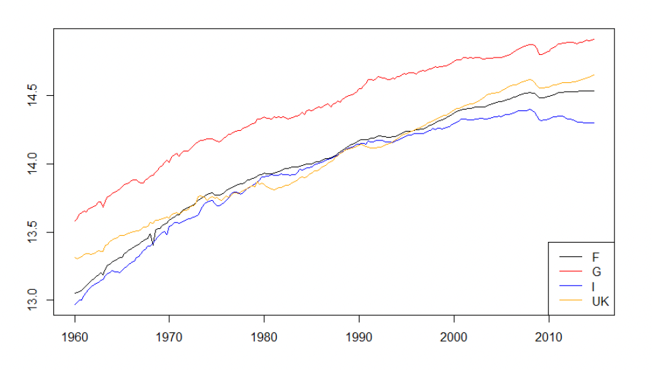{#fig-european-gdp-log}

### Second transformation: deviations from a deterministic trend

The idea is to remove the deterministic trend of $\log(x_t)$, estimated by OLS - linearly,
$$
x_t^{*} = \log(x_t) - \hat{\beta}_0 - \hat{\beta}_1 t,
$$
or quadratically,
$$
x_t^{*} = \log(x_t) - \hat{\beta}_0 - \hat{\beta}_1 t - \hat{\beta}_2 t^2.
$$

For German GDP, the two fits give:

| Trend | $\hat{\beta}_0$ | $\hat{\beta}_1$ | $\hat{\beta}_2$ |
|-|-:|-:|-:|
| Linear | 13.78 | 0.005 | - |
| Quadratic | 13.62 | 0.010 | −0.00002 |

: OLS trend estimates, log German GDP {#tbl-german-gdp-trend}

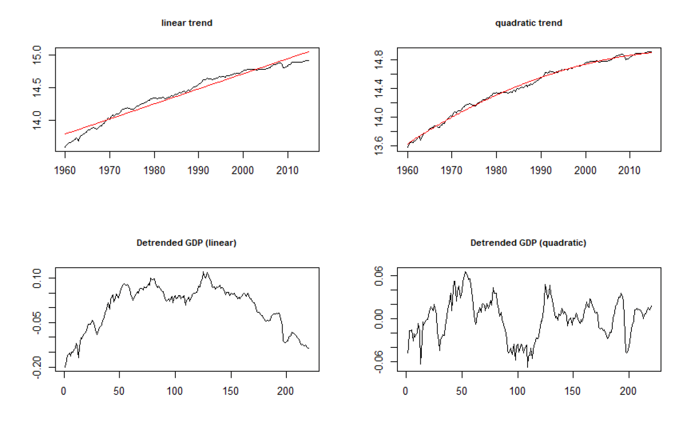{#fig-german-gdp-detrended}

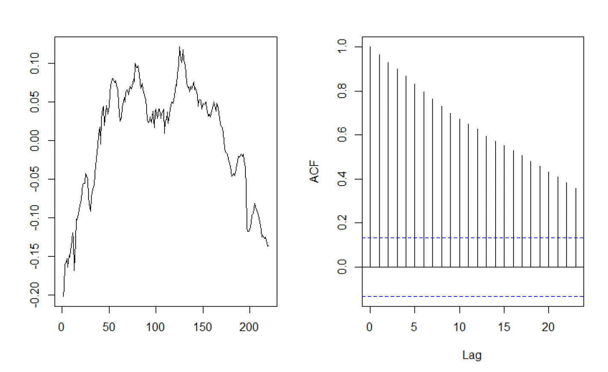{#fig-german-gdp-detrended-acf-linear}

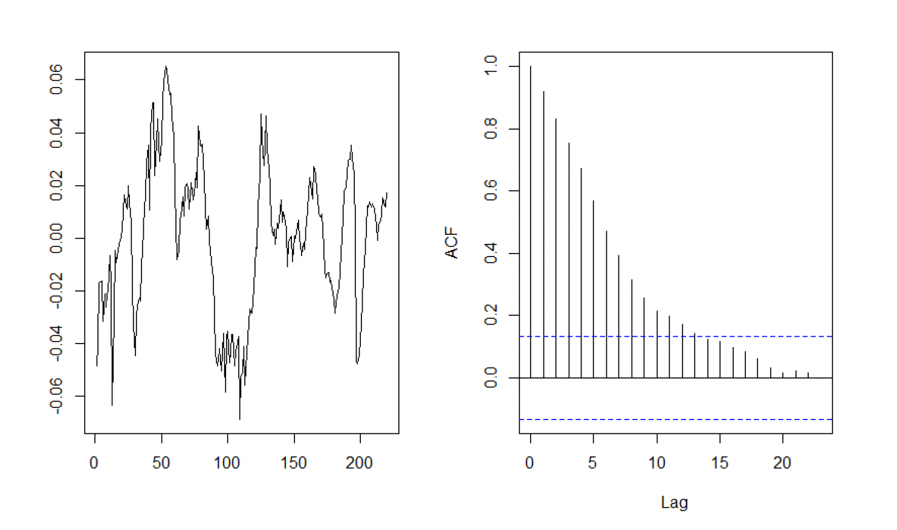{#fig-german-gdp-detrended-acf-quadratic}

### Third transformation: first differences

If instead the series has a unit root, **first differences of the logarithm** approximate the growth rate:

$$
\Delta \log(x_t) = \log(x_t) - \log(x_{t-1}) \approx \frac{x_t - x_{t-1}}{x_{t-1}}.
$$ {#eq-log-diff-growth}

To see why, write

$$
\Delta \log(x_t) = \log x_t - \log x_{t-1} = \log \frac{x_t}{x_{t-1}}
= \log\!\left(\frac{x_t - x_{t-1}}{x_{t-1}} + 1\right),
$$

and use $\log(1+\epsilon) \approx \epsilon$ for small relative changes $\epsilon$ to recover @eq-log-diff-growth.

### Centering vs. differencing

It is worth being precise about what each transformation does to the mean, since the two are easy to conflate:

**Trend-stationary**, $X_t = a + bt + Y_t$ with $E[Y_t] = 0$, $Y_t \sim I(0)$: *detrending* gives $Y_t$, stationary and centered on 0; *differencing* gives $\Delta X_t = b + \Delta Y_t$ with $E[\Delta X_t] = b$ - **not** centered (unless $b=0$), since GDP growth is centered above zero precisely because there is long-run growth in levels.

**Difference-stationary (random walk) with drift $\mu$**, $X_t = \mu + X_{t-1} + \varepsilon_t$: *differencing* gives $\Delta X_t = \mu + \varepsilon_t$, stationary but not centered unless $\mu = 0$; without drift, $\Delta X_t = \varepsilon_t$ is centered on 0.

In short: for a TS series, detrending centers on 0 while differencing leaves mean $b$; for a DS (random-walk) series, differencing leaves mean $\mu$ (often $>0$ in macro data), centered only if $\mu = 0$.

::: {.callout-important title="Rule of thumb"}
$$
\begin{cases}
x_t^* = x_t - \hat a - \hat b\, t & \Rightarrow \text{trend-stationary (TS)} \\[4pt]
\Delta x_t = x_t - x_{t-1} & \Rightarrow \text{difference-stationary (DS)}
\end{cases}
$$

A stationary series is said to be **integrated of order 0**, $I(0)$; a series requiring one difference is $I(1)$; a series requiring $d$ differences is $I(d)$.
:::

### From detrending to filtering

Detrending removes deterministic growth to obtain stationarity. **Filtering** instead separates movements by frequency, for business-cycle extraction. The underlying idea is that a series decomposes into components at different frequencies,

$$
X_t = T_t + C_t + \varepsilon_t,
$$

with $T_t$ the slow, low-frequency long-run trend, $C_t$ the medium-frequency business cycle, and $\varepsilon_t$ high-frequency noise. Which component to remove depends on the question: forecasting calls for removing the nonstationary trend; cyclical analysis calls for removing both the high- and low-frequency components. But **what counts as "trend" and what counts as "business cycle" is not given by the data** - it is an assumption built into the choice of filter.

::: {.callout-note title="Main filtering methods"}
**Hodrick-Prescott (HP) filter.** Penalizes variability in the trend,
$$
\min_T \sum_t (X_t - T_t)^2 + \lambda \sum_t (\Delta^2 T_t)^2,
$$
with $\lambda$ controlling smoothness ($\lambda = 1600$ for quarterly data), giving $X_t = T_t + C_t$ with $C_t$ stationary.

**Baxter-King (BK) filter.** A band-pass filter isolating cycles of 6-32 quarters, implemented as a symmetric moving average - which introduces edge loss, and suppresses genuine cyclicality if the endogenous dynamics actually operate beyond 32 quarters (e.g. medium-run capacity utilization, or longer financial cycles in credit volumes and leverage, à la Borio at the BIS).

**Christiano-Fitzgerald (CF) filter.** Similar band-pass logic to BK, optimized for finite samples, with less edge distortion.
:::

::: {.callout-warning title="Detrending and filtering are not neutral"}
The HP filter can mistake a long slump for a fall in potential output, pulling the estimated "trend" down until the economy appears to be back at full employment. In the Great Depression, this misreads a sustained demand shortfall as lower potential output - the filter absorbs the depression into the trend, erasing genuine cyclical slack (Hamilton [-@Hamilton2018], "Why You Should Never Use the Hodrick-Prescott Filter"). Detrending methods are usually discretionary and parametric, with a direct impact on what counts as trend versus cycle.
:::

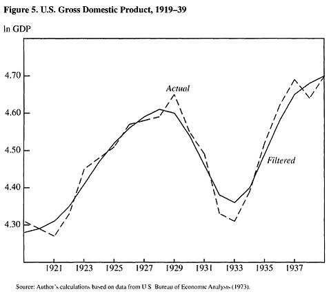{#fig-hp-filter-critique}

<!-- REVIEW: possible substantive issue in original slides: the frame "My work" (source: 09-time-series lecture, "Are Cycles Cyclical?") presents ongoing, unpublished research on frequency-domain separation of macro-financial cycles, illustrated by @fig-nfci-leverage-spectrum below. This is explicitly framed as the instructor's current work rather than an established textbook result; kept here as personal/illustrative research context rather than a citable finding. -->

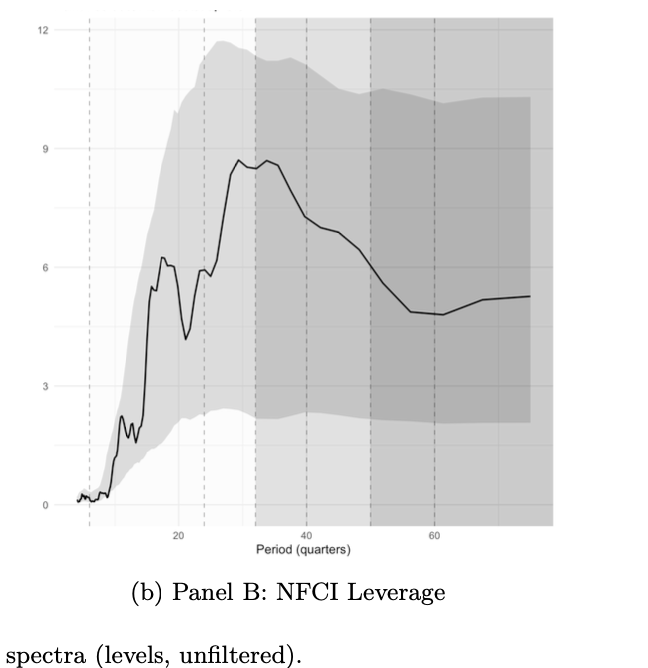{#fig-nfci-leverage-spectrum}

### Summary of transformations

Log-transforming stabilizes variance; detrending removes deterministic growth; differencing removes stochastic trends. But filtering is never neutral - it defines what counts as "trend" and what counts as "cycle," and misuse can distort macroeconomic interpretation.

## From stationarity to prediction: the Wold decomposition {#sec-wold}

::: {.callout-important title="Wold decomposition theorem"}
Any zero-mean, weakly stationary process $\{X_t\}$ can be written as
$$
X_t = X_t^{(d)} + X_t^{(s)}, \qquad X_t^{(s)} = \sum_{j=0}^{\infty} \psi_j \varepsilon_{t-j},
$$ {#eq-wold}
where $X_t^{(d)}$ is a **deterministic** (perfectly linearly predictable) component and $X_t^{(s)}$ is the **purely nondeterministic** (stochastic) component, driven by uncorrelated innovations $\varepsilon_t \sim WN(0, \sigma^2)$ with $\sum_j \psi_j^2 < \infty$.
:::

The Wold representation describes the *best linear predictor* of $X_t$ from its own past, and it guarantees that any stationary process can be approximated, in mean-square sense, by a linear process - which is exactly what motivates using linear **AR, MA, and ARMA models**, the subject of the next chapter. Wold's theorem does *not* imply that all stationary processes are truly linear (e.g. GARCH processes, or nonlinear Markov chains); only that their second-order structure is linearizable, and thus admits a linear representation.

This has a direct implication for prediction: stationarity ensures that all unconditional moments of $X_{T+h}$, for any horizon $h > 0$, can be estimated from $(X_1, \ldots, X_T)$. A first, simple non-conditional predictor is the sample mean, $\hat X_{T+h} = \bar X_T = \frac{1}{T}\sum_{t=1}^T X_t$ - but this naive predictor is *constant* across all horizons $h$, ignoring any dynamics in the series (@fig-naive-forecast). Capturing those dynamics is exactly what dynamic linear models (AR, MA, ARMA) are for.

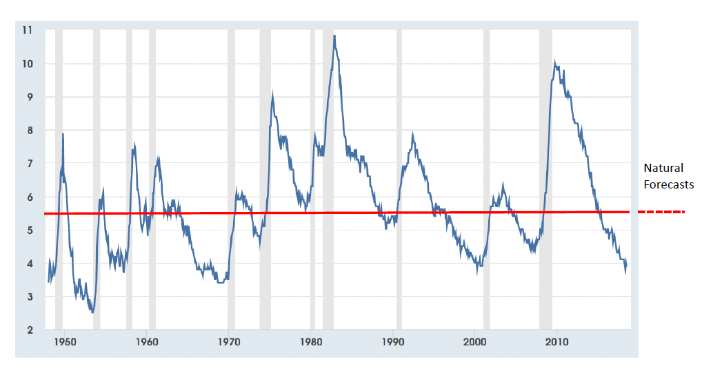{#fig-naive-forecast}

### A historical note on stationarity and linearity

Up to the end of the 1970s, time-series analysis largely assumed a stationary, linear setup. Nelson and Plosser [-@NelsonPlosser1982] applied Dickey-Fuller tests and showed that most macroeconomic and financial time series are in fact non-stationary, which meant that statistical inference built on an assumption of stationarity was invalid for these series. More recently, linearity tests and new model classes have emerged - structural-change and threshold models, stochastic-volatility models - motivated in part by the observation that prices, interest rates, and other financial series are often nonlinear. The nonstationarity issue is now widely acknowledged, but it is still frequently addressed within an otherwise linear, univariate framework; nonlinear models are the subject of a later chapter.

## Summary

A time series is one observed realization of a stochastic process, so its dependence structure requires assumptions on stability before any statistics can be done on it. **Stationarity** - constant mean, variance, and covariance - is necessary for estimation, inference, and forecasting.

Nonstationarity may stem from deterministic trends, stochastic trends (unit roots), seasonality, or structural breaks. To achieve stationarity: take logs to stabilize variance; check the ACF visually and test formally for unit roots; then detrend to remove a deterministic trend, difference to remove a stochastic trend, or filter to separate frequency components (trend vs. cycle) - keeping in mind that filtering is never neutral, since the choice of filter defines what counts as trend and what counts as cycle.

Once a series is stationary, Wold's theorem guarantees it can be represented as a linear combination of past shocks - the foundation for the AR, MA, and ARMA models developed next.

## Further reading

Hamilton [-@Hamilton1994], Lütkepohl [-@Lutkepohl2005], and Brockwell and Davis [-@BrockwellDavis2002; -@BrockwellDavis2006] cover time-series analysis in depth, though - as emphasized in the source lectures - none of them alone covers this course's full scope, nor shows how time series methods are used to estimate structural macroeconomic models.
