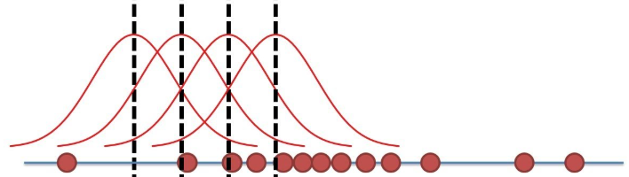
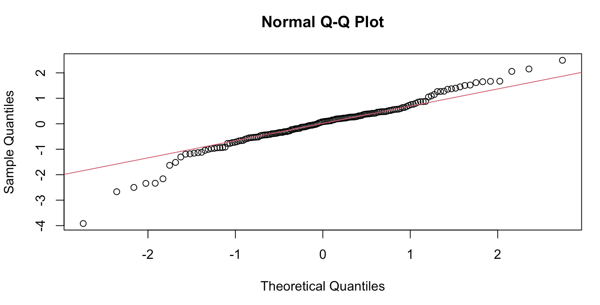

# AR, MA, and ARMA Processes {#sec-arma}

The previous chapter established when a series can be treated as stationary, and why that matters for inference. This chapter turns to modeling the dynamics of a stationary, univariate series: forecasting it, and eventually simulating the impact of a shock on it. Once we move to several series at once, next chapter's vector autoregressions (VAR) build directly on the univariate machinery developed here.

## From stationarity to dynamic models

Recall the Wold decomposition (@sec-wold): any weakly stationary process can be written as a deterministic part plus an infinite moving average of past shocks,

$$
X_t = \mu + \sum_{j=0}^{\infty} \psi_j \varepsilon_{t-j}, \qquad \varepsilon_t \sim WN(0, \sigma^2).
$$

Truncating or inverting this infinite representation yields the finite-order linear models this chapter is about:

$$
\text{AR}(p): \quad X_t = \mu + \phi_1 X_{t-1} + \cdots + \phi_p X_{t-p} + \varepsilon_t,
$$
$$
\text{MA}(q): \quad X_t = \mu + \varepsilon_t - \theta_1 \varepsilon_{t-1} - \cdots - \theta_q \varepsilon_{t-q},
$$
$$
\text{ARMA}(p,q): \quad \phi(L) X_t = \mu + \theta(L)\varepsilon_t.
$$ {#eq-arma-family}

::: {.callout-note title="Why represent a series this way: the Box-Jenkins approach"}
Following Wold's theorem (1938), Box and Jenkins (1970) proposed approximating the infinite Wold representation by a *finite*, parsimonious model, without assuming any structural economic relationship. Two natural truncations are available: keep past **values** of $X$ (an autoregressive, AR, model), keep past **shocks** $\varepsilon$ (a moving-average, MA, model), or combine both (ARMA). The motivation is to capture short- and medium-run persistence with few parameters, produce statistically efficient forecasts, and provide an interpretable dynamic multiplier path for shocks.
:::

### The best linear forecast

Wold's theorem guarantees the existence of a **best linear forecast (BLF)**: the linear predictor that minimizes the mean-square forecast error among all linear predictors, for any stationary process. Its defining property is that the forecast error is orthogonal to the past,

$$
\mathrm{Cov}(e_{t+h|t}, X_{t-j}) = 0, \qquad \forall j \ge 0, \qquad e_{t+h|t} = X_{t+h} - \hat X_t(h).
$$

AR, MA, and ARMA models are finite-order approximations of this BLF. The connection to the Wold representation is direct: if $X_t = \sum_{j=0}^{\infty} \psi_j \varepsilon_{t-j}$, then $\hat X_t(h) = \sum_{j=h}^{\infty} \psi_j \varepsilon_{t+h-j}$ - the Wold coefficients *are* the coefficients of the best linear forecast, simply shifted by the horizon $h$.

## Lag polynomials {#sec-lag-polynomials}

### The lag operator

The **lag operator** $L$ shifts a series one period into the past, $LX_t = X_{t-1}$, and more generally $L^k X_t = X_{t-k}$. It lets us write temporal dependence algebraically - e.g. $(1-L)X_t = X_t - X_{t-1}$ is the first-difference operator, and $(1 - \phi L)X_t = \varepsilon_t$ is an AR(1) process. Instead of writing $X_t = \phi X_{t-1} + \varepsilon_t$ explicitly, we can manipulate entire lag structures symbolically, just as with ordinary polynomials.

A **lag polynomial** of order $p$ with real coefficients $\{\psi_i\}$ is $P(L) = \sum_{i=0}^p \psi_i L^i$, applied to a process as $P(L)X_t = \sum_{i=0}^p \psi_i X_{t-i}$. In this notation, an MA($q$) process is $X_t = \mu + \theta(L)\varepsilon_t$ with $\theta(L) = 1 - \theta_1 L - \cdots - \theta_q L^q$, and an AR($p$) process is $\phi(L)X_t = \mu + \varepsilon_t$ with $\phi(L) = 1 - \phi_1 L - \cdots - \phi_p L^p$.

### Stability, invertibility, and roots {#sec-stability-invertibility}

::: {.callout-important title="Stationarity as a root condition"}
For $\phi(L) = 1 - \phi_1 L - \cdots - \phi_p L^p$, define the associated polynomial in a complex variable $z$, $\phi(z) = 1 - \phi_1 z - \cdots - \phi_p z^p$. The AR process is **stationary** if and only if all roots $z_i$ of $\phi(z) = 0$ satisfy $|z_i| > 1$ (equivalently, $|\lambda_i| < 1$ for $\lambda_i = 1/z_i$). If any $|z_i| = 1$, the process has a **unit root** (a random walk, a stochastic trend, as in @sec-unit-root-tests); if some $|z_i| < 1$, it is **explosive**. The mirror-image condition on $\theta(z)$ governs **invertibility** on the MA side (@sec-ma).
:::

When all $|\lambda_i| < 1$, the AR polynomial can be inverted:

$$
\phi(L)^{-1} = (1 - \phi_1 L - \cdots - \phi_p L^p)^{-1} = \sum_{k=0}^{\infty} a_k L^k,
\qquad a_k = \phi_1 a_{k-1} + \cdots + \phi_p a_{k-p},\ a_0 = 1,
$$ {#eq-ar-inversion}

so that any AR($p$) admits an **MA($\infty$) representation**, $X_t = \sum_{k=0}^{\infty} a_k \varepsilon_{t-k}$, with $\sum_k |a_k| < \infty$ whenever all $|\lambda_i| < 1$. Intuitively: the AR polynomial governs how past values feed into the present; if all feedback roots lie outside the unit circle, the inverse polynomial converges, past effects die out, and the system "forgets" its history.

::: {.callout-tip title="Example: the AR(1) case, worked through the roots"}
For $X_t = \lambda X_{t-1} + \varepsilon_t$, i.e. $(1-\lambda L)X_t = \varepsilon_t$: if $|\lambda| < 1$, shocks die out exponentially and the process is stationary and mean-reverting; if $|\lambda| = 1$, shocks accumulate into a random walk (non-stationary); if $|\lambda| > 1$, shocks amplify into explosive dynamics. The lag polynomial encodes how today's $X_t$ depends on its past: if the feedback coefficients sum to less than one in magnitude, past influences fade; otherwise they persist or blow up.
:::

The inversion itself is just the familiar geometric series applied to the lag operator. Recall $\frac{1}{1-\lambda} = \sum_{k=0}^{\infty} \lambda^k$ for $|\lambda| < 1$, since $(1-\lambda)(1 + \lambda + \lambda^2 + \cdots) = 1$; applying this to $L$ gives $(1-\lambda L)^{-1} = 1 + \lambda L + \lambda^2 L^2 + \cdots$, and hence

$$
X_t = \varepsilon_t + \lambda \varepsilon_{t-1} + \lambda^2 \varepsilon_{t-2} + \cdots = \sum_{k=0}^{\infty} \lambda^k \varepsilon_{t-k},
$$ {#eq-ar1-ma-inf}

convergent only for $|\lambda| < 1$: each shock affects future values with weight $\lambda^k$, decaying geometrically (e.g. at rate $0.8^k$ for $\lambda = 0.8$). If instead $\lambda = 1$, $X_t = X_0 + \sum_{j=1}^t \varepsilon_j$ and $\mathrm{Var}(X_t) = t\sigma^2$ grows linearly, as seen already for the random walk (@eq-random-walk); if $\lambda = 1.1$, $X_t$ explodes exponentially since $1.1^t$ diverges. The same logic extends to any AR($p$): convergence and stability require all roots $|\lambda_i| < 1$, so that the feedback coefficients in @eq-ar-inversion decay geometrically - stationarity is geometric damping of past influences.

::: {.callout-tip title="Worked example: an AR(2) process"}
For $X_t = \phi_1 X_{t-1} + \phi_2 X_{t-2} + \varepsilon_t$, with lag polynomial $\phi(L) = 1 - \phi_1 L - \phi_2 L^2$, the characteristic roots solve $\lambda^2 - \phi_1 \lambda - \phi_2 = 0$; stationarity requires $|\lambda_1| < 1$ and $|\lambda_2| < 1$. When it holds, $(1 - \phi_1 L - \phi_2 L^2)^{-1} = \sum_{k=0}^\infty a_k L^k$ with $a_k = \frac{\lambda_1^{k+1} - \lambda_2^{k+1}}{\lambda_1 - \lambda_2}$, giving $X_t = \sum_{k=0}^\infty a_k \varepsilon_{t-k}$.

Two numerical cases illustrate the possibilities:

- $\phi_1 = 1.3$, $\phi_2 = -0.4$: solving $\lambda^2 - 1.3\lambda + 0.4 = 0$ gives $\lambda_{1,2} = 0.8, 0.5$, both real and inside the unit circle - **stationary**.
- $\phi_1 = 0.7$, $\phi_2 = -0.2$: solving $\lambda^2 - 0.7\lambda + 0.2 = 0$ gives the complex conjugate pair $\lambda_{1,2} = 0.35 \pm 0.278i$, with modulus $|\lambda_i| = \sqrt{0.35^2 + 0.278^2} \approx 0.447 < 1$ - **stationary**, and complex roots inside the unit circle imply damped oscillations in the impulse response, rather than the smooth monotone decay of the real-root case.
:::

## Autoregressive processes: AR(p) {#sec-ar}

The AR($p$) process,

$$
X_t = \mu + \phi_1 X_{t-1} + \cdots + \phi_p X_{t-p} + \varepsilon_t, \qquad \varepsilon_t \sim WN(0, \sigma^2),
$$

or equivalently $\phi(L)X_t = \mu + \varepsilon_t$ with $\phi(L) = 1 - \phi_1 L - \cdots - \phi_p L^p$, has unconditional mean $E[X_t] = \mu / (1 - \sum_{i=1}^p \phi_i)$ and is stationary if and only if all roots of $\phi(z) = 0$ satisfy $|z| > 1$ (@sec-stability-invertibility). Under stationarity it admits the infinite MA representation $X_t = m + \sum_{k=0}^\infty a_k \varepsilon_{t-k}$ with $\sum_k |a_k| < \infty$.

## Moving-average processes: MA(q) {#sec-ma}

$$
X_t = \mu + \varepsilon_t - \theta_1 \varepsilon_{t-1} - \cdots - \theta_q \varepsilon_{t-q}, \qquad \varepsilon_t \sim WN(0, \sigma^2).
$$ {#eq-ma-def}

::: {.callout-warning title="Sign convention"}
This course follows the Box-Jenkins convention, $\theta(L) = 1 - \theta_1 L - \cdots - \theta_q L^q$. Some software (e.g. Stata, some R packages) instead writes $+\theta_j$ in the model, giving reported coefficients of the opposite sign. Always check the documentation of the specific implementation before reading off coefficient signs.
:::

Because each $X_t$ is a finite weighted sum of current and past shocks, with no feedback from past $X$'s, an MA($q$) is **always stationary** for any finite $q$ - even if some $\theta_i$ are large or negative, since shocks enter with finite weights and finite variance.

Stationarity is not the whole story, however. Write $\theta(z) = 1 - \theta_1 z - \cdots - \theta_q z^q$ for the associated polynomial. A **unit root** ($|z_i| = 1$ for some root) makes $\theta(L)$ non-invertible; if any $|z_i| < 1$, the process is still stationary but *not invertible* - the underlying shocks $\varepsilon_t$ cannot be recovered uniquely from the observed data.

| Property | Condition | Consequence |
|-|-|-|
| Stationarity | Always (finite $q$) | Finite-variance process |
| Invertibility | $|z_i| > 1$ for all roots | Unique MA representation |
| Unit root | Some $|z_i| = 1$ | Non-invertible, non-identifiable |

: Stationarity versus invertibility for MA($q$) {#tbl-ma-properties}

### Why invertibility matters

All finite MA($q$) processes are stationary, but identifying the shocks $\varepsilon_t$ uniquely from the data requires the additional property of **invertibility**. Given $X_t = \theta(L)\varepsilon_t$, if all roots $z_i$ of $\theta(z) = 0$ satisfy $|z_i| > 1$, the inverse polynomial admits a convergent power-series expansion,

$$
\theta(L)^{-1} = 1 + \psi_1 L + \psi_2 L^2 + \cdots,
$$

and the shocks can be recovered as a stable infinite AR of the observed data, $\varepsilon_t = X_t + \psi_1 X_{t-1} + \psi_2 X_{t-2} + \cdots = \sum_{k=0}^\infty \psi_k X_{t-k}$. Equivalently, the MA($q$) admits an AR($\infty$) representation $X_t = \sum_{k=1}^\infty \phi_k X_{t-k} + \varepsilon_t$.

If the process is **not invertible**, the series for $\theta(L)^{-1}$ diverges - not $X_t$ itself, which remains stationary - but $\varepsilon_t$ is no longer uniquely defined: many shock sequences can generate the same observed data, and inference becomes ill-posed because the likelihood function is not unique.

::: {.callout-tip title="Example: MA(1) invertibility"}
For $X_t = \varepsilon_t - \theta \varepsilon_{t-1}$: if $|\theta| < 1$, $(1-\theta L)^{-1} = 1 + \theta L + \theta^2 L^2 + \cdots$ converges, giving $\varepsilon_t = X_t + \theta X_{t-1} + \theta^2 X_{t-2} + \cdots$. If $|\theta| > 1$, this inverse diverges - but the process can be rewritten as $X_t = \tilde\varepsilon_t - \tilde\theta \tilde\varepsilon_{t-1}$ with $\tilde\theta = 1/\theta$ and $\tilde\varepsilon_t = -\theta \varepsilon_t$, restoring invertibility. In short: stationarity concerns the finiteness of $X_t$; invertibility concerns the uniqueness and convergence of the innovation representation.
:::

## ARMA(p,q) {#sec-arma-def}

Combining both parts, the ARMA($p,q$) process is

$$
\phi(L)(X_t - \mu) = \theta(L)\varepsilon_t,
\qquad \phi(L) = 1 - \phi_1 L - \cdots - \phi_p L^p,
\qquad \theta(L) = 1 - \theta_1 L - \cdots - \theta_q L^q,
$$ {#eq-arma-general}

with $\varepsilon_t \sim WN(0, \sigma^2)$. It is **stationary** if and only if all roots of $\phi(z) = 0$ lie outside the unit circle (past values of $X_t$ cannot cause divergence), and **invertible** if and only if all roots of $\theta(z) = 0$ lie outside the unit circle (the innovations $\varepsilon_t$ can be uniquely recovered from $X_t$).

When both conditions hold, the ARMA($p,q$) admits two equivalent infinite representations,

$$
\text{MA}(\infty): \quad X_t = \mu + \sum_{j=0}^\infty \psi_j \varepsilon_{t-j},
\qquad
\text{AR}(\infty): \quad \varepsilon_t = X_t - \sum_{j=1}^\infty \pi_j X_{t-j}.
$$

The MA($\infty$) form shows $X_t$ as the cumulative effect of all past shocks - how the system propagates and fades random disturbances over time. The AR($\infty$) form shows $\varepsilon_t$ as what remains after removing a long memory of past values - how the system filters out predictable components. Every ARMA process is, in this sense, a shock-filtering system that smooths white noise into persistent dynamics. Economically, the shocks $\varepsilon_t$ can be read as structural innovations (policy, demand, and so on), and the $\psi_j$ coefficients as their delayed impacts - a dynamic multiplier path, a theme picked up formally with impulse response functions in the SVAR chapter.

### Moments, ACF, and PACF

For a weakly stationary process, $E[X_t] = \mu$, $\mathrm{Var}(X_t) = \gamma(0)$, and $\mathrm{Cov}(X_t, X_{t-h}) = \gamma(h)$ depend only on the lag $h$ (@sec-stationarity). The **autocorrelation function** $\rho(h) = \gamma(h)/\gamma(0)$, with $\rho(0) = 1$, measures linear dependence between $X_t$ and $X_{t-h}$ - a "memory" or persistence over lag $h$ - and is estimated by $\hat\rho(h) = \frac{\sum_t (X_t - \bar X)(X_{t-h} - \bar X)}{\sum_t (X_t - \bar X)^2}$.

::: {.callout-note title="Definition: partial autocorrelation function (PACF)"}
$$
\phi_{hh} = \mathrm{Corr}\big(X_t, X_{t-h} \mid X_{t-1}, \ldots, X_{t-h+1}\big),
$$
the *direct* link between $X_t$ and $X_{t-h}$, controlling for the intermediate lags - equivalently, the coefficient on $X_{t-h}$ in the best linear regression of $X_t$ on $(X_{t-1}, \ldots, X_{t-h})$. The ACF captures overall persistence (direct plus indirect correlation); the PACF isolates the net correlation at lag $h$. For a stationary process, both decay to 0 as $h \to \infty$.
:::

For the AR(1), $X_t = \mu + \phi X_{t-1} + \varepsilon_t$, the moments are explicit: $E[X_t] = \mu/(1-\phi)$, $\mathrm{Var}(X_t) = \sigma^2/(1-\phi^2)$, and $\rho(h) = \phi^h$. The parameter $\phi$ controls persistence directly: as $|\phi| \to 1$ the process becomes highly persistent, and the ACF decays exponentially, the signature of mean-reverting dynamics. For a general ARMA($p,q$), the autocovariances satisfy the recursion

$$
\gamma(h) = \sum_{i=1}^p \phi_i \gamma(h-i) + \sigma^2 \sum_{j=0}^{q-h} \theta_j \theta_{j+h}.
$$

## Identification via ACF and PACF {#sec-arma-identification}

Before estimation, the orders $(p,q)$ must be identified. The sample ACF and PACF reveal characteristic signatures of each model class:

| Model | Stationarity | ACF pattern | PACF pattern |
|-|-|-|-|
| AR($p$) | $|\phi_i| < 1$ | Exponential decay | Cutoff after lag $p$ |
| MA($q$) | Always | Cutoff after lag $q$ | Exponential decay |
| ARMA($p,q$) | $|\phi_i| < 1$ | Exponential decay | Exponential decay |

: Identification patterns for AR, MA, and ARMA processes {#tbl-identification-patterns}

The intuition behind each pattern: for **AR($p$)**, each $X_t$ depends recursively on its own past, producing correlations at all horizons that weaken geometrically; once the first $p$ lags are controlled for, no additional direct link remains, so the PACF cuts off. For **MA($q$)**, $X_t$ depends on only a finite number of past shocks $\varepsilon_{t-j}$, so correlations vanish beyond $q$ lags in the ACF - but partial correlations remain substantial for longer, because each additional lag still removes some indirect noise dependence, so the PACF decays only gradually. For **ARMA($p,q$)**, the mix of infinite but damped memory from the AR part and finite shock smoothing from the MA part means both the ACF and the PACF decay smoothly, with no sharp cutoff in either.

{#fig-acf-pacf-identification}

## Estimation {#sec-arma-estimation}

The estimation strategy depends on whether the regressors are directly observable.

For **AR($p$)**, $X_t = \phi_1 X_{t-1} + \cdots + \phi_p X_{t-p} + \varepsilon_t$: the regressors $(X_{t-1}, \ldots, X_{t-p})$ are observed and, since $\varepsilon_t$ is white noise with no conditional-expectation restriction imposed by an underlying structural model, they are uncorrelated with $\varepsilon_t$. OLS is therefore consistent, exactly as in a standard linear regression.

For **MA($q$)**, $X_t = \varepsilon_t - \theta_1 \varepsilon_{t-1} - \cdots - \theta_q \varepsilon_{t-q}$: the regressors $\varepsilon_{t-1}, \varepsilon_{t-2}, \ldots$ are *unobserved*. OLS cannot be applied directly - there is both an endogeneity problem ($E[\varepsilon_{t-1}X_t] \ne 0$) and a latent-variable problem ($\varepsilon_{t-1}$ is not observable). Estimation instead requires **maximum likelihood (MLE)** or **nonlinear least squares (NLS)**,

$$
\hat\theta = \arg\min_\theta \sum_t \varepsilon_t(\theta)^2, \qquad \varepsilon_t(\theta) = X_t + \sum_{i=1}^q \theta_i \varepsilon_{t-i}(\theta),
$$

with the residuals $\varepsilon_t(\theta)$ computed recursively given a candidate $\theta$. **ARMA($p,q$)** follows the same logic and requires MLE.

| Model | Observable regressors | OLS valid? | Estimation method |
|-|-|-|-|
| AR($p$) | Yes | Yes | OLS / ML |
| MA($q$) | No | No | ML / NLS / Kalman filter |
| ARMA($p,q$) | No | No | ML / Kalman filter |

: Estimation methods by model class {#tbl-estimation-methods}

### Maximum likelihood, briefly

The idea of **maximum likelihood estimation** is to choose the parameters that make the observed data $\{X_t\}_{t=1}^T$ the most likely realization of the model. Given the joint likelihood $L(\theta) = f(X_1, \ldots, X_T \mid \theta)$, the estimator maximizes it, equivalently the log-likelihood: $\hat\theta_{ML} = \arg\max_\theta L(\theta) = \arg\max_\theta \ell(\theta)$, $\ell(\theta) = \log L(\theta)$.

In Gaussian linear models such as ARMA, $X_t = g(X_{t-1}, \ldots; \theta) + \varepsilon_t$ with $\varepsilon_t \sim \mathcal{N}(0, \sigma^2)$, so

$$
\ell(\theta) = -\frac{T}{2}\log(2\pi\sigma^2) - \frac{1}{2\sigma^2}\sum_{t=1}^T \varepsilon_t(\theta)^2,
$$

with residuals computed recursively. Under standard regularity conditions, $\hat\theta$ is consistent and asymptotically normal, with estimated asymptotic variance $\widehat{\mathrm{Avar}}(\hat\theta) = \hat\sigma^2 \big(\sum_t \partial_\theta \varepsilon_t(\hat\theta)\, \partial_\theta' \varepsilon_t(\hat\theta)\big)^{-1}$.

{#fig-mle-intuition}

Intuitively, MLE picks the parameters that make the model's implied residuals look as close as possible to white noise - equivalent, under normality, to minimizing the sum of squared innovations, and automatically accounting for the correlation structure in a way that plain OLS does not. For AR models, conditional MLE coincides exactly with OLS under Gaussian errors; for MA and ARMA, conditional MLE coincides with NLS, and both are asymptotically equivalent and efficient.

## Model selection {#sec-arma-selection}

### The bias-variance trade-off

Choosing the lag orders $(p,q)$ is a bias-variance problem. Higher $(p,q)$ always increases in-sample fit, since the maximized log-likelihood $\ell(\hat\theta)$ rises as the model becomes more flexible - but adding parameters also increases sampling uncertainty and may overfit random noise, producing spurious dynamics and poor out-of-sample performance. Too few lags underfit (bias, especially damaging out-of-sample); too many overfit the noise (variance), since adding parameters without adding data dilutes the information available per estimated parameter. Formally,

$$
\mathrm{MSE}(\hat y) = \underbrace{\mathrm{Bias}^2}_{\text{underfit}} + \underbrace{\mathrm{Variance}}_{\text{overfit}} + \sigma^2_{\text{noise}}.
$$

**Information criteria**, based on the maximized log-likelihood, formalize the trade-off:

$$
\mathrm{AIC} = -2\ell(\hat\theta) + 2k, \qquad \mathrm{BIC} = -2\ell(\hat\theta) + k \log T,
$$

where $k$ is the number of estimated parameters and $T$ the sample size. The first term rewards fit; the second penalizes complexity. AIC's lighter penalty tends to favor richer models, while BIC's stronger penalty favors simpler ones; in both cases the model with the *lowest* criterion value is preferred. A third option, the Hannan-Quinn criterion, sits between the two: $\mathrm{HQC} = -2\ell(\hat\theta) + 2k\log\log T$.

### Practical workflow

::: {.callout-note title="Step 1: visual identification"}
Examine the ACF/PACF of $X_t$ for a first guess of $(p,q)$: AR($p$) shows a PACF cutoff at $p$ with the ACF decaying; MA($q$) shows an ACF cutoff at $q$ with the PACF decaying (@sec-arma-identification).
:::

::: {.callout-note title="Step 2: statistical selection"}
Estimate ARMA($p,q$) over a grid of plausible orders (e.g. $0$ to $4$), compute AIC, BIC, and HQC for each, and choose the $(p,q)$ minimizing the preferred criterion.
:::

::: {.callout-note title="Step 3: model validation"}
Check that the **residual ACF** collapses to zero, i.e. the residuals behave like white noise. The **Ljung-Box test** (or the older Box-Pierce portmanteau test) formalizes this: $H_0: \rho_\varepsilon(h) = 0$ for $h = 1, \ldots, m$ against $H_1: \exists\, h \in \{1, \ldots, m\}$ with $\rho_\varepsilon(h) \ne 0$, typically with $m = \lfloor \ln T \rfloor$ or $m = \min(T/5, 40)$. Complement this with a likelihood-ratio test for nested models (e.g. AR(1) against AR(2)), out-of-sample forecast errors (choosing the model that minimizes RMSE), and rolling backtesting - estimating on a training window, testing predictive accuracy on a validation window, and rolling the split forward to avoid an arbitrary choice of cutoff date.
:::

{#fig-residual-diagnostics}

::: {.callout-note title="Step 4: normality check"}
Even uncorrelated residuals may not be Gaussian, which matters whenever inference or confidence intervals rely on an MLE normality assumption. Use the Jarque-Bera normality test (or Shapiro-Wilk for small samples, Kolmogorov-Smirnov for tail sensitivity), and inspect a quantile-quantile (Q-Q) plot: a straight 45-degree line indicates normal residuals, while an S-shape signals heavy tails or skewness. A residual histogram, centered on zero and roughly bell-shaped, is a useful complement.
:::

{#fig-residual-qq}

The workflow overall: **ACF/PACF (identify) $\Rightarrow$ AIC/BIC (select) $\Rightarrow$ residual diagnostics (validate)**.

### When AR, when MA, when ARMA

Following the model selection workflow above remains the rule, but as a rule of thumb: **autoregressive** models capture dependence through feedback from past values, useful when persistence is gradual and long-lived (ACF decays slowly, PACF cuts off - mean-reverting dynamics). **Moving-average** models capture dependence through past shocks, useful for short, transitory effects and noise smoothing (ACF cuts off sharply - finite memory). **ARMA** models combine both, and are often needed because real macro and financial processes typically display both slow decay and finite-shock propagation at once; per the Box-Jenkins philosophy, ARMA($p,q$) can approximate any stationary linear process efficiently with a low-order specification.

## Forecasting {#sec-arma-forecasting}

The key idea: future values depend on past values (known) and future shocks (unknown). When forecasting, unknown future shocks are replaced by their expectation, zero. The goal is to predict $X_{T+h}$ using the information set $\mathcal{I}_T = \{X_1, \ldots, X_T\}$.

::: {.callout-tip title="Forecasting an AR model, step by step"}
For AR(1), $X_t = \phi X_{t-1} + \varepsilon_t$: the one-step-ahead forecast is $\hat X_T(1) = \phi X_T$, the two-step-ahead forecast is $\hat X_T(2) = \phi \hat X_T(1) = \phi^2 X_T$, and in general $\hat X_T(h) = \phi^h X_T$ - which converges to 0 (or to the unconditional mean, if nonzero) as $h$ grows, since $|\phi| < 1$.

For AR(2), $X_t = \phi_1 X_{t-1} + \phi_2 X_{t-2} + \varepsilon_t$: $\hat X_T(1) = \phi_1 X_T + \phi_2 X_{T-1}$, $\hat X_T(2) = \phi_1 \hat X_T(1) + \phi_2 X_T$, $\hat X_T(3) = \phi_1 \hat X_T(2) + \phi_2 \hat X_T(1)$, and so on: each new forecast uses the previous *forecasts* once the horizon exceeds the available observed history.
:::

For a general ARMA($p,q$), the optimal predictor (in the minimum-MSE sense) is the conditional expectation $\hat X_T(h) = E[X_{T+h} \mid \mathcal{I}_T]$. The one-step-ahead forecast is

$$
\hat X_T(1) = \hat\mu + \sum_{i=1}^p \hat\phi_i X_{T-i+1} + \sum_{j=1}^q \hat\theta_j \hat\varepsilon_{T-j+1},
$$

and for $h \ge 2$, future shocks are unknown and set to zero, $\varepsilon_{T+k} = 0$ for $k > 0$, giving the recursion

$$
\hat X_T(h) = \underbrace{\hat\mu}_{\text{long-run mean}}
+ \underbrace{\sum_{i=1}^p \hat\phi_i\, \hat X_T(h-i)}_{\text{uses observed data, then earlier forecasts}}
+ \underbrace{\sum_{j=1}^{\min(h-1,q)} \hat\theta_j\, \hat\varepsilon_{T+h-j}}_{\text{only shocks that have already occurred}}.
$$ {#eq-arma-forecast-recursion}

The forecast error is $e_{T+h|T} = X_{T+h} - \hat X_T(h) = \sum_{i=0}^{h-1} \psi_i \varepsilon_{T+h-i}$, with variance

$$
\mathrm{Var}(e_{T+h|T}) = \sigma^2 \sum_{i=0}^{h-1} \psi_i^2,
$$ {#eq-forecast-error-variance}

which grows with the horizon $h$: forecast uncertainty accumulates. Because the process is stationary, the impact of any given shock is transitory - $X_{t+h} = m + \sum_{k=0}^\infty \theta_k \varepsilon_{t+h-k}$ with $\theta_h \to 0$ as $h \to \infty$ - so the forecast necessarily converges back to the unconditional mean as the horizon grows.

### Evaluating forecast accuracy

Standard accuracy criteria are the mean error, mean absolute error, mean squared error, and root mean squared error,

$$
\mathrm{ME} = E[e_{T+h}], \quad \mathrm{MAE} = E[|e_{T+h}|], \quad \mathrm{MSE} = E[e_{T+h}^2], \quad \mathrm{RMSE} = \sqrt{\mathrm{MSE}},
$$

estimated empirically as $\widehat{\mathrm{MSE}}(h) = \frac{1}{H}\sum_{k=1}^H (x_{T+k} - \hat x_{T+k})^2$. The ME reveals bias (signs can cancel out errors, so a low ME does not imply small individual errors); the RMSE, being a quadratic loss, is more sensitive to outliers and gives an overall accuracy measure - lower RMSE indicates better predictive performance when comparing models. Cross-validation or backtesting, using an expanding or rolling window, is the standard way to evaluate these criteria out-of-sample rather than in-sample.

### Forecast uncertainty and confidence intervals

Under Gaussian errors, a confidence interval for the $h$-step forecast is

$$
\hat X_T(h) \pm z_{1-\alpha/2}\, \hat\sigma_\varepsilon \sqrt{\sum_{i=0}^{h-1} \hat\psi_i^2},
$$

widening as $h$ grows, consistent with @eq-forecast-error-variance. When the error distribution is unknown - the Gaussian assumption is often wrong in practice - a **bootstrap** approach can be used instead: resample the residuals $\hat\varepsilon_t^*$ with replacement to approximate their empirical distribution, generate pseudo-series from the fitted model and re-estimate parameters on each, compute the empirical distribution of $\hat X_T^*(h)$ across replications, and use its percentiles to build confidence intervals.

::: {.callout-note title="Monte Carlo versus bootstrap"}
**Monte Carlo simulation** assumes a known data-generating process and simulates many samples directly from it - e.g. drawing samples of size $n$ from $X \sim N(0,1)$ to study the sampling behavior of $\bar X$. The **bootstrap** is used instead when the true DGP is unknown, to assess robustness to sampling variability: following Efron (1979), the idea is to use the observed data as a proxy for the population - "if we cannot resample the population, we resample the sample" - resampling with replacement from the data and recomputing the statistic of interest. A standard example: given wages for 400 workers, resample to approximate the sampling distribution of the median and build percentile confidence intervals; the same logic produces uncertainty bands for time-series forecasts. Every bootstrap is a Monte Carlo resampling scheme, but not every Monte Carlo simulation is a bootstrap.
:::

## From ARMA to ARIMA

Many macroeconomic and financial series are non-stationary in levels (they contain unit roots, @sec-unit-root-tests). The natural extension is to difference the series until it is stationary, then model the differenced series with ARMA:

$$
(1-L)^d X_t = \text{stationary process} \quad \Longrightarrow \quad X_t \sim \mathrm{ARIMA}(p,d,q),
$$

where $d$ is the order of integration: if $d=2$, the first difference of the first difference is needed to reach stationarity. If $X_t$ is a random walk, $(1-L)X_t = \varepsilon_t$, so $d=1$ and $X_t \sim \mathrm{ARIMA}(0,1,0)$. If $(1-L)X_t$ follows an ARMA(1,1), then $X_t \sim \mathrm{ARIMA}(1,1,1)$ - and if $X_t$ is in logs, $(1-L)X_t$ is its growth rate. If $(1-L)^2 X_t$, i.e. $\Delta^2 X_t = (X_t - X_{t-1}) - (X_{t-1} - X_{t-2})$, is stationary, then $d=2$ - and in logs, $\Delta^2 X_t$ is an acceleration rate, the growth rate of the growth rate. A textbook example of an $I(2)$ series: the price level is typically $I(2)$, inflation (its first difference) is typically $I(1)$, and the change in inflation is typically $I(0)$.

Differencing removes trends, so ARIMA generalizes ARMA to non-stationary data. Two practical notes for going back to levels once forecasting is done in a transformed space: if estimation and forecasting were done on the growth rate (i.e. $I(1)$ in logs), levels are recovered by cumulating the forecast growth rates; if only a deterministic trend was removed, it can simply be added back (continuing it forward for the forecast horizon).

## Summary: the Box-Jenkins workflow

1. **Visual inspection and stationarity check.** Plot the series and its ACF; inspect mean and variance constancy and the pattern of ACF decay, watching for breaks or trends. Run unit-root tests (ADF, PP, DF-GLS, KPSS); if non-stationary, difference or detrend and re-check.
2. **Identify model orders $(p,q)$.** Use ACF/PACF patterns (@sec-arma-identification): AR($p$) gives a PACF cutoff, MA($q$) gives an ACF cutoff, ARMA gives decay in both. Confirm visually that stationarity now holds.
3. **Estimate parameters.** OLS for AR($p$) (consistent under stationarity); maximum likelihood or nonlinear least squares for MA or ARMA.
4. **Select and validate.** Compare candidate models via AIC, BIC, and HQC; check that residuals are white noise (Ljung-Box, residual ACF) and approximately normal (Jarque-Bera, Q-Q plot).
5. **Forecast and evaluate.** Compute forecasts $\hat X_T(h)$ and forecast intervals, and evaluate predictive accuracy (RMSE, MAPE) using rolling windows.

## Looking ahead

The next chapters extend this univariate machinery in three directions that this course takes up in turn: how to model several series jointly, in a **vector autoregression (VAR)**; how to move beyond forecasting to simulate the causal impact of a structural shock, via the **impulse response function** in a structural VAR; and how to quantify the contribution of each variable to the overall forecast variance, via **variance decomposition**.

## Further reading

As preparatory reading for the VAR chapter that follows, see Nishi [-@Nishi2021], "A VAR Analysis for the Growth Regime and Demand Formation Patterns of the Japanese Economy."
