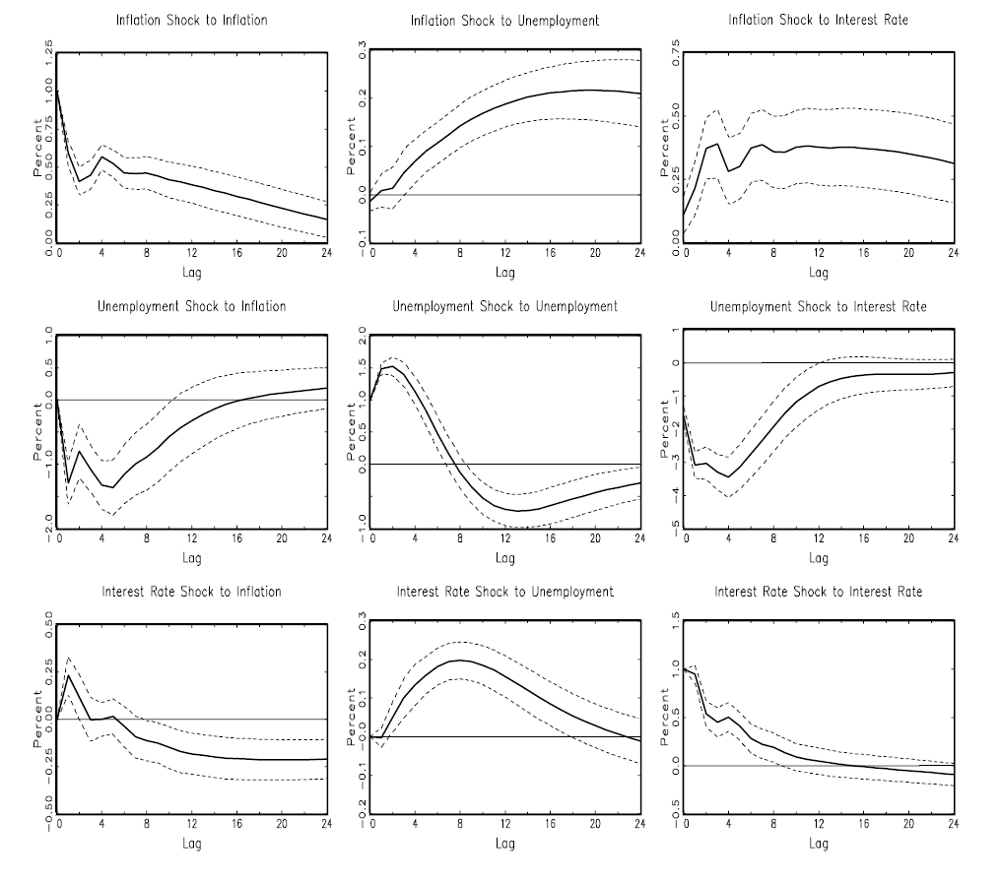
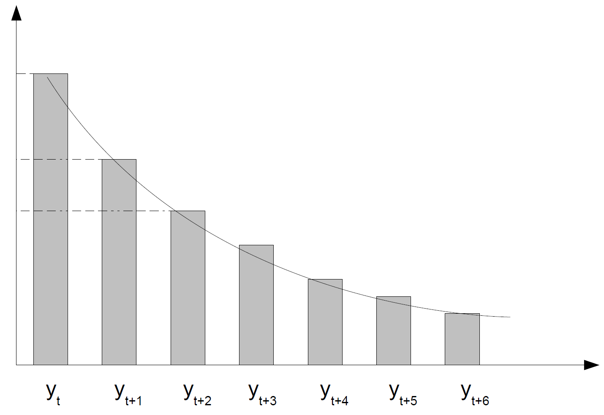
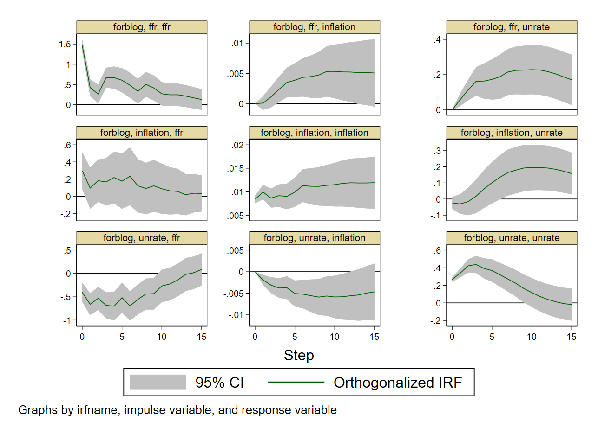

# Vector Autoregressions {#sec-var}

The previous chapter modeled a single stationary series. But macroeconomic variables are jointly determined: output, inflation, interest rates, credit, investment, and unemployment evolve simultaneously, feeding back into one another. A single-equation model cannot capture this. This chapter introduces the **vector autoregression (VAR)**, the workhorse multivariate framework for that problem, in its reduced form: how to define it, estimate it, check it, and use it to forecast and to decompose forecast uncertainty. Identifying the *structural*, causal content of a VAR - impulse responses to a genuine shock, rather than mere forecasting - is deferred to the next chapter.

## Motivating questions

Three questions motivate everything in this chapter and the next:

1. How should we model a genuinely multivariate system, where no single variable is exogenous and feedback is pervasive - a vector autoregression?
2. Can we go beyond forecasting to simulate the causal impact of a policy or a shock - an impulse response function (IRF), which requires solving an identification problem, taken up in the SVAR chapter?
3. Can we quantify each variable's contribution to the overall forecast variance (variance decomposition) and to the predictive accuracy of another variable (Granger causality)?

### Sims (1980): the origin of the VAR approach

::: {.callout-note title="Macroeconomics and Reality"}
Sims [-@Sims1980], "Macroeconomics and Reality" (Econometrica), laid the foundations of modern macroeconometrics - work later recognized with a Nobel Prize.
:::

In 1980, macroeconometrics was dominated by **large-scale structural econometric models (SEMs)**: the FRB-MIT-Penn, Brookings, and Wharton models, often built on disequilibrium or non-Walrasian theory (the neoclassical-Keynesian synthesis of Patinkin, Malinvaud and Benassy, Clower and Leijonhufvud, Tobin, Modigliani, and others; see also the Barro and Grossman [-@BarroGrossman1971] disequilibrium model). These SEMs comprised hundreds of equations, each carrying strong, largely *ad hoc* "theoretical" restrictions, identified through *a priori* exclusion restrictions, and claimed to deliver policy simulations and causal statements.

Sims's diagnosis was that these models performed poorly in the 1970s (failing to anticipate the oil shocks and stagflation), that their identifying assumptions were often arbitrary and not credible, and that causality and exogeneity were imposed by the modeler rather than found in the data - SEMs implicitly assumed the econometrician already knew the true structure.

Two influential responses followed, both of which Sims also found wanting. Lucas [-@Lucas1976] (the **Lucas critique**) showed that structural parameters typically depend on the policy regime itself, so traditional SEMs are not policy-invariant and hence unreliable for policy analysis. Sargent and Wallace [-@SargentWallace1975], in the "freshwater" tradition, proposed rational expectations and microfounded structural equations instead, with identification grounded in theory rather than data - leading to real business cycle (RBC) models, optimizing general-equilibrium models calibrated to match empirical co-movements (Kydland and Prescott [-@KydlandPrescott1982]; Long and Plosser [-@LongPlosser1983]).

::: {.callout-warning title="Sims's view"}
Lucas and Sargent were right to criticize the old structural models - but their alternative introduces *even stronger*, and often untestable, assumptions of its own (rational expectations, Euler equations, market clearing, and so on).[^kirman-representative] Empirical macro needed a third way: an agnostic statistical structure - a system of cross-equation autoregressions, i.e. a VAR - combined with identification that does not rely on unrealistic theoretical constraints.
:::

[^kirman-representative]: On the "microfoundations" claim specifically, see Kirman [-@Kirman1992], "Whom or What Does the Representative Individual Represent?"

Sims's approach treats *all* macro variables as jointly endogenous, with no exogeneity imposed by assumption. It starts from the reduced form - an unrestricted VAR - and identifies shocks using minimal, transparent assumptions (recursive, Cholesky-type timing rules, or information-set arguments), then uses the VAR's moving-average representation to compute impulse response functions (IRFs) and forecast error variance decompositions (FEVDs). This responds to the Lucas critique without requiring full microfoundations. Empirically, this approach overturned some received wisdom: money turned out not to be exogenous, but to respond endogenously to the economy, contrary to monetarist SEMs; VAR-based IRFs differed sharply from SEM predictions in timing and magnitude (e.g. prices adjusting faster than SEMs implied); output, prices, unemployment, and money displayed richer dynamics than assumed (e.g. money reacting to unemployment and inflation, not only the reverse); and simple VARs were shown to outperform large SEMs in short-run forecasting.

## The VAR(p) model {#sec-var-definition}

For the remainder of this chapter, identification, causality, and structural interpretation are set aside; we work only with the **reduced-form** VAR. A vector autoregression treats all variables as jointly endogenous, with cross-equation terms in every equation, and models their dynamics using only lagged values of all the variables - the direct multivariate extension of the AR model from @sec-ar.

::: {.callout-important title="Definition: VAR(p)"}
Let $y_t$ be a $k \times 1$ vector of jointly endogenous variables. A **vector autoregression of order $p$** is

$$
\underbrace{y_t}_{k \times 1} = \underbrace{c}_{k \times 1} + \underbrace{A_1 y_{t-1} + \cdots + A_p y_{t-p}}_{k \times 1} + \underbrace{B x_t}_{k \times 1} + \underbrace{u_t}_{k \times 1},
$$ {#eq-var-def}

where $c$ is a deterministic intercept vector, each $A_i$ is a $k \times k$ autoregressive coefficient matrix, $x_t$ is an optional $r \times 1$ vector of exogenous controls with coefficient matrix $B \in \mathbb{R}^{k \times r}$ (a "VARX" when included), and $u_t$ are reduced-form innovations with $u_t \sim (0, \Sigma_u)$. Each variable depends on its own lags *and* on the lags of every other variable; all variables are treated symmetrically, with no *a priori* endogenous/exogenous distinction imposed.
:::

::: {.callout-tip title="Example: a 3-variable VARX(1)"}
Let the endogenous vector be $y_t = (g_t, \pi_t, i_t)'$ - GDP growth, inflation, and the interest rate - and the exogenous controls be $x_t = (\Delta \text{Oil}_t, \text{Policy}_t)'$, so $r = 2$. A VARX(1) is $y_t = c + A_1 y_{t-1} + B x_t + u_t$ with $c \in \mathbb{R}^{3 \times 1}$, $A_1 \in \mathbb{R}^{3 \times 3}$, $B \in \mathbb{R}^{3 \times 2}$. Written out equation by equation:

$$
\begin{aligned}
g_t &= c_1 + a_{11} g_{t-1} + a_{12}\pi_{t-1} + a_{13} i_{t-1} + b_{11}\Delta\text{Oil}_t + b_{12}\text{Policy}_t + u_{1t}, \\
\pi_t &= c_2 + a_{21} g_{t-1} + a_{22}\pi_{t-1} + a_{23} i_{t-1} + b_{21}\Delta\text{Oil}_t + b_{22}\text{Policy}_t + u_{2t}, \\
i_t &= c_3 + a_{31} g_{t-1} + a_{32}\pi_{t-1} + a_{33} i_{t-1} + b_{31}\Delta\text{Oil}_t + b_{32}\text{Policy}_t + u_{3t}.
\end{aligned}
$$
:::

### Companion form and stability {#sec-var-stability}

Writing the VAR($p$) in **companion form** converts it into a first-order VAR, which makes stability, forecasting, and impulse responses analytically tractable. Define the stacked, $kp \times 1$ state vector $Y_t = (y_t', y_{t-1}', \ldots, y_{t-p+1}')'$. Then the VAR($p$) becomes

$$
Y_t = F Y_{t-1} + \begin{pmatrix} c \\ 0 \\ \vdots \\ 0 \end{pmatrix} + \begin{pmatrix} u_t \\ 0 \\ \vdots \\ 0 \end{pmatrix},
\qquad
F = \begin{pmatrix}
A_1 & A_2 & \cdots & A_{p-1} & A_p \\
I_k & 0 & \cdots & 0 & 0 \\
0 & I_k & \cdots & 0 & 0 \\
\vdots & & \ddots & & \vdots \\
0 & 0 & \cdots & I_k & 0
\end{pmatrix},
$$ {#eq-companion-form}

with $F$ the **companion matrix**.

::: {.callout-important title="Stability condition"}
A VAR($p$) is **stable** (equivalently, weakly stationary) if and only if all eigenvalues of $F$ lie strictly inside the unit circle. Equivalently, writing the lag polynomial $A(z) = I_k - A_1 z - A_2 z^2 - \cdots - A_p z^p$, the VAR is stable if and only if $\det A(z) \ne 0$ for all $|z| \le 1$.
:::

**Why eigenvalues below 1 in modulus imply stability.** Switching off the shocks gives the homogeneous system $Y_t = F Y_{t-1}$, so $Y_t = F^t Y_0$: future states depend on repeated applications of $F$, and stability requires $\lim_{t \to \infty} F^t Y_0 = 0$ for every $Y_0$, i.e. the effect of initial conditions must vanish over time. If $F$ is diagonalizable, $F = P\Lambda P^{-1}$, then $F^t = P \Lambda^t P^{-1}$ with $\Lambda^t = \mathrm{diag}(\lambda_1^t, \ldots, \lambda_{kp}^t)$: as $t \to \infty$, $|\lambda_i| < 1$ implies $\lambda_i^t \to 0$, $|\lambda_i| = 1$ implies persistence, and $|\lambda_i| > 1$ implies explosive behavior. Hence $F^t \to 0$ if and only if $|\lambda_i| < 1$ for every $i$ - the stability condition above.

If the VAR is stable, it admits a **VMA($\infty$) representation**, the multivariate generalization of the Wold decomposition (@sec-wold):

$$
y_t = \mu + \sum_{h=0}^{\infty} \Phi_h u_{t-h}, \qquad \Phi_0 = I_k, \qquad \Phi_h = A_1 \Phi_{h-1} + \cdots + A_p \Phi_{h-p}.
$$ {#eq-vma-representation}

A stable VAR($p$) is a parametric structure whose solution is this representation; the $\{\Phi_h\}$ describe how shocks propagate dynamically through the system, and are the basis for the impulse response functions and variance decompositions developed in @sec-irf and @sec-fevd.

### How many variables to include?

Choosing the endogenous variable set is a theory-driven choice, trading off several considerations:

| Issue | Implication or rule of thumb |
|-|-|
| Parameter explosion | Each variable adds $k \times p$ coefficients; total parameters scale as roughly $k^2 p + k$. Too many variables means few degrees of freedom and poor estimation. |
| Rule of thumb | Require $T / (k^2 p) \gtrsim 5$ to $10$. With quarterly data ($T \approx 120$), this usually caps $k$ at around 4 to 5. |
| Interpretability | Beyond a few variables, IRFs and FEVDs become opaque, mixing several channels (demand, financial, price) with unclear economic meaning. |
| Identification | Adding variables complicates ordering and exogeneity assumptions, e.g. in a Cholesky decomposition (developed in the SVAR chapter). |
| Best practice | Start from a clear theoretical core; add variables stepwise for robustness and check that key impulse responses remain stable; justify omissions explicitly - parsimony is not the same as arbitrariness. |

: Choosing the set of endogenous variables {#tbl-var-variable-choice}

## Estimation and selection {#sec-var-estimation}

We observe $\{y_t\}_{t=1}^T$ with $y_t \in \mathbb{R}^k$. Forming the regressors $(y_{t-1}, \ldots, y_{t-p})$ requires $p$ initial periods, leaving $T_p = T - p$ usable observations. Let $m = kp + d$ be the number of regressors per equation ($kp$ lag coefficients plus $d$ deterministic or exogenous terms). Stacking all usable observations,

$$
Y = XB + U, \qquad Y \in \mathbb{R}^{T_p \times k}, \quad X \in \mathbb{R}^{T_p \times m}, \quad B \in \mathbb{R}^{m \times k}, \quad U \in \mathbb{R}^{T_p \times k},
$$

where each column of $Y$ is one equation's dependent variable, each column of $B$ is that equation's coefficients, and - crucially - **all equations share the same regressor matrix $X$**.

### OLS is system-efficient

Because all equations share $X$, equation-by-equation OLS coincides with system OLS:

$$
\hat B = (X'X)^{-1} X'Y, \qquad \hat U = Y - X\hat B, \qquad \hat\Sigma_u = \frac{\hat U'\hat U}{T_p - m},
$$

with $T_p - m$ the residual degrees of freedom (Bessel's correction). Under standard assumptions (stability, weak exogeneity, finite moments), the asymptotic distribution of the coefficients is

$$
\mathrm{vec}(\hat B - B) \overset{a}{\sim} \mathcal{N}\big(0, \Sigma_u \otimes (X'X)^{-1}\big).
$$ {#eq-var-coef-distribution}

The Kronecker product appears because two distinct covariance structures are at play: $\Sigma_u$ governs correlation *across equations* (columns of $B$), while $(X'X)^{-1}$ governs uncertainty *within* each equation (rows of $B$). The Kronecker product $A \otimes B$ inflates each element of $A$ by the entire matrix $B$, producing a block matrix,

$$
\begin{pmatrix} a & b \\ c & d \end{pmatrix} \otimes \begin{pmatrix} 1 & 2 \\ 3 & 4 \end{pmatrix} = \begin{pmatrix} aB & bB \\ cB & dB \end{pmatrix},
$$

the correct multivariate analogue of the scalar OLS variance formula $\mathrm{Var}(\hat\beta) = \sigma^2 (X'X)^{-1}$, with the scalar $\sigma^2$ replaced by the matrix $\Sigma_u$.

::: {.callout-important title="Why OLS is efficient here: the link to SUR and Zellner"}
VAR innovations are typically correlated *across* equations (contemporaneous cross-equation correlation), so a VAR looks superficially like a **seemingly unrelated regressions (SUR)** system,

$$
y_{1t} = x_{1t}'\beta_1 + u_{1t}, \qquad y_{2t} = x_{2t}'\beta_2 + u_{2t}, \qquad \mathrm{Cov}(u_{1t}, u_{2t}) = \sigma_{12} \ne 0,
$$

where the equations *seem* unrelated (no common regressor), yet a common shock (e.g. demand) makes the disturbances co-move: a large residual in one equation signals a likely residual in the other. Generalized least squares (GLS) can exploit this cross-equation information to filter noise and improve precision. So should a VAR be estimated by GLS instead of OLS?

Zellner's [-@Zellner1962] theorem answers this: if the regressors are *identical* across equations, $x_{1t} = x_{2t} = x_t$ (i.e. $X_1 = X_2 = X$), the cross-equation covariance structure adds no additional information, and $\hat B_{GLS} = (X'X)^{-1}X'Y = \hat B_{OLS}$. A VAR has, by construction, identical regressors across equations - so GLS collapses exactly to OLS, and **OLS is already system-efficient**.
:::

Three estimation approaches are used in practice for VARs: **least squares**, justified by Zellner's result; **maximum likelihood**, which, under multivariate Gaussian errors, is asymptotically equivalent to least squares (exactly as for AR models, @sec-arma-estimation); and **Bayesian methods** (not covered in this chapter, but developed in a later chapter on Bayesian VARs), which combine prior information with the likelihood to obtain a posterior distribution over the VAR parameters - particularly useful for high-dimensional systems requiring shrinkage, or when the sample size is limited.

### Identification and validation: diagnostics

**Lag order selection.** Choose $p$ to optimize the bias-variance trade-off by minimizing an information criterion (AIC, BIC, or HQ, exactly as in @sec-arma-selection); AIC tends to select a larger $p$, BIC is more parsimonious, HQ sits in between. As with ARMA, information criteria alone are not sufficient - always validate with residual tests and stability checks.

**Residual serial correlation.** Portmanteau or LM tests (e.g. a multivariate Ljung-Box test) on $\hat U$, with $H_0$: no remaining autocorrelation - the goal being that no dynamics remain beyond lag $p$, so that $u_t \sim WN(0, \Sigma_u)$.

**Normality.** Jarque-Bera on the residuals, $H_0$: normality - relevant only for exact finite-sample inference; if rejected, a residual bootstrap can be used for inference, forecast confidence intervals, or IRF confidence bands.

**Stability.** Check that all eigenvalues of the companion matrix $F$ have modulus below 1 (@eq-companion-form); if not, reconsider the lag order $p$, the deterministic terms, or a transformation such as first-differencing or a VECM (@sec-var-cointegration).

::: {.callout-note title="Why not a VARMA?"}
Adding MA terms to a VAR - a "VARMA" - is rarely done in practice. VARMA estimation requires solving a high-dimensional nonlinear optimization problem with many local minima, under invertibility and stationarity constraints that are difficult to impose; even modern optimizers (BFGS, EM, MCMC) struggle with it. In practice, VARs are used almost exclusively instead, relying on the fact that any stable, invertible VARMA($p,q$) process can be approximated arbitrarily closely by a VAR($P$) for sufficiently large $P$ (and, symmetrically, by a VMA($Q$) for sufficiently large $Q$, though that route is rarely taken in practice).
:::

## Granger causality {#sec-granger-causality}

Granger causality answers a prediction question: do past values of $x$ help forecast $y$, beyond what the lags of $y$ already provide - do past values of one variable carry *incremental predictive information* about another?

::: {.callout-important title="Definition (Granger, 1969)"}
For two components $x_t, y_t$ of a VAR, $x$ **Granger-causes** $y$ if lags of $x_t$ improve the prediction of $y_t$ given the lags of $y_t$ [@Granger1969]. Formally, $y_t$ Granger-causes $x_t$ if $E[y_t \mid y_{t-1}] \ne E[y_t \mid y_{t-1}, x_{t-1}]$.
:::

::: {.callout-warning title="Granger causality is not structural causality"}
The definition is entirely predictive: it does not assert a true structural causal relationship. Excluding $x$ from the $y$-equation does not imply that $x$ has no structural effect on $y$; conversely, including $x$ does not identify a structural shock. Structural identification, taken up in the next chapter, still requires further restrictions.
:::

In a VAR($p$), the $y$-equation is $y_t = c + a_1 y_{t-1} + \cdots + a_p y_{t-p} + b_1 x_{t-1} + \cdots + b_p x_{t-p} + u_t$, and testing whether $x$ Granger-causes $y$ amounts to a joint test on $\{b_1, \ldots, b_p\}$:

$$
H_0: b_1 = b_2 = \cdots = b_p = 0 \qquad \text{against} \qquad H_1: \text{at least one } b_i \ne 0,
$$

via a joint Wald test (or an $F$-test in small samples), rejecting $H_0$ at level $\alpha$ if $W > \chi^2_{p, 1-\alpha}$. Granger causality can run in one direction only, or in both.

### Block exogeneity

A multivariate generalization tests whether an entire *group* of variables helps forecast another group, rather than a single variable predicting another. Partition the system as $y_t = (y_{1,t}, y_{2,t})$, with $y_1$ containing $k_1$ variables and $y_2$ containing $k_2$ variables. **Block exogeneity** of $y_1$ with respect to $y_2$ ("$y_2$ does not help predict $y_1$") is

$$
H_0: \text{all lag coefficients of block } y_2 \text{ are zero in the equations for block } y_1,
$$

tested jointly with a Wald (or $F$) test. This is useful for defining ordered blocks ahead of recursive (Cholesky) identification, for separating a "policy block" from the rest of the system, and more generally for reducing model complexity while aiding structural interpretation.

## Forecasting {#sec-var-forecasting}

The goal is to compute forecasts $\hat y_{T+h}$ for $h = 1, 2, \ldots$ given data up to $T$. The one-step-ahead forecast uses only observed lags, since $E[u_{T+1}] = 0$:

$$
\hat y_{T+1|T} = \hat c + \hat A_1 y_T + \hat A_2 y_{T-1} + \cdots + \hat A_p y_{T-p+1}.
$$

For $h \ge 2$, the multi-step recursion substitutes previously forecasted values wherever the observed history runs out, exactly as for ARMA (@sec-arma-forecasting):

$$
\hat y_{T+h|T} = \hat c + \hat A_1 \hat y_{T+h-1|T} + \hat A_2 \hat y_{T+h-2|T} + \cdots + \hat A_p \hat y_{T+h-p|T}.
$$

### Forecast uncertainty: fan charts

As with ARMA (@sec-arma-forecasting), three approaches are standard.

**Monte Carlo simulation (Gaussian).** Draw innovations $u_{T+1}, \ldots, u_{T+H}$ from $\mathcal{N}(0, \hat\Sigma_u)$, simulate the VAR forward recursively, repeat many times (e.g. 5,000 paths), and construct pointwise percentiles (e.g. the 10th to 90th) across simulated paths.

**Analytic forecast MSE.** A closed-form $\mathrm{MSE}(h)$ can be derived from the companion matrix, giving approximate confidence intervals $\hat y_{T+h|T} \pm z_{\alpha/2}\sqrt{\mathrm{diag}(\mathrm{MSE}(h))}$ - fast, but reliant on normality.

**Distribution-free bootstrap simulations**, when innovations are non-Gaussian or their distribution is unknown: a **residual bootstrap** resamples past residual vectors $\hat u_t$ with replacement, rebuilds artificial series, re-estimates the VAR, and simulates forecasts; a **wild bootstrap** multiplies $\hat u_t$ by random signs or weights, robust to heteroskedasticity; a **block bootstrap** resamples residual *blocks* when serial correlation is present in the residuals. These methods generate fan charts without assuming Gaussian shocks, and account for both shock uncertainty and parameter uncertainty.

## Stationarity, integration, and cointegration {#sec-var-cointegration}

As always, diagnosis precedes estimation: each series must be checked for stationarity - $I(0)$, an AR root inside the unit circle - via unit-root tests (ADF, PP, ERS, KPSS, @sec-unit-root-tests). Three cases arise.

**Case 1: all variables are $I(0)$.** A standard VAR in levels is valid, and IRFs and FEVDs based on the stable VAR (@sec-irf, @sec-fevd) apply directly.

**Case 2: variables are $I(1)$ but not cointegrated.** A VAR in first differences is needed (in growth rates, if the levels were in logs). IRFs then describe only short-run dynamics; long-run levels are not identified by this specification.

**Case 3: variables are $I(1)$ and cointegrated.**

::: {.callout-important title="What is cointegration?"}
Cointegration means that several non-stationary variables share a common long-run equilibrium relation despite short-run deviations, so that a specific linear combination of them is stationary even though each series individually is not: there exists a **cointegrating vector** $\beta$ such that

$$
\beta' y_t = \sum_{i=1}^k \beta_i y_{i,t} \quad \text{is stationary,}
$$

even though each $y_{i,t}$ individually is $I(1)$.
:::

In this case, a VAR in levels is not appropriate: it obscures the long-run equilibrium relation, its coefficient matrices mix stationary and non-stationary components, impulse responses can be misleading at long horizons, and shocks can imply implausible long-run drifts if the cointegrating relationship is ignored. Differencing away the problem is not appropriate either, since it would throw away the long-run relation entirely.

The correct specification that remains in levels is the **vector error-correction model (VECM)**, also known as the Johansen framework:

$$
\Delta y_t = \Pi y_{t-1} + \Gamma_1 \Delta y_{t-1} + \cdots + \Gamma_{p-1}\Delta y_{t-p+1} + u_t,
$$ {#eq-vecm-preview}

where $\Pi = \alpha\beta'$ encodes the long-run relations through $\beta$ (the cointegrating vector) and the **adjustment, or loading, coefficients** $\alpha$, which govern how each variable responds to short-run disequilibrium from that long-run relation. This model, its estimation, and the Johansen procedure for testing the cointegrating rank are developed in full in a later chapter.

## Impulse response functions {#sec-irf}

The objective of an impulse response function (IRF) is to analyze the effect of a given shock on the dynamic system proxied by the VAR.

{#fig-irf-3x3}

Assume the system receives a one-time shock of amplitude $\delta$ to the $j$-th structural innovation at time $t$, $\varepsilon_{j,t} = \delta$, with $\varepsilon_{j,t+1} = \varepsilon_{j,t+2} = \cdots = 0$. The IRF traces out how each variable $y_{i,t+h}$ reacts at horizon $h$ to this one-time impulse:

$$
I_{i,j,h} = \frac{\partial y_{i,t+h}}{\partial \varepsilon_{j,t}}, \qquad h = 0, 1, 2, \ldots,
$$

so that at each horizon $h$, $I_h = \left[\partial y_{i,t+h} / \partial \varepsilon_{j,t}\right]_{i,j=1}^k$ is a $k \times k$ matrix.

::: {.callout-warning title="An IRF is a difference of forecasts, not a forecast path"}
An IRF is the *difference* between the forecast path *with* the shock and the forecast path *without* it (the baseline) - it is **not** the raw forecast path itself following a shock.
:::

{#fig-irf-decay-schematic}

### IRFs from the VMA representation

Consider the zero-mean structural VAR $\Phi(B)y_t = \varepsilon_t$, with $E[\varepsilon_t] = 0$ and $\mathrm{Cov}(\varepsilon_t) = \Omega_\varepsilon$. If $\Phi(B)$ is invertible, $y_t$ has a VMA($\infty$) representation,

$$
y_t = \Phi(B)^{-1}\varepsilon_t = \Psi(B)\varepsilon_t = \varepsilon_t + \Psi_1 \varepsilon_{t-1} + \Psi_2 \varepsilon_{t-2} + \cdots,
$$

and the impulse responses are simply $I_{i,j,h} = (\Psi_h)_{ij}$, or equivalently, in expectation form, $I_{i,j,h} = E[y_{i,t+h} \mid \varepsilon_{j,t}=1] - E[y_{i,t+h} \mid \varepsilon_{j,t}=0]$.

### Reading an IRF

When reading an impulse response, look at its sign, magnitude, lag or delay, duration (short-run versus long-run effects), whether it mean-reverts or produces a permanent level change, whether it overshoots (e.g. positive then negative), and its statistical significance (confidence intervals). By convention, a panel reads as the impact of a shock to the *row* variable on the *column* variable, with the diagonal panels showing self-impact; confidence intervals around IRFs are generally computed by bootstrap.

{#fig-irf-stata-example}

### Limits of linearity

Because VARs are linear, two properties always hold mechanically, whether or not they are economically realistic. First, a positive shock is always the exact mirror image of a negative shock of the same size - only nonlinear models can produce asymmetric responses. This raises the empirical question of whether macro multipliers really have the same magnitude in an expansion as in a recession (consider, informally, the Greek crisis). Second, the magnitude of the initial shock does not matter for the *shape* of the IRF: a "unit shock" is conventionally a one-standard-deviation shock to a variable's residual, and a $2.3$-unit shock produces exactly $2.3$ times the impulse response of a unit shock. Whether this scale-invariance holds in reality is also an open empirical question - thresholds and tipping points (the Great Moderation, policy-rate effective lower bounds, "Minsky moments") all suggest it may not, always. These are exactly the limitations that motivate the nonlinear models developed in a later chapter.

## Forecast error variance decomposition {#sec-fevd}

The FEVD answers a complementary question to the IRF: how much of the forecast error variance (uncertainty) of a variable $y_t$ at horizon $h$ is explained by each structural shock in the system? When forecasting $y_{t+h}$, errors arise because future shocks (innovations) are unknown; the FEVD decomposes these forecast errors into shares attributable to each shock.

The $h$-step forecast error is $y_{t+h} - \hat y_t(h)$, with variance given by the accumulated responses to future shocks,

$$
V\big(y_{t+h} - \hat y_t(h)\big) = \sum_{j=0}^{h-1} \Phi_j \Sigma_u \Phi_j',
$$

where $\Phi_j$ are the reduced-form moving-average matrices of @eq-vma-representation. The contribution of the $i$-th *orthogonalized* structural shock to the forecast-error variance of the $k$-th variable at horizon $h$ is

$$
\sum_{j=0}^{h-1} \big(e_k' \Psi_j e_i\big)^2, \qquad \Psi_j = \Phi_j P,
$$

where $P$ is a structural decomposition of $\Sigma_u = PP'$ (e.g. a Cholesky factor, developed in the SVAR chapter) and $e_i$ selects the $i$-th orthogonalized shock. A typical application: how much of GDP forecast uncertainty is explained by monetary policy shocks, as opposed to demand or supply shocks.

## But what about causality? {#sec-var-causality-teaser}

So far, everything in this chapter is reduced-form. A reduced-form VAR captures the interactions between variables efficiently, but it cannot by itself reveal the underlying causal mechanism: two entirely different causal structures can generate the same reduced-form VAR. A reduced-form innovation $u_{k,t}$ on variable $y_{k,t}$ has no reason, *a priori*, to be orthogonal to the other variables' innovations - it need not be a genuine "structural" shock at all. It might instead reflect a contemporaneous feedback from the rest of the system, or a common shock hitting the whole system at once.

For example, in assessing the impulse response of a monetary policy action, an increase in interest rates that is itself a *response* to economic conditions is not a shock - it is endogenous. The same caution applies to reading a forecast error variance decomposition. Disentangling genuine structural shocks from these reduced-form innovations - the identification problem - is the subject of the next chapter.
