# Structural VARs, Identification, and Policy Shock Assessment {#sec-svar}

The previous chapter closed on a warning: a reduced-form VAR captures the interactions between variables efficiently, but it cannot by itself reveal the underlying causal mechanism, since two entirely different causal structures can produce the same reduced form. This is **observational equivalence**. This chapter develops the identification strategies that resolve it: recursive (Cholesky) restrictions, more general short-run restrictions, long-run restrictions, sign restrictions, and the narrative approach, together with what each buys once a structural shock is in hand - impulse responses, historical decompositions, and counterfactuals.

## Why a reduced-form VAR cannot identify causality

A reduced-form innovation $u_{k,t}$ on variable $y_{k,t}$ is, by construction, linearly unpredictable from the past - but there is no reason, *a priori*, for it to be orthogonal to the innovations of other variables, i.e. to be a genuine "structural" shock. It can instead be a contemporaneous feedback from other variables, or the fruit of a common shock hitting the whole system at once.

::: {.callout-warning title="A trivial but instructive example"}
Public policies are state-dependent: monetary policy reacts to inflation, output, unemployment, credit spreads, exchange rates, asset prices, forecasts, and financial-stability assessments, among other things. A naive approach - looking at "what happened after" a policy move - confounds the **policy shock** with the systematic reaction to the state of the economy. Why not instead estimate a Taylor rule for the systematic policy response and take the residual $u_t$ as the policy shock? Because of **contemporaneity**: if the policy variable itself reacts within the period to output and inflation, and those in turn reflect other shocks, the residual is not an isolated policy shock - it is a mix of several structural shocks, as the next section makes precise.
:::

### From a structural DGP to its reduced form

Consider a stylized economy with output growth $g_t$, the nominal interest rate $i_t$, and inflation $\pi_t$, with $g_t$ reacting to real shocks $\varepsilon_{r,t}$, $\pi_t$ reacting to cost-push shocks $\varepsilon_{n,t}$, and $i_t$ following a Taylor rule reacting to monetary policy shocks $\varepsilon_{mp,t}$. Write the **structural (true) data-generating process** as

$$
B_0 y_t = B_1 y_{t-1} + \varepsilon_t, \qquad \varepsilon_t \sim \mathcal{N}(0, I_k), \qquad u_t = B_0^{-1}\varepsilon_t,
$$

with $B_0$ the matrix of contemporaneous relationships, and, concretely,

$$
\begin{cases}
g_t = -0.3(i_{t-1} - \pi_{t-1}) + \varepsilon_{r,t} & \text{(IS curve)} \\
i_t = 0.9 i_{t-1} + 1.5\pi_t + \varepsilon_{mp,t} & \text{(Taylor rule)} \\
\pi_t = 0.9\pi_{t-1} + 0.2 g_{t-1} + \varepsilon_{n,t} & \text{(backward-looking Phillips curve)}
\end{cases}
$$

with $\varepsilon_{r,t}, \varepsilon_{mp,t}, \varepsilon_{n,t}$ mutually uncorrelated **structural shocks** - the true causal innovations driving the economy.

::: {.callout-note title="Getting to the reduced form"}
Eliminating the contemporaneous $\pi_t$ from the right-hand side[^ols-endogeneity] gives the reduced-form VAR,

$$
\begin{aligned}
g_t &= 0.06 g_{t-1} - 0.3 i_{t-1} + 0.27\pi_{t-1} + 0.3\varepsilon_{n,t} + \varepsilon_{r,t}, \\
i_t &= 0.9 i_{t-1} + 1.35\pi_{t-1} + 0.3 g_{t-1} + \varepsilon_{mp,t} + 1.5\varepsilon_{n,t}, \\
\pi_t &= 0.9\pi_{t-1} + 0.2 g_{t-1} + \varepsilon_{n,t},
\end{aligned}
$$

with all right-hand-side variables now lagged - a genuine reduced-form VAR. But note that the structural shocks $\varepsilon_t$ appear *mixed* in the residuals.
:::

[^ols-endogeneity]: The structural form cannot be estimated by OLS directly: its contemporaneous regressors are jointly determined with the structural shocks, hence correlated with the equation's error term, violating the OLS exogeneity condition.

Writing $A = B_0^{-1}B_1$, the reduced form actually estimated is $y_t = Ay_{t-1} + u_t$, $u_t = B_0^{-1}\varepsilon_t \sim \mathcal{N}(0, \Sigma_u)$. Because the central bank reacts to inflation *within* the period, the reduced-form innovations mix structural shocks through $B_0^{-1}$ (the impact matrix). Concretely, $u_{i,t} = \varepsilon_{mp,t} + 1.5\varepsilon_{n,t}$: the interest-rate "innovation" is *not* a monetary policy shock. It contains the true policy shock $\varepsilon_{mp,t}$ *plus* a contemporaneous cost-push shock $1.5\varepsilon_{n,t}$. IRFs to $u_{i,t}$ therefore do **not** give the causal effect of monetary policy.

::: {.callout-important title="Why $\\Sigma_u$ alone is not enough"}
The reduced-form covariance $\Sigma_u$ only tells you *how* shocks co-move - "shock 1 and shock 2 correlate at 0.3" - not *what generated* that correlation. It could arise because one structural shock affects both variables, because one shock hits one variable which then affects the other, because both respond to a common shock, or simply because the contemporaneous relations in $B_0$ mix them. Reduced-form innovations $u_t$ are correlated ($\Sigma_u$ is generally non-diagonal), and the *same* reduced form $(A, \Sigma_u)$ is consistent with infinitely many $B_0$, each delivering different "structural" shocks and IRFs. This is the identification problem.
:::

In short: **reduced-form VAR shocks are not structural economic shocks**; a reduced-form VAR gives prediction, not causality. To obtain causal IRFs and FEVDs, the structural shocks must be *identified* - via a Cholesky decomposition, structural theory, sign restrictions, long-run restrictions, external instruments, and so on.

## The structural VAR and the identification problem

::: {.callout-important title="Definition: structural VAR(p)"}
$$
B_0 y_t = c + B_1 y_{t-1} + \cdots + B_p y_{t-p} + \varepsilon_t, \qquad E[\varepsilon_t] = 0, \qquad E[\varepsilon_t \varepsilon_t'] = I_k,
$$

where $y_t$ is $k \times 1$, $B_0$ is the $k \times k$ matrix of contemporaneous relations (with impact matrix $C(0) = B_0^{-1}$), and $\varepsilon_t$ are orthogonal, unit-variance structural shocks. Multiplying through by $B_0^{-1}$ recovers the reduced form,

$$
y_t = \mu + A_1 y_{t-1} + \cdots + A_p y_{t-p} + u_t, \qquad u_t = B_0^{-1}\varepsilon_t,
$$

with $\mu = B_0^{-1}c$, $A_i = B_0^{-1}B_i$, and $\Sigma_u = E[u_tu_t'] = B_0^{-1}(B_0^{-1})'$ - not diagonal whenever any contemporaneous relation is present.
:::

From the data we can estimate the reduced-form coefficients $A_1, \ldots, A_p$ and the innovation covariance $\Sigma_u$. What we *want*, for causal analysis, is the structural matrix $B_0$ (or $C(0) = B_0^{-1}$) and the structural shocks $\varepsilon_t = B_0 u_t = C(0)^{-1}u_t$, orthogonal and economically interpretable. The identification problem is precisely the step from $(A_i, \Sigma_u)$ to $(B_0, \varepsilon_t)$.

### Counting unknowns and equations

$C(0)$ has $k^2$ unknown entries, but $\Sigma_u$, being symmetric, supplies only $k(k+1)/2$ independent equations (variances and covariances). This leaves

$$
\underbrace{k^2}_{\text{unknowns}} - \underbrace{\frac{k(k+1)}{2}}_{\text{equations from } \Sigma_u} = \frac{k(k-1)}{2}
$$

additional, independent restrictions needed to pin down $C(0)$: the system is **underidentified** as it stands.

### The rotation problem

Even worse, suppose one impact matrix $C(0)$ satisfies $\Sigma_u = C(0)C(0)'$. For *any* orthogonal matrix $Q$ ($Q'Q = QQ' = I_k$), defining $\tilde C(0) = C(0)Q$ and $\tilde\varepsilon_t = Q'\varepsilon_t$ gives $\tilde C(0)\tilde C(0)' = C(0)QQ'C(0)' = C(0)C(0)' = \Sigma_u$ and $E[\tilde\varepsilon_t\tilde\varepsilon_t'] = I_k$ as well. So the *same* reduced form is consistent with infinitely many rotations $(C(0)Q, Q'\varepsilon_t)$ - different structural-shock decompositions that are **observationally equivalent** from the reduced form alone. Additional restrictions must select a single rotation (or a credible subset of them) out of this continuum.

The covariance factorisation, orthogonal rotations, and uniqueness of the Cholesky factor are reviewed in @sec-decompositions.

## Recursive (Cholesky) identification

The simplest resolution imposes enough zero restrictions on $C(0)$ to make it unique, through a recursive, hierarchical ordering of the variables $y_t = (y_{1t}, \ldots, y_{kt})'$: variable 1 does not react contemporaneously to any other variable (its innovation is purely its own structural shock - contemporaneously exogenous); variable 2 reacts contemporaneously at most to variable 1 and its own shock; variable 3 reacts at most to variables 1 and 2 and its own shock; and so on. This forces $C(0)$ to be **lower triangular**,

$$
C(0) = \begin{pmatrix} c_{11} & 0 & \cdots & 0 \\ c_{21} & c_{22} & \cdots & 0 \\ \vdots & \vdots & \ddots & \vdots \\ c_{k1} & c_{k2} & \cdots & c_{kk} \end{pmatrix},
$$

with $k(k-1)/2$ imposed zeros - exactly the number needed for identification.

::: {.callout-note title="Cholesky in practice"}
The recursive assumptions imply a *unique* lower-triangular $C(0)$ with positive diagonal such that $\Sigma_u = C(0)C(0)'$ - the **Cholesky factor** of $\Sigma_u$. Algorithm: (1) estimate the reduced-form VAR to get residuals $\hat u_t$; (2) compute the sample covariance $\hat\Sigma_u$; (3) compute its Cholesky factor $\hat C(0)$; (4) recover the structural shocks $\hat\varepsilon_t = \hat C(0)^{-1}\hat u_t$. The ordering of $y_t$ encodes the assumption about who can react contemporaneously to whom; it yields orthogonal shocks with a clear causal story, but that story is only as good as the ordering.
:::

::: {.callout-tip title="Example: an economic ordering"}
For a quarterly macro VAR with $y_t = (g_t, \pi_t, i_t)'$, a common ordering assumes output cannot react within the quarter to monetary policy (real activity adjusts slowly), prices may react within the quarter to output but not to interest rates (gradual price adjustment), and the central bank observes both $g_t$ and $\pi_t$ and can adjust $i_t$ within the quarter. This yields a lower-triangular $C(0)$ with contemporaneous feedback from real activity and inflation into the interest rate, but none the other way - identifying the monetary policy shock as the last element of $\varepsilon_t$. Formally, with

$$
C(0) = \begin{pmatrix} c_{11} & 0 & 0 \\ c_{21} & c_{22} & 0 \\ c_{31} & c_{32} & c_{33} \end{pmatrix}, \qquad \varepsilon_t = (\varepsilon_{g,t}, \varepsilon_{\pi,t}, \varepsilon_{mp,t})',
$$

row 1 says output reacts within the quarter only to its own shock ($u_{g,t} = c_{11}\varepsilon_{g,t}$); row 2 says inflation may react to output and its own shock but not to monetary policy ($u_{\pi,t} = c_{21}\varepsilon_{g,t} + c_{22}\varepsilon_{\pi,t}$); row 3 says the interest rate may react to all three ($u_{i,t} = c_{31}\varepsilon_{g,t} + c_{32}\varepsilon_{\pi,t} + c_{33}\varepsilon_{mp,t}$). $\varepsilon_{mp,t}$ is still recoverable, because we know exactly how much of $u_{i,t}$ came from output shocks and how much from inflation shocks; the leftover is the monetary policy innovation.
:::

A structural shock ordered second, say, has *no* immediate ($h=0$) effect on the variable ordered first, but does move both its own variable and any variable ordered after it contemporaneously. At $h=1$, those moves feed into the equation for the first variable with a one-period lag: $\text{IRF}_{1,2}(1) = a_{12}\text{IRF}_{2,2}(0) + a_{13}\text{IRF}_{3,2}(0)$. So IRFs remain structural throughout, only with no contemporaneous ($h=0$) effect on variables placed above the shock in the ordering.

::: {.callout-warning title="Cholesky and common shocks"}
Because Cholesky imposes a strict causal hierarchy, the *only* contemporaneous shock patterns it can represent are triangular ones. If the data reflect innovations that move several variables in a way incompatible with that triangular structure - a genuine **common shock** hitting two variables directly, rather than propagating through the recursive ordering - the algorithm has no way to represent it as a single object: it will split it across the available shocks instead. This motivates the more general short-run restrictions of the next section.
:::

### What Cholesky gives you

After estimating the reduced-form VAR and applying $u_t = C(0)\varepsilon_t$, you have: the **impact matrix** $C(0)$, whose columns are structural shocks and whose zero entries encode the within-period non-responses imposed by the ordering; the **structural shocks** $\hat\varepsilon_t$ themselves, one time series per economically meaningful shock; the **structural VMA($\infty$) representation**,

$$
y_t = \mu + \sum_{h=0}^{\infty} \Psi_h \varepsilon_{t-h}, \qquad \Psi_h = \Phi_h C(0),
$$

whose entries $\Psi_h(i,j)$ give the **orthogonalized impulse response functions (OIRFs)**, $\text{IRF}_{i,j}(h) = \partial y_{i,t+h}/\partial\varepsilon_{j,t} = \Psi_h(i,j)$; and the **forecast error variance decomposition**,

$$
\text{FEVD}_{i,j}(h) = \frac{\sum_{s=0}^{h-1}\Psi_s(i,j)^2}{\sum_{s=0}^{h-1}\sum_{m=1}^k \Psi_s(i,m)^2},
$$

the share of variable $i$'s forecast-error variance at horizon $h$ attributable to shock $j$ - meaningful only once $\varepsilon_{j,t}$ is genuinely structural; otherwise the FEVD merely decomposes variance according to an arbitrary linear combination of $u_t$.

### Using structural shocks

Structural shocks support three complementary uses. **Generic OIRFs** answer the timeless question "if shock $j$ hits with size 1, how does $y_i$ move at horizons $h = 0, 1, \ldots$?" - a property of the estimated, time-invariant dynamics, not of any particular calendar date. **Historical decomposition** asks what drove past fluctuations: with estimated shocks $\hat\varepsilon_t$, the contribution of shock $j$ to variable $i$ at time $t$ is $y_{i,t}^{(j)} = \sum_{h=0}^H \Psi_h(i,j)\hat\varepsilon_{j,t-h}$, plotted over time to show how much of $y_i$'s history is due to each structural shock. **Counterfactuals** ask what would have happened absent a shock: build a counterfactual shock history with some shocks switched off (e.g. $\varepsilon^{cf}_{mp,t} = 0$, all others unchanged), recompute $y_{i,t}^{cf} = \mu_i + \sum_j \sum_h \Psi_h(i,j)\varepsilon^{cf}_{j,t-h}$, and compare it to the actual path; the difference is the contribution of the removed shocks.

::: {.callout-tip title="Example: monetary policy shock, Cholesky identification"}
A monthly VAR(12), no constant, six U.S. variables ordered GDP, GDP deflator, commodity prices, the federal funds rate (FFR), non-borrowed reserves, and total reserves.

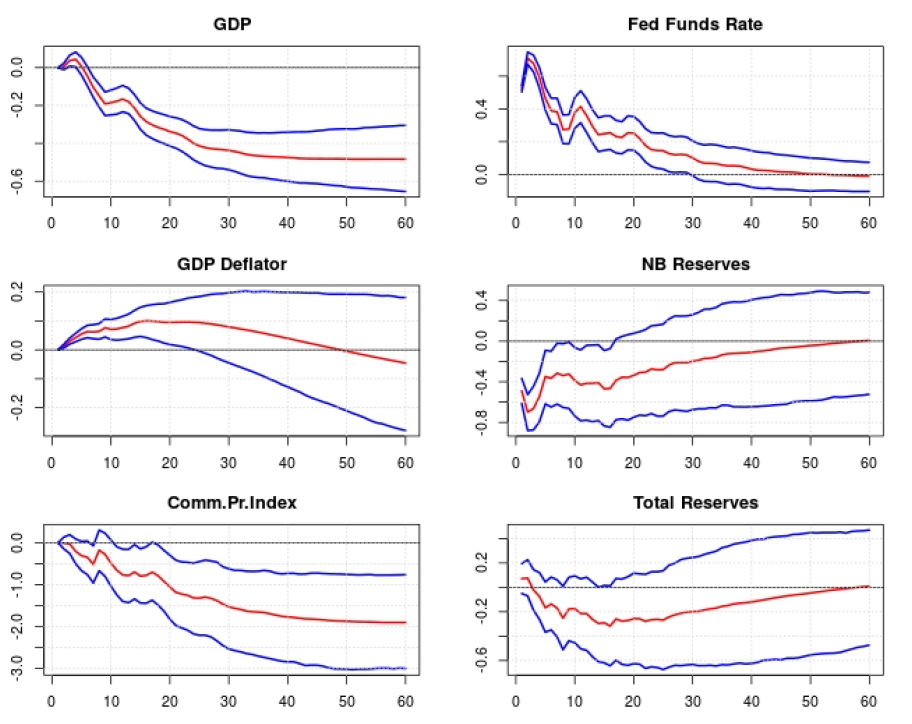{#fig-cholesky-example}
:::

::: {.callout-tip title="Example: Kilian (2009), oil price shocks"}
Kilian [-@Kilian2009], "Not All Oil Price Shocks Are Alike," decomposes movements in the real price of oil into economically meaningful structural shocks. A 3-variable monthly SVAR of the global crude oil market uses $z_t = (\Delta\text{prod}_t, \text{rea}_t, \text{rpo}_t)'$: the growth rate of world crude oil production, a global real-activity index built from dry bulk freight rates, and the real price of crude oil. Three structural shocks are identified with short-run recursive restrictions - oil production does not respond contemporaneously to demand shocks, real activity does not respond within the month to oil-specific shocks, and the real oil price can respond immediately to all three: an **oil supply shock** (unanticipated production change), a **global aggregate demand shock** (demand for all industrial commodities, driven by the world business cycle), and an **oil-specific (precautionary) demand shock** (reflecting uncertainty about future oil supply).

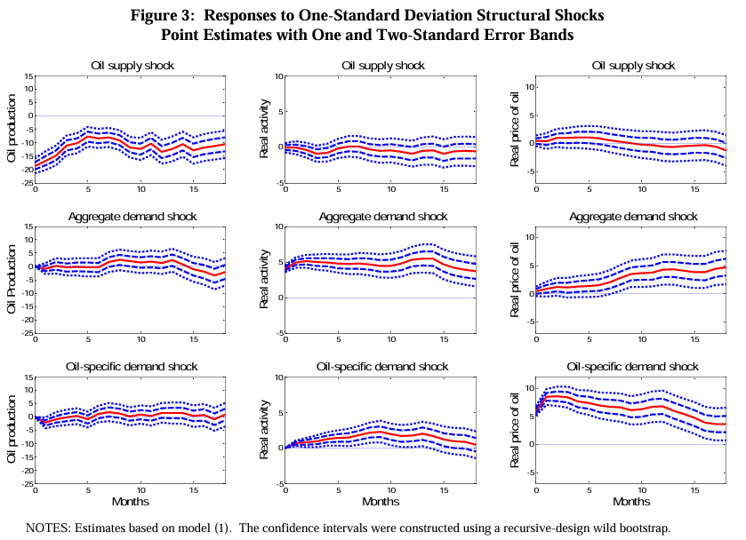{#fig-kilian-irf}

The key patterns: a supply shock produces only a small, short-lived fall in production and a small, transitory rise in the real oil price; an aggregate demand shock produces a persistent rise in global activity and a large, sustained (if delayed) rise in the oil price; a precautionary demand shock produces an immediate, sharp, and persistent rise in the oil price (with overshooting) and a temporary drop in activity with little change in production. The historical decomposition (1975-2007) attributes oil-price spikes mainly to global aggregate demand and precautionary demand, not supply - the post-2003 surge is almost entirely driven by world demand. To assess U.S. macro effects, the estimated global shocks $\{\hat\varepsilon_t^{supply}, \hat\varepsilon_t^{agg.dem}, \hat\varepsilon_t^{prec}\}$ - not U.S.-specific - are fed into external regressions (local projections, @sec-local-projections): supply shocks produce a small, temporary GDP drop with little CPI response; aggregate demand shocks initially raise GDP but are later recessionary, with persistently rising CPI; precautionary demand shocks are stagflationary (GDP down, CPI up). "Oil price shocks" are thus not a single object - their macro effects depend on which structural shock actually moved the price.
:::

### Good practice for Cholesky identification

1. **Always justify the variable ordering.** It imposes a causal hierarchy - a substantive economic assumption, not a technical detail.
2. **Use an appropriate frequency.** No-contemporaneous-reaction is more credible at quarterly than monthly frequency, and rarely valid at daily or weekly frequency; consult the empirical and theoretical literature for priors.
3. **Start with slow-moving variables.** Put "sticky" variables (real activity, employment) first, and fast-moving policy variables (interest rates, exchange rates, financial volatility) last.
4. **Check robustness to alternative orderings.** Try several economically plausible orderings (e.g. $(g,\pi,i)$ versus $(\pi,g,i)$) and report at least one alternative. Similar IRFs across orderings are reassuring (either $\Sigma_u$ is nearly diagonal, or lag dynamics dominate the responses); IRFs that change substantially mean conclusions hinge on the recursive assumption, requiring both a stronger theoretical justification for the preferred ordering and a transparent report of how results vary.
5. **Inspect the reduced-form residual covariance matrix.** Near-collinearity (all correlations close to 1) makes Cholesky numerically unstable and may signal a common latent factor; check that $\hat\Sigma_u$ is well-conditioned.
6. **Remember Cholesky is sufficient, not necessary.** Other identification strategies include more general short-run restrictions (Blanchard-Perotti), long-run restrictions (Blanchard-Quah), sign restrictions (Uhlig), the narrative approach (Romer and Romer, Ramey), and external instruments (proxy-VAR) - covered in turn below.

## Short-run restrictions {#sec-short-run-restrictions}

A **short-run (contemporaneous) restriction** uses institutional timing or information lags to rule out some within-period responses, translating timing assumptions into zero restrictions on selected elements of $B_0$ (or $C(0)$). Recursive Cholesky is a special case, where earlier-ordered variables never react contemporaneously to later-ordered ones. **Non-recursive** short-run restrictions relax the strict hierarchy: some pairs of variables are allowed to interact contemporaneously while others are not (encoding, e.g., that financial variables move jointly and contemporaneously while real variables adjust slowly) - appropriate whenever the evidence suggests simultaneity among a subset of variables rather than a clean hierarchy.

Economic timing assumptions that motivate such zeros include decision or implementation lags (some policies cannot change, or affect the economy, within the same month or quarter), information lags (agents do not observe certain contemporaneous variables when deciding), and adjustment frictions (prices and wages may not adjust within the period, while financial variables do). For two variables with $B_0 = \begin{pmatrix} 1 & a_{12} \\ a_{21} & 1 \end{pmatrix}$, if $y_1$ cannot respond contemporaneously to $\varepsilon_2$, set $a_{12} = 0$; the collection of such zeros defines the contemporaneous structure. Beyond the minimum $k(k-1)/2$ needed for exact identification, extra zeros produce an **overidentified** system, testable via a likelihood-ratio test (at the risk that the data reject the overidentifying restrictions entirely).

::: {.callout-tip title="Example: Blanchard and Perotti (2002) on fiscal shocks"}
Blanchard and Perotti [-@BlanchardPerotti2002] estimate a quarterly reduced-form VAR $Y_t = A(L)Y_{t-1} + U_t$ with $Y_t = (T_t, G_t, X_t)'$ - net taxes, government spending, and GDP - and reduced-form residuals $U_t = (t_t, g_t, x_t)'$ with non-zero cross-correlations. The identification problem is to express $U_t$ in terms of mutually uncorrelated structural shocks, $(t_t, g_t, x_t)' = C(0)(e^T_t, e^G_t, e^X_t)'$: a tax shock, a spending shock, and an output shock.

Rather than restricting $B_0$ directly, Blanchard and Perotti write an explicit contemporaneous system for the *errors*:

$$
\begin{aligned}
t_t &= a_1 x_t + a_2 e^G_t + e^T_t \\
g_t &= b_1 x_t + b_2 e^T_t + e^G_t \\
x_t &= c_1 t_t + c_2 g_t + e^X_t
\end{aligned}
$$

Unexpected tax movements can come from an automatic response to GDP ($a_1 x_t$), a contemporaneous reaction to a spending shock ($a_2 e^G_t$), or a pure tax shock ($e^T_t$); unexpected spending responds symmetrically to GDP, tax shocks, and its own pure shock; unexpected output reacts to taxes and spending (the fiscal multipliers $c_1, c_2$) plus its own pure shock.

**Identification strategy.** Blanchard and Perotti separate *automatic stabilizers* (a mechanical reaction under existing tax and transfer rules) from *discretionary policy* (an active decision responding to the cycle), and argue that discretionary policy cannot respond within the quarter to unexpected GDP (decision and implementation lags). So $a_1$ and $b_1$ capture only automatic stabilizers, and can be *fixed from institutional information* rather than estimated: using OECD-based elasticities, $a_1 \approx 2.08$ (the elasticity of taxes to their base, times the elasticity of the base to GDP), while institutional evidence on government purchases shows no automatic within-quarter response to GDP, so $b_1 = 0$.

Given $a_1, b_1$, cyclically adjusted residuals $t'_t = t_t - a_1 x_t$ and $g'_t = g_t - b_1 x_t = g_t$ are purged of automatic responses to GDP, and - no longer containing output shocks themselves - can serve as **instruments** to identify the contemporaneous output multipliers $c_1, c_2$ in $x_t = c_1 t_t + c_2 g_t + e^X_t$. The remaining cross-effects $a_2$ (tax shock into spending) and $b_2$ (spending shock into tax) have no strong institutional ordering, so Blanchard and Perotti consider two polar cases - taxes decided first ($a_2 = 0$) or spending decided first ($b_2 = 0$) - and find, since the correlation between $t'_t$ and $g'_t$ is small in the data, that both give very similar results. This is a **non-recursive** short-run scheme: some elements of $C(0)$ come from institutional information and elasticities, not from a single ordering.

**Results.** The estimated contemporaneous multipliers show a spending shock raising GDP by around 1 USD per USD spent ($c_2 > 0$), and a tax shock lowering GDP by around 0.8 to 0.9 USD per USD ($c_1 < 0$). Dynamically, tax-shock multipliers peak between roughly $-0.8$ and $-1.3$ and spending-shock multipliers around 1 or slightly above, with some persistence; signs match standard theory, though size and persistence depend on how trend and non-stationarity are handled (deterministic detrending versus first-differencing a stochastic trend).

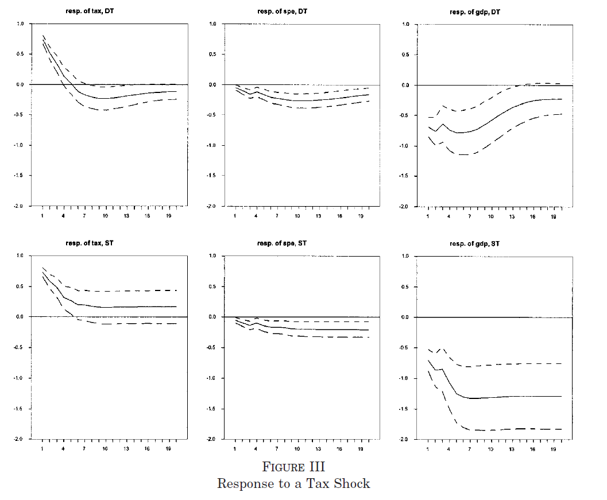{#fig-bp-tax-irf}

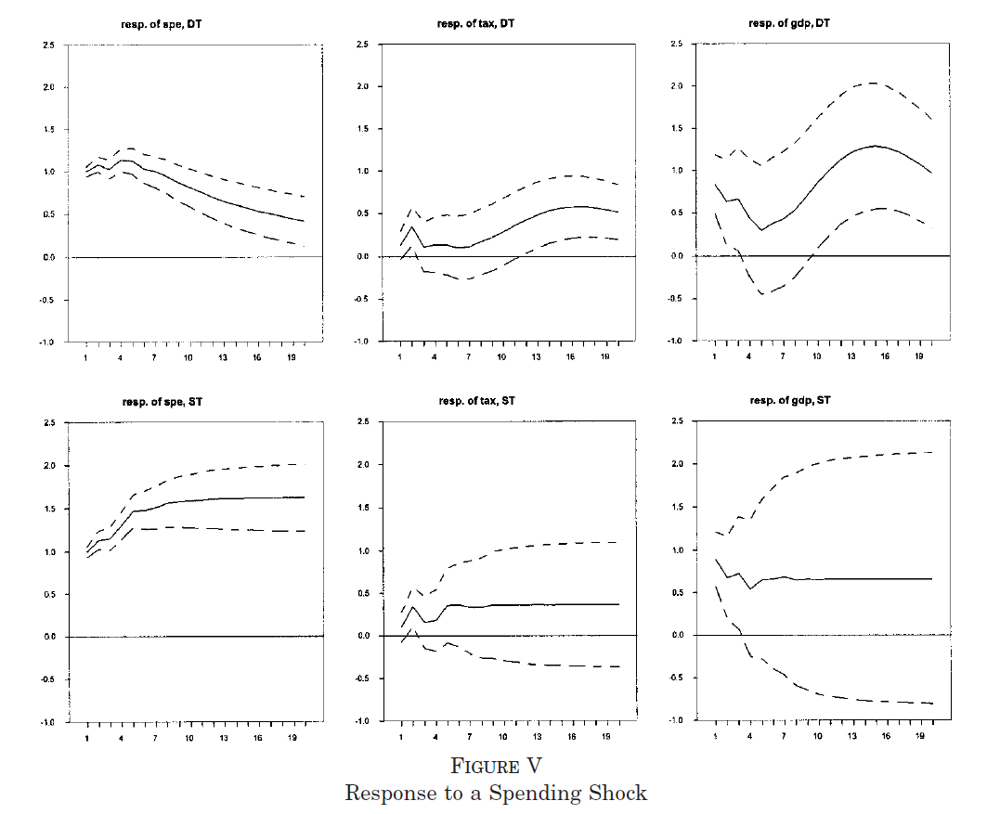{#fig-bp-spending-irf}
:::

## Long-run restrictions {#sec-long-run-restrictions}

Short-run restrictions (Cholesky, Blanchard-Perotti) impose zeros or other constraints on the *impact* matrix $C(0)$, controlling within-period responses. **Long-run restrictions**, following the seminal Blanchard and Quah [-@BlanchardQuah1989] paper, instead impose constraints only on the *cumulative* effect of a shock,

$$
\text{long-run effect of shock } j \text{ on variable } i = \sum_{h=0}^{\infty}\Psi_h(i,j).
$$

The typical economic idea: some shocks are transitory (no effect on the trend or level of a variable), others permanent. This requires at least one series that had to be stationarized from an original $I(1)$ series - otherwise there is no notion of a "permanent" shock to begin with.

### Long-run effects in the VAR representation

For a stable reduced-form VAR($p$) with VMA($\infty)$ representation $y_t = \mu + \sum_h \Phi_h u_{t-h}$, the **long-run effect of reduced-form shocks** is $\Theta \equiv \sum_{h=0}^{\infty}\Phi_h = (I_k - A_1 - \cdots - A_p)^{-1}$ (when this inverse exists). With structural shocks $u_t = C(0)\varepsilon_t$, the structural MA is $y_t = \mu + \sum_h \Psi_h \varepsilon_{t-h}$, $\Psi_h = \Phi_h C(0)$, and the **long-run effect of structural shocks** is $\Lambda \equiv \sum_{h=0}^{\infty}\Psi_h = \Theta C(0)$; column $j$ of $\Lambda$ gives shock $j$'s long-run effect on every variable.

**Procedure.** Estimate the VAR to get $\hat A_i$, $\hat\Sigma_u$, $\hat\Theta$; compute the long-run variance-covariance matrix $\hat\Omega = \hat\Theta\hat\Sigma_u\hat\Theta' = \Lambda\Lambda'$; choose a long-run impact matrix $\Lambda$ satisfying $\Lambda\Lambda' = \hat\Omega$ plus the long-run zero restrictions; recover $C(0) = \Theta^{-1}\Lambda$. As with short-run restrictions, $k(k-1)/2$ independent long-run constraints are needed; in a $2\times 2$ system $\Sigma_u$ supplies 3 restrictions and a single long-run zero supplies the 4th - there is no need for a triangular $\Sigma_u$ here.

::: {.callout-tip title="Example: Blanchard and Quah (1989)"}
The goal is to decompose output fluctuations into **supply** and **demand** shocks, using a 2-variable VAR $y_t = (\Delta y_t, u_t)'$ (output growth and unemployment). Shock 1 is a supply shock (technology, productivity); shock 2 is a demand shock (aggregate demand, monetary policy). The key long-run restriction: demand shocks have **no long-run effect on the level of output** - since $\Delta y_t$ is growth, this means the *cumulative* effect of a demand shock on $\Delta y_t$ is zero, i.e.

$$
\Lambda \equiv \sum_{h=0}^{\infty}\Psi_h = \Psi(1) = \begin{pmatrix} \lambda_{11} & 0 \\ \lambda_{21} & \lambda_{22} \end{pmatrix},
$$

while supply shocks can have a permanent effect on output. This single long-run zero restriction, together with orthogonality, is enough to identify demand versus supply shocks in this 2-variable system.

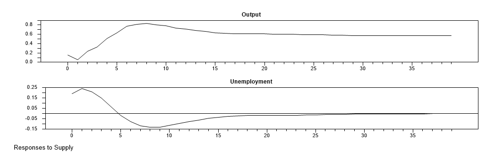{#fig-bq-supply-irf}

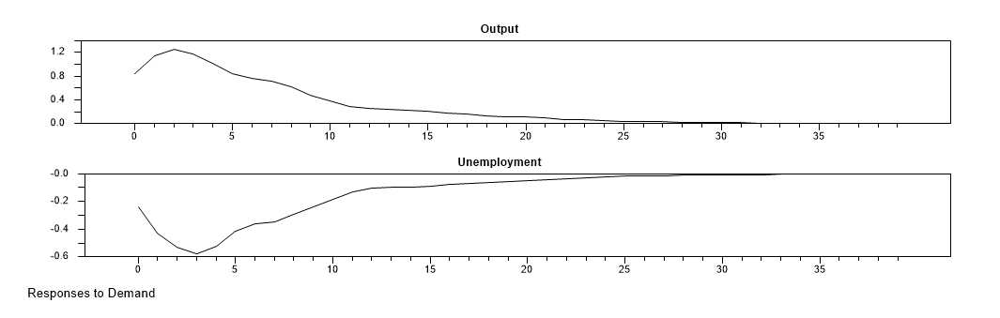{#fig-bq-demand-irf}

**Results.** Demand shocks produce a hump-shaped rise in output and a fall in unemployment, with effects fading over 3 to 5 years; supply shocks build over about 2 years and plateau after about 5, with unemployment possibly rising initially. The variance decomposition attributes 40 to 95 percent of output volatility at the 1-year horizon to demand shocks (a wide interval).
:::

::: {.callout-tip title="Another example: technology shocks à la Galí (1999)"}
Galí [-@Gali1999] asks: what is the effect of technology shocks on hours worked? A VAR with labor productivity $\Delta(Y_t/N_t)$, hours (or employment) growth $\Delta N_t$, and other variables identifies shock 1 as a technology shock and shock 2 as a composite of non-technology shocks (demand, policy). The long-run restriction: only technology shocks affect the long-run level of productivity, so non-technology shocks have zero long-run effect on $Y_t/N_t$, $\sum_{h=0}^{\infty}\Psi_h(\Delta(Y/N), \text{non-tech}) = 0$.

**Results.** A positive (permanent) technology shock raises output but *lowers* hours worked in the short and medium run - evidence that challenges the standard real-business-cycle prediction that hours rise after a productivity shock. Technology shocks' contribution to the variance of output and hours is modest; non-technology (demand) shocks dominate.
:::

::: {.callout-warning title="Limits of long-run restrictions"}
Long-run restrictions require strong assumptions about the trend properties of the variables (unit roots, cointegration), and at least one series that was stationarized from an originally $I(1)$ series to allow for a permanent shock at all. They implicitly assume the long-run restriction holds *exactly* - e.g. that demand or money *never* change long-run output, a remarkably strong claim. Fatás and Summers [-@FatasSummers2018] document persistent, not just transitory, effects of fiscal consolidations on output, and more broadly it is unclear why cyclical (business or financial cycle) components should have *no* long-run effect on trend at all, rather than contributing to structural change (cf. Pasinetti, Schumpeter, Harvey, and Goodwin's late work). Long-run restrictions remain, nonetheless, another legitimate way of using economic structure - here, permanence versus transience rather than timing - to select one structural model among the many reduced forms consistent with the data.
:::

::: {.callout-note title="A related empirical fact: the persistence of crisis effects"}
Measuring the output effects of financial crises via estimated impulse responses across 190 countries (1960-2001), Cerra and Saxena [-@CerraSaxena2008], "Growth Dynamics: The Myth of Economic Recovery," find a widening output-*level* loss rather than a temporary growth dip: recessions induced by the financial cycle are longer and deeper, and can leave a permanent mark on the level of output, not merely on its growth rate (a finding echoed by BCBS 2010, Claessens et al. 2012, and Drehmann et al. 2017).

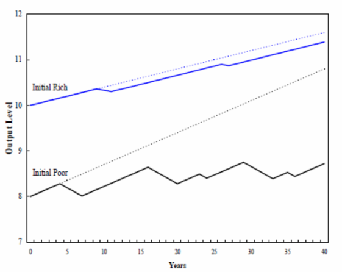{#fig-crisis-permanent-effect}
:::

## Sign restrictions {#sec-sign-restrictions}

Both short-run and long-run restrictions require *exact zeros*, and often strong functional-form assumptions along with them. **Sign restrictions**, most closely associated with Uhlig [-@Uhlig2005], instead exploit that economic theory often delivers the *sign* of a response without pinning down its exact size or timing. The restriction takes the form $\Psi_h(i,j) \ge 0$ or $\le 0$ for chosen variables $i$, shocks $j$, and horizons $h \in \mathcal{H}$ - no exact zeros, and a correspondingly more agnostic, less parametric identification strategy.

### Rotations and set identification

As before, if the VAR is stable it has a VMA($\infty$) representation, $y_t = \mu + \sum_h \Phi_h u_{t-h} = \mu + \sum_h \Psi_h \varepsilon_{t-h}$, $\Psi_h = \Phi_h C(0)$, and sign restrictions are inequality constraints on the entries of $\Psi_h$. Starting from any factorization $\Sigma_u = PP'$ (e.g. Cholesky - the specific choice does not matter, since it will be rotated away), any orthogonal $Q$ gives another valid $C(0) = PQ$, and hence $\Psi_h = \Phi_h P Q$ for *every* orthogonal $Q$. Sign restrictions select a *subset* of admissible rotations,

$$
\mathcal{Q}^* = \big\{Q \in \mathbb{R}^{k\times k} : Q'Q = I_k,\ \Psi_h(i,j) = \Phi_h P Q \text{ satisfies all sign constraints}\big\},
$$

giving a whole *set* of admissible $Q$ - **set identification**, not point identification - summarized, e.g., by the pointwise median IRF and credible bands across $\mathcal{Q}^*$.

::: {.callout-warning title="Sign schemes can still fail to identify, or over-identify"}
In a $2\times 2$ VAR with output $y_t$ and prices $p_t$: a *weak* scheme where demand and supply shocks both imply $(+,+)$ responses leaves the two shocks observationally equivalent under the restrictions - swapping the two columns of $C(0)$ leaves $\Sigma_u$ and the sign pattern unchanged, so you cannot tell which shock is which. A *better* scheme gives each shock a distinct sign signature - e.g. demand $(+,+)$, supply $(+,-)$ - so that columns of $C(0)$ carry different sign signatures and far fewer $Q$ remain admissible.
:::

**Algorithm.** (1) Estimate the reduced-form VAR to get $\hat A_i$, residuals $\hat u_t$, covariance $\hat\Sigma_u$. (2) Compute any factorization $\hat\Sigma_u = \hat P\hat P'$ (e.g. Cholesky). (3) For many draws: draw a random orthogonal $Q$ (e.g. from the Haar measure on $O(k)$), set $C(0) = \hat P Q$, compute structural IRFs $\Psi_h = \hat\Phi_h C(0)$, and check the sign restrictions on $\Psi_h(i,j)$ for every $(i,j,h)$ in the restriction set - keep $(C(0), \Psi_h)$ if satisfied, discard otherwise. (4) Summarize the collection of accepted IRFs, e.g. by the pointwise median and 16-84 percent bands - every retained curve corresponds to a structural decomposition consistent with the sign restrictions.

::: {.callout-tip title="Example: Uhlig (2005)"}
A VAR on postwar U.S. data with GDP, prices, commodity prices, non-borrowed reserves, the federal funds rate, and other variables. The goal: identify a **contractionary monetary policy shock**. Following such a shock, for several quarters after impact, Uhlig imposes: the short-term interest rate rises (federal funds rate non-negative); a monetary aggregate (non-borrowed reserves) falls; the price level or inflation does not increase (ruling out the "price puzzle" - though it is worth asking *why* it should never occur). Crucially, **no restriction** is placed on real GDP: the data alone determine whether output rises, falls, or is essentially unchanged.

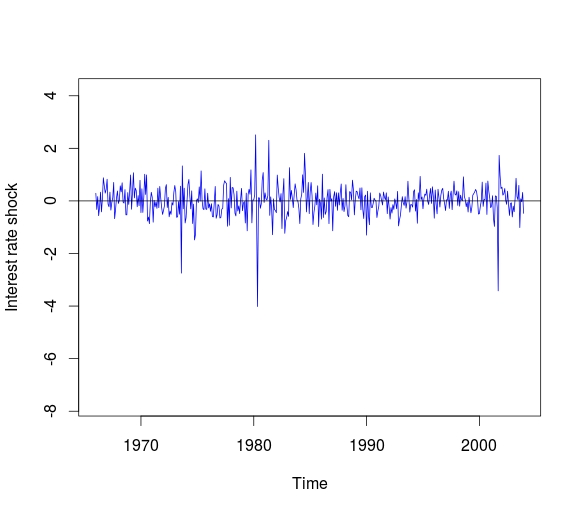{#fig-uhlig-shock-series}

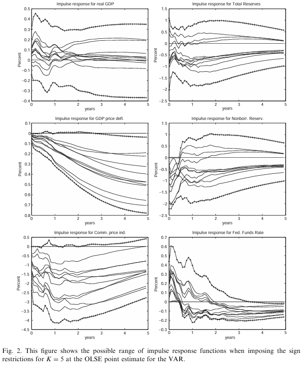{#fig-uhlig-irf-range}

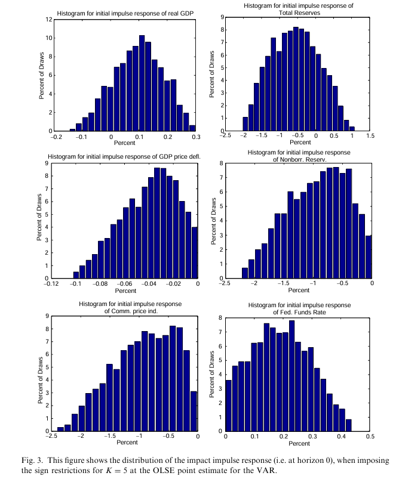{#fig-uhlig-irf-histograms}

**Qualitative findings.** The price level falls only gradually, and the GDP response is ambiguous - consistent, in Uhlig's reading, with near-neutrality of monetary policy across many samples.
:::

### Pros, cons, and a serious critique

**Advantages.** Sign restrictions are weaker than exact zero short-run or long-run restrictions, less sensitive to variable ordering (no recursive hierarchy is imposed by construction), and provide a direct way to encode qualitative theoretical predictions in the IRFs. **Limitations.** They typically deliver only set identification - many admissible $C(0)$, hence IRFs that are intervals, sometimes wide - and results can be sensitive to which variables and horizons are restricted, and to whether "weak" sign restrictions (allowing small violations) are used. They cannot easily impose near-zero (as opposed to purely directional) responses, though bounds restrictions on elasticities are possible as an extension. And sign restrictions remain a theoretical device: if the underlying economic restrictions are misspecified - in particular, if they ignore the systematic policy rule - the identified "shock" may not be the structural shock intended.

::: {.callout-warning title="Why Uhlig (2005) finds almost no GDP effect: a methodological diagnosis"}
Uhlig's identification places no restriction on the GDP response - by design - but *also* none on the systematic policy rule governing how $i_t$ reacts to $y_t, p_t$, and other variables. Arias, Caldara, and Rubio-Ramírez [-@AriasCaldaraRubioRamirez2016] make the implicit contemporaneous policy equation explicit,

$$
i_t = \psi_y y_t + \psi_p p_t + \psi_{pc}pc_t + \psi_{tr}tr_t + \psi_{nbr}nbr_t + \varepsilon^{mp}_t,
$$

and show that under Uhlig's sign restrictions alone, the posterior median $\psi_y \approx -0.43$ (with $P(\psi_y < 0) \approx 0.66$), and $\psi_{tr}, \psi_{nbr} \ne 0$ with probability near 1. Most admissible models therefore imply a *counterfactual* policy rule in which the Fed raises rates when output falls and reacts to reserves - the opposite of a standard reaction function.

Because $\psi_y < 0$ in most admissible draws, many of the "MP shocks" selected by the sign restrictions are actually *mixtures* of a genuine rate hike plus an underlying negative demand shock that had already pushed output down. Under such a rule, episodes where rates rise while output is weak or falling get rationalized as "monetary shocks" - because the counterfactual rule would otherwise want to *cut* rates as output rises. Since those episodes typically occur in bad times (or alongside other shocks), GDP does not fall much further in the sample, and can even rebound over time. Averaging across all such admissible models drives the median GDP IRF toward zero, or even a positive sign - a severe underestimation, potentially a sign reversal, of the true contractionary effect.

**The fix.** Arias, Caldara, and Rubio-Ramírez keep Uhlig's agnosticism about the *output* response - no sign restriction on the IRF of $y_t$ - but instead discipline the *systematic* policy rule directly: e.g. a baseline where the federal funds rate reacts contemporaneously only to $y_t$ and $p_t$ with $\psi_y, \psi_p > 0$ and $\psi_{tr} = \psi_{nbr} = 0$, or an alternative where it reacts only to money and commodity prices. Under both schemes, a contractionary shock ($r_t \uparrow$) now produces a clear, hump-shaped fall in output, a decline (or at least no sustained rise) in the price level, and a medium-run easing as policy reacts systematically to the resulting slowdown. The lesson: sign restrictions on IRFs alone can admit counterfactual systematic policies, generating misleading "monetary shocks"; imposing restrictions directly on the structural coefficients (see also Baumeister and Hamilton, 2015) rather than on the IRFs themselves can mitigate this problem in set-identified SVARs.
:::

## The narrative approach {#sec-narrative-approach}

Estimated SVAR shocks can suffer from a serious **omitted-variable bias**: both policy actions and real economic activity are influenced by variables not included in the SVAR. The **narrative approach** instead gathers systematic evidence from contemporaneous qualitative sources - newspapers, official reports, policy transcripts - to date episodes of policy action that were plausibly *not* a systematic response to the state of the economy.

Even a careful Cholesky-based attempt to recover a monetary policy shock from a backward-looking Taylor-rule residual remains biased, for two structural reasons. First, we rarely observe the central bank's full information set: the bank reacts to internal forecasts, risk assessments, financial-stability concerns, and political constraints that are typically not included in a VAR or a Taylor-rule regression, so the residual still contains this omitted information. Second, the econometrician may misspecify the policy reaction function itself: the true rule need not be linear or constant over time (compare, e.g., the Volcker and Bernanke eras), so a misspecified rule makes the residual diverge from the true shock. The narrative approach targets policy actions that are *intentionally* unrelated to the state of the economy, sidestepping both problems.

::: {.callout-note title="Romer and Romer: narrative identification of monetary shocks"}
Romer and Romer (seminal 1989 paper, revised 2023 [-@RomerRomer2023]) read Federal Open Market Committee *Minutes* to find dates of exogenous monetary policy decisions - episodes where the central bank deliberately tightened or loosened policy for reasons *not* driven by current or expected output - producing a time series of shock indicators $m_t \in \{-1, 0, 1\}$. More precisely, the original approach looks for times when policymakers judged the economy to be roughly at potential output, but decided inflation was too high, and chose to raise interest rates or cut money growth while accepting the risk of adverse output and unemployment consequences (in AS/AD terms: a deliberate leftward shift of the aggregate demand curve). The 2023 revision extends this to *expansionary* shocks - episodes where policymakers judged activity to be at a stable level but acted to lower unemployment, accepting adverse inflation consequences.

Narrative shocks can be used in three ways: included as an exogenous regressor (a VARX), or as the shock in an SVAR block treated as purely exogenous; used directly as the regressor of interest in a local projection (@sec-local-projections; Jordà [-@Jorda2005][^jorda-year-note]) to compute IRFs; or, if the measurement is noisy, used as an *instrument* in a proxy-VAR (@sec-proxy-var). The first two methods tend to give quite similar results, though local projections additionally accommodate nonlinearities.
:::

[^jorda-year-note]: <!-- REVIEW: possible substantive issue in original slides: the slide cites "Jordà, 2015" for local projections, but the seminal local-projections paper, "Estimation and Inference of Impulse Responses by Local Projections," is Jordà (2005), American Economic Review 95(1). This may be a typo in the source slide (or a reference to a different, later Jordà paper not otherwise identified in the lecture); the 2005 citation is used here as the best-supported match. --> Cited in the source slides as "Jordà, 2015"; the well-established local-projections paper carrying this title is dated 2005 (see the note above).

The same logic applies to identifying **fiscal** shocks. Ramey and Shapiro [-@RameyShapiro1998] identify defense-spending shocks from episodes where *Business Week* suddenly forecast large defense spending unrelated to the state of the U.S. economy - capturing genuine *news* about future spending (a shock to expectations), rather than the delayed execution of already-planned spending. Three original episodes: the start of the Korean War (July 1950), the escalation of the Vietnam War (February 1965), and the Soviet invasion of Afghanistan (January 1980); Ramey [-@Ramey2011] adds September 11, 2001 as a fourth date.

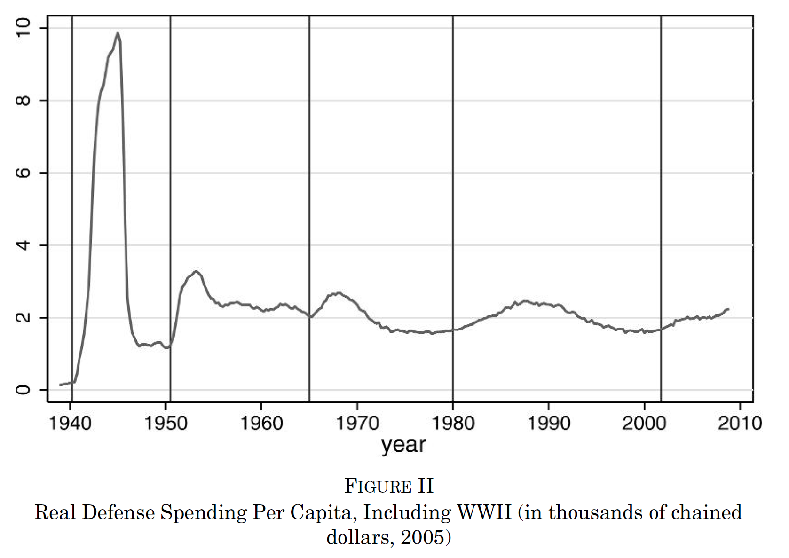{#fig-ramey-defense-spending}

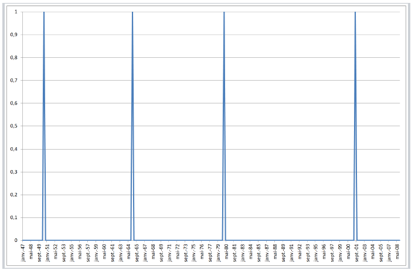{#fig-ramey-shapiro-dates}

Fiscal shocks are typically *anticipated*: agents react to the news at announcement, well before implementation, which is why the narrative approach - built on external sources like media coverage - can capture information a VAR would otherwise miss.

### Narrative identification versus Cholesky SVARs

Narrative identification uses historical information (official records, newspapers, institutional documents) to date shocks that are plausibly exogenous; Cholesky SVARs instead identify shocks from purely statistical timing restrictions (an ordering, e.g. spending ordered first so that its reduced-form innovation is *defined* as the spending shock). If both approaches capture the same underlying shock, their IRFs should agree; systematic differences point to problems of timing, of anticipation, or of the ordering assumption itself.

::: {.callout-tip title="Illustration: Ramey (2011)"}
Comparing narrative and Cholesky identification of government spending shocks: government spending, GDP, and hours show broadly similar responses under both approaches, but *much stronger* rises in GDP and hours under narrative identification - attributable to the expectations effect the narrative measure captures and a standard Cholesky VAR does not. Consumption, investment, and wages, by contrast, show *opposite signs* across the two approaches.

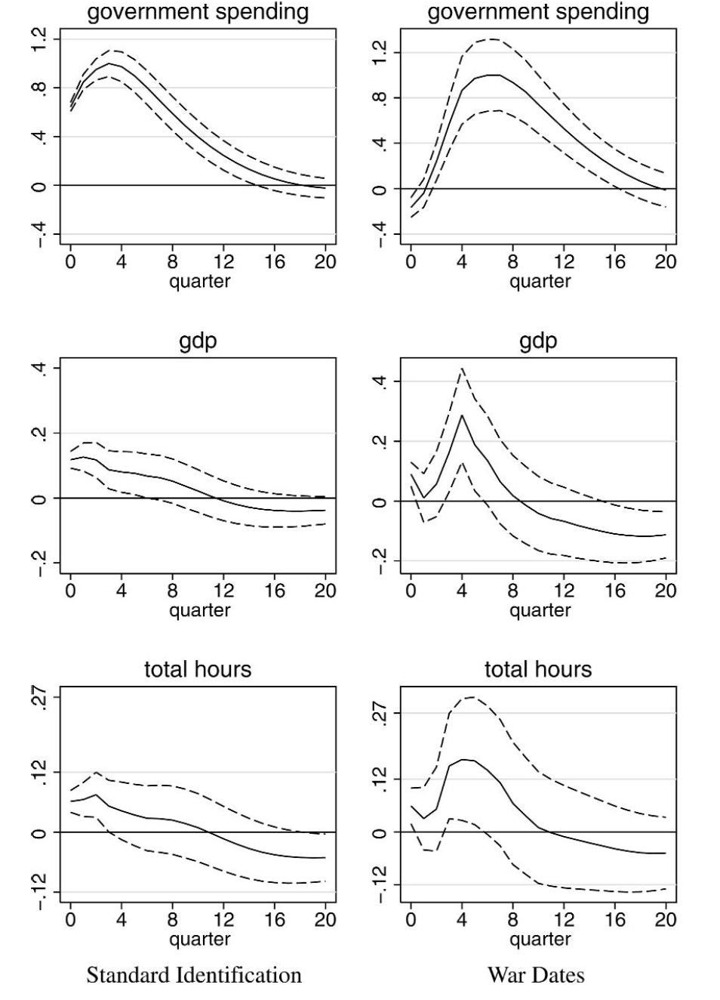{#fig-ramey-irf-comparison-1}

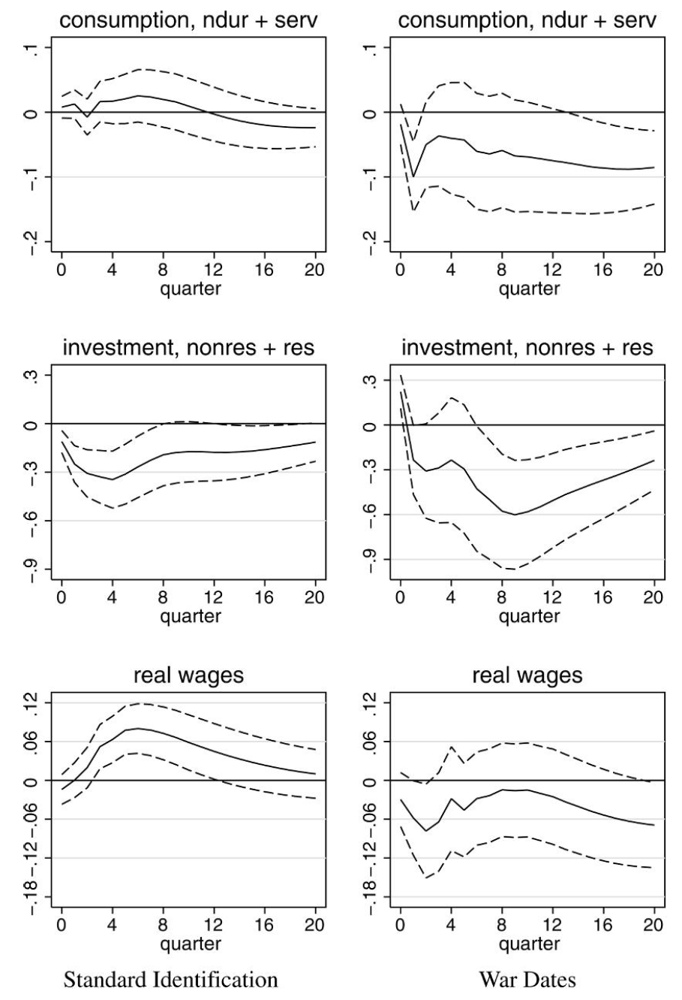{#fig-ramey-irf-comparison-2}
:::

Granger causality (@sec-granger-causality) serves as a diagnostic here: if narrative shocks or professional forecasts Granger-cause the SVAR's estimated shocks, the SVAR shock is dated too late; if the SVAR shocks instead Granger-cause the narrative measure, the narrative measure is likely incomplete or itself endogenous.

::: {.callout-tip title="Illustration: Ramey (2011), Granger-causality diagnostics"}
War-news shocks and Survey of Professional Forecasters forecasts *Granger-cause* the VAR's "spending shocks" - and not the reverse - implying the VAR shocks are missing the timing of the underlying news (they are dated too late, i.e. delayed relative to when agents actually learned of the spending change).

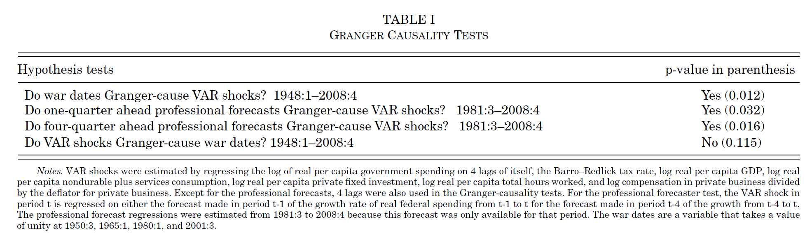{#fig-ramey-granger}
:::

### Monetary policy shocks: a closer look

Monetary policy shocks are particularly hard to identify given the strong endogeneity between macro activity and policy in both directions: macro conditions shape policy, which in turn shapes macro outcomes. In practice, exogenous MP shocks are usually estimated from data *other* than what enters the SVAR, then fed into it to trace out dynamic macro effects - narrative identification, following Romer and Romer's seminal 1989 paper (revised 2023), being the most influential such approach. An MP shock, in this sense, is a policy move not driven by output or other factors that affect output today or in the future.

{#fig-rr-requirements}

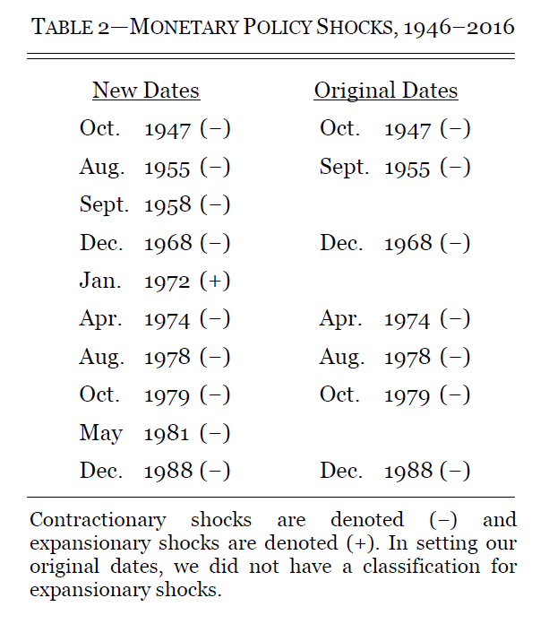{#fig-rr-dates}

The identified shock series takes $m_t = 1$ for a contractionary MP shock at date $t$, $m_t = -1$ for an accommodative shock, and $m_t = 0$ otherwise. Its dynamic effect is then assessed via a local projection à la Jordà [-@Jorda2005],

$$
y_{t+h} = \alpha^h + \beta^h m_t + \sum_{k=1}^K \theta_k m_{t-k} + \sum_{k=1}^K \phi_k y_{t-k} + u^h_{t+h},
$$

with the sequence of estimated $\beta^h$ across horizons $h$ tracing out the IRF to a unit realization of the shock dummy. In Romer and Romer's (2023) implementation: $K=12$ lags at monthly frequency (or $K=4$ quarterly), sample 1946-2016, and outcome variables including the unemployment rate, GDP, and several inflation measures (GDP deflator, PCE, core PCE).

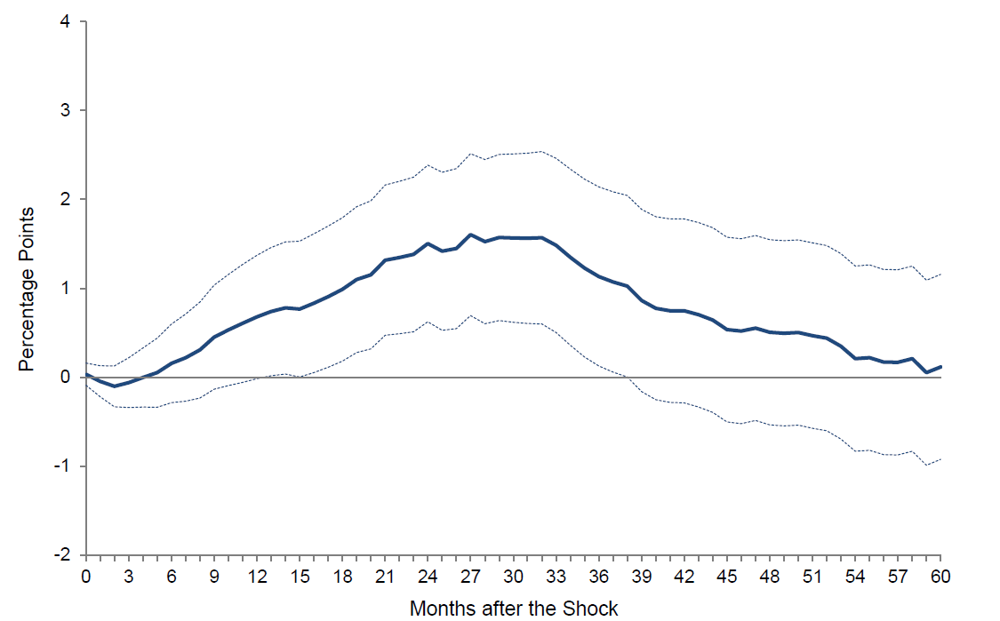{#fig-rr-unemployment-irf}

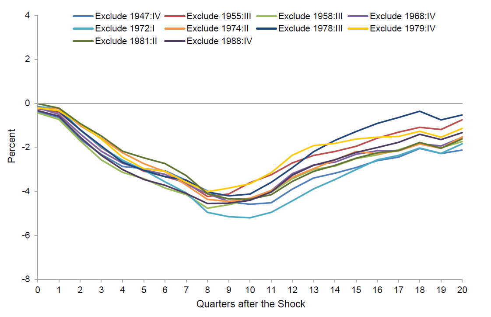{#fig-rr-gdp-robustness}

A related, complementary narrative strategy (Romer and Romer [-@RomerRomer2004]) defines the shock as the component of a policy instrument $s_t = f(\Omega_t) + \varepsilon_t$ that is *orthogonal to the information the policymaker was reacting to*, where $\Omega_t$ is the central bank's information set and $f(\cdot)$ the systematic component of policy. Concretely, estimate $\Delta i_t = \alpha + \beta i_t + \gamma X_t^f + \varepsilon_t^{RR}$, where $i_t$ is the policy rate and $X_t^f$ are the central bank's own forecasts made at time $t$ (e.g. FOMC "Greenbook" forecasts for the Fed) - so that $\varepsilon_t^{RR}$ is purged both of endogenous responses to current developments and of pre-emptive responses to developments the bank already anticipated. This relies on two assumptions: that the chosen forecasts are a good proxy for the information actually relevant to the decision, and that the mapping from information to decisions, $f(\cdot)$, is well approximated as linear. More recent work (Aruoba and Drechsel, 2023) extends this using natural language processing on FOMC Minutes text to enrich the information set and relax the linearity assumption on $f(\cdot)$ - underscoring that identifying "the" monetary policy shock remains, in no small part, a problem in the sociology of institutions and public officials, not only in statistics.

## External instruments: the Proxy-VAR {#sec-proxy-var}

Narrative shocks and high-frequency market surprises are rarely a perfect measurement of the true structural shock - they are, at best, noisy proxies for it. Putting such a proxy directly into a VAR as if it *were* the shock (as in the local-projection specifications of the previous section) invites attenuation bias and a misspecified dynamic system whenever the measurement error is non-trivial. The **Proxy-VAR** approach instead treats the proxy series as an *external instrument*, using only its covariance with the VAR's reduced-form residuals to pin down the target shock, rather than treating it as the shock itself.

::: {.callout-important title="Setup"}
Let the observed proxy $z_t$ be a noisy signal of the target structural shock $\varepsilon_t^*$,

$$
z_t = \lambda\,\varepsilon_t^* + \eta_t,
$$

with $\eta_t$ measurement noise uncorrelated with every structural shock. Two conditions make $z_t$ a valid instrument for $\varepsilon_t^*$: **relevance**, $\mathrm{Cov}(z_t, \varepsilon_t^*) \ne 0$ (the proxy actually carries signal about the shock of interest), and **exogeneity**, $\mathrm{Cov}(z_t, \varepsilon_t^j) = 0$ for every other shock $j \ne *$ (the proxy's noise is uncorrelated with every *other* structural shock in the system) - exactly the relevance and exclusion-restriction conditions familiar from instrumental-variable estimation.

The corresponding moment-condition and two-stage least-squares logic is introduced in @sec-gmm.
:::

**How it works, as a Proxy-SVAR.** Estimate the reduced-form VAR to obtain residuals $u_t$; identify the impact vector of the target shock as $b_* \propto E[u_t z_t]$, the covariance of the reduced-form residuals with the proxy - this works because, under the exogeneity condition, only the *column* of the impact matrix $B$ associated with $\varepsilon_t^*$ actually covaries with $z_t$, so that covariance vector identifies (up to scale) exactly that column; normalize $b_*$ to represent a one-unit shock, and compute IRFs from it exactly as in any other identified SVAR (@sec-irf).

**Alternative: LP-IV.** Rather than building a full Proxy-SVAR, the same identification logic can be embedded directly in a local projection (@sec-local-projections): for each horizon $h$, regress $y_{t+h}$ on the reduced-form residual $u_t$ and its lags, *instrumenting* $u_t$ with the proxy $z_t$. The resulting IV coefficient $\theta_h$ *is* the impulse response at horizon $h$ - the same object the Proxy-SVAR route delivers, but estimated horizon by horizon in the local-projection style rather than derived from a single estimated VAR.

Whichever route is used, the usual instrumental-variable diagnostics apply directly: check first-stage strength (an F-statistic) to rule out a weak-instrument bias in the identified shock, use robust inference (HAC standard errors, or a bootstrap) given the overlapping-horizon structure of the residuals, and always verify that the resulting IRF has an economically sensible sign and shape before trusting it.

## What are shocks, really?

::: {.callout-warning title="An open question, not a technicality"}
DSGE models typically need to assume a large number of structural shocks simply to be identified at all (otherwise the model suffers from *stochastic singularity* relative to the data). But what *are* these shocks? Genuine, ontological exogenous causes - or simply a measure of our ignorance, much as the Solow residual, often treated as a "technology shock," in fact bundles together unobserved changes in labor hoarding, capacity utilization, and the vintage structure of capital? Or could much of what linear models label a "shock" actually be *endogenous fluctuations* generated by nonlinear dynamics that a linear specification is simply unable to recognize as such? Cochrane [-@Cochrane1994] poses exactly this question in "Shocks."
:::

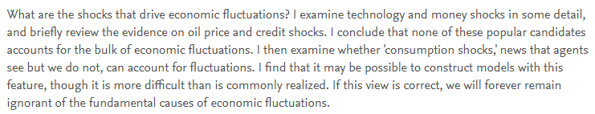{#fig-cochrane-abstract}

## Where we stand, and the limits of linearity

So far, every identification strategy in this chapter - recursive short-run restrictions, more general short-run restrictions, long-run restrictions, sign restrictions, and narrative or proxy-based external instruments[^appendix-strategies] - has operated within a **linear** macroeconometric system, $y_t = A_1y_{t-1} + \cdots + A_py_{t-p} + u_t$, $u_t = C(0)\varepsilon_t$. Within that framework we have achieved forecasting and a description of dynamic interactions (the reduced-form VAR), and the recovery of causal shock effects (the SVAR). But all of it rests on one crucial assumption: **the data-generating process is linear.**

[^appendix-strategies]: Two further identification strategies - identification via heteroskedasticity, and max share identification, including in the spectral domain - are developed in the appendix to this chapter.

Three consequences of that linearity are worth stating explicitly, because each is a substantive empirical claim, not a harmless technicality. First, since VARs are linear, a positive shock is exactly the mirror image of a negative shock of the same size; only a nonlinear model can generate genuine asymmetry. Do macro multipliers really have the same magnitude in an expansion as in a recession (informally: consider the Greek crisis)? Second, the magnitude of the initial shock does not affect the *shape* of the IRF: a "unit shock" is conventionally a one-standard-deviation shock to a residual, and a shock 2.3 times as large produces an impulse response exactly 2.3 times as large. Does this scale-invariance hold in practice, or are there thresholds and tipping points (the Great Moderation, policy rates near an effective lower bound, a "Minsky moment")? Third, a **stable** linear VAR always converges back to a unique equilibrium: with $\Phi_h \to 0$ as all eigenvalues of the companion matrix lie inside the unit circle, $E[y_{t+h} \mid y_t] \to 0$ (or the unconditional mean $\mu$, if not demeaned) as $h \to \infty$; an **unstable** linear VAR (some $|\lambda| \ge 1$) instead has forecasts that explode, with no other possibility in between.

When dynamics genuinely depend on the state of the economy - when IRFs themselves change with the business cycle - a linear VAR cannot represent that by construction, whatever identification scheme is layered on top of it. This motivates the **nonlinear** models developed in the next chapter: threshold VARs, smooth-transition VARs, Markov regime-switching VARs, local projections with nonlinear terms, and state-dependent IRFs more generally.

## Appendix: two further identification strategies

Two additional families of identification strategy round out the toolkit, each carrying its own, different, non-trivial assumption (volatility stability in the first case, a variance-dominance criterion in the second) rather than being assumption-free.

### Identification through heteroskedasticity

Suppose the economy moves from a *quiet* regime to a *turbulent* one, so that the reduced-form residual covariance changes across regimes, $\Sigma_1 = E(u_tu_t' \mid s_t = 1) \ne \Sigma_2 = E(u_tu_t' \mid s_t = 2)$. If the transmission matrix from structural shocks to reduced-form innovations is stable across regimes, but the *variances* of the structural shocks change, the second covariance matrix carries genuinely new information: volatility changes rotate the covariance ellipse, and if shocks become more or less volatile by different relative amounts, this rotation helps recover the structural directions [@Rigobon2003; and related work by Rigobon and Sack, Sims and Zha, and Lütkepohl and Netšunajev].

Starting from the reduced form $y_t = A_1y_{t-1} + \cdots + A_py_{t-p} + u_t$, $u_t = B\varepsilon_t$, with structural shocks orthogonal *within* each regime, $E(\varepsilon_t\varepsilon_t' \mid s_t=r) = \Lambda_r$ diagonal, the regime covariances are $\Sigma_r = B\Lambda_rB'$. Normalizing regime 1's scale, $\Lambda_1 = I$, gives $\Sigma_1 = BB'$ and $\Sigma_2 = B\Lambda_2B'$: the *same* unknown matrix $B$ must now explain *two* covariance matrices rather than one. With this normalization, $\Sigma_2\Sigma_1^{-1} = B\Lambda_2B^{-1}$, so the columns of $B$ are the eigenvectors of $\Sigma_2\Sigma_1^{-1}$, and the corresponding eigenvalues are the relative volatility changes of the structural shocks. **Identification requires** $\lambda_i \ne \lambda_j$ for $i \ne j$: shock $i$ and shock $j$ must not share the same volatility ratio between the two regimes. If every shock became, say, twice as volatile in the turbulent regime, heteroskedasticity provides no additional identifying information; if instead financial shocks explode in volatility while technology shocks barely move, it can help a great deal.

::: {.callout-tip title="Example: Rigobon and Sack"}
The observed correlation between interest rates and stock prices reflects two simultaneous relationships - a monetary policy response to stock prices, and a stock-market response to interest rates - that cannot be told apart from a single, homoskedastic sample. When stock-market shocks become more volatile (e.g. during a period of market turmoil), the data cloud stretches specifically along the monetary-policy reaction-function line, allowing its slope to be identified from the *change* in the covariance matrix across the two volatility regimes.

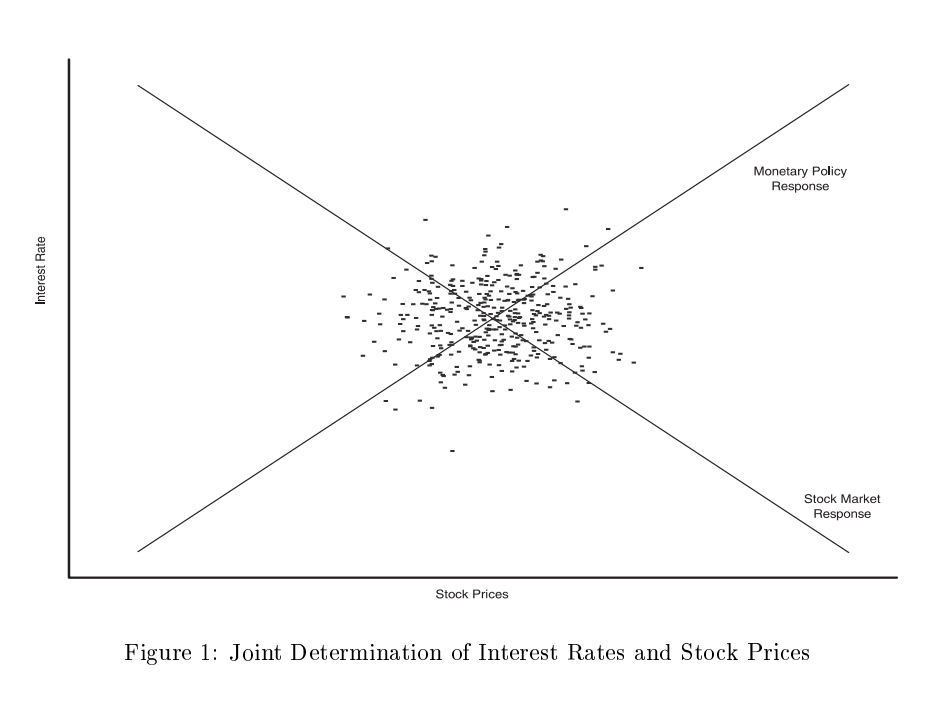{#fig-rigobon-low-vol}

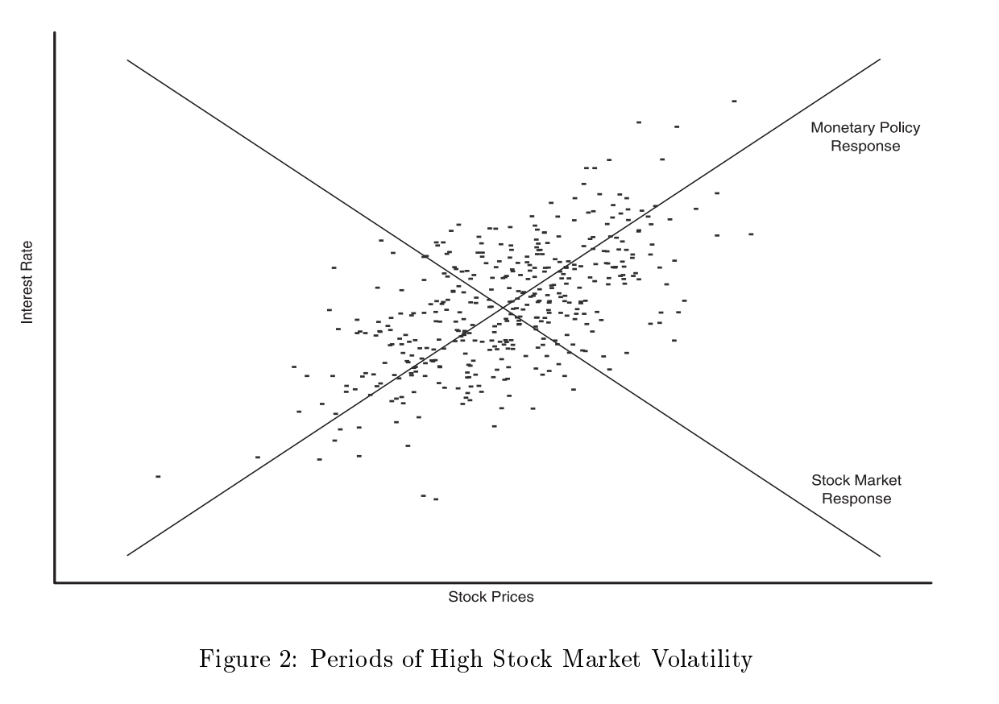{#fig-rigobon-high-vol}
:::

Identification here rests on several assumptions worth stating explicitly: a stable contemporaneous structure ($B$ unchanged across regimes); that only the *volatilities* $\Lambda_r$ shift, not necessarily the propagation mechanism itself; orthogonal structural shocks within each regime ($\Lambda_r$ diagonal); genuinely different relative volatility changes across shocks (otherwise only partial separation is achieved); and that the regimes themselves are economically meaningful, whether observed or inferred via a latent Markov process, and truly capture real shifts in volatility. This approach is fragile if a crisis changes underlying behavior, not just volatility. In practice: estimate a VAR allowing for volatility regimes, estimate the covariance matrix within each regime, recover structural directions via the joint-diagonalization logic above, and label the resulting shocks *ex post* using their IRFs, variance shares, or known historical episodes - heteroskedasticity can identify statistical *directions*, but not their economic names.

### Max share identification

A different idea: rather than defining a shock by what it *cannot* do (a zero or sign restriction), define it by what it **explains most**. A technology shock, for instance, can be defined as the shock explaining the largest share of productivity at a long but finite horizon; a news shock as the shock explaining a large share of *future* total factor productivity (TFP) with no contemporaneous TFP movement [@BarskySims2011]; a main business-cycle shock as the one explaining the largest share of GDP or aggregate volatility at business-cycle frequencies [@AngeletosCollardDellas2020]. This gives an *operational* definition of a shock as the dominant driver of a variable, horizon, or frequency band, rather than as the solution to a system of restrictions imposed a priori.

**Finite-horizon max share.** Among all orthogonal rotations, pick the shock $q$ that explains the largest share of variable $j$'s variance over horizons $0$ to $H$:

$$
q^\star = \arg\max_{q'q=1} \sum_{h=0}^{H}(e_j'\Phi_hPq)^2.
$$

Since the FEVD's denominator does not depend on $q$, this reduces to an eigenvector problem.

**Spectral max share.** Rather than a horizon $H$, choose a frequency band $\Omega$ instead - e.g. periodicities between 6 and 32 quarters, the conventional business-cycle band (@sec-ts-transformations). The spectral density implied by the VAR describes how variable $j$'s variance is distributed across frequencies, and a candidate shock $q$ is chosen to maximize the share of that frequency-specific variance it explains:

$$
q^\star = \arg\max_{q'q=1} \int_{\omega \in \Omega} \big|e_j'\Phi(e^{-i\omega})Pq\big|^2\, d\omega.
$$

Again an eigenvector problem, but now the objective is "explains variable $j$ at the frequencies conventionally called the cycle" rather than "explains variable $j$ after $H$ quarters." Angeletos, Collard, and Dellas's [-@AngeletosCollardDellas2020] "Business Cycle Anatomy" identifies a **Main Business Cycle (MBC) shock** this way - the single shock capturing the largest share of macroeconomic volatility at business-cycle frequencies - and then asks which DSGE mechanisms, if any, can generate a shock with that propagation pattern.

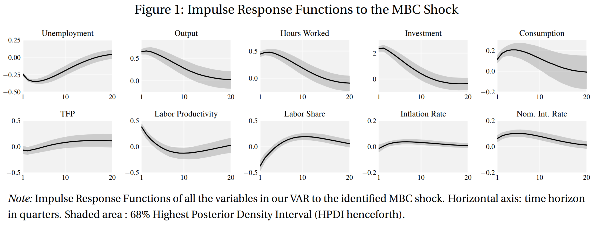{#fig-mbc-irf}

**Algorithm.** Estimate the reduced-form VAR; compute $\Phi_h$, or the frequency response $\Phi(e^{-i\omega})$; choose the target (a variable or set of variables, and a horizon or frequency band); build the corresponding positive semi-definite matrix of explained variance; take its leading eigenvector $q^\star$; compute IRFs, FEVD, and historical decomposition for the resulting shock $Pq^\star$.

**Strengths.** Max share identification avoids very strong long-run zero restrictions, works at finite horizons or over specific frequency bands, and is well suited to questions of the form "what is the dominant driver of this object?" **Limits.** The economic label of the resulting shock is not delivered by the eigenvector itself and must be argued for separately; different targets (variables, horizons, frequency bands) can produce different "dominant" shocks; a dominant statistical driver need not correspond to a single primitive structural cause; and, as always, an insufficiently rich information set can contaminate the recovered shock.
