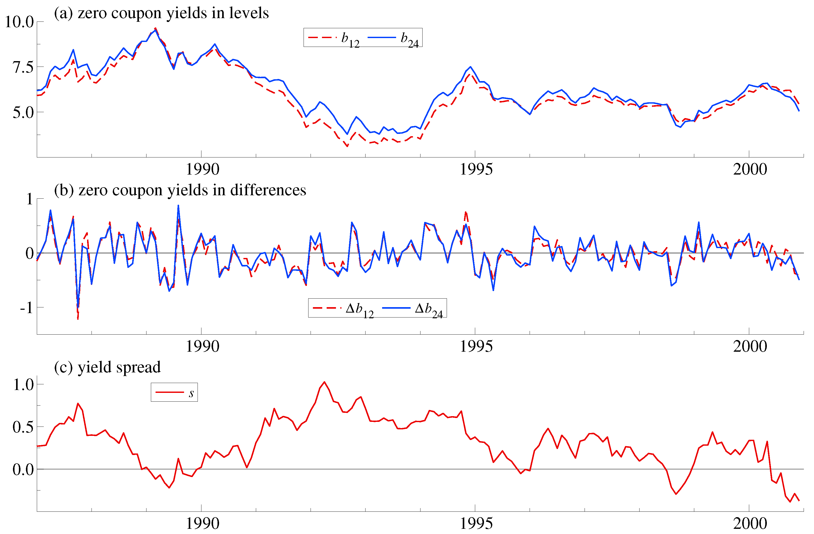
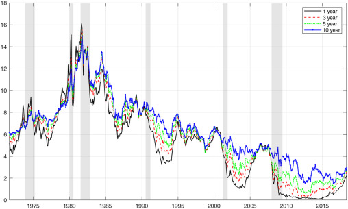
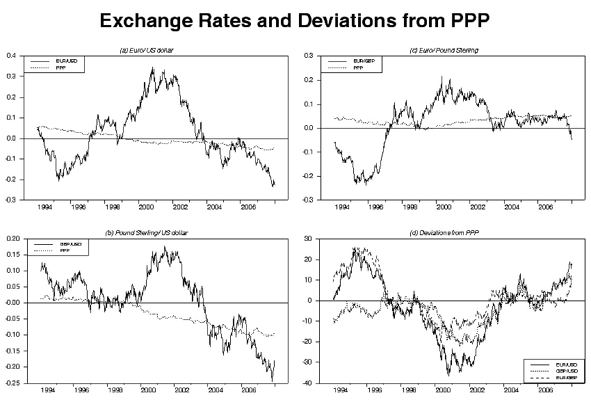
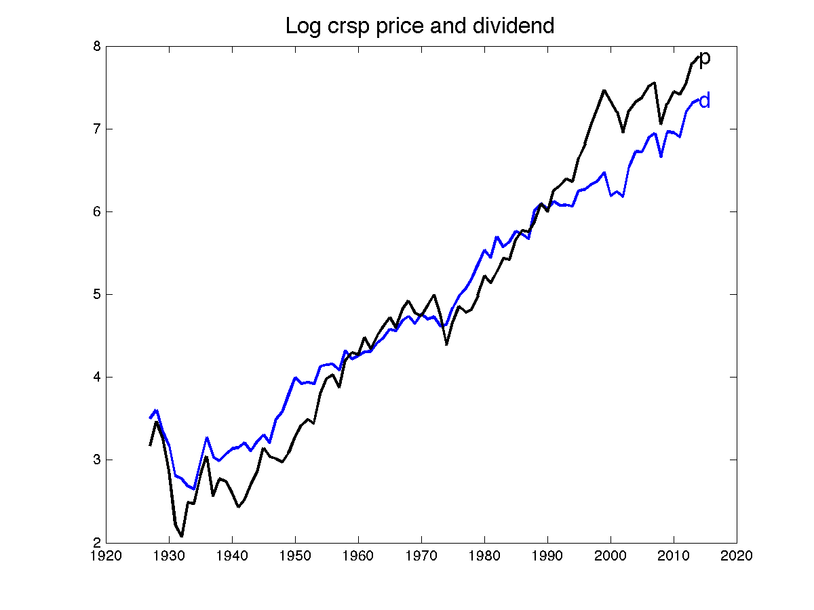
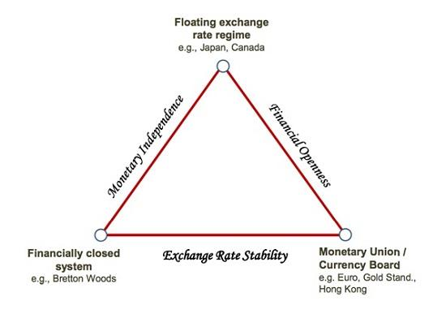
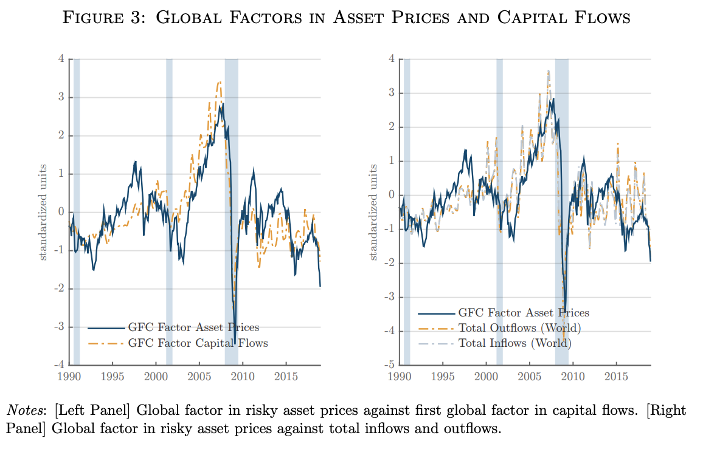

# Panel VAR, Cointegration, and Dynamic Factor Models {#sec-cointegration-dfm}

This chapter closes three loose ends left open by the VAR chapters. First, what to do when the units of observation are themselves a panel - many countries, banks, or sectors - rather than a single economy. Second, the case flagged repeatedly since @sec-var-cointegration: what to do when the variables in a VAR are $I(1)$ *and* cointegrated, where neither a levels VAR nor a differenced VAR is appropriate. Third, what to do when there are far more observed series than any VAR could handle - the dynamic factor model, and its VAR-based cousin, the factor-augmented VAR (FAVAR).

## A note on panel VAR

A **panel VAR (PVAR)** extends the VAR framework to panel data, modeling dynamic interactions *within* each unit while exploiting repeated observations *across* units - credit, capital, and risk for 100 banks over 10 years, say, or output, inflation, and employment for 20 countries or sectors:

$$
y_{i,t} = a_i + \sum_{\ell=1}^p A_{i\ell}y_{i,t-\ell} + u_{i,t}, \qquad i = 1, \ldots, N,
$$

with $y_{i,t}$ a $k$-vector of endogenous variables for unit $i$ and $a_i$ a unit-specific fixed effect. The model describes domestic, within-unit dynamics, and is useful for learning common or average dynamic patterns across many comparable units. The central modeling choice is how much heterogeneity to allow in $A_{i\ell}$ across units - should the slopes be pooled, partially pooled, or estimated separately?

**Strategy 1: pooled PVAR** (units are homogeneous). Assume identical slopes $A_{i\ell} = A_\ell$ across units, with only the intercepts $a_i$ differing. The estimation challenge is that removing $a_i$ by demeaning or first-differencing interacts badly with the dynamic structure: $y_{i,t-1}$ appears on the right-hand side *and* in the demeaned left-hand side, producing the **Nickell [-@Nickell1981] bias** - the within-group estimator is inconsistent at fixed $T$, with bias of order $-\frac{1+\rho}{T}$ that does *not* vanish as $N \to \infty$.[^nickell-intuition] The standard fix is **GMM estimation** [Arellano and Bond, -@ArellanoBond1991; Blundell and Bond, -@BlundellBond1998]: first-difference to remove $a_i$, then instrument $\Delta y_{i,t-1}$ with levels $y_{i,t-2}, y_{i,t-3}, \ldots$ (valid whenever $u_{i,t}$ is serially uncorrelated); **system GMM** adds a levels equation, instrumented with differences, for better finite-$T$ precision. This strategy suits similar-sized units under a shared institutional framework (banks of similar size, firms in the same sector), but is inconsistent if the slopes genuinely differ across units [@PesaranSmith1995].

[^nickell-intuition]: Intuition in the AR(1) case: first-differencing removes $a_i$ but leaves $\Delta y_{i,t} = \rho\Delta y_{i,t-1} + \Delta u_{i,t}$, with $\Delta u_{i,t} = u_{i,t} - u_{i,t-1}$. Since $\Delta y_{i,t-1} = y_{i,t-1} - y_{i,t-2}$ contains $u_{i,t-1}$, it is mechanically correlated with the $-u_{i,t-1}$ term inside $\Delta u_{i,t}$ - so OLS/within estimation is biased even when $u_{i,t}$ is itself serially uncorrelated, and the $O(1/T)$ bias does not vanish as $N \to \infty$ with $T$ fixed.

**Strategy 2: hierarchical panel VAR** (units heterogeneous but structurally related). Each unit gets its own slope $A_{i\ell}$, but units are assumed to share a common group structure - countries in a currency union, banks in the same regulatory tier. The natural implementation is Bayesian hierarchical: place a common prior $A_{i\ell} \sim \mathcal{N}(\bar A_\ell, \Sigma_A)$ and estimate via MCMC/Gibbs sampling (Canova and Ciccarelli, 2004; Jarociński, 2010), giving **partial pooling** - units with little data are shrunk toward the global mean, while data-rich units stay close to their own estimates. This suits heterogeneous units with small $T$, where fully separate VARs would be too noisy.

**Strategy 3: Mean Group (MG) estimator** [Pesaran and Smith, -@PesaranSmith1995] (units fully heterogeneous). Slopes are assumed fully heterogeneous, with no common structure beyond a common *mean*: estimate a separate VAR for each unit ($\hat A_{\ell,i}$, by OLS or GMM), then average, $\hat A_\ell^{MG} = \frac{1}{N}\sum_i \hat A_{\ell,i}$. The MG estimator is consistent under slope heterogeneity (unlike the pooled estimator), and $\bar A_\ell$ has a natural interpretation as the cross-unit average dynamic - but it is noisy when $T$ is small, with no shrinkage toward a common value; hierarchical pooling is preferable in that case.

| Strategy | Slope assumption | When to use |
|-|-|-|
| Pooled + GMM | Identical | Homogeneous units, small $T$ |
| Hierarchical | Heterogeneous, common structure | Heterogeneous units, small $T$ |
| Mean Group | Fully heterogeneous | Heterogeneous units, large $T$ |

: Panel VAR strategies, by slope-heterogeneity assumption {#tbl-pvar-strategies}

A related tool, the **Global VAR (GVAR)**, models an interconnected multi-economy system with spillovers across units. Each unit gets a country-specific VARX, $y_{i,t} = a_i + \sum_\ell A_{i\ell}y_{i,t-\ell} + \sum_\ell B_{i\ell}y^*_{i,t-\ell} + e_{i,t}$, with foreign aggregates $y^*_{i,t} = \sum_{j\ne i} w_{ij}y_{j,t}$ built from trade, financial, or input-output weights $w_{ij}$. This captures spillovers and network propagation while scaling far better than one huge unrestricted VAR: each country-specific VARX is estimated on its own (often treating $y^*$ as weakly exogenous for that unit), and the units are then stacked into a single global system, with any identification scheme respecting the cross-country structure.

## Cointegration {#sec-cointegration}

Return to the diagnostic question from @sec-var-cointegration: each series must first be checked for stationarity via unit-root tests (ADF, PP, ERS, KPSS). If all variables are $I(0)$, a standard VAR in levels is valid. If variables are $I(1)$ but *not* cointegrated, a VAR in first differences (or growth rates, if the levels were in logs) is needed - though its IRFs then describe only short-run dynamics, with long-run levels left unidentified. This chapter takes up the third and most interesting case in full.

::: {.callout-important title="What is cointegration?"}
Cointegration means that several non-stationary variables share a common long-run equilibrium relation despite short-run deviations, so that a specific linear combination of them is stationary even though each series individually is not: there exists $\beta$, the **cointegrating vector** (or long-run equilibrium vector), such that

$$
\beta'y_t = \sum_{i=1}^k \beta_i y_{i,t} \quad \text{is stationary,}
$$

even though each $y_{i,t}$ is $I(1)$.
:::

::: {.callout-tip title="A canonical example: consumption and income"}
Both consumption $C_t$ and income $Y_t$ individually look like random walks in levels, but households smooth consumption toward income in the long run, $C_t \approx \beta_0 + \beta_1 Y_t$, and the gap $u_t = C_t - \beta_0 - \beta_1 Y_t$ is stationary. More generally, if $y_{1,t}, y_{2,t} \sim I(1)$ but $y_{1,t} - \beta y_{2,t} \sim I(0)$, the two series are cointegrated: they may each drift, but they cannot drift *too far* apart.
:::

{#fig-coint-example}

Cointegration is a genuinely common pattern in macro and finance data. In the **term structure of interest rates**, $i^{\text{long}}_t - \beta i^{\text{short}}_t$ is stationary - long and short rates move together in the long run, consistent with the expectations hypothesis.

{#fig-yield-curve-coint}

In **purchasing power parity (PPP)**, $e_t + p_t - p_t^*$ is stationary - the nominal exchange rate and relative price levels co-move in the long run (loosely: if domestic inflation raises money supply and depresses exports, a compensating nominal depreciation should follow).

{#fig-ppp-coint}

Thirlwall's law - the **balance-of-payments-constrained growth** relation - ties exports, imports, and domestic and foreign income together, $X_t - \beta_1 M_t - \beta_2 Y_t - \beta_3 Y_t^* \sim I(0)$, with the implication that a country's long-run growth rate is approximately bounded by the growth of its exports divided by the income elasticity of its imports: if income grows and imports rise faster than exports can pay for them, the country hits an external constraint and must slow down.

In **housing markets**, $P_t^{\text{house}} - \theta_1 R_t - \theta_2 Y_t \sim I(0)$ ties house prices to rents and income through long-run affordability - though it is worth asking whether that relationship still holds as tightly as it once did.

{#fig-housing-coint}

Finally, the **dividend discount model** for stock prices, $P_t - \phi D_t$ stationary, is a theoretically motivated but empirically fragile cointegration claim: prices should reflect the discounted present value of dividends and expected returns; dividends have a unit root but expected returns are (in the simplest version of the theory) stationary, so essentially all long-run price variation should trace back to dividend variation rather than to time-varying discount rates. In practice the relationship looks progressively less stable, plausibly reflecting buybacks, quantitative easing, and genuinely time-varying discount rates.

{#fig-dividend-coint}

## The error-correction representation {#sec-vecm}

Start with a bivariate long-run relation, $y_t = \gamma_0 + \gamma_1 y_{t-1} + \gamma_2 x_{t-1} + u_t$, with $y_t, x_t \sim I(1)$ and cointegrated. Subtracting $y_{t-1}$ from both sides and rearranging,

$$
\Delta y_t = \gamma_0 - \alpha\underbrace{(y_{t-1} - \beta x_{t-1})}_{\text{error-correction term}} + u_t,
$$ {#eq-ecm}

with $\alpha = 1-\gamma_1$ and $\beta = \gamma_2/(1-\gamma_1)$. The term $e_{t-1} = y_{t-1} - \beta x_{t-1}$ is last period's deviation from the long-run equilibrium (with $E[e_{t-1}] = 0$ if the relation is genuinely stationary), and $-\alpha$ is the **speed of adjustment** back toward it: if $e_{t-1} > 0$ ($y_{t-1}$ too high relative to $x_{t-1}$), then $-\alpha e_{t-1} < 0$ and $y_t$ is pushed downward next period, and conversely if $e_{t-1} < 0$. With $\alpha > 0$, this is a systematic restoring force pulling $y_t$ back toward the long-run relationship.

::: {.callout-important title="The VECM in general form"}
For $y_t$ a $k \times 1$ vector of $I(1)$ variables, the **vector error-correction model (VECM)** of order $p$ - also called the Johansen model - is

$$
\Delta y_t = \Pi y_{t-1} + \Gamma_1\Delta y_{t-1} + \cdots + \Gamma_{p-1}\Delta y_{t-p+1} + u_t, \qquad \Pi = \alpha\beta', \quad \alpha, \beta \in \mathbb{R}^{k \times r}.
$$

$\beta'y_{t-1}$ gives $r$ long-run equilibrium relations (cointegrating combinations); $\alpha$ gives the adjustment (loading) coefficients describing how each variable reacts to short-run deviations from each equilibrium; and $\Gamma_i$ captures the short-run dynamics in differences (relevant once $p \ge 2$).
:::

### The cointegration rank

The rank $r = \mathrm{rank}(\Pi)$ tells us how many independent long-run equilibrium relations exist among the $k$ variables, and equivalently how many common stochastic trends remain ($k-r$ of them). Three cases:

- **$r = 0$: no cointegration.** No stationary linear combination of $y_t$ exists; model in differences, a VAR in $\Delta y_t$ with no error-correction term.
- **$0 < r < k$: cointegration present.** There are $r$ long-run relations and $k-r$ common stochastic trends; use a VECM with $\Pi = \alpha\beta'$, $\beta$ containing the $r$ cointegrating vectors and $\alpha$ the loading coefficients.
- **$r = k$: effectively no unit roots.** All variables are $I(0)$; a standard VAR in levels is appropriate, with no need to difference.

::: {.callout-tip title="Reading the rank in a 3-variable system"}
For $y_t = (y_{1,t}, y_{2,t}, y_{3,t})'$: at $r=1$, only one stationary combination $\beta_1'y_t \sim I(0)$ exists, and two stochastic trends remain. At $r=2$, two independent stationary combinations $\beta_1'y_t, \beta_2'y_t \sim I(0)$ exist, and only one stochastic trend remains. At $r=3$, three stationary relations span the whole space, which forces $y_{1,t}, y_{2,t}, y_{3,t}$ to each be $I(0)$ individually (each variable can be solved for as a stationary function of the others) - no VECM is needed, and a standard VAR in levels applies.
:::

### Testing for cointegration: the Johansen procedure

Testing for cointegration is not as simple as running ADF on some residual series $\beta'y_t$ for a guessed $\beta$: there is no way to test every possible linear combination one at a time, and cointegration is a property of the *system* as a whole, not of any single pair of series. A genuinely multivariate method is needed to estimate both the rank $r$ and the vectors $\beta$ jointly - the full-system maximum-likelihood approach of Johansen [-@Johansen1988; -@Johansen1991].

Since $\Pi$ contains all the long-run information, Johansen's approach estimates its eigenvalues $\lambda_1 \ge \cdots \ge \lambda_k$, which measure the strength of each candidate long-run relation: a large $\lambda_i$ signals a real cointegrating vector (deviations are pulled back strongly), a tiny one signals no further cointegration. Two test statistics are built from these eigenvalues: the **trace test**, $H_0: r \le r_0$ against $H_1: r > r_0$, $\lambda_{\text{trace}}(r_0) = -T\sum_{i=r_0+1}^k \ln(1-\hat\lambda_i)$; and the **maximum-eigenvalue test**, $H_0: r = r_0$ against $H_1: r = r_0+1$, $\lambda_{\max}(r_0) = -T\ln(1-\hat\lambda_{r_0+1})$. The standard procedure starts at $r_0 = 0$ and increases $r_0$ until the test fails to reject; the resulting $r$ is the estimated number of long-run equilibria.

::: {.callout-note title="Practical workflow with I(1) variables"}
1. Run unit-root tests on each variable ($I(0)$ versus $I(1)$).
2. If all series are $I(0)$: estimate a VAR in levels directly.
3. If some are $I(1)$: test for the cointegration rank $r$ (Johansen trace/max-eigenvalue tests).
4. If $r = 0$: a VAR in differences, short-run dynamics only.
5. If $0 < r < k$: estimate a VECM, then interpret $\beta$ (the long-run relations) and $\alpha$ (who adjusts to whom), and recover IRFs and FEVDs via the equivalent levels VAR.

$I(0)$ variables can coexist with $I(1)$ ones in the system; they simply do not participate in any cointegrating relation, which reduces the effective rank $r$ available among the genuinely $I(1)$ variables.
:::

### Interpreting $\beta$ and $\alpha$

**The cointegrating vector $\beta$** defines the stationary long-run relation and the fixed proportion in which variables move together - e.g. $C_t - 0.85Y_t$ stationary means consumption and income move together in an 0.85:1 long-run ratio. Only *relative* coefficients matter: if $\beta = (1,-2)$, then $p_t - 2c_t \sim I(0)$, meaning $p_t$ must be roughly twice $c_t$ in the long run - a 1-point rise in $c_t$ requires $\Delta p_t = 2$ to stay on the long-run path, a 0.5-point rise requires $\Delta p_t = 1$. Two caveats: with only $r=1$ cointegrating relation among 3 or more variables, $\beta$ gives only the equilibrium proportion, not which variable does the adjusting to restore it (that is $\alpha$'s job); and if $\beta_i = 0$ for a given variable in every cointegrating vector, that variable plays no role in the long-run equilibrium at all - **long-run exclusion** - even though it may still appear in the short-run dynamics $\Gamma$ through its first difference.

**The loading matrix $\alpha$** describes how each variable reacts once the system deviates from equilibrium: $\alpha_i < 0$ means variable $i$ falls to correct a positive disequilibrium, $\alpha_i > 0$ means it rises to correct it, $\alpha_i = 0$ means variable $i$ does not adjust at all - it is **weakly exogenous** for the long run - and a larger $|\alpha_i|$ means faster adjustment. A standard example: prices adjust to costs, not the reverse, so $\alpha_{\text{price}} > 0$ while $\alpha_{\text{cost}} \approx 0$ - costs are weakly exogenous for the long-run relationship.

Three distinct restrictions can be tested within a VECM: **weak exogeneity** ($\alpha_i = 0$, variable $i$ does not adjust to long-run disequilibrium), **long-run exclusion** ($\beta_i = 0$ in every cointegrating vector, variable $i$ plays no role in the long-run relation), and **short-run exclusion / Granger non-causality** (the relevant row or column of $\Gamma$ is zero, variable $i$ does not affect the others' short-run dynamics).

::: {.callout-tip title="Long-run anchors: in the cointegrating relation but weakly exogenous"}
A variable can enter the long-run relation ($\beta_i \ne 0$) while never adjusting to it ($\alpha_i = 0$) - it is then part of the equilibrium but acts as its **external anchor**, not something the rest of the system pulls back into line. Examples: the foreign interest rate in a small open economy enters the uncovered interest parity relation ($\beta \ne 0$) but does not react to domestic deviations ($\alpha=0$) - it is the *domestic* rate that adjusts, through depreciation, capital flight, or bond yields. The world oil price drives domestic costs for energy-importing countries but is unaffected by local imbalances. A productivity trend anchors long-run wages (wages adjust to productivity, not the reverse - barring a Kaldor-Verdoorn feedback through demand and increasing returns). Foreign GDP anchors long-run export volumes (and hence, under Thirlwall's law, domestic growth) without adjusting to home-country exports. And potential output anchors the long-run gap in Phillips-curve systems without moving in response to short-run inflation or output imbalances.
:::

### Correlation is not cointegration

Ordinary correlation measures linear association *at a point in time*; it can be high simply because two series both trend over time, with no genuine economic relation at all (spurious correlation), and it ignores both the order of integration and long-run behavior entirely. Cointegration, by contrast, is about *common stochastic trends*, not contemporaneous covariation - two cointegrated series can even be weakly correlated in the short run. Two unrelated random walks can show high correlation with no cointegration whatsoever (both simply trend upward); conversely, two series can be cointegrated even with weak short-run correlation, wandering independently period to period while never drifting apart *permanently*. The standard image: two drunk walkers taking independent steps each moment have low or even zero correlation in their individual movements, but if they are tied together by a rope, they cannot drift apart indefinitely - their *distance* is stationary, even though neither walker's own path is.

### Two empirical illustrations

::: {.callout-tip title="Is U.S. growth wage-led or profit-led? (Barrales-Ruiz et al., 2025)"}
**Question:** why did U.S. long-run growth and the labor share decline together since the 1970s - is long-run growth wage-led or profit-led? **Data:** U.S., 1948Q1-2023Q4, real GDP growth $g_t$, labor share $\psi_t$, unemployment $u_t$. **Method:** a time-varying-parameter VECM with stochastic volatility (@sec-tvp-var) - TVP because the postwar U.S. has passed through very different eras (the Golden Age, neoliberalism, financialization) that evolved only gradually - with a long-run equilibrium of the form $g_t = B_{1,t}\psi_t + B_{3,t}u_t$, applying Johansen's logic within a Bayesian VECM.

**Results.** The long-run coefficient $B_{1,t} > 0$ for most of 1948-2023: a 1 percentage-point fall in the labor share is associated with a 0.25 to 0.40 percentage-point fall in long-run GDP growth - long-run U.S. growth is **wage-led**. The effect essentially disappears during 1975-1995 (the neoliberal transition, a profit-led interlude) before reappearing after the mid-1990s. Two further VECMs trace the transmission channels: the labor share strongly and robustly affects consumption growth, and affects labor productivity positively but only significantly after 2000 - so the pattern is short-run profit-led but long-run wage-led, with the consumption channel dominating any induced-technical-change channel.
:::

::: {.callout-tip title="Cointegration of output, capital, labor, and energy (Stresing, Lindenberger, and Kümmel, 2008)"}
**Question:** do the production factors $(K, L, E)$ and output $Q$ form a long-run equilibrium relation - and if so, does the cointegrating vector match the Cobb-Douglas elasticities implied by neoclassical theory? **Data:** Germany, Japan, and the USA, 1960s-1990s, $\ln Q_t, \ln K_t, \ln L_t, \ln E_t$. **Method:** all series are $I(1)$, so the study tests cointegration of $u_t = \ln Q_t - \alpha\ln K_t - \beta\ln L_t - \gamma\ln E_t$, imposing the Cobb-Douglas structure $\alpha, \beta, \gamma \ge 0$, $\alpha+\beta+\gamma=1$, and identifying $(\alpha,\beta,\gamma)$ via Engle-Granger residual-stationarity tests together with RSS and Durbin-Watson criteria to pick the best candidate vector. The resulting cointegrating vector is interpreted as an *empirical output elasticity*, not a cost share - these need not coincide (cf. the cost-share theorem's documented failures).

**Results.** $(Q,K,L,E)$ are cointegrated for Germany and the USA, more weakly so for Japan, with estimated long-run elasticities that differ sharply from neoclassical predictions: $\alpha_K \approx 0.4$ to $0.6$, $\beta_L \approx 0.05$ to $0.2$, $\gamma_E \approx 0.3$ to $0.6$ - a strikingly large energy elasticity and a small labor elasticity relative to capital's. This supports heterodox production theories built on thermodynamic constraints, challenges the neoclassical assumption that cost shares equal output elasticities, and offers an alternative reading of the 1973 and 1979 energy crises as genuine productivity shocks - output highly sensitive to energy - in contrast to the real-business-cycle literature's tendency (e.g. Shapiro and Watson, 1988) to attribute roughly half of output volatility to labor-supply shifts, effectively reversing the direction of causality.
:::

## Dynamic factor models {#sec-dfm}

Modern macro-finance datasets contain dozens or hundreds of indicators - production, employment, sales, prices, wages across many sectors; credit, spreads, house prices, equity indices; surveys, confidence indicators, expectations - and the goal is to exploit all of it for analysis, forecasting, and structural work. But a VAR with $k$ variables and $p$ lags has roughly $k^2p$ parameters: with $k=20$ and $p=4$, that is 1,600 parameters - the **curse of dimensionality** makes an unrestricted VAR on the full dataset hopeless.

The escape route rests on a stylized fact: most macro and financial variables co-move because of a handful of underlying forces - domestic and global business cycles, domestic and global financial cycles, inflation regimes, uncertainty cycles, market sentiment - and not a great deal else. Idiosyncratic components obviously differ series by series, but the cross-sectional comovement is strong. The core idea of the **dynamic factor model (DFM)**: if $N$ is large, most of the variance of $x_{1t}, \ldots, x_{Nt}$ can be explained by a small number of hidden drivers, and the goal is to extract those few latent common components.

### From hundreds of observables to a few factors

Instead of modeling $x_t \in \mathbb{R}^N$ directly, assume

$$
x_t = \Lambda f_t + e_t, \qquad x_t \in \mathbb{R}^N,\ f_t \in \mathbb{R}^r,\ \Lambda \in \mathbb{R}^{N \times r},\ e_t \in \mathbb{R}^N,
$$

with $N$ large and $r \ll N$ (often $r=1$ to $4$). $f_t$ is the vector of **latent factors** (a business cycle, a financial cycle); $\Lambda$ is the matrix of **factor loadings** linking each $x_{it}$ to each factor; $e_t$ is **idiosyncratic** noise (variable-specific components and measurement error). This compresses $N$ series into $r$ factors, lets dynamics be modeled on $f_t$ with a small VAR, and lets the impact of $f_t$ on each $x_{it}$ be recovered through its loadings - a low-dimensional, state-space representation of a high-dimensional system.

Dynamic factor models serve several distinct purposes. **Forecasting**: GDP, inflation, or credit growth can be forecast using factors that summarize 100+ variables at once. **Nowcasting** [Giannone, Reichlin, and Small, -@GiannoneReichlinSmall2008]: a real-time estimate of the current state of the economy (e.g. GDP) before official statistics are released, handling missing or late data releases naturally through the state-space representation - a Kalman filter updates the factor estimate as monthly indicators (industrial production, PMI, retail sales, credit) arrive. **Structural analysis via the factor-augmented VAR (FAVAR)**: identify shocks in a VAR augmented with factors, and observe the responses of hundreds of underlying series through the factor loadings (below). **Macro-financial cycle analysis** [Miranda-Agrippino and Rey, -@MirandaAgrippinoRey2020]: uncover common global or cross-country factors to study spillovers, comovement, and systemic risk across a panel of countries or assets.

In short, the DFM pipeline: represent each $x_{it}$ as driven by a small number of common factors; estimate the factors by principal component analysis (PCA), exploiting large-$N$ consistency to average out idiosyncratic noise; model the factor dynamics with a small VAR (for forecasting, analysis, or identification); and map factor shocks back onto every original series via the loadings.

::: {.callout-note title="Exact versus approximate factor models"}
The textbook **exact** factor model assumes the idiosyncratic components $e_{it}$ are cross-sectionally uncorrelated. In macro/finance practice, the **approximate** factor model is more realistic: $e_{it}$ may be weakly correlated across both $i$ and $t$, but the *dominant* cross-sectional dependence still comes from $f_t$ - most of the covariance of $x_t$ across $i=1,\ldots,N$ is driven by the small number of common factors. This weaker assumption is what allows the factor space to be estimated consistently when $N$ is large; the typical asymptotics are large $N$, moderate-to-large $T$.
:::

### Estimating the factors by PCA

Let $X = [x_1, \ldots, x_T]$ be the $N \times T$ data matrix. The objective is to find low-dimensional $f_t$ and $\Lambda$ such that $x_t \approx \Lambda f_t$ for every $t$, minimizing the sum of squared idiosyncratic components, $\min_{\Lambda,(f_t)} \frac{1}{NT}\sum_t \|x_t - \Lambda f_t\|^2$, subject to a normalization on $(f_t)$ - exactly what **principal component analysis** does, by choosing $r$ linear combinations of $x_t$ that maximize explained variance. PCA chooses $\hat f_t$ and $\hat\Lambda$ so that the first factor explains as much of $x_t$'s variance as possible, the second explains as much of the *remaining* variance as possible, and so on, with all factors mutually orthogonal - so the first few factors capture the main comovements in the data, and the idiosyncratic components absorb what is left as variable-specific noise.

::: {.callout-note title="Interpreting factors and loadings"}
Once $\hat f_t$ is estimated, check its correlation with known macro series (GDP growth, credit spreads, trade flows); inspect it visually - do its peaks and troughs coincide with recessions or crises? The **sign** of a loading $\lambda_{ik}$ tells you whether series $i$ moves with or against factor $k$; its **magnitude** tells you how strongly series $i$ is driven by that factor, and the high-loading series collectively suggest how to interpret the factor. The cross-section of loadings $\lambda_i$ tells you which economic block a given factor corresponds to (real activity, credit, confidence, prices, financial stress). Interpretation matters: a factor is only useful insofar as it corresponds to an economically meaningful latent force, not merely a statistically convenient summary.
:::

**Choosing the number of factors** is, in practice, never fully settled: look at the share of variance explained by the first few components (e.g. if factor 1 explains 75 percent, factor 2 an additional 15 percent, and factor 3 only 3 percent more, $r=2$ is a reasonable choice), or minimize the Bai and Ng [-@BaiNg2002] information criteria ($IC(r)$, $PC(r)$) for static factors (for the dynamic case, compare with the Hallin and Liška, 2007, spectral-density test). In practice, do not obsess over $r=2$ versus $r=3$ - instead check robustness: do the substantive conclusions change drastically between the two? Try alternative subsets of variables (only real indicators, only financial ones), alternative transformations (levels, growth rates, logs), and alternative sample splits, and keep asking whether the loadings and the resulting factor interpretation remain economically sensible and stable over time.

### From static to dynamic factors

A **static** factor model, $x_t = \Lambda f_t + e_t$, captures only cross-sectional comovement *at each date $t$* - it draws no distinction between contemporaneous factors and dynamic latent forces evolving over time, cannot model how today's shocks affect tomorrow's factors, imposes no autocorrelation structure on factors that may themselves be highly persistent, and imposes no lag structure between variables (what if employment lags industrial production by four months, or housing leads the cycle?). Forecasting and structural analysis both require a genuine **law of motion** for $f_t$ - the **dynamic factor model (DFM)**, written as a classical state-space system:

$$
\text{state equation:} \quad f_t = A_1f_{t-1} + \cdots + A_pf_{t-p} + u_t, \qquad \text{measurement equation:} \quad x_t = \Lambda f_t + e_t,
$$

with $f_t$ the low-dimensional latent state, $x_t$ the high-dimensional observables, and $e_t$ idiosyncratic noise. Now the common forces have their own dynamics and persistence, and transmit shocks to every observed variable through the loadings $\Lambda$.

**Two-step (Stock-Watson) estimation.** Step 1: estimate the static factors by PCA, $\hat f_t = V_r'x_t$, $\hat\Lambda = \frac{1}{T}X\hat F'$ (with $V_r$ the $N \times r$ matrix of eigenvectors of the sample covariance $\hat\Sigma_x = \frac{1}{T}XX'$ associated with the $r$ largest eigenvalues). Step 2: estimate the factor dynamics via an ordinary VAR, $\hat f_t = \hat A_1\hat f_{t-1} + \cdots + \hat A_p\hat f_{t-p} + \hat u_t$. This is simple, fast, and consistent as $N \to \infty$, and is easy to use for forecasting or a FAVAR - but it does not optimally handle missing data or a small $N$ (PCA becomes unreliable below roughly $N=20$).

**Kalman filter and EM estimation.** Using the full state-space form, $(f_t, A_i, \Lambda)$ can be estimated jointly via the Kalman filter and smoother together with the EM algorithm for maximum likelihood. This handles missing observations efficiently, is especially useful when $N$ is small or moderate, allows time-varying parameters (a TVP-DFM), and enables applications such as nowcasting and mixed-frequency data (e.g. quarterly GDP alongside monthly prices). Factors can even be estimated in the frequency domain - the generalized dynamic factor model (GDFM) of Forni, Hallin, Lippi, and Reichlin [-@ForniHallinLippiReichlin2000], via the spectral density - decomposing each factor's contribution into medium-term (productivity, credit), business-cycle, and high-frequency (financial stress) bands, with different factors potentially dominating different frequency ranges.

## Factor-augmented VAR (FAVAR) {#sec-favar}

Suppose the object of interest is a small set of macro variables, $(y_t, \pi_t, i_t)$, but a large information set $x_t = (x_{1t}, \ldots, x_{Nt})'$, $N \gg 3$, is also observed. How can that information be incorporated without estimating a huge VAR? The **factor-augmented VAR (FAVAR)** [Bernanke, Boivin, and Eliasz, -@BernankeBoivinEliasz2005]: extract factors $\hat f_t$ from $x_t$ by PCA, construct the augmented vector $z_t = (y_t, \pi_t, i_t, \hat f_t)'$, and estimate a small VAR in $z_t$. This uses a rich dataset while keeping the estimated VAR itself low-dimensional - and, as a bonus, tends to deliver **more reliable identification**, since the factors absorb omitted variables that would otherwise contaminate the estimated shocks.

Reduced-form forecasting and structural identification then proceed exactly as in an ordinary SVAR (Cholesky, sign restrictions, narrative shocks; @sec-svar). What changes is the scope of what a shock affects: now a shock moves both the observables $(y_t,\pi_t,i_t)$ *and* the latent factors $\hat f_t$ summarizing the other $N$ variables. This gives, first, ordinary IRFs for $y_t, \pi_t, i_t$; second, IRFs of the factors themselves to the structural shocks; and third, by mapping factor responses back through the loadings $\hat\Lambda$,

$$
\widehat{\text{IRF}}_{x_{it}}(h) = \hat\lambda_i' \cdot \widehat{\text{IRF}}_f(h),
$$

an impulse response for *every one* of the $N$ underlying series - even though none of them appeared directly in the VAR. A single identified shock thus produces impulse responses for 100+ variables at once, letting the analyst ask which factors react most, which individual variables are most sensitive to each factor, how fast effects propagate and decay, and how a shock spreads across sectors, countries, or channels (e.g. detailed monetary-policy transmission).

::: {.callout-tip title="A worked business-cycle and financial-cycle example"}
Building a business-cycle dataset (industrial production, hours worked, employment, sales, consumption indicators, survey indices), PCA typically extracts a first factor that closely tracks GDP growth. Building a financial dataset (credit growth, leverage, corporate bond spreads, equity prices, house prices, volatility indices), the first factor often captures a "financial cycle." Feeding a monetary policy shock through a FAVAR built on both datasets lets you observe how each cycle factor responds, then how each underlying series responds, and to ask whether the financial cycle leads or lags the business cycle. Because factors are, in effect, a common signal purged of idiosyncratic noise, they typically track the same peaks and troughs as the key underlying macro series, only *smoother*.
:::

## Core example: the Global Financial Cycle

The classical **Mundell-Fleming trilemma** ("impossible triangle") says policymakers can choose at most two of: free capital mobility, a fixed exchange rate, and independent monetary policy. Under free capital mobility, the textbook recipe is that a fixed exchange rate forecloses monetary autonomy (the central bank must manage the exchange rate), while a floating exchange rate restores it (the exchange rate absorbs shocks instead).

{#fig-mundell-trilemma}

Rey's [-@Rey2015] "dilemma," rather than trilemma, argues that the **Global Financial Cycle (GFCy)** undermines this classical logic. Miranda-Agrippino and Rey [-@MirandaAgrippinoRey2020], "U.S. Monetary Policy and the Global Financial Cycle," provide a systematic empirical measurement of the GFCy and quantify its role in global risky asset prices and capital flows (FDI, portfolio, and banking flows). **Method:** build large panels - world risky-asset returns (equity, credit), capital flows (gross inflows and outflows by type) for roughly 80 countries, 1990-2018, and credit and other macro-financial quantities - estimate a DFM extracting a *global* factor (and possibly group-specific factors) for both prices and quantities, and study its comovement with the VIX and with identified U.S. monetary policy shocks.

{#fig-mar-global-factor}

**Main results.** A small number of factors explain a large share of the variation in risky asset prices and capital flows - a strong, time-varying Global Financial Cycle. U.S. monetary policy shocks significantly move the global factor (a "center-country" channel). The resulting **dilemma**: with free capital mobility, a floating exchange rate is *not* enough on its own to guarantee monetary independence - some form of capital-account management, whether direct capital controls or indirect macroprudential tools, becomes necessary. Sensitivity is heterogeneous: emerging-market and financially open economies are considerably more exposed to the global cycle than others. (See also Boyarchenko and Elias, 2024, on decomposing the GFCy into a Global Credit Cycle and a Global Risk Factor.)

{#fig-mar-commodity-factor}

## Appendix: further topics in dimension reduction and estimation

### Regularization as an alternative to latent factors

Not all dimensionality reduction relies on latent factors; an alternative is to keep every variable but *shrink* its coefficient. **Ridge regression**, $\min_\beta \|y-X\beta\|^2 + \lambda\|\beta\|^2$, shrinks coefficients toward zero (never exactly to zero), reducing variance while retaining every predictor - useful when predictors are highly collinear. **LASSO**, $\min_\beta \|y-X\beta\|^2 + \lambda\|\beta\|_1$, performs genuine variable *selection* (some $\beta_j$ set exactly to zero), reducing dimensionality by keeping only a sparse subset of predictors. **Elastic net**, $\min_\beta \|y-X\beta\|^2 + \lambda(\alpha\|\beta\|_1 + (1-\alpha)\|\beta\|^2)$, combines both penalties, and is particularly useful when many predictors are mutually correlated - the typical macro/finance case.

### The PCA algorithm, in full

Standardize each series (subtract its mean, divide by its standard deviation); compute the sample covariance matrix $\hat\Sigma_x = \frac{1}{T}\sum_t x_tx_t' = \frac{1}{T}XX'$; compute its eigenvalues and eigenvectors, and let $V_r$ be the $N \times r$ matrix of eigenvectors associated with the $r$ largest eigenvalues. The estimated factors at each date are $\hat f_t = V_r'x_t$, and the estimated loadings are $\hat\Lambda = \frac{1}{T}X\hat F'$ with $\hat F = [\hat f_1, \ldots, \hat f_T]$.

### Identification is only up to rotation

In $x_t = \Lambda f_t + e_t$, for any invertible $H \in \mathbb{R}^{r \times r}$, $x_t = (\Lambda H)(H^{-1}f_t) + e_t$: the pairs $(\Lambda, f_t)$ and $(\Lambda H, H^{-1}f_t)$ generate exactly the same observables, so only the *subspace* spanned by the factors is identified, not any particular basis for it. A normalization is imposed to pin one down, typically $\frac{1}{T}\sum_t f_tf_t' = I_r$ together with $\Lambda'\Lambda$ diagonal.

### Kalman filter and EM estimation, in detail

The goal: given many noisy indicators $x_t$ (industrial production, surveys, spreads), recover the latent factors $f_t$ - "the common state of the economy" - in real time. The **Kalman filter** is, in essence, a recursive, precision-weighted average. In the **prediction step**, before seeing $x_t$: $\hat f_{t|t-1} = A\hat f_{t-1|t-1}$, $P_{t|t-1} = AP_{t-1|t-1}A' + Q$, where $P_{t|t} = \mathrm{Var}(f_t - \hat f_{t|t})$ is the covariance of the estimation error - the factor is predicted from its own VAR dynamics, and predicted uncertainty grows because of the state shock $Q$: this is the model's best guess before any new data arrive. In the **update step**, after observing $x_t$: $K_t = P_{t|t-1}\Lambda'(\Lambda P_{t|t-1}\Lambda' + R)^{-1}$, $\hat f_{t|t} = \hat f_{t|t-1} + K_t(x_t - \Lambda\hat f_{t|t-1})$, $P_{t|t} = (I-K_t\Lambda)P_{t|t-1}$, where $K_t$, the **Kalman gain**, governs how much to trust the new data relative to the prediction: large measurement noise $R$ means trusting the model more (a small update), while a large and reliable prediction error produces a strong correction, and posterior uncertainty $P_{t|t}$ shrinks whenever the new data are genuinely informative. This is powerful for DFM estimation specifically because noisy series are automatically down-weighted through $R$, missing observations are handled simply by omitting the corresponding row of $\Lambda$ and $R$ from that period's update, and under Gaussian assumptions the result is the optimal linear estimator of $f_t$ at every date.

The Kalman filter and smoother require the parameters $\theta = (\Lambda, A_1, \ldots, A_p, \text{variances})$ - but how are these estimated by maximum likelihood when the factors $f_t$ themselves are unobserved? The **EM algorithm** answers this by alternating: "fill in the factors, then re-estimate." In the **E-step**, given a current parameter guess $\theta^{(k)}$, run the Kalman filter and smoother on the data to obtain the conditional expectations $E[f_t \mid x_{1:T}, \theta^{(k)}]$ and $E[f_tf_{t-1}' \mid x_{1:T}, \theta^{(k)}]$ - reconstructing the latent factor paths as well as possible given the current parameters. In the **M-step**, treat these reconstructed factors as if they were observed data and re-estimate: the loadings $\Lambda$ by cross-sectional regressions of $x_t$ on $f_t$, the dynamics $(A_1,\ldots,A_p)$ by running a VAR on $f_t$, and the noise variances from the residuals of both steps - producing updated parameters $\theta^{(k+1)}$ that increase the likelihood. Repeating the E- and M-steps until $\theta$ (or the log-likelihood) stops changing meaningfully yields maximum-likelihood estimates of $(\Lambda, A_i, \text{variances})$ together with smoothed factor estimates $f_t$ - well suited to small $N$, missing data, and more elaborate DFM specifications.

### Mixed-frequency data

Some series arrive often (daily, weekly, or monthly - rates, spreads, surveys), while the target of interest arrives rarely (quarterly GDP, say). **Temporal aggregation bias** (Working, 1960) means that if the true high-frequency process is dynamic (e.g. an AR), naive time-aggregation (summing, averaging, or taking an end-of-period value) alters the dynamics - an AR at high frequency becomes ARMA at low frequency, as serial correlation is created or reallocated by the aggregation itself - distorts timing and persistence (intra-quarter shocks get smeared across low-frequency periods, producing spurious inertia and a distorted lag structure), and effectively low-pass filters the spectrum, discarding genuine within-quarter information.

Two solutions keep the frequencies as they naturally are. The **DFM** route treats quarterly observations as an aggregation of a *latent* series specified at the highest available frequency - e.g. $Y_T^{(Q)} = \lambda_Q(F_{3T} + F_{3T-1} + F_{3T-2}) + \varepsilon_T^{(Q)}$ for a quarterly variable built from a latent monthly factor - handled naturally as a missing-data problem via the Kalman filter and smoother, though at the cost of a considerably larger model. The **MIDAS** route is lighter and forecasting-first: rather than aggregating $x$ into a single quarterly number, regress the low-frequency target directly on many high-frequency lags, compressed through a smooth weighting function,

$$
y_T = \alpha + \beta\sum_{k=0}^K w(k;\theta)x_{T,k} + e_T, \qquad \sum_{k=0}^K w(k;\theta) = 1,
$$

learning a distributed-lag profile (do recent lags matter most? Is there a delayed or hump-shaped peak?) with only a handful of parameters $\theta$.
