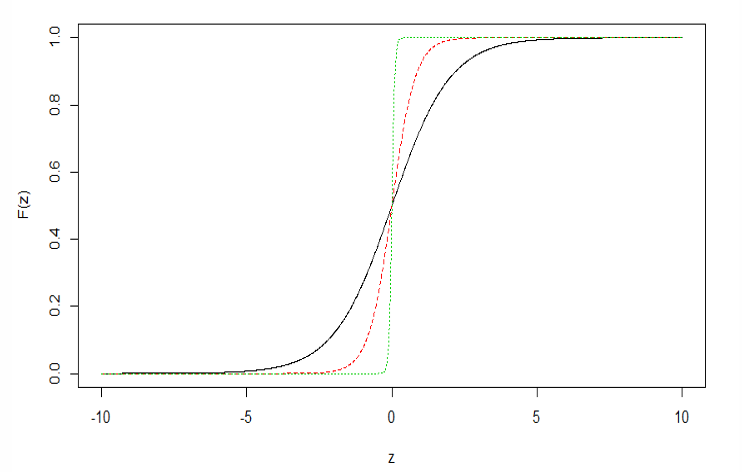
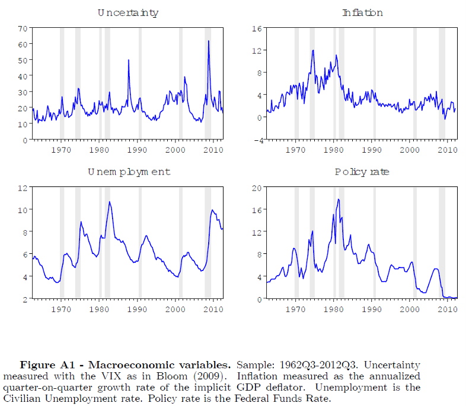
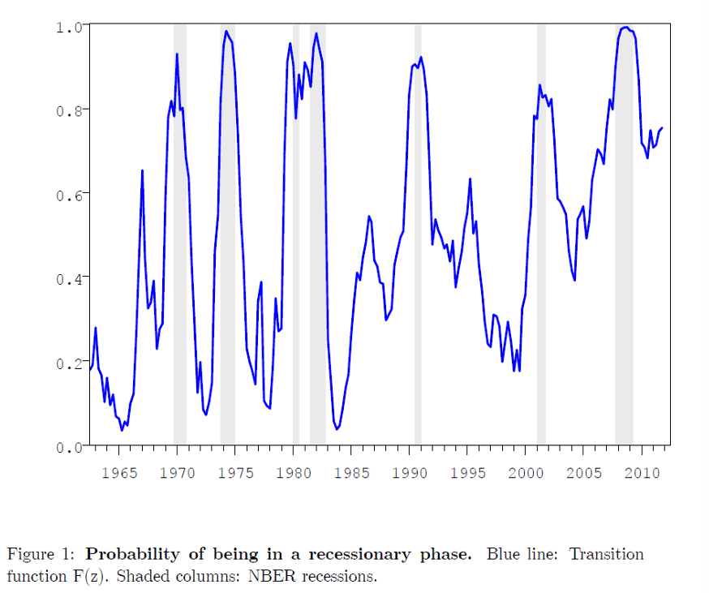
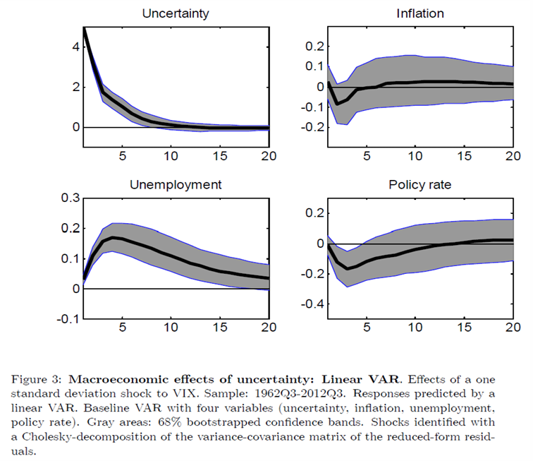
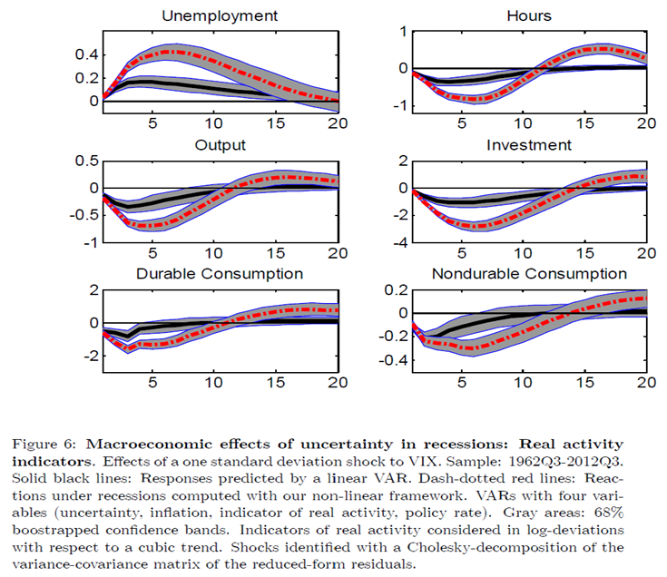
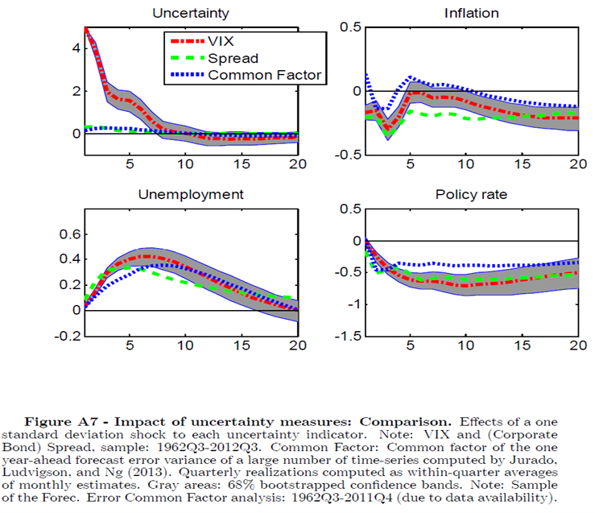
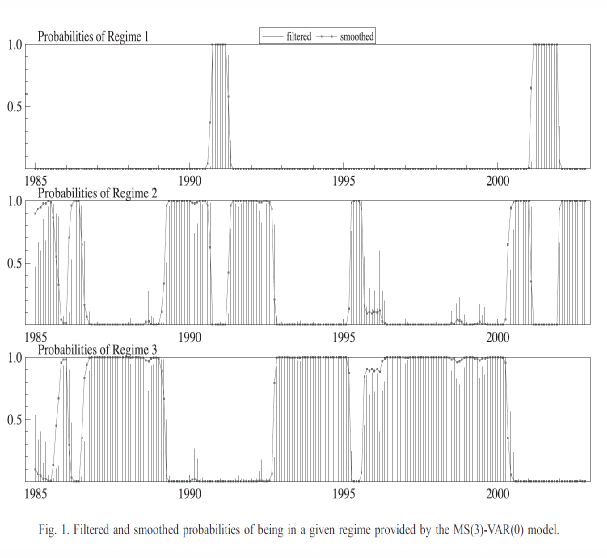
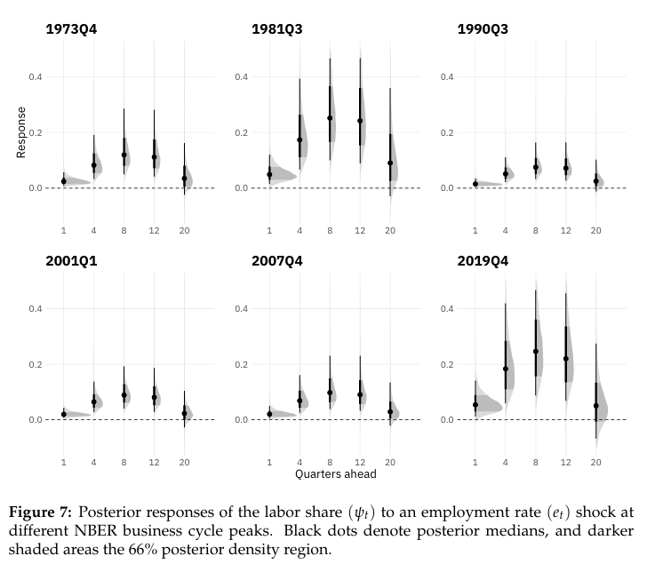
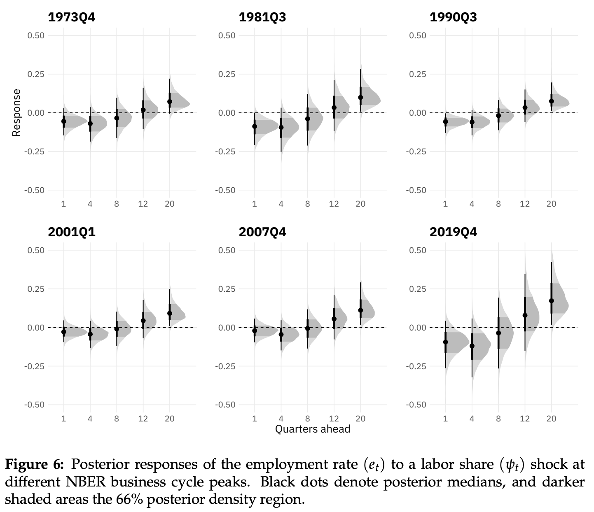
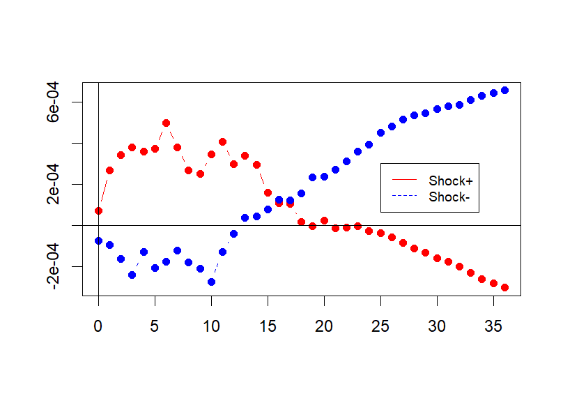

# Beyond Linearity: Thresholds, Regime Changes, and Local Projections {#sec-nonlinear}

The previous chapter closed by naming three specific ways linearity constrains a VAR: a positive shock is always the exact mirror of a negative one; the impulse response's *shape* never depends on the shock's size; and a stable VAR always converges back to a single, fixed equilibrium. None of these need be true of the actual economy. This chapter develops the main alternatives - threshold, smooth-transition, and Markov-switching VARs, time-varying-parameter VARs, and local projections - and asks, throughout, when each is the right tool.

## Uncorrelated is not the same as independent

At the core of every linear model in this course sits one assumption: after enough lags, the residual is white noise, $E[u_t] = 0$, $\mathrm{Cov}(u_t, u_{t-h}) = 0$ for all $h \ne 0$ - i.e. $u_t$ is *linearly* unpredictable from the past. But does uncorrelated imply independent? **Not in general** - correlation is a linear measure, and nonlinear dependence can survive it entirely.

::: {.callout-important title="The Gaussian special case"}
If $\{u_t\}$ is a *jointly Gaussian* process with $\mathrm{Cov}(u_t, u_{t-h}) = 0$ for all $h \ne 0$, then $(u_t, u_{t-1}, u_{t-2}, \ldots)$ is multivariate normal with a diagonal covariance matrix - and for a multivariate normal, zero covariance *does* imply independence. In that special case, linearly unpredictable is the same as fully unpredictable.
:::

In macro and finance data, residuals often look uncorrelated but are *not* jointly Gaussian, and there can be real remaining structure in the full conditional distribution of $y_t \mid \mathcal{X}_{t-1}$ that a linear specification simply cannot see. Two broad ways that extra structure can hide: a **nonlinear conditional mean** (the subject of this chapter - TAR, STAR, MS-VAR, TVP models), and a **nonlinear conditional variance or higher moments** (ARCH, GARCH, and stochastic volatility - not covered in this course, but worth knowing exist). This is the core motivation for the nonlinear time-series models developed below.

A well-specified linear model - one with enough lags that the residual passes as white noise - does not mean the underlying social or economic process is linear, nor that shocks arise "from nothing." It only means all the information that a *linear* specification (linear regressions, i.e. controlled correlations) can extract from the past has been extracted. What is left over may still contain a nonlinear element the linear specification, however many lags it has, was never able to capture in the first place.

### What does "nonlinear" mean here?

Nonlinearity can enter a time-series model in (at least) three genuinely different places, and it matters which one is meant.

**1. Nonlinear in levels (functional form).** A regression like $y_t = \alpha + \beta_1 x_t + \beta_2 x_t^2 + \beta_3 \log x_t + \beta_4(1 - e^{-\lambda x_t}) + \beta_5\frac{x_t}{1+\gamma x_t} + \beta_6(x_t \cdot z_t) + u_t$ uses nonlinear *transformations* of the regressors, but remains **linear in the parameters** $(\alpha, \beta_1, \ldots)$ - so OLS is still valid, simply treating $x_t^2$, $\log x_t$, and the rest as additional regressors. This is very common in cross-section and panel work; in time series it is usually a mild, static form of nonlinearity that does not change the *dynamics* of the system.

::: {.callout-tip title="Approximating a nonlinear DGP with polynomials"}
If the true DGP is $y_i = f(x_i) + u_i$ with $f$ continuous, the Weierstrass approximation theorem guarantees $f(x) \approx \beta_0 + \beta_1 x + \cdots + \beta_p x^p$ for $p$ large enough - still linear in parameters, so OLS remains valid. In practice, though, polynomial approximation is risky: high-degree polynomials oscillate and extrapolate poorly at the boundary; $x, x^2, x^3, \ldots$ are highly collinear, inflating standard errors; large $p$ fits noise rather than signal; and polynomials fit S-shaped or saturating patterns (logistic curves, $1-e^{-\lambda x}$) poorly, while also requiring the shape parameter ($\lambda$, $\gamma$) to be fixed exogenously rather than estimated. In applied work, low-degree polynomials (quadratic, cubic) are usually fine, but genuinely rich nonlinearities are better captured with splines.
:::

**2. Nonlinear dynamics** - what actually matters for business-cycle analysis, and the subject of this chapter. **Threshold** (piecewise-linear) models let dynamics change abruptly when a state variable crosses a threshold (recession versus expansion); **smooth-transition** models let coefficients change *gradually* with a state variable (the output gap, credit-to-GDP); **regime-switching** models let coefficients depend on a (possibly latent) regime index $s_t$ ("crisis" versus "normal" times); **time-varying-parameter** models let coefficients drift continuously over time (policy learning, structural change, financial development).

**3. Nonlinear in the shock process.** The *variance* of shocks can itself depend on the past or on the state - conditional heteroskedasticity. ARCH/GARCH models let volatility rise after large past shocks, capturing volatility clustering and turbulent periods; this course does not cover them, but it is worth knowing that even a model with a perfectly linear conditional *mean* can have highly nonlinear risk dynamics.

| Model | Abrupt vs. smooth | State variable | State evolution |
|-|-|-|-|
| (1) Threshold / piecewise linear | Abrupt jump | Observed | Deterministic rule ($z_t > c$) |
| (2) Smooth transition (STAR/ST-VAR) | Smooth change | Observed | Smooth deterministic function of $z_t$ |
| (3) Regime switching (MS-VAR) | Abrupt jump | Latent $s_t$ (inferred from data) | Probabilistic Markov chain |
| (4) Time-varying parameters (TVP-VAR) | Smooth drift | Latent parameters (inferred from data) | Slow stochastic drift (random walk) |

: Four families of nonlinear dynamics, by how abruptly they switch and whether the state driving them is observed {#tbl-nonlinear-taxonomy}

## Threshold models: TAR and TVAR {#sec-tar}

Introduced by Tong [-@TongLim1980] (and Tong, 1978), the simplest threshold model has one variable and two regimes - a **threshold AR(1)**:

$$
y_t = \begin{cases} \phi_1 y_{t-1} + u_t, & z_{t-d} \le c \quad \text{(Regime 1)} \\ \phi_2 y_{t-1} + u_t, & z_{t-d} > c \quad \text{(Regime 2)} \end{cases}
$$

where $z_{t-d}$ is the **threshold variable** (e.g. the output gap, credit, unemployment), possibly lagged by $d$ periods, and $c$ is the **threshold level**. When $z_t = y_t$ itself (the threshold variable is the modeled series), the process is called **self-exciting** (SETAR). Within each regime the dynamics are ordinary linear AR(1); globally, the process is nonlinear because the coefficient *switches* as $z_{t-d}$ crosses $c$. Using an indicator function $I_t = \mathbf{1}\{z_{t-d} > c\}$, the model can be written compactly as $y_t = (\phi_1 + (\phi_2 - \phi_1)I_t)y_{t-1} + u_t$: the coefficient on $y_{t-1}$ depends on the state $I_t$.

If $|\phi_1| < |\phi_2|$, $y_t$ is more persistent in regime 2 than regime 1 (or vice versa) - a **state-dependent speed of adjustment**. The economy might, for instance, revert quickly toward trend when far below it, but only slowly near or above it; if $z_{t-d}$ is the output gap, both policy and private behavior may respond differently once the gap is deeply negative. Within each regime the process behaves like an ordinary AR(1): if $|\phi_1| < 1$ and $|\phi_2| < 1$, it reverts in both regimes.

### From TAR to TVAR

The multivariate extension - **threshold VAR (TVAR)** - lets a $k \times 1$ VAR($p$) switch between two regimes:

$$
y_t = \begin{cases} A_0^{(L)} + A_1^{(L)}y_{t-1} + \cdots + A_p^{(L)}y_{t-p} + u_t, & z_{t-d} \le c \quad \text{(low state)} \\ A_0^{(H)} + A_1^{(H)}y_{t-1} + \cdots + A_p^{(H)}y_{t-p} + u_t, & z_{t-d} > c \quad \text{(high state)} \end{cases}
$$

with the threshold variable $z_{t-d}$ either a component of $y_{t-d}$ (e.g. credit) or an external macro-financial indicator. Compactly, $y_t = A_0(I_t) + \sum_{j=1}^p A_j(I_t)y_{t-j} + u_t$, $A_j(I_t) = A_j^{(L)} + (A_j^{(H)} - A_j^{(L)})I_t$. Intercepts can switch across regimes too ($\mu_1 \ne \mu_2$), capturing state-dependent means or level shifts, not only state-dependent persistence. TAR/TVAR models generalize to three or more regimes (e.g. expansion / normal / recession), though the grid search over multiple thresholds grows demanding quickly; Gonzalo and Pitarakis (2002) propose a sequential procedure for selecting the number of regimes efficiently.

### State-dependent IRFs

Within each regime the usual linear-VAR machinery applies directly - companion form, powers of the transition matrix - giving regime-specific IRFs, $\text{IRF}_h^{(L)} = \partial y_{t+h}/\partial\varepsilon_t \mid_{z_{t-d}\le c}$ and $\text{IRF}_h^{(H)} = \partial y_{t+h}/\partial\varepsilon_t \mid_{z_{t-d} > c}$: the same shock can have different effects depending on whether the economy is in a "normal" or "stressed" state. Structural shocks can still be recovered within each regime by the usual schemes (e.g. Cholesky, $\varepsilon_t = C^{-1}u_t$; @sec-svar). These are **fixed-state** IRFs: they study the response *as if* the economy stayed in the given regime over the whole horizon, so the horizon considered must remain realistic (e.g. do not assume a five-year recession with no empirical basis for one).

### Estimating and testing a TVAR

The simplest estimation approach is a **grid search over the threshold** $c$: choose a grid of candidate thresholds (e.g. between the lower and upper quantiles of $z_{t-d}$, trimming the extremes); for each candidate, split the sample into $\{t : z_{t-d} \le c\}$ and $\{t : z_{t-d} > c\}$, estimate two separate VAR($p$)s by OLS, and compute the sum of squared residuals $\text{SSR}(c)$; select $\hat c$ minimizing $\text{SSR}(c)$. This is called **sequential conditional least squares** (under Gaussian shocks, LS coincides with MLE); in practice, the delay $d$ and the regime-specific lag orders $(p_1, p_2)$ are searched jointly with $c$, using an information criterion.

::: {.callout-warning title="Testing linear VAR versus TVAR is nonstandard"}
The natural null is *no threshold*, $A_j^{(L)} = A_j^{(H)}$ for all $j$. Under $H_0$, the model collapses to a single VAR, and the threshold $c$ becomes irrelevant - every candidate $c$ gives the same (correct) model under the null, so $c$ is simply not identified there. Because $c$ is only meaningfully defined under the alternative, the usual Wald or $F$-statistics do not follow their standard distributions, and standard critical values cannot be used. The solution is a **sup-Wald** test with bootstrap-derived critical values.
:::

## Smooth transition models and generalized impulse responses {#sec-star}

A hard threshold forces an unrealistically abrupt regime switch exactly at $z_{t-d} = c$. **Smooth transition autoregression (STAR)** [@Terasvirta1994; also Teräsvirta and Anderson, 1992; Granger and Teräsvirta, 1993] replaces the indicator with a smooth function:

$$
y_t = \big(\phi_1 + (\phi_2 - \phi_1)G(z_{t-d})\big)y_{t-1} + u_t, \qquad G(z_{t-d}) = \frac{1}{1+\exp\{-\gamma(z_{t-d}-c)\}},\ \gamma > 0.
$$

$G(\cdot) \in (0,1)$ is the **transition function**: for $z_{t-d} \ll c$, $G \approx 0$ and the coefficient is close to $\phi_1$; for $z_{t-d} \gg c$, $G \approx 1$ and it is close to $\phi_2$; in between, the effective coefficient is a smooth mixture of $\phi_1$ and $\phi_2$. The parameter $\gamma$ controls the speed of transition between regimes; as $\gamma \to \infty$, $G$ approaches the hard indicator function and STAR collapses to TAR.

{#fig-star-logistic}

The multivariate **ST-VAR** extension is $y_t = A_0(z_{t-d}) + \sum_{j=1}^p A_j(z_{t-d})y_{t-j} + u_t$, $A_j(z_{t-d}) = A_j^{(L)} + (A_j^{(H)}-A_j^{(L)})G(z_{t-d})$: coefficients are a smooth mixture of the two regime-specific matrices. IRFs now depend continuously on the mixture $G$ implied by a chosen value of $z_{t-d}$: $\text{IRF}_h(z_{t-d}) = \partial y_{t+h}/\partial\varepsilon_t \mid_{z_{t-d}}$. This is still only a *state-dependent* IRF, in the sense that the IRF computed with $t$ set at, say, the 2008 recession is identical to one computed at the 1991 recession, provided both start from the same value of $z_{t-d}$ - the calendar date itself carries no information beyond the state. And it raises an immediate question: is it realistic to trace out a shock's impact assuming the economy remains in recession throughout, never returning to expansion?

**Estimation.** $(A_j^{(L)}, A_j^{(H)}, c, \gamma)$ are estimated by nonlinear least squares, minimizing $\sum_t \|y_t - H(y_{t-1},\ldots;\theta)\|^2$; under Gaussian innovations, NLS coincides with (quasi-)maximum likelihood and is consistent and asymptotically normal under standard regularity conditions. Conceptually, an ST-VAR is still two linear VARs, smoothly glued together by $G(z_{t-d}; c, \gamma)$. **Testing** linearity ($H_0: A_j^{(L)} = A_j^{(H)}$) faces the same identification problem as for TAR - $(c, \gamma)$ are not identified under $H_0$ - and the standard fix (Luukkonen-Saikkonen-Teräsvirta) is an auxiliary regression built from a Taylor expansion of $G$ around $\gamma = 0$, which restores a standard $F$/$\chi^2$ test.

### Three notions of IRF once the state can change

In TVAR/ST-VAR models, impulse responses are no longer unique - they depend on the transition variable's state. Three distinct concepts need to be told apart.

1. **Fixed-state IRF, exogenous $z_t$.** Fix $z_{t-d} = z^*$ and hold it constant over the entire horizon; the IRF is then exactly that of a linear VAR with coefficients $A_j^{\text{eff}}(z^*)$, and has a clean interpretation as "the IRF in regime $z^*$."
2. **Fixed-state IRF, endogenous $z_t$.** If $z_t$ is itself a component of $y_t$, it reacts to shocks, but the standard practice still fixes $z_{t-d} = z^*$ and holds it fixed over the horizon $h$, implicitly freezing $G$. This is a **local IRF** conditional on being in state $z^*$ at $t$, but becomes increasingly counterfactual at longer horizons: the shock itself may push the economy toward or away from that state, and forcing the state to stay fixed can miss both the endogenous regime shift a shock causes and any amplification the shock produces precisely because the regime is *not* held fixed.
3. **Dynamic-state (path-dependent) IRF, endogenous $z_t$.** Start from a given initial history, let the shock hit at $t$, and let $z_{t+h}$ (and hence $G_{t+h}$) evolve *endogenously* according to the estimated nonlinear model - allowing for genuine regime changes along the way. This gives $\text{IRF}_h(z_{t-d},\varepsilon_t) = \partial y_{t+h}/\partial\varepsilon_t$ evaluated along the state and path implied by the model itself. It remains, however, a *single-path* IRF - there is still no averaging over the distribution of future shocks.

::: {.callout-important title="The Generalized Impulse Response Function (GIRF)"}
Koop, Pesaran, and Potter [-@KoopPesaranPotter1996] resolve the remaining gap by additionally averaging over random future innovations, not just letting the state evolve endogenously along one path:

$$
\mathrm{GIRF}_h(x_{t-1}, \delta) = E\big[y_{t+h} \mid \varepsilon_t = \delta,\ x_{t-1}\big] - E\big[y_{t+h} \mid x_{t-1}\big],
$$

conditioning on a given starting state $x_{t-1}$, then averaging over both future shocks *and* future regimes (since the world keeps evolving after the shock hits). In practice: simulate many paths with and without the shock $\varepsilon_t = \delta$, from chosen initial histories, and average the difference by Monte Carlo. The result is conditional on the state at $t=0$, but *unconditional* thereafter - future regimes and transition variables evolve endogenously, and that uncertainty is integrated out rather than assumed away.
:::

::: {.callout-tip title="Example: Caggiano, Castelnuovo, and Groshenny (2014)"}
Caggiano, Castelnuovo, and Groshenny [-@CaggianoCastelnuovoGroshenny2014], "Uncertainty Shocks and Unemployment Dynamics in U.S. Recessions" (*Journal of Monetary Economics*), ask whether uncertainty shocks affect unemployment more strongly in recessions than in expansions - a question a linear SVAR cannot even pose, since it delivers the same IRF regardless of the state of the cycle.

**Setup.** A quarterly U.S. VAR(3) (1962Q3-2012Q3, selected by AIC) with four variables, ordered uncertainty (the VIX, as in Bloom [-@Bloom2009]) before unemployment, inflation, and the federal funds rate.

{#fig-caggiano-variables}

The transition variable $z_t$ is a moving average of *past GDP growth* (not unemployment): low $z_t$ signals a recession, high $z_t$ an expansion, and a logistic transition function converts this into a smooth "probability of being in recession" ($G \approx 0$ in expansions, $G \approx 1$ in recessions). The steepness $\gamma$ is *calibrated*, not estimated (estimating it made NLS extremely unstable in their application), to match the empirical frequency of recessions - $\gamma = 2.4$ for a 10 percent recession probability, $\gamma = 1.2$ for 25 percent, with $\gamma = 1.75$ as their mid-range benchmark.

{#fig-caggiano-recession-prob}

Two IRF scenarios are computed: an **expansion IRF**, starting from $G(z_t) \approx 0$, and a **recession IRF**, starting from $G(z_t) \approx 1$. Because nonlinear IRFs must be computed under some counterfactual path for the state variable - a shock could push the economy toward or away from recession, or the regime could revert to expansion after a few quarters, or persist - the authors assume the economy *stays in recession* for 20 quarters (long enough for the IRFs to have died out) when simulating the recession scenario. This keeps the regime fixed over the horizon so the two IRFs can be cleanly interpreted as "recession" versus "expansion" responses, avoiding contamination from an endogenous regime shift (e.g. the shock itself pulling the economy out of recession).

{#fig-caggiano-linear-irf}

{#fig-caggiano-recession-irf}

{#fig-caggiano-macro-irf}

**Robustness.** The result is checked against alternative uncertainty measures - other financial spreads, and a common factor extracted from many uncertainty indicators - with broadly consistent state-dependence.

{#fig-caggiano-robustness}
:::

## Markov-switching VARs {#sec-ms-var}

The covariance-stationary Markov-switching (MS) model [@Hamilton1989; also Quandt, 1958; Neftçi, 1982, 1984] succeeds in part because it reproduces the U.S. business cycle without relying on the complex, non-transparent procedure used by the NBER Business Cycle Dating Committee (cf. Burns and Mitchell, 1946, *Measuring Business Cycles*). Unlike TAR models, the state driving the switch is not observed at all - it is assumed to follow a first-order Markov chain.

$$
\text{MS-VAR}(p): \quad y_t = A_0^{(s_t)} + A_1^{(s_t)}y_{t-1} + \cdots + A_p^{(s_t)}y_{t-p} + u_t, \qquad u_t \sim \mathcal{N}(0, \Sigma^{(s_t)}),
$$

where $s_t \in \{1, \ldots, K\}$ is the regime index (e.g. $1=$ expansion, $2=$ recession), and $A_j^{(i)}, \Sigma^{(i)}$ are regime-specific coefficients and shock covariances. Regime switches are discrete jumps, governed by a probabilistic rule (the Markov chain); the regime itself is typically **latent** - never directly observed, only inferred from the data.

::: {.callout-note title="What is a Markov chain, and why use one for regimes?"}
A Markov chain is a process moving between finitely many states where the future depends only on the *current* state, not the full past: $\Pr(s_t = j \mid s_{t-1}, s_{t-2}, \ldots) = \Pr(s_t = j \mid s_{t-1})$ for all $j$ - "memoryless," in the sense that forecasting $s_t$ requires knowing only $s_{t-1}$. This fits business-cycle phases (expansion/recession), weather (sunny/rainy), and financial markets (normal/crisis) naturally. It is useful for macro regime-switching specifically because it supplies a *probabilistic law* for entering and leaving regimes - no arbitrary dating rule or ad hoc threshold is needed - while still capturing both persistence (spells can be long) and occasional abrupt jumps, and remaining parsimonious (just a handful of transition probabilities).
:::

For two regimes, $s_t \in \{1,2\}$, the Markov property is $\Pr(s_t=j \mid s_{t-1}=i, s_{t-2},\ldots) = \Pr(s_t=j\mid s_{t-1}=i) = p_{ij}$, collected in the transition matrix $P = \begin{pmatrix}p_{11}&p_{12}\\p_{21}&p_{22}\end{pmatrix}$ with $p_{i1}+p_{i2}=1$: $p_{11}$ is the probability of remaining in regime 1 (expansion), $p_{22}$ of remaining in regime 2 (recession), and $p_{12}, p_{21}$ the probabilities of switching. The **expected duration** of regime $i$ is $E[\text{length of regime } i] = 1/(1-p_{ii})$: a $p_{22}$ close to 1 means persistent recessions, a high $p_{11}$ means long expansions, and a small $p_{12}$ means recessions are simply *rare*, which is a statement about frequency, not duration. The chain's **unconditional (long-run) probabilities** solve the fixed point $\pi_{\text{tomorrow}} = \pi_{\text{today}}P$, $\pi_1 + \pi_2 = 1$: the long-run fraction of time spent in each regime.

### Regime-dependent dynamics, estimation, and IRFs

Conditional on $s_t = i$ and *remaining* in regime $i$, the model is an ordinary linear VAR with parameters $\{A_j^{(i)}, \Sigma^{(i)}\}$. But because future regimes $s_{t+h}$ can switch according to $P$, the **expected IRF** must average over all possible regime paths given the starting state - making MS-VAR, in effect, a Swiss-army-knife tool for state-dependent dynamics that need not be tied to a single observable threshold variable.

The key estimation challenge is that $s_t$ is latent - it governs both the VAR coefficients and the shock covariance, but is never observed directly. Treating $s_t$ as the hidden state of a Markov chain, the **Hamilton filter and smoother** infer it: the *forecasted* probability $\Pr(s_t = i \mid y_{1:t-1})$ is the predicted regime before seeing $y_t$; the *filtered* probability $\Pr(s_t=i\mid y_{1:t})$, from a forward recursion, is a real-time estimate of the current regime; the *smoothed* probability $\Pr(s_t=i\mid y_{1:T})$, from a backward pass using the full sample, is the best ex-post estimate. Parameters are estimated by maximum likelihood (the likelihood integrates out the unobserved $s_t$) via numerical optimization. The output: a time series of smoothed regime probabilities, often read as "the probability of recession," together with regime-specific VAR parameters and IRFs describing how shock transmission differs across regimes.

::: {.callout-tip title="Example: Ferrara (2003)"}
Ferrara [-@Ferrara2003], "A Three-Regime Real-Time Indicator for the US Economy" (*Economics Letters*), uses an MS-VAR to let the data identify business-cycle phases directly, without imposing NBER dates. Monthly U.S. data, 1985-2002, four real-activity indicators (the Industrial Production Index, the unemployment rate, construction, and the Help-Wanted index), and an MS(3)-VAR(0): 3 regimes, no lag dynamics, only regime-dependent means (and possibly variances), $y_t = \mu^{(s_t)} + \varepsilon_t$, $\varepsilon_t \sim \mathcal{N}(0, \Sigma^{(s_t)})$ - each regime summarizing a different average level and volatility of real activity (slump / normal / boom).

{#fig-ferrara-probabilities}

The three estimated regimes line up with low, medium, and high activity phases, and reproduce the U.S. business cycle without using NBER dates by construction - an MS-VAR functions here as an automatic, model-based business-cycle dating tool.
:::

## Time-varying-parameter VARs {#sec-tvp-var}

Why should coefficients move at all? Because the underlying relationships are not timeless: the slope of the Phillips curve shifts with bargaining power, globalization, and labor-market institutions; the systematic monetary policy response changes across Fed chairs (Volcker, Greenspan, Bernanke, Powell); the impact of interest rates on demand changes with leverage, financial frictions, and demographics. Crucially, these shifts typically do *not* occur in just two or three discrete regimes, and do *not* happen at a sharp threshold in some single observable - they happen gradually, continuously, and with genuine uncertainty about their pace. This is the case for **time-varying-parameter (TVP) VARs** [seminal: Cogley and Sargent, -@CogleySargent2001], where the economic relationships themselves evolve slowly and stochastically.

Where a standard VAR($p$) has constant $A_j$ and $\Sigma$, a **TVP-VAR($p$)** is

$$
y_t = A_{0,t} + A_{1,t}y_{t-1} + \cdots + A_{p,t}y_{t-p} + u_t, \qquad u_t \sim \mathcal{N}(0, \Sigma_t),
$$

with $A_{j,t}$ and $\Sigma_t$ now **time-varying**. At every date $t$, the model is still a linear VAR, but the coefficients and covariance are allowed to change, capturing gradual shifts in behavior, institutions, and policy rules.

### TVP-VAR as a state-space model

Stack the coefficients into a state vector, $\theta_t = (\mathrm{vec}(A_{0,t})', \mathrm{vec}(A_{1,t})', \ldots, \mathrm{vec}(A_{p,t})', \mathrm{vech}(\Sigma_t)')'$, so that the **measurement equation** is the VAR itself, $y_t = A_{0,t} + \cdots + A_{p,t}y_{t-p} + u_t$, and the **state equation** describes how the parameters evolve:

$$
\theta_t = \theta_{t-1} + \eta_t, \qquad \eta_t \sim \mathcal{N}(0, Q) \text{ with small variance,}
$$

or more generally $\theta_t = F\theta_{t-1} + \eta_t$ with $F$ close to the identity - a **random walk** in parameter space, with $\eta_t$ representing slow structural drift ("parameter shocks"). The random-walk law is not an incidental modeling choice: it is what makes estimation possible at all, functioning as a *prior* that encodes the belief that macroeconomic relationships evolve gradually rather than through abrupt jumps, staying close to their past values unless the data strongly indicate otherwise. The estimation problem becomes: find the smoothest path $\{\theta_t\}_{t=1}^T$ that still explains the observed $\{y_t\}_{t=1}^T$ - precisely the computation performed by the **Kalman filter and smoother**. In state-space language, the measurement equation answers "given $\theta_t$, how likely is $y_t$?", the state equation answers "given $\theta_{t-1}$, how plausible is $\theta_t$?", and estimation balances fitting today's data against staying close to yesterday's coefficients to avoid implausible jumps.

### What a TVP-VAR buys, and how it is estimated

At each date $t$, given $\{A_{j,t}, \Sigma_t\}$, the usual VAR objects can be computed - but now the impulse response is conditional on a specific calendar date $t$, not on a "state" that could recur at many different dates. With $u_t = C_t\varepsilon_t$, $C_tC_t' = \Sigma_t$, $\text{IRF}_{h,t} = \partial y_{t+h}/\partial\varepsilon_t \mid_{\theta_t}$ depends on calendar time $t$: the response of output to a monetary policy shock in 1980 can differ systematically from its response in 2010, and the model does not force a single "average" IRF onto the whole sample. This goes beyond discrete breaks, giving a genuinely time-located interpretation of every parameter in a structural TVP-VAR.

TVP-VAR is a linear-Gaussian state-space model, $y_t = Z_t(\theta_t) + u_t$, $u_t \sim \mathcal{N}(0,\Sigma_t)$, $\theta_t = F\theta_{t-1}+\eta_t$, $\eta_t \sim \mathcal{N}(0,Q)$. Estimation uses the Kalman filter (forward, for real-time updating of beliefs about $\theta_t$ given data up to $t$) and smoother (backward, for a historical reconstruction using the full sample); Bayesian methods are the norm in practice - placing priors on $Q$ and the initial $\theta_0$, drawing from the posterior of $\{\theta_t\}_{t=1}^T$ via MCMC or variational Bayes, and computing time-varying IRFs from each posterior draw.

::: {.callout-tip title="Example: a time-varying finance-led Goodwin model (Santetti, 2024)"}
Santetti [-@Santetti2024], "A Time-Varying Finance-Led Model for U.S. Business Cycles" (*Metroeconomica*, following Carrillo-Maldonado and Nikiforos, 2022), studies **Goodwin-style** cycles - counter-clockwise cycling between employment and the labor share - allowing for regimes of profit-led demand and profit-squeeze distribution, and for a role for residential investment and finance.

The endogenous vector is $y_t = (\text{labour share}, \text{employment rate}, \text{residential investment}, \text{term spread})'$, U.S. quarterly data 1956-2019, estimated as a **TVP-VAR with stochastic volatility**, recursively (Cholesky) identified with an ordering finance $\to$ housing $\to$ employment $\to$ distribution (finance leads housing, housing leads the cycle, the labor share reacts last), via Bayesian estimation (a Kalman filter in state-space form combined with a Gibbs sampler). Time-varying IRFs are computed around six NBER business-cycle peaks (1973Q1, 1981Q3, 1990Q3, 2001Q1, 2007Q4, 2019Q4) to track how the demand and distributive regimes change across cycles.

{#fig-santetti-labor-share}

{#fig-santetti-employment}

**Main findings.** The data show evidence of both profit-led demand and profit-squeeze distribution - a Goodwin-type regime - with both channels weakening during the Great Moderation and re-intensifying before 2019. Residential investment strongly leads the cycle, and the overall pattern is consistent with a finance-led, deregulated post-1980 U.S. growth regime.
:::

### Recap: which nonlinear VAR, when?

**TVAR / ST-VAR.** Use when behavior depends on an *observable* variable (the output gap, credit growth, an interest-rate level); coefficients change deterministically and abruptly (TVAR) or gradually as a smooth mixture of two states (ST-VAR) as that variable crosses a threshold region (e.g. low versus high debt, low versus high inflation).

**MS-VAR.** Use when you suspect *unobserved*, discrete regimes but no single observable variable clearly triggers the transitions; switches are latent, probabilistic (governed by a Markov chain), and abrupt.

**TVP-VAR.** Use when you believe the underlying structure drifts *gradually* over time (policy, expectations, institutions) with no clear regimes or triggers at all; coefficients follow a stochastic drift, typically modeled as a random walk.

## Local projections {#sec-local-projections}

So far, every impulse response in this course has been an object *implied* by an estimated (S)VAR - reduced-form or structural. **Local projections (LPs)**, following Jordà [-@Jorda2005] (see Jordà and Taylor, forthcoming, for a state-of-the-art review[^jt-review-note]), estimate IRFs *directly* instead: run a separate regression for each horizon $h$, and read the IRF off the estimated coefficient.

[^jt-review-note]: The source slide cites this review as "Jordà & Taylor (JEL, 2025)"; the exact title was not independently verified, so it is not given a formal `@citation` entry here (see `CONVERSION_ISSUES.md`).

::: {.callout-important title="Baseline local projection, known structural shock"}
Let $\varepsilon_t$ be a known structural shock (a narrative series, say, or an external instrument). The baseline LP is

$$
y_{t+h} = \alpha_h + \beta_h \varepsilon_t + \Gamma_h X_{t-1} + u_{t+h}, \qquad h = 0, 1, \ldots, H,
$$

with $X_{t-1}$ a vector of controls (lags of $y_t$, lags of $\varepsilon_t$, other covariates; the number of lags either matching a VAR's $p$ or a conventional macro rule, e.g. 4 quarters or 12 months). The coefficient of interest, $\beta_h \approx \partial y_{t+h}/\partial\varepsilon_t$, *is* the impulse response at horizon $h$. Estimation runs one OLS regression per horizon; collecting $\{\hat\beta_h\}_{h=0}^H$ and plotting against $h$ gives the empirical IRF directly. Because the residual $u_{t+h}$'s autocorrelation grows with $h$ by construction (overlapping horizons), HAC/Newey-West standard errors (or a block bootstrap for confidence bands) are standard practice.
:::

### Why local projections are useful

LPs are **model-free**: there is no need to commit to a correctly specified, finite-order VAR. They are correspondingly more **robust to dynamic misspecification** - no need for the full cross-equation system, no risk from a wrong lag count or from the omitted-variable bias that a high-dimensional VAR invites, no imposed linearity of the whole dynamic system - especially at longer horizons, where a misspecified VAR's errors compound through iteration while an LP is estimated directly at $t+h$. Formally, since $\beta_h = \mathrm{Cov}(y_{t+h}, \varepsilon_t)/\mathrm{Var}(\varepsilon_t)$ is simply the local derivative of a conditional expectation at horizon $h$, the LP does not impose any particular dynamic system, and linear projection remains a consistent estimator of it regardless. LPs are also **flexible**: nonlinear terms (interactions, thresholds, splines) can be added directly, without estimating a full TVAR or ST-VAR; additional controls or instruments do not blow up the model's dimensionality; and constraints on $y_{t+h}$ (bounded outcomes, via logit or probit) are easy to accommodate. In short, LPs inherit the entire toolbox of linear regression - OLS, robust standard errors, instrumental variables, panel methods, quantile regression.

::: {.callout-note title="The precise connection to VARs (Plagborg-Møller and Wolf, 2021)"}
If the true DGP really is a linear VAR and $X_{t-1}$ contains enough lags, LPs and VAR-based IRFs [-@PlagborgMollerWolf2021] estimate *the same* population impulse responses. In finite samples, there is a genuine bias-variance trade-off: a correctly specified VAR is more efficient, while LPs are more robust to misspecification but can be noisier at long horizons. Bayesian VARs in particular remain attractive when precision at medium or long horizons matters most, and are *necessary* whenever the exogenous shock itself must be constructed through identification restrictions - local projections do not supply identification on their own; they require an already-identified series (narrative, or a proxy/instrument) to regress on. That said, LPs can equally be used for purely reduced-form analysis, with no identification claim at all - see Jordà, Schularick, and Taylor's "When Credit Bites Back" and "Leveraged Bubbles," discussed below.
:::

### State-dependent and asymmetric local projections

A structural shock's effect can be allowed to depend on the state of the cycle directly within the LP framework, via an **interacted LP** [Auerbach and Gorodnichenko, -@AuerbachGorodnichenko2012]. With a known shock $m_t$ (e.g. a fiscal shock) and a business-cycle indicator $z_t = 1$ if the economy is in an NBER recession and $0$ otherwise, the simplest (no-lags) version is

$$
y_{t+h} = (\alpha_h^1 + \beta_h^1 m_t)z_t + (\alpha_h^0 + \beta_h^0 m_t)(1-z_t) + u_{t+h},
$$

with $\{\beta_h^1\}$ the IRF during recessions and $\{\beta_h^0\}$ the IRF during expansions (lags of $y_t$ and $m_t$ are simply added to the general interacted specification when needed).

A related but distinct question: do positive and negative shocks produce mirror-image effects? Decomposing the shock into its positive and negative parts, $Shock_t^+ = Shock_t$ if $Shock_t \ge 0$ and $0$ otherwise, $Shock_t^- = Shock_t - Shock_t^+$, an **asymmetric LP** is

$$
y_{t+h} = \alpha_h + \beta_h^+ Shock_t^+ + \beta_h^- Shock_t^- + \Gamma_h X_{t-1} + u_{t+h},
$$

with $\{\beta_h^+\}$ and $\{\beta_h^-\}$ the separate IRFs to positive and negative shocks - here $Shock_t^+$ and $Shock_t^-$ are already identified series, and so can be treated directly as exogenous regressors.

{#fig-asymmetric-mp-irf}

### Local projections in practice: credit, bubbles, and long-run monetary effects

::: {.callout-tip title="Jordà, Schularick, and Taylor (2013), \"When Credit Bites Back\""}
**Question:** do recessions become deeper and longer when they follow unusually fast credit growth? Are financial-crisis recessions systematically worse than ordinary ones? **How LPs are used** (with no identified shock at all): for every recession in a long-run panel of 14 countries, 1870-2008, an LP traces the recovery path of GDP for 5 years after the pre-recession peak, conditional on excess credit growth before the downturn and on whether the episode was a financial-crisis recession or not [@JordaSchularickTaylor2013]. **Results:** financial-crisis recessions are far more damaging, with output remaining well below trend even five years out, and high pre-crisis credit growth systematically predicts deeper, slower recoveries - strong evidence for a credit-overhang mechanism.
:::

::: {.callout-tip title="Jordà, Schularick, and Taylor (2015), \"Leveraged Bubbles\""}
**Question:** do housing or equity bubbles worsen the recession that follows them? Are bubbles harmful only when they are credit-fuelled? **How LPs are used** (again with no identified shock): compare medium-run GDP paths after recessions preceded by no bubble, an "unleveraged" bubble, and a credit-fuelled (leveraged) bubble [@JordaSchularickTaylor2015]. **Results:** equity bubbles modestly worsen the subsequent recession, housing bubbles more so, but the decisive factor is leverage - credit-fuelled bubbles produce the deepest and most persistent output losses, often still negative five years out.
:::

::: {.callout-tip title="Jordà, Singh, and Taylor (2020), \"The Long-Run Effects of Monetary Policy\""}
**Questions:** is monetary policy neutral in the long run, or do interest-rate shocks leave persistent scars on output, capital, and total factor productivity? Are the long-run effects of tightening and easing symmetric? **How LPs are used:** a long historical panel of advanced economies from the 20th century onward (GDP, consumption, investment, capital, TFP), with an external instrument for policy-rate changes built from the Mundell trilemma - base-country rate shocks interacted with the fixed-exchange-rate regime and capital-account openness of each country [@JordaSchularickTaylor2020]. An **IV-LP** regresses long-run changes in macro variables on the instrumented rate shock at horizons of up to 10 to 15 years, with rich controls, country fixed effects, and robust panel standard errors; LP is chosen explicitly here because it delivers consistent long-horizon IRFs precisely where finite-lag VARs can become badly biased. **Results:** a one-percentage-point unexpected rate hike reduces real GDP by several percent even a decade later, with capital and TFP showing even stronger hysteresis while hours largely recover; tightening shocks have large, persistent real effects, but rate cuts do not symmetrically undo the damage - an asymmetric hysteresis.
:::

## Further reading

Fazzari, Morley, and Panovska [-@FazzariMorleyPanovska2015], ["State-Dependent Effects of Fiscal Policy"](https://www.degruyterbrill.com/document/doi/10.1515/snde-2014-0022/html), *Studies in Nonlinear Dynamics & Econometrics*, is recommended reading alongside this chapter. This paper goes beyond a simple recession-versus-expansion split (recessions are, after all, rare relative to expansions) or a narrow focus on episodes like the zero lower bound, and instead examines economic slack versus high capacity utilization directly - a Keynesian view of demand dynamics - using a **Bayesian threshold SVAR**, and in the process addresses the investment-response puzzle raised by Blanchard and Perotti's fiscal-shock estimates (@sec-svar).
