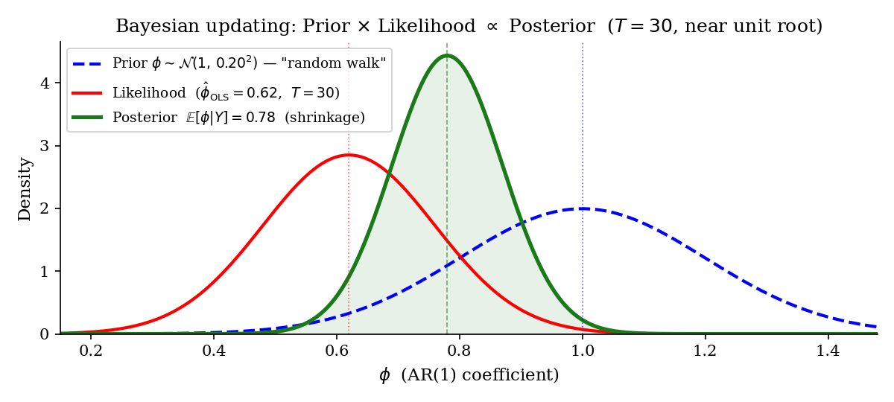

# Bayesian Estimation: Foundations and Applications to VARs {#sec-bvar}

Every model so far has been estimated the frequentist way: parameters are fixed but unknown constants, estimated by OLS, MLE, or GMM, with uncertainty expressed through asymptotic standard errors and confidence intervals - loosely, "if we repeated the sampling process infinitely often." This chapter develops the Bayesian alternative, and argues that it is not merely a philosophical preference but close to a practical necessity for VARs estimated on typical macro samples.

## Why Bayesian? {#sec-why-bayesian}

Macro data creates exactly the conditions frequentist asymptotics handle worst. Samples are short - $T=40$ to $150$ observations is typical - so asymptotic approximations are, in an important sense, fictions. Parameter counts explode quickly: a VAR($p$) with $k$ variables has $k^2p$ slope parameters plus $k(k+1)/2$ covariance parameters, so with $T=120$ quarterly observations (30 years) and $k=8$, $p=4$, OLS must estimate 264 slope parameters (plus covariance parameters) from 120 observations - catastrophic overfitting, with IRFs and forecasts that are, in a word, garbage. Structural breaks and regime changes reduce the *effective* number of observations per regime still further. And frequentist methods have no systematic way to use what is often known *before* looking at the data at all - economic theory, stylized facts, results from previous studies.

The **Bayesian solution**: treat the parameter $\theta$ itself as a random variable, express what is known before seeing the data as a **prior distribution**, and update it with the data to obtain a **posterior distribution**.

### Bayes' theorem

$$
\underbrace{p(\theta \mid Y)}_{\text{posterior}} \;\propto\; \underbrace{p(Y \mid \theta)}_{\text{likelihood}} \times \underbrace{p(\theta)}_{\text{prior}}.
$$ {#eq-bayes-theorem}

$p(\theta)$ is the **prior** - what is believed about $\theta$ before seeing the data (theory, stylized facts, regularization, prior empirical results); $p(Y\mid\theta)$ is the **likelihood** - exactly the same object used in MLE, the probability of the observed data given a parameter value; $p(\theta\mid Y)$ is the **posterior** - the updated belief about $\theta$ after seeing the data, and the entire object of Bayesian inference.

The conditioning logic, prior-to-posterior update, and distinction from frequentist intervals are introduced in @sec-bayes-foundations.

Three conceptual shifts relative to frequentism follow directly. Uncertainty about $\theta$ is *probabilistic*, not a statement about hypothetically repeated sampling. The posterior is a full *distribution* over $\theta$, not a point estimate plus a standard error. And as $T \to \infty$, the prior is washed out by the data - the posterior converges to the MLE (the Bernstein-von Mises theorem) - but with *small* $T$, exactly the macro case, the prior genuinely matters.

::: {.callout-tip title="Worked example: AR(1) with a prior"}
For $y_t = \phi y_{t-1} + \varepsilon_t$, $\varepsilon_t \sim \mathcal{N}(0,\sigma^2)$: the frequentist estimator $\hat\phi = \mathrm{Cov}(y_t,y_{t-1})/\mathrm{Var}(y_{t-1})$ uses no prior information at all, and with $T=30$ and a near-unit-root true process ($\phi=0.99$, say), pure sampling variation can put $\hat\phi$ anywhere from around $0.78$ to above $1.02$.

A Bayesian instead places a prior $\phi \sim \mathcal{N}(1,\kappa^2)$ - "a random walk is a reasonable benchmark." The posterior mean is then a precision-weighted average of the two sources of information,

$$
E[\phi\mid Y] = \underbrace{\frac{T/\sigma^2}{T/\sigma^2 + 1/\kappa^2}}_{\text{weight on data}}\hat\phi_{OLS} + \underbrace{\frac{1/\kappa^2}{T/\sigma^2+1/\kappa^2}}_{\text{weight on prior}}\cdot 1.
$$ {#eq-ar1-posterior-mean}

With small $T$, the prior dominates and shrinks $\phi$ toward 1 (the random-walk benchmark); with large $T$, the data dominates and the posterior converges to the OLS estimate. This **shrinkage** is regularization in the same spirit as ridge regression, but derived from a fully probabilistic model rather than imposed as an ad hoc penalty.
:::

{#fig-prior-posterior-ar1}

With OLS giving $\hat\phi = 0.62$ from $T=30$ observations, the likelihood is wide - large sampling noise, potentially even flatter than shown - and the prior $\mathcal{N}(1, 0.20^2)$ pulls the posterior toward 1 while still allowing substantial variance: shrinkage in action. The posterior ends up *narrower* than either the prior or the likelihood alone, since combining two independent sources of information reduces overall uncertainty. A posterior **credible interval** is not the same object as a frequentist confidence interval: it is a direct probability statement - "$\phi$ lies in this interval with probability 90 percent" - rather than a statement about the long-run behavior of a repeated sampling procedure.

### Where does the prior come from?

A prior can be grounded in **economic theory** (e.g. price homogeneity restricting long-run elasticities, or stationarity of the consumption-income ratio implying a cointegration-based prior on an error-correction coefficient); in **stylized facts from the literature** (e.g. monetary policy multipliers are known to be small on impact, so the prior on the impact IRF might be $\mathcal{N}(0, 0.1^2)$); in **regularization or parsimony**, when there is no strong theoretical view or empirical benchmark, shrinking instead toward a simple default (a random walk, zero cross-equation spillovers); or it can be **non-informative or diffuse**, $p(\theta) \propto 1$ ("let the data speak entirely"), in which case the posterior essentially reduces to the likelihood - useful mainly as a comparison baseline.

::: {.callout-note title="Is the prior just subjective?"}
The prior is a modeling choice like any other - choosing a lag length, a functional form, or an identifying restriction is no less a judgment call. The difference is that the prior is *explicit and transparent*: frequentist methods embed their own implicit regularization too (ridge and LASSO penalties, ad hoc lag-selection rules), but Bayesian methods make that regularization visible and open to scrutiny rather than burying it inside a procedure.
:::

### Posterior summaries

| Summary | Formula | Frequentist analogue |
|-|-|-|
| Posterior mean | $\hat\theta = E[\theta \mid Y]$ | Point estimate |
| Posterior mode | $\arg\max_\theta p(\theta\mid Y)$ | MAP / penalized MLE |
| Posterior std. | $\sqrt{\mathrm{Var}(\theta\mid Y)}$ | Standard error |
| Credible interval | $P(a \le \theta \le b \mid Y) = 1-\alpha$ | Confidence interval |

: Posterior summaries and their frequentist counterparts {#tbl-posterior-summaries}

The **posterior predictive distribution**,

$$
p(y_{T+h} \mid Y) = \int p(y_{T+h}\mid\theta)\,p(\theta\mid Y)\,d\theta,
$$

produces forecasts that integrate over parameter uncertainty directly, and are correspondingly wider than a plug-in forecast that simply substitutes a point estimate - a crucial distinction in macro, where $\theta$ is often poorly identified by a short sample. **Model comparison via the marginal likelihood**,

$$
p(Y\mid\mathcal{M}) = \int p(Y\mid\theta,\mathcal{M})\,p(\theta\mid\mathcal{M})\,d\theta \quad \Rightarrow \quad \text{Bayes factor} = \frac{p(Y\mid\mathcal{M}_1)}{p(Y\mid\mathcal{M}_2)},
$$

automatically penalizes over-parameterization - an Occam's-razor effect built directly into the marginal likelihood, without needing a separate information-criterion penalty term bolted on afterward.

## Bayesian computation {#sec-bayesian-computation}

In some models the posterior has a closed analytical form: a normal likelihood combined with a normal prior on a mean gives a normal posterior (a **conjugate** pair); a Normal-Wishart prior on $(B,\Sigma)$ in a VAR gives a Normal-Wishart posterior. In general, though, the posterior is a high-dimensional integral with no closed form,

$$
p(\theta\mid Y) = \frac{p(Y\mid\theta)\,p(\theta)}{\int p(Y\mid\theta)\,p(\theta)\,d\theta},
$$

and the denominator - the marginal likelihood, or normalizing constant - is intractable for most models of realistic size.

The standard solution is **Markov Chain Monte Carlo (MCMC)**: rather than computing the posterior analytically, draw samples $\{\theta^{(s)}\}_{s=1}^S$ from $p(\theta\mid Y)$ and use sample averages as estimators, $E[g(\theta)\mid Y] \approx \frac{1}{S}\sum_s g(\theta^{(s)})$. This works for essentially any posterior, however non-Gaussian the likelihood or nonlinear the model.

The basic idea of an artificial Markov chain with the posterior as stationary distribution is reviewed in @sec-bayes-foundations.

### The Gibbs sampler

If sampling from the *joint* posterior $p(\theta_1,\theta_2,\ldots\mid Y)$ is hard, sampling iteratively from the **full conditionals** $p(\theta_j \mid \theta_{-j}, Y)$ is often tractable instead - the idea behind the **Gibbs sampler**, the workhorse algorithm in macro Bayesian work. Initialize $\theta^{(0)}$; for $s=1,\ldots,S$, draw $\theta_1^{(s)} \sim p(\theta_1\mid\theta_2^{(s-1)},\theta_3^{(s-1)},\ldots,Y)$, then $\theta_2^{(s)}\sim p(\theta_2\mid\theta_1^{(s)},\theta_3^{(s-1)},\ldots,Y)$, and so on through all blocks; discard the first $S_0$ draws as **burn-in** and use $\{\theta^{(s)}\}_{s=S_0+1}^S$ for inference. The chain $\{\theta^{(s)}\}$ has $p(\theta\mid Y)$ as its stationary distribution (a detailed-balance argument), so after convergence the draws are approximately i.i.d. samples from the posterior.

In practice: check convergence via trace plots and the Gelman-Rubin statistic ($\hat R < 1.1$ across multiple independently initialized chains); note that autocorrelation *within* a chain reduces its effective sample size, so long chains are needed; and when a full conditional has no closed form, embed a **Metropolis-Hastings** step within Gibbs (propose a value, accept or reject it).

{#fig-mcmc-trace}

### Metropolis-Hastings and modern samplers

When $p(\theta\mid Y)$ itself has no closed form, **Metropolis-Hastings (MH)** proposes $\theta^* \sim q(\theta^*\mid\theta^{(s-1)})$ (e.g. a Gaussian random walk centered at the current state) and accepts it with probability

$$
\alpha = \min\left(1,\ \frac{p(\theta^*\mid Y)\,q(\theta^{(s-1)}\mid\theta^*)}{p(\theta^{(s-1)}\mid Y)\,q(\theta^*\mid\theta^{(s-1)})}\right),
$$

setting $\theta^{(s)}=\theta^*$ if accepted and $\theta^{(s)}=\theta^{(s-1)}$ otherwise. Plain random-walk MH explores the parameter space slowly; modern alternatives address this directly. **Hamiltonian Monte Carlo (HMC)** uses the gradient of $\log p(\theta\mid Y)$ to make directed rather than random proposals, dramatically lowering autocorrelation (implemented in Stan). **NUTS**, the No-U-Turn Sampler, is an adaptive form of HMC, and the default sampler in Stan and PyMC. **Variational Bayes** instead approximates the posterior by a tractable family (e.g. Gaussian), minimizing the KL divergence to the true posterior - very fast, but only approximate, and mainly useful for very large models where exact MCMC is infeasible. When the prior and likelihood happen to be conjugate, none of this machinery is needed at all: the posterior is available analytically, in the same family as the prior - the Normal-Wishart case for VARs, developed next.

## Bayesian VARs: priors {#sec-bvar-priors}

The Bayesian answer to catastrophic VAR over-parameterization - sometimes literally more parameters than observations - is a prior that **shrinks** the VAR toward a parsimonious benchmark (a random walk, say, or zero cross-variable lags), while still letting a sufficiently strong signal in the data override that prior. This is regularization, but carried out in a fully probabilistic and internally coherent way.

::: {.callout-important title="The general Bayesian VAR setup"}
In matrix form, $Y = XB + E$, $E \sim \mathcal{MN}(0, T, \Sigma)$, with $Y$ the $T \times k$ matrix of observations, $X$ the $T \times (kp+1)$ matrix of regressors (lags plus a constant), $B$ the $(kp+1) \times k$ coefficient matrix to be estimated, and $\Sigma$ the $k \times k$ error covariance. The prior $p(B,\Sigma)$ encodes what is known before the data; the likelihood $p(Y\mid B,\Sigma)$ is Gaussian, the same object as in OLS/MLE; the posterior is $p(B,\Sigma\mid Y) \propto p(Y\mid B,\Sigma)\,p(B,\Sigma)$. Posterior inference then proceeds via the posterior mean of $B$ and $\Sigma$ as point estimates; simulated forward draws $(B^{(s)},\Sigma^{(s)})$ for the posterior predictive forecast distribution; and, for each draw $B^{(s)}$, a computed IRF$^{(s)}$, whose spread across draws gives credible bands.

The matrix-Normal notation, vectorisation, and Kronecker covariance structure are reviewed in @sec-joint-distributions and @sec-decompositions.
:::

### Prior 1: the Minnesota prior

The most widely used prior in macro VARs, introduced by Litterman [-@Litterman1979] at the Minneapolis Fed. The benchmark belief: each variable follows a random walk, and cross-variable lags are probably small or zero. Formally, the prior on coefficient $B_{\ell,ij}$ (lag $\ell$, effect of variable $j$ on variable $i$) is $B_{\ell,ij} \sim \mathcal{N}(\mu_{\ell,ij}, v_{\ell,ij}^2)$, with

$$
\mu_{\ell,ij} = \begin{cases} 1 & i=j,\ \ell=1 \quad \text{(own first lag = random walk)} \\ 0 & \text{otherwise} \end{cases},
\qquad
v_{\ell,ij}^2 = \begin{cases} \left(\dfrac{\lambda_1}{\ell^{\lambda_3}}\right)^2 & i=j \\[6pt] \left(\dfrac{\lambda_1\lambda_2}{\ell^{\lambda_3}}\cdot\dfrac{\sigma_i}{\sigma_j}\right)^2 & i \ne j \end{cases}.
$$

Three hyperparameters control the shrinkage: $\lambda_1$ is the **overall tightness** ($\lambda_1 \to 0$: the prior dominates completely; $\lambda_1 \to \infty$: the posterior converges to OLS); $\lambda_2$ is the **cross-variable tightness**, typically $\lambda_2 < 1$ so that cross-variable lags are shrunk harder than own lags; $\lambda_3$ is the **lag-decay** parameter (typically 1 or 2), with higher values shrinking higher lags more aggressively. The ratio $\sigma_i/\sigma_j$ is a scale correction that makes the prior invariant to the units in which each variable is measured.

Random walks are a natural benchmark because many macro series - GDP, prices, interest rates - behave approximately as random walks or near-unit-root processes; a random walk is, in this sense, the most agnostic prior available for a persistent series, encoding no mean reversion and no deterministic trend, only accumulation of past shocks. Concretely, the Minnesota prior sets each variable's own first lag near 1 (persistence is the default), shrinks higher own lags toward 0 (the first lag already captures most of the useful information), and shrinks cross-variable lags toward 0 (the VAR collapses toward $k$ independent random walks unless a variable shows genuine predictive power on itself or others) - and if the data strongly support mean reversion or genuine cross-variable dynamics, the posterior departs from the prior accordingly.

The *original* Minnesota prior treats $\Sigma$ as fixed (diagonal, set from univariate regressions), which makes the posterior on $B$ available in closed form - a Normal distribution - and hence very fast to compute. It remains the standard starting point for VARs, with excellent documented out-of-sample forecasting performance, including for large BVARs with $k=20$ to $100$ variables [@BanburaGiannoneReichlin2010].

{#fig-minnesota-irf}

### Prior 2: the Normal-Wishart prior

A fully conjugate prior that, unlike the original Minnesota prior, treats $\Sigma$ itself as unknown: $\Sigma \sim \mathcal{IW}(\underline{S}, \underline{\nu})$ (inverse-Wishart), $\mathrm{vec}(B)\mid\Sigma \sim \mathcal{N}(\mathrm{vec}(\underline{B}), \Sigma\otimes\underline{V})$ (normal conditional on $\Sigma$). By conjugacy, the posterior is again Normal-Wishart, $\Sigma\mid Y \sim \mathcal{IW}(\overline{S},\overline{\nu})$, $\mathrm{vec}(B)\mid\Sigma,Y \sim \mathcal{N}(\mathrm{vec}(\overline{B}), \Sigma\otimes\overline{V})$, with analytical update formulas mapping $(\underline{B},\underline{V},\underline{S},\underline{\nu})$ to $(\overline{B},\overline{V},\overline{S},\overline{\nu})$. The advantages: no MCMC is needed at all, since the posterior is available in closed form and hence extremely fast to compute; the posterior predictive distribution is a (also analytical) matrix-$t$ distribution; and the marginal likelihood is analytical, making model comparison straightforward. The limitation is structural: the $\Sigma \otimes \underline{V}$ form forces the *same* prior variance matrix $\underline{V}$ across every equation, so cross-equation dependence in the prior cannot be freely specified equation by equation. This prior is the baseline in many BVAR software packages (e.g. BEAR6, BVARs.jl) precisely because analytical tractability and speed matter in practice.

### Prior 3: the independent Normal-Wishart prior

Relaxes the Kronecker structure of the Normal-Wishart prior directly: $B\mid\Sigma \sim \mathcal{MN}(\underline{B}, \underline{V}_B, \underline{V}_\Sigma)$, $\Sigma \sim \mathcal{IW}(\underline{S},\underline{\nu})$, but now with $\underline{V}_B$ (prior precision on $B$) and $\underline{V}_\Sigma$ independent across equations - in practice, each equation $i$ gets its own prior variance $V_{B,i}$, and cross-equation dependence in the prior is removed entirely. The posterior is no longer fully analytical and requires Gibbs sampling (alternating $B\mid\Sigma,Y$ and $\Sigma\mid B,Y$), but both full conditionals are standard distributions, so the resulting Gibbs sampler is easy to implement and fast to run. The advantage is allowing different degrees of shrinkage *per equation* (an investment equation, say, being inherently less predictable than a consumption equation might warrant a looser prior), giving more flexibility than the Normal-Wishart prior while remaining computationally cheap - suitable when equations are believed to be largely independent in their dynamics, e.g. different sectors of the economy, or equations built from very different variable sets.

### Prior 4: the Normal-diffuse prior

Addresses a different question: what if the coefficients $B$ should be shrunk, but there is no strong prior view on $\Sigma$ at all? The prior combines an informative, Minnesota-type shrinkage prior on $B$, $\mathrm{vec}(B) \sim \mathcal{N}(\mathrm{vec}(\underline{B}), \underline{V}_B)$, with a diffuse (Jeffreys) prior on $\Sigma$, $p(\Sigma) \propto |\Sigma|^{-(k+1)/2}$, letting the data determine the error covariance entirely. The posterior is not fully conjugate but both full conditionals remain analytical, so Gibbs sampling is straightforward: $B\mid\Sigma,Y \sim \mathcal{N}(\overline{B},\overline{V}_B)$, and $\Sigma\mid B,Y \sim \mathcal{IW}(\hat E'\hat E,\, T-kp)$ with $\hat E = Y-XB$. This gives coefficient shrinkage without restricting the error-covariance structure at all - useful when the researcher holds a strong theoretical prior on the dynamics but wants the residual covariances left entirely data-driven, as in some SFC or structural models where theory pins down particular behavioral equations while the error structure is deliberately left unrestricted.

## Time-varying Bayesian VARs {#sec-tvp-bvar}

Every VAR discussed so far assumes constant coefficients $B$ and constant $\Sigma$. But the macro record is full of episodes suggesting otherwise: the Great Moderation (mid-1980s) roughly halved volatility - was that a change in $B$, or simply a change in the size of the shocks hitting the economy? Monetary transmission plausibly changed around the effective lower bound period (2008-2015); cross-country financial spillovers strengthened with globalization. Two distinct dimensions of time variation are worth separating. **Time-varying parameters (TVP)**: the VAR coefficients $B_t$ themselves change over time, capturing gradual structural change (already developed as the TVP-VAR in @sec-tvp-var). **Stochastic volatility (SV)**: the error covariance $\Sigma_t$ changes over time, capturing heteroskedasticity directly - larger shocks in a crisis, smaller ones in tranquil periods. The two can be combined, and estimating a fixed-parameter VAR when either is genuinely present in the data leads to biased coefficients and unreliable inference.

### TVP-VAR as a state-space model, in Bayesian form

Following Cogley and Sargent [-@CogleySargent2001; -@CogleySargent2005] and Primiceri [-@Primiceri2005], the **observation equation** is the VAR itself, $y_t = X_t'\beta_t + u_t$, $u_t \sim \mathcal{N}(0,\Sigma_t)$, and the **state equation** is a random walk in the coefficients, $\beta_t = \beta_{t-1} + \eta_t$, $\eta_t \sim \mathcal{N}(0,Q)$: $\beta_t$ drifts gradually rather than jumping abruptly as it would in a TAR-type model, with $Q$ governing how fast the coefficients are allowed to move. $\Sigma_t$ is the time-varying error covariance - the stochastic-volatility component. The full system is a linear-Gaussian state-space model, estimated by the Kalman filter and smoother (or, in genuinely nonlinear extensions, a particle filter). In the Bayesian implementation, a prior on $Q$ (typically inverse-Wishart) controls how much $\beta_t$ is allowed to move; a Gibbs sampler draws the entire path $\{\beta_t\}_{t=1}^T$ jointly, using the Carter-Kohn forward-backward algorithm, and then draws $Q$, $\Sigma_t$, and any remaining parameters conditionally.

For the distinction between latent state, observation equation, filtering, and smoothing, see @sec-state-space-foundations.

{#fig-tvp-coefficients}

### Stochastic volatility

The basic observation motivating SV models is almost too obvious to state: macro time series do not have constant volatility - crisis periods bring large $\sigma_t$, tranquil periods small $\sigma_t$. The standard univariate SV model writes

$$
u_t = e^{h_t/2}\varepsilon_t, \qquad \varepsilon_t \sim \mathcal{N}(0,1), \qquad h_t = \mu_h + \phi_h(h_{t-1}-\mu_h) + \sigma_h w_t, \qquad w_t \sim \mathcal{N}(0,1),
$$

with $h_t$ the log-variance, following its own AR(1) process. The persistence $\phi_h \in (-1,1)$ is typically around $0.95$ in macro applications - volatility itself is highly persistent - and $\sigma_h$ governs the volatility of volatility. Modeling the *log*-variance rather than the variance directly has two practical advantages: $e^{h_t} > 0$ always holds, so there is no risk of an estimated negative variance, and a log-normal specification is considerably more tractable than working with a truncated distribution directly. In practice, the SV model is both non-Gaussian and nonlinear in $h_t$, requiring MCMC methods specifically designed for it - the Kim, Shephard, and Chib [-@KimShephardChib1998] auxiliary mixture sampler, or particle MCMC more generally.

{#fig-stochastic-volatility}

### A taxonomy of time-varying BVARs

Different applications call for different combinations of time variation, and software packages such as BEAR6 implement a spectrum of them:

| Model | What varies? | Use case / key feature |
|-|-|-|
| TVP-VAR | Coefficients $\beta_t$ only (random walk) | Gradual structural change; constant volatility |
| TVP-VAR-SV | Coefficients $\beta_t$ and covariance $\Sigma_t$ | Most flexible; standard benchmark for policy analysis (Primiceri 2005) |
| Cogley-Sargent SV | $\Sigma_t$ only, constant $\beta$ | Focus on evolving volatility alone; simpler starting point |
| Carriero SV | $\Sigma_t$ via a factor structure | Large VARs with SV, via $\Sigma_t = A^{-1}H_tA^{-\prime}$ for scalability |
| CCMM SV | $h_t$ follows a random walk | Persistent, smooth volatility changes (Chan, Koop, Poirier, and Tobias) |
| CCMM SV + outliers | SV plus occasional large deviations | Robust to outliers via an added mixture component |
| CCMM SV + jumps | SV plus jumps in volatility | Both smooth drift and sudden jumps (e.g. Lehman, COVID) |
| Large-shock SV | $\Sigma_t$ designed for crisis periods | Handles samples with unusually large innovations (2008, 2020) |
| Random-inertia SV | Time-varying persistence $\phi_t$ | Captures shifts in the propagation mechanism itself |

: A taxonomy of time-varying Bayesian VARs {#tbl-tvp-bvar-taxonomy}

### Choosing among these models

Five general principles help discipline the choice. **Start simple**: a constant-parameter Bayesian VAR with a Minnesota prior already improves substantially on OLS, and time variation should be added only when the data actually calls for it. **Visualize volatility first**: plot the squared residuals from a constant-$B$ VAR; if volatility looks clearly non-stationary, add SV, and if it looks stable, do not. **Test for parameter instability** directly (Chow tests, Bai-Perron), with strong discrete breaks pointing toward TVP or regime-switching specifications and gradual drift pointing toward a random-walk TVP prior. **Use formal model comparison** - the marginal likelihood (Bayes factor), or out-of-sample forecast evaluation (DIC, WAIC, rolling mean squared forecast error, backtesting) - since overly complex models can still overfit within a Bayesian framework if the prior is not sufficiently tight. And weigh **interpretability**: a TVP-SV model with 8 variables produces 8 time-varying IRFs per shock, changing every quarter - hard to digest, and worth the added complexity only when the research question genuinely requires it (e.g. "did monetary transmission change after 2008?").

## Practical implementation {#sec-bvar-practice}

::: {.callout-note title="Workflow"}
1. **Choose variables and transformation.** Exactly as in the frequentist case: check stationarity, $I(0)$ versus $I(1)$, cointegration (@sec-cointegration). A BVAR in *levels* is a legitimate option even with unit roots present (the Sims-Zha recommendation): the Minnesota prior itself supplies implicit regularization against the resulting near-collinearity.
2. **Choose a prior.** Minnesota or Normal-Wishart for homogeneous variables of similar scale within the same sector; independent Normal-Wishart for heterogeneous equations; add stochastic volatility if the sample shows strong volatility variation; add TVP if structural change is suspected or already documented.
3. **Set the hyperparameters** $(\lambda_1,\lambda_2,\lambda_3)$, ideally by maximizing the marginal likelihood - "hierarchical Bayes," letting the data itself choose how tight the shrinkage should be.
4. **Estimate**, either via the analytical Normal-Wishart posterior or via a Gibbs sampler, checking convergence (trace plots, $\hat R$).
5. **Draw inference**: posterior draws give IRFs with credible bands, FEVDs, and full forecast distributions.
6. **Validate**, via pseudo out-of-sample forecasting and residual diagnostics.
:::

### Forecasting with a BVAR

The posterior predictive distribution integrates directly over parameter uncertainty,

$$
p(y_{T+1},\ldots,y_{T+H}\mid Y) = \int p(y_{T+1:T+H}\mid B,\Sigma)\,p(B,\Sigma\mid Y)\,dB\,d\Sigma.
$$

In practice: for each posterior draw $(B^{(s)},\Sigma^{(s)})$, simulate shocks $u_{T+h}^{(s)} \sim \mathcal{N}(0,\Sigma^{(s)})$ for $h=1,\ldots,H$ and compute $y_{T+h}^{(s)} = X_{T+h}^{(s)\prime}B^{(s)} + u_{T+h}^{(s)}$ recursively; the resulting cloud $\{y_{T+h}^{(s)}\}_{s=1}^S$ *is* the forecast distribution, summarized by its median together with 68 percent and 90 percent credible intervals.

{#fig-bvar-fan-chart}

Empirically, large BVARs with a Minnesota prior outperform both small VARs and univariate benchmarks at essentially every horizon [@BanburaGiannoneReichlin2010]; optimal hyperparameters chosen by maximizing the marginal likelihood produce forecasts competitive with dynamic factor models [@GiannoneLenzaPrimiceri2015]; and during the 2020 pandemic, specifications with stochastic volatility and explicit outlier-robustness (CCMM SV with outliers, large-shock SV) clearly outperformed standard, constant-volatility BVARs, which badly misjudged uncertainty in the presence of that episode's extreme observations.

### Impulse responses from Bayesian VARs

The identification strategies of @sec-svar - Cholesky, short-run, long-run, sign, heteroskedasticity-based, spectral max-share, proxy-VAR - carry over unchanged; the only difference is that each is applied to *every* posterior draw rather than to a single point estimate. For Cholesky specifically: draw $(B^{(s)},\Sigma^{(s)})$ from the posterior; compute its Cholesky factor $\Sigma^{(s)} = P^{(s)}P^{(s)\prime}$; compute the reduced-form MA matrices $\Phi_h^{(s)}$ implied by $B^{(s)}$; compute the structural IRF as $\text{IRF}_h^{(s)} = \Phi_h^{(s)}P^{(s)}$. Repeating across $s=1,\ldots,S$ yields a full posterior *distribution* of IRFs, not just a point estimate with an approximate confidence band.

::: {.callout-important title="Credible bands are not confidence bands"}
A frequentist confidence band means: "if we repeated the data-generating process infinitely often, 68 percent of these bands would contain the true IRF." A Bayesian credible band means something more direct: "given the observed data and the stated prior, the IRF lies in this region with probability 68 percent." In practice, with samples around $T=120$, Bayesian bands also tend to be narrower and better calibrated than their frequentist counterparts, since they require neither a delta-method approximation nor an assumption of asymptotic normality that a short sample may not actually support.
:::

## Summary

Bayesian estimation brings four distinct things to macroeconometrics that frequentist methods, applied to typical macro sample sizes, cannot easily supply on their own: **regularization**, through priors that shrink parameters toward economically sensible benchmarks and directly address the VAR over-parameterization problem; a principled way to bring in **theoretical priors and existing empirical knowledge**, rather than discarding it; **full uncertainty quantification** through posterior distributions, credible bands, and the posterior predictive distribution, rather than point estimates dressed up with asymptotic standard errors that may not hold in short samples; **time variation when the data calls for it**, via state-space models and Gibbs sampling, for TVP and stochastic-volatility specifications that are otherwise computationally intractable; and **principled model comparison** through the marginal likelihood, selecting among competing specifications without resorting to repeated significance testing.
