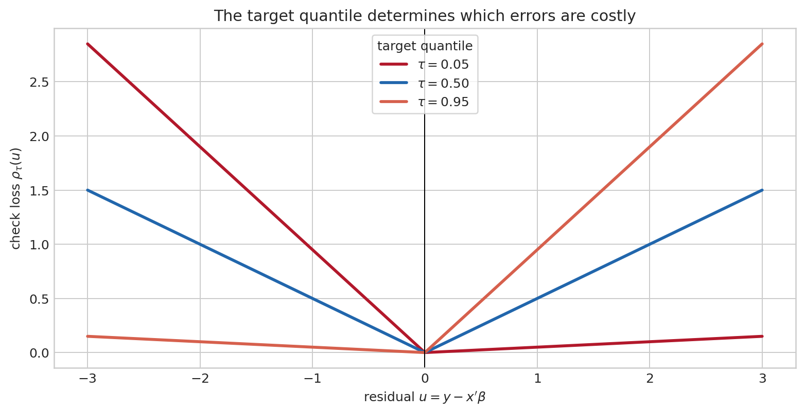
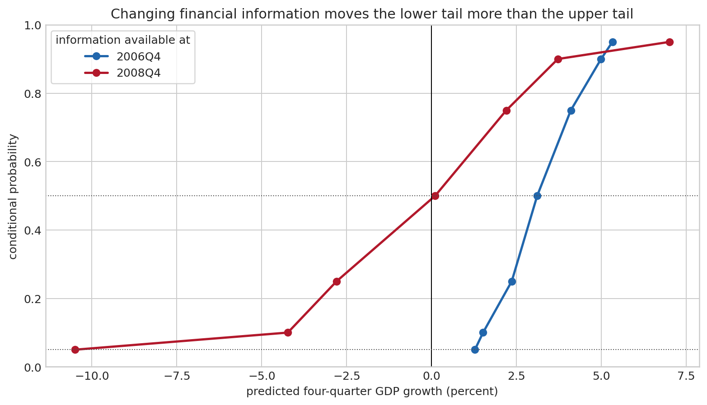
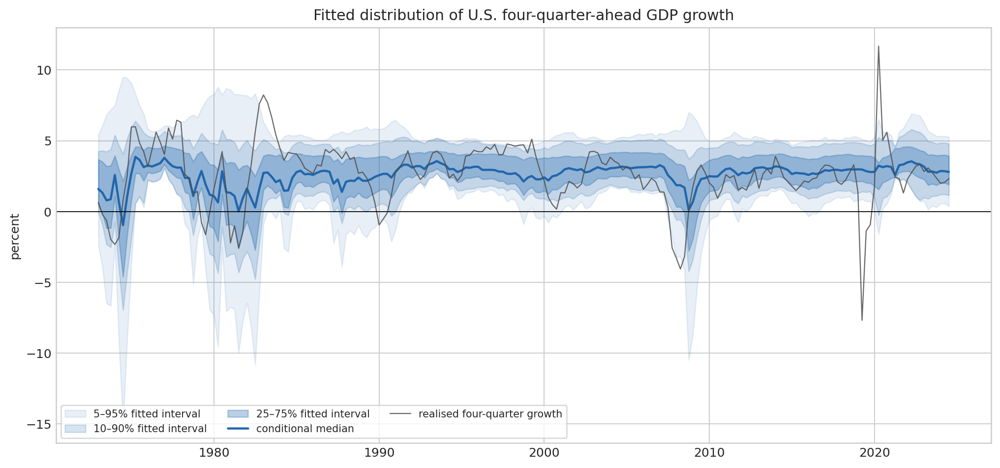
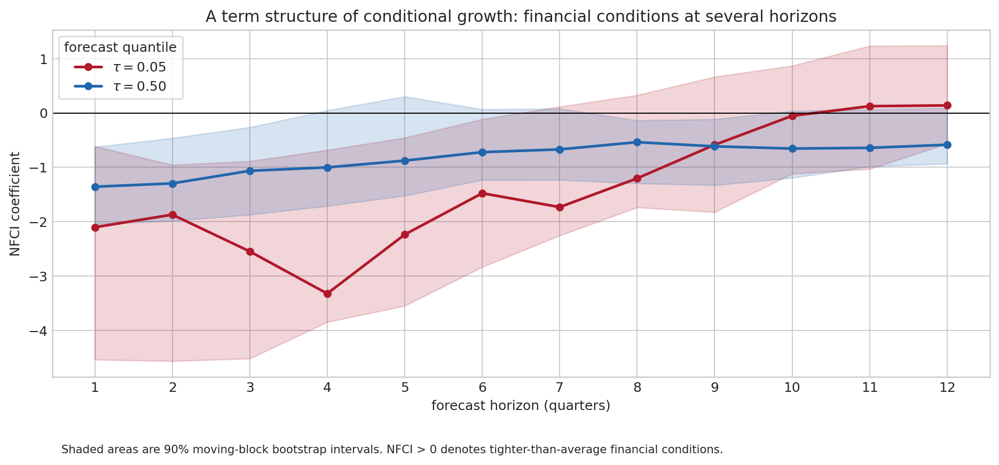
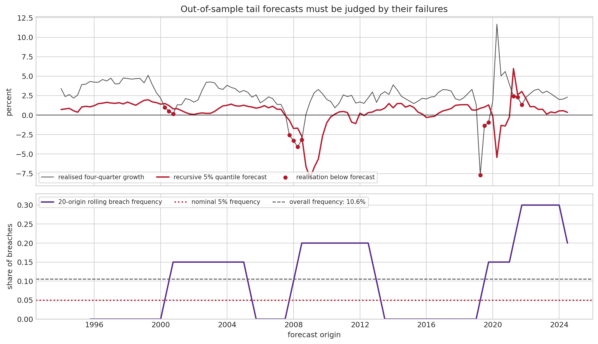

# Quantile Regressions and Growth-at-Risk {#sec-growth-at-risk}

Suppose that two forecasters both expect U.S. output to grow by two percent over the coming year. One puts the fifth percentile of growth at $1.2$ percent; the other puts it at minus $4$ percent. Their central forecasts agree, yet they are describing markedly different economies. For a government deciding how much fiscal space to preserve, a central bank assessing financial fragility, or a firm planning investment, the difference is not a detail around the forecast. It is the risk that matters.

Growth-at-Risk (GaR) takes that difference seriously. Rather than asking only for the conditional mean of future growth, it estimates selected points of its conditional distribution, especially its lower tail. The empirical result that made the literature influential is equally simple: financial conditions tend to contain more information about bad growth outcomes than about very good ones [@AdrianBoyarchenkoGiannone2019]. Quantile regression supplies a direct way of putting that proposition to the data.

The chapter first builds the estimator from the familiar median, then develops GaR as a conditional tail forecast. It uses a small U.S. exercise with public FRED data, extends it across horizons in the spirit of local projections, and finally discusses the climate-risk application. The point is not that a fifth percentile is an oracle. It is a well-defined forecast object, with its own assumptions, sampling limits, and methods of validation.

## A forecast can miss the risk that matters {#sec-gar-motivation}

Let $G_{t,t+h}$ denote real GDP growth between today $t$ and a future date $t+h$. A standard forecast targets

$$
E(G_{t,t+h}\mid\mathcal I_t),
$$

the conditional mean given the information available today, $\mathcal I_t$. This is the right object if squared forecast errors are the relevant loss and the decision-maker treats positive and negative misses symmetrically. It is not enough when the question concerns recession risk. The mean can remain close to normal while the left tail opens up.

For a probability level $\tau\in(0,1)$, the conditional quantile is defined by

$$
Q_{G_{t,t+h}\mid\mathcal I_t}(\tau)
=\inf\{g:\Pr(G_{t,t+h}\leq g\mid\mathcal I_t)\geq\tau\}.
$$

The **Growth-at-Risk at level $\tau$** is this lower conditional quantile:

$$
\operatorname{GaR}_{t,h}(\tau)=Q_{G_{t,t+h}\mid\mathcal I_t}(\tau).
$$

At $\tau=.05$, the statement is precise: conditional on the model and information set, growth is expected to fall below $\operatorname{GaR}_{t,h}(.05)$ in five percent of comparable forecast situations. GaR is expressed in growth units, not in probability units. It is therefore different from the probability of recession $\Pr(G_{t,t+h}<0\mid\mathcal I_t)$. The latter can be recovered only after estimating enough of the conditional distribution.

The terminology comes from financial Value-at-Risk, but the analogy should not be overstretched. A bank's VaR refers to a portfolio loss over a stated horizon; GaR refers to a low quantile of aggregate growth. In both cases, the number says where a tail begins, not how severe outcomes become once the tail has been entered. For that second question, the relevant object is **expected shortfall**,

$$
ES_{t,h}(\tau)=E\left[G_{t,t+h}\mid G_{t,t+h}\leq \operatorname{GaR}_{t,h}(\tau),\mathcal I_t\right].
$$

When GaR is minus three percent, an expected shortfall of minus six percent and one of minus ten percent carry different economic meanings even though their fifth percentiles coincide.

::: {.callout-important title="A conditional forecast is not a causal policy effect"}
If tight financial conditions today are associated with a lower future fifth percentile, it does not follow that an exogenous policy tightening would have that estimated effect. Financial conditions move with anticipated growth, risk appetite, and shocks that may not be observed by the econometrician. GaR is first a conditional forecasting framework. Causal claims need an identification design, such as a credible instrument, quasi-experiment, or structural model; see @sec-svar-identification and @sec-gmm.
:::

## The median is the first quantile regression {#sec-quantile-regression}

Before introducing regressors, consider the problem of choosing one number $a$ to describe observations $y_1,\ldots,y_T$. The mean minimises squared mistakes, $\sum_t(y_t-a)^2$. The median solves another sensible problem: it minimises the sum of absolute mistakes,

$$
\widehat{\operatorname{median}}(y)=\arg\min_a\sum_{t=1}^T|y_t-a|.
$$

Moving $a$ slightly to the right increases the distance from every observation on its left and reduces the distance from every observation on its right. At the optimum, the two sides balance. This is why the median is less affected by an isolated extreme observation than the mean.

To target the fifth percentile instead, errors on one side must count more than errors on the other. Define the **check loss**

$$
\rho_\tau(u)=u\big[\tau-\mathbf 1\{u<0\}\big]
=
\begin{cases}
\tau u, & u\geq0,\\
(1-\tau)(-u), & u<0.
\end{cases}
$$

For $\tau=.05$, a negative residual $u=y-a<0$ means that the proposed fifth percentile was too high: the realised outcome fell beneath it. That mistake receives weight $.95$, whereas a forecast set too low receives weight $.05$. The minimum therefore moves down until only roughly five percent of observations lie below it. At $\tau=.50$, both slopes equal one half and the solution is the median.

{#fig-gar-check-loss}

Now let $x_t$ be a vector of variables known at date $t$: a constant, current growth, inflation, a credit spread, or a financial-conditions index. The linear conditional quantile specification is

$$
Q_{G_{t,t+h}\mid x_t}(\tau)=x_t'\beta_{\tau,h},
$$

and the estimator is

$$
\widehat\beta_{\tau,h}
=\arg\min_{\beta}\sum_{t=1}^{T-h}
\rho_\tau\left(G_{t,t+h}-x_t'\beta\right).
$$

This is the quantile-regression estimator of Koenker and Bassett [@KoenkerBassett1978]. It is linear in coefficients but not an OLS problem: the objective has corners, not a differentiable quadratic surface. Computationally it can be written as a linear programme by splitting each residual into its positive and negative parts. There is no need to assume Normal, symmetric, or homoskedastic shocks in order to define the estimator.

### Conditional is doing important work

The quantile in GaR is conditional on today's information. Consider two quarters with the same unconditional 5th percentile of output growth but different credit spreads. If the conditional fifth percentile is lower in the high-spread quarter, the distribution relevant to a decision made in that quarter has changed. Pooling the two quarters into one unconditional distribution would erase that information.

This differs from a question sometimes called *unconditional quantile regression*: how would a small shift in a covariate move a quantile of the population-wide marginal distribution? That question is often useful in cross-sectional distributional work. GaR instead asks for a forecast distribution for one macroeconomic variable at one date, conditional on a specified information set. The distinction is not terminology for its own sake: only the conditional object can serve as a date-$t$ tail forecast.

### What a quantile coefficient says

If $x_{j,t}$ rises by one unit, $\beta_{j,\tau,h}$ is the associated change in the $\tau$th **conditional quantile** of growth, holding the other included regressors fixed. It is not, in general, the effect on an observation that happens to be in the bottom five percent. Quantile membership is an outcome, not a stable group of units followed through time.

Comparing coefficients across $\tau$ is where the method becomes economically useful. Suppose a financial-stress index has a coefficient of minus two at $\tau=.05$, minus one at the median, and zero at $\tau=.95$. Higher stress then shifts the lower tail down much more than the upper tail. OLS would compress these movements into a single conditional-mean coefficient and conceal the asymmetry. Conversely, parallel coefficients across the quantiles would say that the predictor mainly translates the distribution rather than changing its shape.

{#fig-gar-coefficients}

The figure should be read as a conditional association, not as a universal macroeconomic law. The right panel is nevertheless the empirical pattern that motivates GaR: a deterioration in financial conditions is much more closely associated with low future-growth quantiles than with the high side of the distribution. The very wide bands at the extremes also show why a graph of many quantiles is more honest than a single precisely reported tail coefficient.

### Why tail inference is demanding

Quantile regression is consistent under weak conditions, but a tail coefficient is not estimated with the ease of a mean coefficient. In the independent-observation benchmark,

$$
\sqrt{T}(\widehat\beta_\tau-\beta_\tau)
\overset{d}{\longrightarrow}
\mathcal N\left(0,
\tau(1-\tau)D_\tau^{-1}E[x_tx_t']D_\tau^{-1}\right),
\qquad
D_\tau=E\left[f_{u_\tau\mid x}(0\mid x_t)x_tx_t'\right].
$$

The density $f_{u_\tau\mid x}(0\mid x_t)$ is the amount of probability mass near the fitted quantile. If few observations lie near the fifth percentile, a small displacement of the fitted line can change which observations count as tail events; the estimate is correspondingly noisy. The formula also shows that the variance depends on an unknown conditional density, so standard-error calculations require an additional estimate of that density.

Macroeconomic data add serial dependence and, for $h>1$, overlap in the target. A moving-block bootstrap gives a practical alternative. It resamples short adjacent stretches of the observed time series, refits the entire quantile regression in each pseudo-sample, and reads uncertainty from the dispersion of the resulting coefficients. The procedure retains local dependence that an i.i.d. bootstrap would destroy. It is an inferential device, however, not a solution to omitted variables or reverse causality. The general bootstrap logic is reviewed in @sec-lln-clt.

### A distribution is more than seven regressions

Estimating $\tau=.05,.10,.25,.50,.75,.90,.95$ gives seven points of a conditional quantile function. For a fixed $x_t$, they should be increasing in $\tau$. Finite-sample estimates can cross, producing the absurdity that a 10th percentile exceeds a 25th percentile. **Monotone rearrangement** restores the order by sorting the fitted quantiles at each forecast origin. It changes the representation minimally while imposing a logical property that the estimated conditional distribution must possess [@ChernozhukovFernandezValGalichon2010].

The ordered points can be linearly interpolated to construct an approximate conditional CDF. A smooth density requires more: it is the derivative of that CDF, so it is sensitive to how the gaps between estimated quantiles are filled. Adrian, Boyarchenko, and Giannone fit a skewed-$t$ distribution to the estimated quantile function in order to obtain a smooth density and tail measures [@AdrianBoyarchenkoGiannone2019]. This can be valuable, since location, dispersion, asymmetry, and tail thickness are all allowed to move. It is also an additional parametric step. A fitted density should therefore be presented as a model-based interpolation of quantile estimates, not as a directly observed object.

### From a quantile grid to a recession probability

Once the fitted quantile curve has been made monotone, the forecast probability of negative growth can be approximated by locating zero on that curve:

$$
\widehat{\Pr}(G_{t,t+h}<0\mid\mathcal I_t)
\approx \sup\left\{\tau:\widehat Q_{G_{t,t+h}\mid\mathcal I_t}(\tau)\leq0\right\}.
$$

With only seven estimated quantiles, this necessarily involves interpolation and says little about probabilities below the lowest fitted quantile. A skewed-$t$ fit extends the curve smoothly to the tails, but only by accepting its shape restrictions. For decisions centred on a 5% threshold, it is often preferable to report the estimated GaR and its uncertainty directly instead of presenting a very precise-looking recession probability constructed from a thin tail.

{#fig-gar-quantile-curves}

## An empirical U.S. exercise {#sec-gar-empirical}

The exercise is deliberately small enough to inspect. It is not a replication of the papers and it makes no claim to be a production forecasting system. Real GDP and the GDP deflator are quarterly FRED series; the Chicago Fed National Financial Conditions Index (NFCI) is weekly and is averaged within each quarter. The estimation sample is 1973Q1–2024Q3. NFCI is positive when financial conditions are tighter than their historical average.

At date $t$, all conditioning variables are observable: current year-on-year real growth $g_t$, year-on-year GDP-deflator inflation $\pi_t$, and quarterly-average NFCI $f_t$. The target is cumulative log real-GDP growth over the following four quarters,

$$
G_{t,t+4}=100(\log Y_{t+4}-\log Y_t).
$$

For each $\tau$, we estimate

$$
Q_{G_{t,t+4}\mid\mathcal I_t}(\tau)
=\alpha_\tau+\beta_{g,\tau}g_t+\beta_{\pi,\tau}\pi_t
+\beta_{f,\tau}f_t.
$$

Using a four-quarter target is attractive because it reads naturally as growth over the coming year. It creates overlapping observations: $G_{t,t+4}$ and $G_{t+1,t+5}$ share three quarters of output. Treating the rows as independent would overstate precision. The bands in Figures @fig-gar-coefficients and @fig-gar-term-structure are consequently obtained by resampling contiguous blocks of dates, rather than isolated rows. This does not fix every specification issue, but it respects the basic time-series dependence induced by the forecasting exercise.

```python
# A compact version of the estimator used to generate the figures.
# The full, independently written script is code/python/make_gar_figures.py.

def rho(u, tau):
    return np.maximum(tau * u, (tau - 1) * u)

def fit_quantile(x, y, tau):
    # Equivalent linear-programme representation is used in the full script.
    return argmin_beta(np.sum(rho(y - x @ beta, tau)))
```

The fan chart below places the realised growth rate against the fitted quantiles. It is an **in-sample description**: each plotted quantile uses the whole available estimation sample, including information that would not have been available at early dates. Its role is to show what the model says about the changing distribution, not to establish forecasting success. The deep widening and downward movement around the Global Financial Crisis and the pandemic make the tail perspective tangible, but they also remind us how much influence a small number of severe episodes have in a 207-observation sample.

{#fig-gar-fan}

### The term structure of downside growth

The one-year forecast is only one horizon. Let

$$
G^{(h)}_{t}=\frac{400}{h}(\log Y_{t+h}-\log Y_t)
$$

be annualised average growth over the next $h$ quarters. Estimating a separate local projection for each horizon gives

$$
Q_{G^{(h)}_t\mid\mathcal I_t}(\tau)=x_t'\beta_{\tau,h},
\qquad h=1,\ldots,H.
$$

This is the distributional counterpart of the local projections introduced in @sec-local-projections. It imposes no VAR recursion across horizons: the coefficient at twelve quarters is estimated from a direct twelve-quarter forecasting equation. That flexibility is useful when the question is whether a predictor changes the timing as well as the level of risk.

Adrian, Grinberg, Liang, Malik, and Yu estimate such term structures for eleven advanced economies out to twelve quarters [@AdrianGrinbergLiangMalikYu2019]. Their central mechanism is intertemporal. Loose financial conditions can support near-term growth, while a combination of loose conditions and rapid credit growth can raise downside risk later on. The estimated lower-tail response changes more strongly with the horizon than the median response. This is not a contradiction: today’s favourable financing terms and tomorrow’s accumulated vulnerability can coexist.

{#fig-gar-term-structure}

The plotted pattern is a useful warning against reducing a forecast to a single horizon. A tight NFCI is associated with a lower short-horizon fifth percentile in this sample. At longer horizons, the estimate becomes much less precise. The cross-country evidence in @AdrianGrinbergLiangMalikYu2019 is richer because it studies a panel, credit growth, and the interaction between loose conditions and credit booms; it also examines the causal interpretation with granular instruments. A small single-country regression should not inherit those claims merely by using the same vocabulary.

## Validation: a tail forecast earns its place out of sample {#sec-gar-validation}

A nominal fifth percentile should be breached roughly five percent of the time. Write

$$
I_{t+h}(\tau)=\mathbf 1\{G_{t,t+h}\leq \widehat Q_{t,h}(\tau)\}.
$$

If forecasts are calibrated, the average of $I_{t+h}(\tau)$ should be close to $\tau$. **Unconditional coverage** checks this average. **Conditional coverage** asks more: are breaches clustered after particular financial states, or predictable from information that the forecast had ignored? A model that happens to achieve five percent coverage while missing every crisis is not adequate.

One practical conditional-coverage diagnostic regresses $I_{t+h}(\tau)-\tau$ on variables known at the forecast origin, including lags of the hit itself. A jointly significant set of predictors signals information left in the violations. In a macro sample, the reference distribution of that test should again allow for serial dependence and for the overlap of $h$-period targets. Calibration concerns the frequency with which a predictive statement comes true; it is separate from the question of whether the model has the lowest check loss among competing forecasts.

The next figure uses recursive forecasts. At each forecast origin, the model is re-estimated only on outcomes that would already have been observed at that date; the red dots mark realised growth below the predicted fifth percentile. The lower panel reports the rolling breach frequency. This exercise is intentionally severe: the tail is sparse, and four-quarter horizons overlap, so neither a few breaches nor their absence settles the question.

{#fig-gar-backtest}

Coverage is necessary but not sufficient. A useful comparison across competing quantile forecasts is average check loss,

$$
\frac{1}{T}\sum_t\rho_\tau\left(G_{t,t+h}-\widehat Q_{t,h}(\tau)\right).
$$

It rewards a forecast that places the target quantile well and penalises an overly optimistic lower-tail forecast especially sharply. A serious empirical assessment should compare this score, coverage, conditional coverage, and stability across rolling windows against simpler benchmarks: an unconditional historical quantile, an autoregression, and a forecast excluding the financial indicator. It should also distinguish revised data from the real-time data vintage that forecasters actually saw.

::: {.callout-warning title="The five-percent problem"}
With 200 independent forecasts, a five-percent tail contains only about ten expected breaches. Macroeconomic forecasts are not independent and overlapping horizons further reduce effective information. A sharp-looking 5% estimate can therefore be driven by a handful of episodes. Reporting the 10th and 25th percentiles alongside GaR, using block bootstrap inference, and showing out-of-sample performance are safeguards against false precision, not optional refinements.
:::

## Climate risk as a distributional macroeconomic problem {#sec-climate-gar}

Climate risk brings the logic of GaR into particularly clear focus. A heatwave, flood, drought, or disorderly policy change need not move average output very much in every place and every year. It may instead make severe outcomes more likely for exposed regions, sectors, or households. The relevant empirical question is then not only whether climate risk shifts mean growth, but whether it shifts the lower conditional quantiles and how quickly that shift materialises.

Yin, Qian, and Ji study this question in a panel of 297 Chinese prefecture-level cities from 2008 to 2023 [@YinQianJi2026]. They distinguish **physical risk** from extreme temperature, rainfall, and drought measures, and **transition risk** proxied by climate-policy uncertainty. Their baseline relates growth at horizons of one, two, and three years to these risks, controls, city fixed effects, and time fixed effects:

$$
Q_{g_{i,t+h}\mid x_{i,t}}(\tau)
=\beta_{\tau,h}^{P}\operatorname{PhysicalRisk}_{i,t}
+\beta_{\tau,h}^{T}\operatorname{TransitionRisk}_{i,t}
+w_{i,t}'\gamma_{\tau,h}+\mu_{i,\tau}+\lambda_{t+h,\tau}.
$$

The distinction is economic as well as statistical. Physical shocks can interrupt production, damage capital, disrupt transport, and tighten local credit precisely when resilience is already weak. Transition risk concerns revaluation and adjustment: carbon-intensive capital, uncertain regulation, and the cost of reallocating labour and investment. A panel is useful here because national aggregates can hide substantial variation in exposure, productive structure, and adaptive capacity.

Their estimates associate physical climate risk most strongly with lower growth quantiles, with an effect that is strongest at the medium horizon. Transition risk has a different distributional profile, concentrated more in higher-growth quantiles in their city sample. The authors also report credit availability and total-factor productivity as potential transmission channels, and find that green finance is associated with a weaker propagation of climate risks to downside growth. These are substantive findings from one setting, not parameters that can be transferred mechanically to another country.

There are two important identification lessons. First, adding fixed effects removes time-invariant city characteristics and common year shocks; it does not by itself make climate-policy uncertainty exogenous. Second, a mediator regression for credit or productivity is evidence about a plausible mechanism, not automatically a decomposition of a causal effect. The paper supplements its analysis with instruments, but the validity of an instrument rests on its own exclusion argument. The general distinction between moment conditions, relevance, and exclusion is developed in @sec-gmm.

The horizon mismatch is also worth keeping in view. Climate change unfolds over decades, whereas GaR usually describes a one- to three-year forecasting window. GaR does not estimate the welfare cost of climate change or replace an integrated assessment model. It asks a narrower and operational question: given current exposure and transition conditions, how vulnerable is growth over a stated near- or medium-term horizon? That is exactly the scale at which resilience investment, credit policy, and prudential supervision often need information.

## A disciplined workflow {#sec-gar-workflow}

1. **State the target before choosing a model.** Specify the growth concept, horizon, conditioning information, and tail probability. A one-quarter annualised rate and four-quarter cumulative growth answer different questions.

2. **Respect the information set.** Every predictor must be observable at the forecast origin. Mixed-frequency variables need an explicit aggregation rule and data releases must be dated correctly.

3. **Estimate several quantiles.** A fifth percentile without a median and upper quantiles cannot reveal whether the predictor changes location, scale, skewness, or the whole shape of the distribution.

4. **Handle the time-series structure.** Overlapping horizons, serial correlation, and revisions affect inference and backtesting. Use block resampling or another dependence-aware procedure.

5. **Repair quantile crossing transparently.** Rearrangement is a logical correction; smoothing a full density adds modelling assumptions that should be reported.

6. **Evaluate recursively.** Report coverage, conditional coverage, check loss, benchmarks, and forecast vintages. The aesthetic quality of a fan chart is not evidence of calibration.

7. **Keep prediction and intervention separate.** A GaR model can flag vulnerability. It cannot alone determine which policy would reduce it, nor how a policy rule changes the distribution after agents respond.

## Further reading

The foundational empirical analysis of changing growth vulnerability is @AdrianBoyarchenkoGiannone2019. The multi-horizon macro-financial extension is @AdrianGrinbergLiangMalikYu2019. For an application that separates physical and transition climate risks in a local panel, see @YinQianJi2026. The mathematical foundations for conditional distributions, convergence, bootstrap inference, and lag operators are collected in @sec-joint-distributions, @sec-lln-clt, and @sec-lag-operator-foundations.
