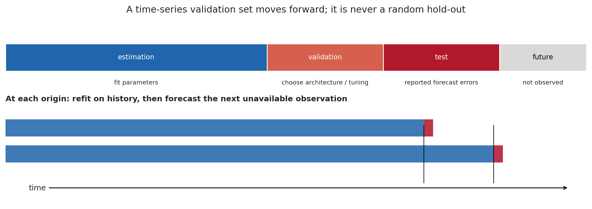
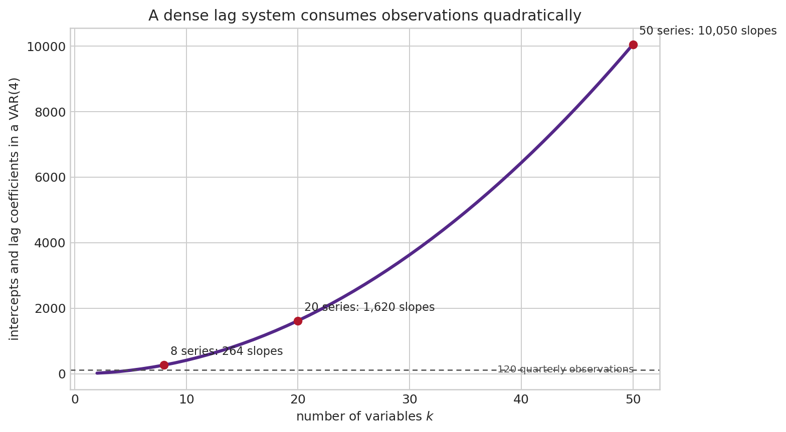
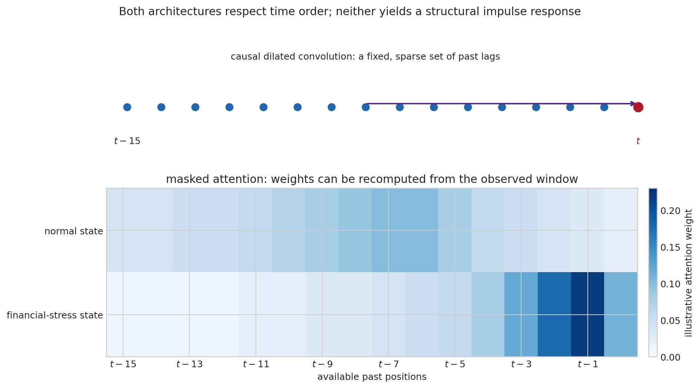
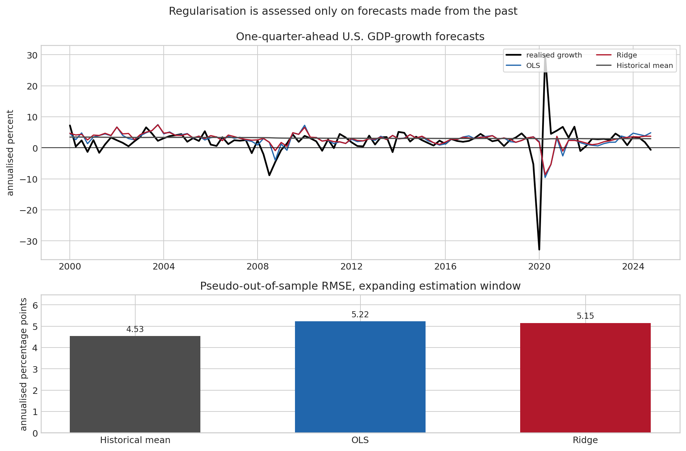

# Machine Learning Tools for Time Series {#sec-machine-learning-time-series}

At the beginning of a quarter, suppose that one wants to forecast next quarter's real GDP growth. The data set contains the past of output, prices, interest rates, credit spreads, employment, surveys, commodity prices, and perhaps thousands of disaggregated series. There are two reasons not to begin by fitting the largest available neural network. First, every observation after the forecast date is forbidden information. Second, U.S. quarterly data offer only a few hundred dates, while a rich dynamic model can easily contain thousands of adjustable quantities.

Machine learning enters this problem as a family of ways of estimating a forecasting rule. It is not a different object from the conditional expectation studied in the earlier chapters. If $y_{t+h}$ is the future variable of interest and $\mathcal I_t$ is the information genuinely available at date $t$, the squared-error target remains

$$
m_h(\mathcal I_t)=E(y_{t+h}\mid \mathcal I_t).
$$

The difference is that a machine-learning method allows the function $m_h(\cdot)$ to be flexible, high-dimensional, or both. That freedom can uncover nonlinearities and interactions that a small VAR leaves out. It can also fit historical accidents, absorb leaked future information, and obscure the economic source of an apparent gain. The discipline of time-series econometrics therefore comes first: define the forecast origin, transform the data, respect dependence, compare with serious benchmarks, and distinguish prediction from a structural effect.

This chapter starts from that forecasting problem and builds the main tools in turn: regularisation, trees, recurrent and convolutional networks, attention and Transformers, distributional prediction, and foundation models. The review by Chen and Wang [@ChenWang2026] is especially useful for seeing these methods as extensions of familiar dynamic models rather than as a replacement vocabulary. The final exercise uses public U.S. data and an expanding forecast experiment. It is a reproducible illustration, not a leaderboard.

## The date of the forecast is part of the model {#sec-ml-forecast-origin}

An observation in a cross-sectional data set is often treated as exchangeable with the next one: an algorithm may randomly divide rows into a training and a test sample. A date is different. The value of GDP growth in 2023Q4 can be useful for explaining 2023Q3 after the fact, but it could not have helped a forecaster in 2023Q3. Random splitting lets the future enter the training sample and evaluates a forecaster who never existed.

For a horizon $h$, construct one row at each forecast origin $t$:

$$
\big(x_t,y_{t+h}\big),\qquad x_t\in\mathcal I_t.
$$

The vector $x_t$ can contain lags, contemporaneous releases already published at $t$, calendar variables, and transformations such as growth rates. Its entries must be dated as carefully as the target. If unemployment for month $t$ is released in month $t+1$, it is not a time-$t$ predictor in a real-time nowcast without a vintage-data argument. Revisions create a second problem: today’s revised history is valuable for exposition, but it is not necessarily the data set that was visible in the past.

{#fig-ml-rolling-origin}

The simplest honest experiment is an **expanding-window forecast**. At origin $t_0$, estimate on observations up to $t_0$, forecast $y_{t_0+h}$, move to $t_0+1$, re-estimate using the enlarged history, and continue. A rolling window instead discards distant observations and may be preferable when an old regime is judged irrelevant. Neither choice is mechanically correct: the expanding window reduces estimation noise, whereas the rolling window can adapt more quickly after a break. The choice itself should be part of the empirical design.

The last stretch of data is often held back for the final evaluation. Within the preceding history, hyperparameters such as a ridge penalty, the number of trees, a network width, a look-back window, or the stopping epoch must be chosen using earlier forecast origins. This is **nested time-series validation**. Choosing an architecture after inspecting its performance on the final test period is a form of overfitting, even if the test observations were never used to estimate weights.

::: {.callout-important title="The information set is more than a column list"}
The relevant question is not merely whether a variable has a date stamp no later than $t$. It is whether the value used was released, known, and defined at that date. A macroeconomic backtest based on the latest data vintage can be useful, but it measures performance with revised information. A real-time claim calls for real-time vintages and release calendars.
:::

### A loss function says what a good forecast is

Given forecasts $\hat y_{t+h\mid t}$, the common score is the mean squared forecast error,

$$
\operatorname{MSFE}_h=\frac{1}{N}\sum_{t\in\mathcal T}
\left(y_{t+h}-\hat y_{t+h\mid t}\right)^2,
\qquad
\operatorname{RMSE}_h=\sqrt{\operatorname{MSFE}_h}.
$$

Squaring makes a rare large miss costly. That is reasonable when large forecast mistakes are especially damaging, but it is not a law of nature. The mean absolute error gives all misses proportional weight. A central bank interested in recessions may care about a lower quantile or a recession probability rather than the conditional mean; Chapter @sec-growth-at-risk develops the corresponding check loss. A forecast method cannot be assessed independently of this decision problem.

Forecast errors are serially dependent when $h>1$ because the targets overlap. Their relative performance may also change across recessions, tranquil periods, and revisions of the monetary-policy regime. Reporting a single RMSE is useful, but a graph of forecast errors through time, performance by subperiod, and the benchmark being beaten usually says more.

If two forecasts are evaluated on the same origins, let $d_t=\ell(e^A_t)-\ell(e^B_t)$ be their loss differential. The null of equal expected predictive accuracy is $E(d_t)=0$. The Diebold–Mariano statistic standardises the average $\bar d$ by a long-run standard error,

$$
DM=\frac{\sqrt{N}\,\bar d}{\widehat{\operatorname{LRV}}(d_t)^{1/2}}.
$$

The long-run variance includes autocovariances of $d_t$, rather than treating the dates as independent. This is indispensable for overlapping multi-step targets. It does not rescue a test after the same test set has been repeatedly used to select models: selection has already made the reported winner unusually lucky. A forecast comparison is evidence about a stated design, not an automatic discovery of a universal best algorithm [@DieboldMariano1995].

## Why flexibility needs restraint {#sec-ml-regularisation}

A VAR already illustrates the central difficulty. With $k$ variables and $p$ lags, a dense VAR has $k^2p+k$ intercept and slope coefficients. With 20 variables and four lags, that is 1,620 coefficients before the innovation covariance matrix is considered. A quarterly sample of 120 observations has little chance of locating all of them precisely.

{#fig-ml-parameter-growth}

The issue is not a defect unique to VARs. A large neural network, a deep tree, and a high-order polynomial each have many ways to fit the same finite history. In sample, extra flexibility almost always helps. Out of sample, it may amplify estimation noise. This is the bias-variance trade-off in its concrete forecasting form: a rigid rule can systematically miss a genuine nonlinear relation; an excessively responsive rule changes sharply when a few historical dates are changed.

### Ridge: the first useful machine-learning tool

Take a linear predictor with a rich vector of features,

$$
y_{t+h}=\alpha+x_t'\beta+u_{t+h}.
$$

OLS minimises the residual sum of squares. Ridge regression instead solves

$$
(\hat\alpha_\lambda,\hat\beta_\lambda)
=\arg\min_{\alpha,\beta}
\left\{
\sum_{t\in\mathcal T_{\mathrm{train}}}(y_{t+h}-\alpha-x_t'\beta)^2
+\lambda\sum_{j=1}^{q}\beta_j^2
\right\},\qquad \lambda\geq0.
$$ {#eq-ml-ridge}

The second term makes large slopes expensive. When predictors are correlated, many coefficient vectors can make almost indistinguishable in-sample predictions. Ridge prefers the one with a smaller Euclidean norm. In matrix notation, after centering or keeping an unpenalised intercept,

$$
\hat\beta_\lambda=(X'X+\lambda I)^{-1}X'y.
$$

The matrix $X'X+\lambda I$ remains invertible for $\lambda>0$ even when the columns of $X$ are linearly dependent. Geometrically, the penalty prevents the fitted coefficient vector from moving far in directions where the data offer little information. The linear-algebra ingredients behind this expression are reviewed in @sec-matrices-transformations and @sec-linear-algebra-foundations.

Ridge does not select variables: it usually keeps every coefficient nonzero but reduces unstable ones. The lasso replaces $\sum_j\beta_j^2$ by $\sum_j|\beta_j|$ and can set some coefficients exactly to zero. Elastic net combines both penalties,

$$
\sum_t(y_{t+h}-\alpha-x_t'\beta)^2
+\lambda\left[(1-\eta)\frac{\|\beta\|_2^2}{2}+\eta\|\beta\|_1\right],
\qquad 0\leq\eta\leq1.
$$

The $\ell_1$ corner is what permits selection; the $\ell_2$ part stabilises groups of correlated lags. These are not merely computational devices. They state a prior empirical judgment: extremely large and intricate responses to small movements in a predictor are less plausible unless the data repeatedly earn them. The same shrinkage logic appears in the Minnesota prior of a Bayesian VAR, developed in Chapter @sec-bvar.

Standardisation is essential here. A one-unit change in an interest rate and a one-unit change in an index need not be comparable. Before applying a common penalty, transform each predictor using the mean and standard deviation **estimated in the training window only**. Applying a full-sample transformation makes future observations influence the scale of the past. The point is small algebraically and consequential in a backtest.

### Features are hypotheses about the past

To give a learner a time series, one often builds a lag window,

$$
x_t=(y_t,y_{t-1},\ldots,y_{t-L+1},z_t,z_{t-1},\ldots,z_{t-L+1})'.
$$

This table is a representation of a dynamic question, not ordinary independent rows. The window length $L$, transformations, missing-value treatment, seasonal adjustment, and inclusion of external variables all impose structure. A model that forecasts levels with a bounded activation function can fail simply because it cannot extrapolate a trend; a model trained on raw prices may appear accurate because persistence dominates, while saying little about returns. The stationarity, unit-root, and cointegration diagnostics in Chapters @sec-time-series and @sec-cointegration should shape this work before a loss is minimised.

## Nonlinearity from partitions and from networks {#sec-ml-nonlinear-predictors}

Suppose a credit spread predicts low output growth only when it is already unusually high. A linear slope averages the two situations. A **regression tree** searches for a split such as $\text{spread}_t>c$, then fits a separate local mean on each side. Repeated splits divide the predictor space into rectangles, and the forecast is constant within each terminal rectangle.

The attraction is immediate: interactions and thresholds are discovered without writing them all down in advance. A single deep tree is unstable, though. Moving one observation can alter an early split and change every subsequent branch. A random forest averages many trees grown on resampled observations and randomly selected candidate predictors. The average lowers variance. Gradient boosting builds trees sequentially, each new tree fitting the residual errors of its predecessors; with squared loss, the update has the form

$$
f_m(x)=f_{m-1}(x)+\nu g_m(x),
$$

where $g_m$ is a shallow tree and $\nu$ is a learning rate. Shallow trees, a small learning rate, and early stopping limit how closely the ensemble chases the training sample.

Trees have useful limits to remember. Their basic prediction within a leaf is an average of observed outcomes, so they extrapolate trends and extremes poorly. Their variable-importance measures can be misleading when predictors are correlated. Most importantly, a split saying that high spreads precede weak growth is a conditional forecasting association, not the effect of an intervention on spreads. For the latter, the identification problem in Chapter @sec-svar remains.

### From a lag window to a hidden representation

A feed-forward neural network starts with the same lag vector $x_t$, but repeatedly transforms it. In a one-hidden-layer network,

$$
h_t=\phi(W_1x_t+b_1),
\qquad
\hat y_{t+h\mid t}=w_2'h_t+b_2,
$$

where $\phi$ is a nonlinear activation such as the rectified linear unit, $\phi(a)=\max(a,0)$. The hidden units construct nonlinear combinations of lags; the final layer combines them. With enough units, such a network can approximate a wide class of continuous functions on a bounded region. This approximation result says little about how much data is needed to learn the function, which is precisely the scarce resource in macroeconomics.

The network is fitted by minimising an empirical loss through gradient descent. For a parameter vector $\theta$, a gradient step is

$$
\theta^{(r+1)}=\theta^{(r)}-\gamma_r\nabla_\theta
\frac{1}{n}\sum_{t\in\mathcal T_{\mathrm{train}}}
\ell\left(y_{t+h},f_\theta(x_t)\right).
$$

Back-propagation is the repeated chain rule used to calculate this gradient efficiently through the layers. Its economic interpretation is modest: it is a numerical method for adjusting a flexible forecast function. Dropout, weight decay, early stopping, and data augmentation all serve the familiar purpose of regularisation. They reduce the effective capacity of the fitted rule; they do not create additional business cycles in the historical record.

## Architectures that preserve temporal order {#sec-ml-sequence-architectures}

Flattening the last $L$ observations into a vector makes a feed-forward network possible, but it does not share any structure across dates. A recurrent, convolutional, or attention-based architecture introduces a particular idea about how temporal information should be reused. Each is a restriction as well as a source of flexibility.

### Recurrent networks and LSTMs

An ordinary recurrent neural network maintains a hidden state,

$$
h_t=\phi(W_xx_t+W_hh_{t-1}+b),
\qquad
\hat y_{t+h\mid t}=a'h_t+c.
$$

The state is a learned summary of the past. Unrolling the recursion shows why a long sequence can be difficult: the derivative of a remote observation involves repeated products of $W_h$ and activation derivatives. Those products can vanish or explode, making long-lag learning fragile.

The long short-term memory network (LSTM) introduces a separate cell state $c_t$ and gates that decide what to retain [@HochreiterSchmidhuber1997]. With input $x_t$ and previous hidden state $h_{t-1}$,

$$
\begin{aligned}
f_t&=\sigma(W_f[x_t,h_{t-1}]+b_f), & i_t&=\sigma(W_i[x_t,h_{t-1}]+b_i),\\
o_t&=\sigma(W_o[x_t,h_{t-1}]+b_o), & \tilde c_t&=\tanh(W_c[x_t,h_{t-1}]+b_c),\\
c_t&=f_t\odot c_{t-1}+i_t\odot\tilde c_t, & h_t&=o_t\odot\tanh(c_t).
\end{aligned}
$$ {#eq-ml-lstm}

Here $\sigma$ maps a number to $(0,1)$, $\odot$ denotes element-by-element multiplication, and the forget gate $f_t$ can carry part of the old cell state forward. The equations give a precise meaning to the informal idea of memory. They do not establish that the learned cell is an economic state variable, nor that one gate corresponds to a named mechanism.

A bidirectional LSTM processes the input window in both directions. It can be legitimate when the whole input window lies before the forecast origin: the model is allowed to compare January with March when forecasting April. It is invalid if the backward pass sees dates after the forecast origin. This distinction is easy to lose in generic sequence-model software.

### Causal convolutions and TCNs

A one-dimensional **causal convolution** with kernel $w_0,\ldots,w_{K-1}$ forms

$$
s_t=\sum_{j=0}^{K-1}w_jx_{t-j}.
$$

The same kernel is applied at every date, so a local pattern has the same meaning wherever it occurs. A dilated convolution replaces $t-j$ by $t-dj$, allowing the receptive field to expand without a huge kernel. Stacking several causal, dilated layers produces a temporal convolutional network (TCN). It can reach far back in time while remaining parallelisable during training [@BaiKolterKoltun2018].

{#fig-ml-convolution-attention}

The word *causal* in a causal convolution concerns information flow: the architecture does not use future dates. It does not mean causal identification. The distinction matters throughout macroeconometrics.

### Attention and Transformers

The Transformer replaces a fixed recurrence or a fixed local kernel by data-dependent weighted combinations. For a sequence matrix $X$, construct queries, keys, and values,

$$
Q=XW_Q,\qquad K=XW_K,\qquad V=XW_V,
$$

and define scaled dot-product attention by

$$
\operatorname{Attention}(Q,K,V)=
\operatorname{softmax}\left(\frac{QK'}{\sqrt{d_k}}+M\right)V.
$$ {#eq-ml-attention}

Each row of the softmax is non-negative and sums to one. The entry in the mask $M$ is set to a very negative value for forbidden future positions, so a forecast at $t$ cannot attend to $t+1$. Positional encodings or time features are necessary because attention by itself sees a set of vectors, not their chronological order. Multiple attention heads apply several query-key-value maps in parallel, allowing different similarity patterns to be represented [@VaswaniEtAl2017].

There is a useful connection with a nonlinear VAR. A linear VAR applies the same lag matrices at every date. An attention layer can recompute the weights placed on different past dates from the current window. It may, for example, put greater weight on recent financial observations in a stressed period. That adaptability is a forecasting property. An attention weight is not an elasticitiy, a Granger-causality statistic, or an impulse response. Correlated inputs can receive very different weights while producing the same forecast, and a large weight can reflect redundancy rather than economic importance.

Long sequences create a computational cost because the attention score matrix contains a pairwise comparison of positions. Time-series implementations therefore use patches of adjacent dates, restrict attention to local windows, or use approximate attention. They also choose whether tokens represent dates, variables, or blocks of a multivariate panel. These are consequential modelling choices: patching may help smooth high-frequency noise, but it can blur a sharp policy announcement.

### One horizon or many?

For a one-step model, multi-step forecasts can be obtained recursively:

$$
\hat y_{t+2\mid t}=f\left(\hat y_{t+1\mid t},x_t\right).
$$

The model is trained on observed lags but, beyond the first step, receives its own predictions. Errors can compound. A direct method instead fits a separate $f_h$ for each horizon, $\hat y_{t+h\mid t}=f_h(\mathcal I_t)$; a sequence-to-sequence model outputs the whole path jointly. Direct forecasts avoid recursive error propagation but require more parameters. A path model can preserve cross-horizon coherence, yet needs a loss and an evaluation that make that coherence visible.

The same distinction arises across series. A **local** model is estimated separately for each series. A **global** model shares parameters across a panel of related series, such as thousands of product sales or country-level macro series. Global learning can be powerful when many comparable trajectories exist. It is less compelling when a single country’s quarterly history is the effective sample and institutional differences are economically important.

## Forecasting a distribution, not only its centre {#sec-ml-probabilistic}

A point forecast cannot distinguish a predictable two-percent growth rate from a two-percent average of very different boom and recession outcomes. A distributional learner estimates an object such as

$$
F_{t,h}(y)=\Pr(Y_{t+h}\leq y\mid\mathcal I_t).
$$

One route is a parametric output layer that predicts a conditional mean and variance, then uses a Gaussian or Student distribution. Another predicts a grid of quantiles with the check loss of Chapter @sec-quantile-regression. The latter directly yields growth-at-risk, while a distributional VAR extends the question to several jointly evolving variables; see @sec-distributional-var.

Probabilistic forecasts need probabilistic evaluation. If a 90 percent interval is correctly calibrated over comparable forecast origins, roughly 90 percent of realisations should fall inside it. Calibration alone is insufficient: an interval extending from minus fifty to plus fifty percent would cover almost everything and be uninformative. The continuous ranked probability score (CRPS) rewards a predictive CDF that places probability near the realised value; the probability integral transform (PIT), $F_{t,h}(y_{t+h})$, should be approximately uniform for a calibrated continuous forecast. Calibration should also be checked separately in crises, where it is most valuable and the evidence is thinnest.

**Conformal prediction** offers a simple route to marginal coverage. Fit a point model on historical data, calculate past absolute forecast errors, and attach a suitably high empirical residual quantile to the next forecast. Under exchangeability, the interval has finite-sample coverage. Time series are not exchangeable, so rolling or weighted conformal procedures rely on approximate stability rather than a free guarantee. After a structural break, old residuals may be the wrong uncertainty distribution. The method makes this vulnerability visible; it cannot remove it.

Generative diffusion models go further by learning to reverse a gradual corruption of a future path with noise. Conditional on the observed past, repeated denoising yields simulated future trajectories rather than only independent marginal quantiles. This can be attractive for scenario generation and joint dependence across horizons. It is computationally demanding and requires just as much care about calibration, changing regimes, and the information set as any other forecast model [@ChenWang2026].

## Foundation models, transfer, and the limits of analogy {#sec-ml-foundation-models}

A time-series foundation model is trained in advance on a large collection of series, then used directly or adapted to a new series. The hope is that recurring temporal motifs, seasonality, persistence, and changes in scale can be learned from many histories. For a small macro sample, transfer can be appealing because the model has seen far more trajectories than the domestic data alone provide.

The relevant empirical question is not whether pretraining is impressive in the abstract. It is whether the pretraining population resembles the target task, whether the target period may already have appeared in the training corpus, and whether the zero-shot forecast beats a simple model using the same real-time information. A benchmark contaminated by future target data is not a forecast experiment. Nor does a model trained on retail, electricity, and web traffic automatically understand an unprecedented monetary-fiscal regime or a pandemic. Pretraining supplies a statistical prior; it does not identify an invariant economic law.

Chen and Wang [@ChenWang2026] make a useful broader comparison. Classical methods retain unusually explicit ways of representing unit roots, cointegration, parameter restrictions, uncertainty, and structural identification. Neural and foundation models can offer nonlinear approximation and cross-series transfer, but normalisation layers do not resolve a unit root, and attention does not identify a policy shock. These are complementary capabilities, not interchangeable labels.

## A small U.S. forecasting exercise {#sec-ml-empirical}

The following exercise keeps the data and claims deliberately narrow. It forecasts annualised one-quarter-ahead U.S. real GDP growth from four lags of current GDP growth, CPI inflation, the federal funds rate, and the Baa–Treasury spread. The quarterly FRED series begin in 1961. At every origin from 1990Q1 onward, the model is re-estimated using only earlier observations. The ridge penalty is selected on earlier rolling origins within the expanding training sample.

The three contenders are a historical-mean forecast, an unpenalised linear lag regression, and ridge regression. The last two use the same features, so the comparison isolates the value of coefficient shrinkage rather than attributing a gain to a different information set. The source data and figures are generated by [make_ml_timeseries_figures.py](../code/python/make_ml_timeseries_figures.py).

{#fig-ml-fred}

The figure gives a salutary result. In this particular specification, the historical mean has the lowest full-period RMSE; ridge improves slightly on unpenalised OLS but does not overturn that benchmark. The pandemic dominates squared errors and neither linear forecast anticipates it. This does not prove that sophisticated models are useless. It shows what an honest comparison is allowed to say: a richer specification has not earned a claim of superiority for this target, horizon, sample, and loss. A different horizon, real-time data vintage, or a model designed for distributional risk may lead to another conclusion, but each is a new experiment.

```python
# The essential chronology of the exercise.
for origin in forecast_origins:
    train_x, train_y = x[:origin], y[:origin]
    lam = choose_penalty_on_earlier_origins(train_x, train_y)
    forecast[origin] = fit_ridge(train_x, train_y, lam).predict(x[origin])
# Only after all forecasts have been stored is RMSE computed.
```

The comparative study by Gopali et al. [@GopaliSiamiNaminiAbriNamin2024] is a useful counterpoint. On their daily stock and cryptocurrency data, LSTM, bidirectional LSTM, temporal convolutional, and multi-head attention models often report smaller errors than their VAR benchmark. The result is not uniform: their cryptocurrency $R^2$ values are negative for every reported method in several specifications, a reminder that volatile prices are difficult to forecast. Their chronological 70/30 split is preferable to random shuffling, but it remains one split on a particular collection of transformed financial series. It cannot establish that a deep architecture dominates VARs for macroeconomic forecasting, where data frequency, sample length, structural change, and the forecasting target are different.

### What to report with a machine-learning forecast

An applied result is easier to assess when it states, in one place:

1. the target, horizon, transformation, and decision loss;
2. the exact time-$t$ information set, release timing, and data vintage;
3. the training, validation, and final evaluation dates, including every tuning choice;
4. strong benchmarks: at least a sensible naive forecast and a parsimonious time-series model;
5. error scores by horizon and subperiod, together with forecast paths rather than only an average;
6. uncertainty calibration when intervals, quantiles, or scenarios are reported;
7. what remains predictive association rather than a causal or structural claim.

This is not a separate standard for machine learning. It is the same standard that makes an ARMA forecast, a VAR, a Bayesian model, or a Growth-at-Risk estimate scientifically interpretable.

## Forecasting is not structural analysis {#sec-ml-prediction-causality}

Machine learning can approximate the conditional relationship

$$
E(Y_{t+h}\mid X_t=x)
$$

with remarkable flexibility. A policy question asks something else:

$$
E\left[Y_{t+h}\mid\operatorname{do}(D_t=d),\mathcal I_t\right],
$$

the outcome under an intervention setting a treatment or policy variable $D_t$ to $d$. The observational conditional expectation can differ because policy responds to information about future output, because an omitted shock moves both variables, or because the intervention changes the regime. A lower forecast error does not make that difference disappear.

This boundary does not diminish the value of prediction. A well-calibrated recession-risk forecast is useful even without a causal interpretation, and a flexible learner can construct controls, forecast counterfactual untreated outcomes, or summarise high-dimensional information within a carefully identified design. But the identifying assumptions must then be stated separately. The SVAR, local-projection, and instrumental-variable chapters remain relevant because the question has changed, not because the forecasting algorithm has become less sophisticated.

## Further reading

Chen and Wang [@ChenWang2026] provide a wide survey from VARs to contemporary AI-based forecasting, with particular attention to high dimensionality, nonstationarity, nonlinearity, uncertainty, and interpretability. Gopali et al. [@GopaliSiamiNaminiAbriNamin2024] offer an applied comparison of VAR, recurrent, convolutional, and attention models on volatile financial series. For the econometric foundations of forecast evaluation, the ARMA and VAR chapters of this course are the natural starting point; for tail and distributional targets, see Chapter @sec-growth-at-risk.
